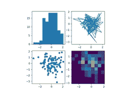
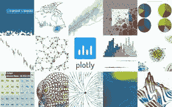
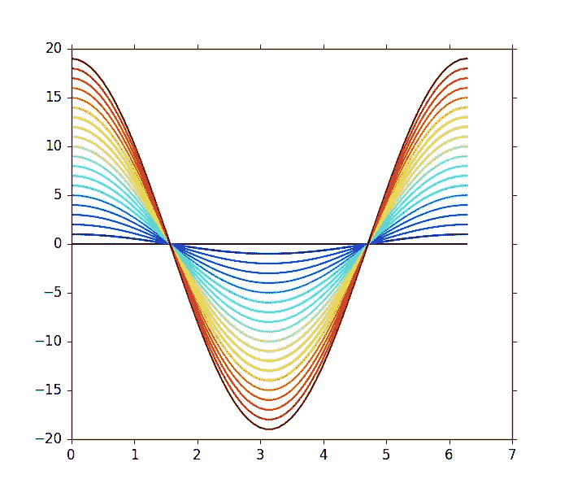
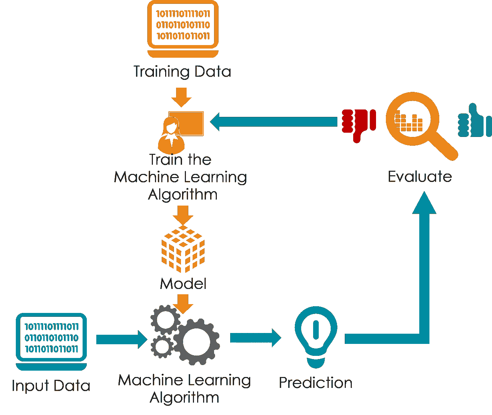
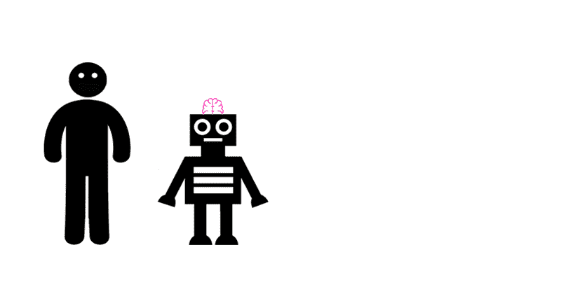
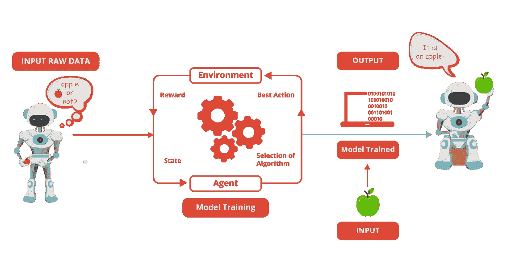

# 投身数据科学

> 原文：<https://medium.com/analytics-vidhya/jump-into-data-science-637c1692ac6?source=collection_archive---------23----------------------->

读完这篇文章后，你会对数据科学的过程有基本的了解。🤩

在数据科学领域，你需要做的第一件也是最重要的事情是理解数据的能力，以及如何将数据转化为信息，并将信息转化为洞察力。最好的数据科学家永远不会低估数据，整个数据科学取决于那个大“D”，只有当我们收集的数据能够通知和激励那些有能力做出改变的人时，事情才能完成。

数据科学的过程与魔术师操纵人类思维的过程是一样的。一个魔术师测试人类感知数千年，然后他就能变魔术了。魔法并不真的是关于你的感官机制。魔术是关于理解——然后操纵——观众如何消化感官信息。现在，您已经非常清楚如何处理数据了。激动吗？我知道你是。

在本文中，我将讨论我们需要应用于数据的三个主要数据科学流程和工具:

# 1.清理数据

能够处理杂乱的数据是最重要的，数据清理是从数据库中检测和纠正不准确记录的过程。数据科学家主要处理:

*   缺失数据
*   极端值
*   不一致的数据
*   不必要的数据

清理数据可能很耗时，但是很多工具的出现让这项重要的任务变得更容易承担。Python 提供了很多让数据有序清晰的库，这些库有 [Dora](https://github.com/NathanEpstein/Dora) 、 [datacleaner](https://github.com/datacleaner) 、 [PrettyPandas](https://prettypandas.readthedocs.io/en/latest/) 、[制表](https://bitbucket.org/astanin/python-tabulate/src/master/)、 [scrubadub](https://scrubadub.readthedocs.io/en/stable/) 、[箭头](https://arrow.readthedocs.io/en/latest/)、 [ftfy](https://ftfy.readthedocs.io/en/latest/) 等等。

# **2。数据可视化**

数据分析，这是你绘制大量数据图以试图理解它的地方(绘图也是电子表格开始落后的另一个地方)。在这个过程中，数据科学家试图编造一个故事，以一种易于沟通和实施的方式解释数据。

## 你应该知道的三大 python 可视化库

## **1。Matplotlib**

Matplotlib 是 python 中最流行的数据可视化库，也是一个 2D 绘图库。它带有跨平台的交互环境。这是一个非常通用的可视化库。有了这个库，只需几行代码，就可以生成图表、条形图、直方图、散点图、误差图、饼状图和许多其他类型的图表。

## 2.Plotly

Plotly 是一个基于网络的工具包，用于形成数据可视化。它有一个伟大的 API，独特的功能，如等高线图，树状图，三维图表，它有像散点图，折线图，条形图，多轴和许多其他可视化。它包含了一个很棒的 API，包括 python 的 API。

## 3.海生的

Seaborn 在 Matplotlib 的基础上提供了一个 API，为绘图样式和颜色默认值提供了相同的选择，为常见的统计绘图类型定义了简单的高级函数，并与 Pandas DataFrame 提供的功能相集成。

# 3.模型结构

这是魔法发生的地方。在这一步中，实际的模型构建过程开始了。在这里，Data scientist 为训练和测试分发数据集。像关联、分类和聚类这样的技术被应用于训练数据集。模型一旦准备好，就根据“测试”数据集进行测试。

有三种类型的最大似然算法:监督学习，非监督学习和强化，这将有助于您为您的数据建立模型。

## 1.监督学习

监督学习是一种学习，在这种学习中，我们使用标记良好的数据来教授或训练机器，这意味着一些数据已经标记了正确的答案。之后，向机器提供一组新的数据，以便监督学习算法分析训练数据，并从标记的数据中产生正确的结果。

## 2.无监督学习

无监督学习是使用既未分类也未标记的信息训练机器，并允许算法在没有指导的情况下对该信息进行操作。这就像训练一个新出生的婴儿，机器的任务是根据相似性、模式和差异对未分类的信息进行分组，而无需事先对数据进行任何训练。

## 3.强化学习

强化学习是机器学习的一个领域。它是关于在特定的情况下采取适当的行动来获得最大的回报。它被各种软件和机器用来寻找在特定情况下它应该采取的最佳行为或路径。

# 关闭

**你可以通过实践来最好地学习数据挖掘和数据科学，**所以尽快开始分析数据吧！然而，不要忘记学习理论，因为你需要一个良好的统计和机器学习基础来理解你在做什么，并在数据的噪音中找到真正的价值

如果你有任何反馈，请随时给我发信息。

祝你好运；)