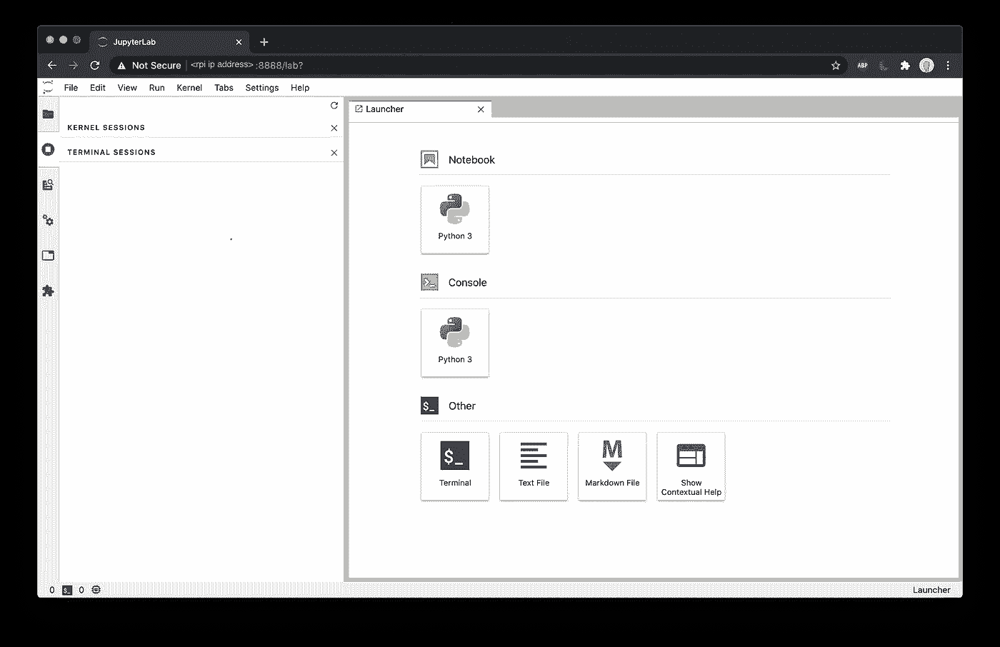
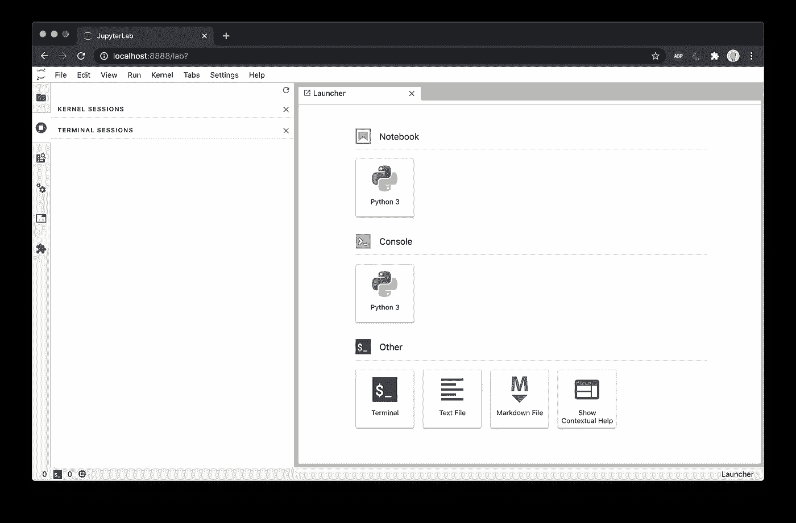

# 关于树莓派的 Jupyter 实验室

> 原文：<https://medium.com/analytics-vidhya/jupyter-lab-on-raspberry-pi-22876591b227?source=collection_archive---------2----------------------->


照片由[哈里森·布罗德本特](https://unsplash.com/@harrisonbroadbent?utm_source=unsplash&utm_medium=referral&utm_content=creditCopyText)在 [Unsplash](https://unsplash.com/s/photos/raspberry-pi?utm_source=unsplash&utm_medium=referral&utm_content=creditCopyText) 拍摄

upyter 笔记本电脑和 jupyter 实验室是许多数据科学项目的首选工作台。对于物联网项目，总是无法连接到 Raspberry PI 桌面来访问笔记本。我们可以使用 SSH 通过控制台访问 Raspberry PI，但是对于一些应用程序，尤其是计算机视觉，我们仍然需要一些图形用户界面。在本文中，我希望分享一些我发现的在 raspberry PI 上运行 Jupyterlab 并从远程机器访问它的技术。

# 安装 Jupyter 实验室

使用 SSH 连接到您的 Raspberry PI。安装所有依赖项。稍后我们将使用 pip3 安装 jupyter lab。

```
$ sudo apt-get update
$ sudo apt-get install python3-pip
$ sudo pip3 install setuptools
$ sudo apt install libffi-dev
$ sudo pip3 install cffi
```

使用 pip3 安装 jupyter。如果您正在使用 virtualenv，那么请遵循 jupyter 文档[中的说明。](https://jupyterlab.readthedocs.io/en/stable/getting_started/installation.html)

```
$ pip3 install jupyterlab
```

为您的笔记本创建一个目录，并启动 jupyter lab(可选)

```
$ mkdir notebooks
$ jupyter lab --notebook-dir=~/notebooks
```

或者，您也可以从下面的任何目录启动 jupyterlab。

```
$ jupyter lab
```

这应该会启动 jupyterlab 运行在树莓 pi 上的 [https://localhost:8888](https://localhost:8888) 上，但是它不能从您的本地机器访问。此外，一旦关闭 SSH 会话，jupyterlab 实例将被终止。

为了解决这个问题，我们需要启动 jupyterlab 作为一项服务。

# 将 Jupyter 实验室设置为服务

运行以下命令找到您的 jupyter lab 二进制文件:

```
$ which jupyter-lab
/home/pi/.local/bin/jupyter-lab
```

创建文件`/etc/systemd/system/jupyter.service`

```
$ sudo nano /etc/systemd/system/jupyter.service
```

内容如下。如果 jupyter-lab 二进制文件的路径与您的系统不同，请确保替换掉由`which jupyter-lab`命令返回的路径。

```
[Unit]
Description=Jupyter Lab[Service]
Type=simple
PIDFile=/run/jupyter.pid
ExecStart=/bin/bash -c "**/home/pi/.local/bin/jupyter-lab** --ip="0.0.0.0" --no-browser --notebook-dir=/home/pi/notebooks"
User=pi
Group=pi
WorkingDirectory=/home/pi/notebooks
Restart=always
RestartSec=10[Install]
WantedBy=multi-user.target
```

启用该服务，以便在 raspberry pi 启动时启动它

```
$ sudo systemctl enable jupyter.service
$ sudo systemctl daemon-reload
```

启动服务:

```
$ sudo systemctl start jupyter.service
```

您也可以使用命令停止该服务:

```
$ sudo systemctl stop jupyter.service
```

重新启动 raspberry pi，并通过检查服务状态来确保服务正在运行

```
$ sudo systemctl status jupyter.servicejupyter.service - Jupyter Notebook
   Loaded: loaded (/etc/systemd/system/jupyter.service; enabled; vendor preset: enabled)
   Active: active (running) since Sun 2020-08-30 16:12:27 PDT; 2s ago
 Main PID: 4864 (jupyter-lab)
    Tasks: 1 (limit: 4915)
   CGroup: /system.slice/jupyter.service
           └─4864 /usr/bin/python3 /usr/local/bin/jupyter-lab --ip=0.0.0.0 --no-browser --notebook-dir=/home/pi/notebooks
```

该服务应该已经启动并运行，现在你可以通过访问`http://<rpi ip address>:8888`从你的本地机器上访问它



然而，这也可以从互联网上的任何地方访问(取决于您的路由器设置，防火墙等)。我们可以使用以下三种方法之一来保护它

1.  添加密码(简单)
2.  使用 SSL 进行加密通信(推荐)
3.  SSH 端口转发(推荐)

# 添加密码

查看您是否有笔记本配置文件`jupyter_notebook_config.py`。该文件的默认位置是您的主目录中的 Jupyter 文件夹:

```
/home/pi/.jupyter/jupyter_notebook_config.py
```

如果您还没有 Jupyter 文件夹，或者如果您的 Jupyter 文件夹不包含笔记本配置文件，请运行以下命令:

```
$ jupyter notebook --generate-config
Writing default config to: /home/pi/.jupyter/jupyter_notebook_config.py$ jupyter notebook password
Enter password:  ****
Verify password: ****
[NotebookPasswordApp] Wrote hashed password to /Users/you/.jupyter/jupyter_notebook_config.json
```

这可用于重置丢失的密码；或者如果您认为您的凭据已经泄露，并希望更改您的密码。服务器重新启动后，更改密码将使所有登录的会话无效。

# 使用 SSL 进行加密通信

如果你需要使用 SSL 来保证安全，你可以按照这里的说明[操作](https://jupyter-notebook.readthedocs.io/en/stable/public_server.html#using-ssl-for-encrypted-communication)

# SSH 端口转发(隧道)

> 这是最安全的方法，但是只要您想要访问 jupyterlab，您就需要在本地终端中保持会话活动。如果你喜欢这种方法，那么确保你更新了`/etc/systemd/system/jupyter.service`并通过移除`--ip="0.0.0.0"`替换了如下的`ExecStart`

```
<file:/etc/systemd/system/jupyter.service>
...
ExecStart=/bin/bash -c "/usr/local/bin/jupyter-lab --no-browser --notebook-dir=/home/pi/notebooks"
...
```

更新文件后。停止服务，重新加载配置，然后再次启动服务。

在您的 raspberry pi 上，使用`ifconfig`或`hostname -I`命令检索 raspberry pi 的 IP 地址

ssh 到 raspberry pi，SSH 端口转发如下:

```
ssh -L 8888:localhost:8888 pi@192.168.xx.xx
```

现在，您可以通过访问`[http://localhost:8888](http://localhost:8888)`从本地计算机访问运行在 raspberry pi 上的 jupyterlab

