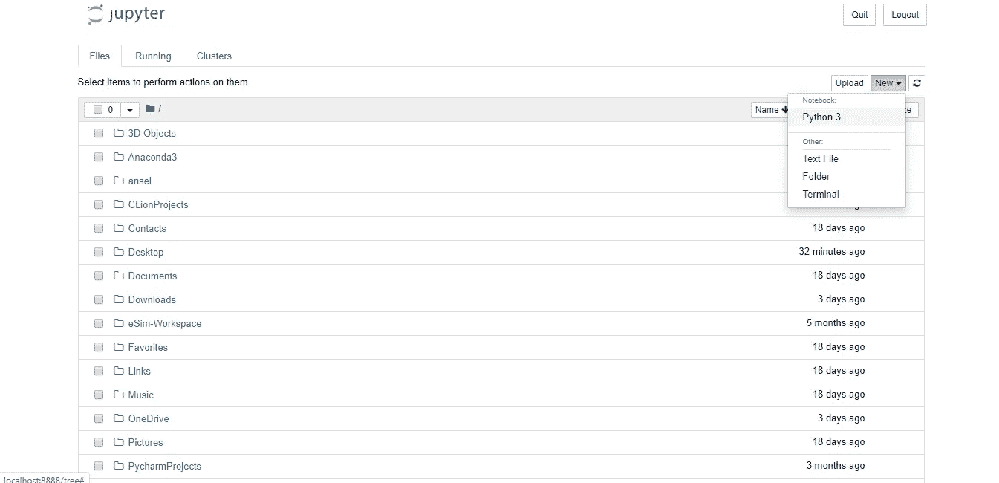
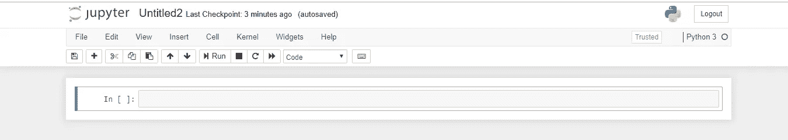
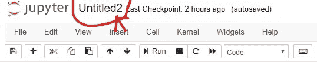
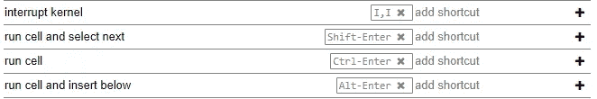
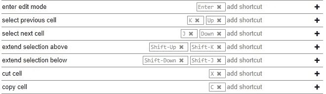
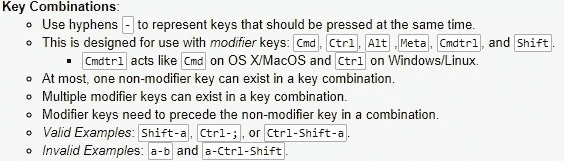

# Jupyter 笔记本|终极指南

> 原文：<https://medium.com/analytics-vidhya/jupyter-notebook-anultimate-guide-1e0383527228?source=collection_archive---------28----------------------->


韦斯·希克斯在 [Unsplash](https://unsplash.com?utm_source=medium&utm_medium=referral) 上的照片

Jupyter Notebook 是一个开源的 web 应用程序，允许您创建和共享包含实时代码、公式、可视化和叙述性文本的文档。它可用于各种应用，如数据清理和转换、数值模拟、统计建模、数据可视化、机器学习等等。它由 Jupyter 项目的人维护。

Jupyter 这个名字来自于它所支持的核心编程语言:JULIA、PYTHON 和 r。

# Jupyter 笔记本入门

它没有包含在 python 中，所以如果你想使用它，你必须安装 Jupyter。Python 语言有很多发行版，但是这里我们只关注其中的两个来安装 Jupyter notebook。

假设您使用的是 Python 3。

# 装置

最受欢迎的 python 发行版是 [*ANACONDA。*](https://www.anaconda.com/distribution/) 它有一个名为 **conda** 的安装工具，可以用来安装一个第三方的包，它还附带了许多预装的科学库，Jupyter Notebook 就是其中之一，所以你除了安装 Anaconda 本身之外什么都不用做。


您也可以使用 pip 直接安装 [Jupyter 笔记本](https://jupyterlab.readthedocs.io/en/stable/getting_started/installation.html):

```
pip install jupyterlab
```

还有各种各样的其他方法，我已经列出了最方便的方法。

# 启动 Jupyter 笔记本

现在你已经安装了 Jupyter，让我们来学习如何使用它。首先，您需要打开您的终端应用程序并创建一个您选择的文件夹。现在选择“新建”并创建一个新的“Python 3”笔记本



您将被重定向到[http://localhost:8888/notebooks/](http://localhost:8888/notebooks/)

> Localhost 不是一个网站，它表示内容是从您的*本地*机器(即您自己的计算机)提供的。Jupyter 的笔记本和仪表板是 web 应用程序，Jupyter 启动了一个本地 Python 服务器来为您的 web 浏览器提供这些应用程序，这使得它基本上与平台无关，并为更容易的 web 共享打开了大门。

# 创建笔记本

你必须点击“新建”按钮，它会打开一个选择列表，选择 Python 3(或者你选择的版本，我会推荐 Python 3)

像这样的新网页将在新标签页中打开:



在最顶端，你会看到一个新文件*未命名。ipynb* ，在下面你会看到很多选项，如*——文件、编辑、查看、插入、单元格、内核、小部件、帮助。*

> *什么是. ipynb 文件？*

*。ipynb* 是一个文本文件，以一种叫做 JSON 的格式描述你笔记本的内容。它包含 Jupyter Notebook web 应用程序会话的所有内容，包括计算、数学、图像和说明性文本的输入和输出。

> *什么是内核？*

每台笔记本背后都运行着一个内核。当我们运行一个代码单元时，该代码在内核中执行，任何输出都返回到单元中进行显示。

> **内核选项:**

Jupyter Notebook 为内核提供了各种选项。如果你想重置东西，这可能是有用的。这些选项包括:

*   **重启:**这将重启内核，即清除所有已定义的变量，清除已导入的模块等。
*   **重启并清除输出:**这将与上述操作相同，但也将清除单元格下方显示的所有输出。
*   **重启并运行全部:**这也与上面相同，但也将按照自上而下的顺序运行所有单元。
*   **中断:**该选项将中断内核执行。在程序继续执行或者内核被某些计算卡住的情况下，它会很有用。

让我们导入一个 python 包并定义一个函数:

```
import numpy as np 
def square(x):
    return x*x
```

好了，现在一旦我们执行了上面的单元格，我们可以在任何其他单元格中引用 *np* 和 *square* 。

```
x = np.random.randint(1,10)
y = square(x)
print('%d squared is %d' %(x,y))
```


# 什么是细胞？

单元是笔记本中显示的文本或笔记本内核执行的代码的容器。

我们将主要讨论两种类型的单元:

*   代码单元—它包含要在内核中执行的代码，并在下面显示其输出。
*   Markdown 单元格-它包含使用 Markdown 格式化的文本，并在运行时就地显示其输出。

第一个单元格始终是代码单元格。所以让我们试试经典的例子，试着打印‘Hello World’。要运行单元，您可以单击“运行按钮”或使用键盘快捷键(Ctrl + Enter)。

我们的结果将是这样的:

```
print('Hello World')
```


# 命名笔记本

在开始任何项目之前，我们必须给我们的笔记本命名，并给它一个相关的和有意义的名字。笔记本的命名非常简单，因为我们可以看到在我们笔记本的顶部有一个写着 *untitled.ipynb* 的东西(见下图)



点击这里！！

所以我们只需点击 *untitled.ipynb* ，一个重命名选项将弹出如下屏幕:


*但是我们已经注意到，我们不能在笔记本运行时对其进行重命名，因此，我们必须将其关闭(“文件>关闭并暂停”)，然后对其进行重命名。*

# 保存您的笔记本

默认情况下，Jupyter 将每隔 *120 秒*自动保存您的笔记本到检查点文件，而不改变主要的笔记本文件。但是，最好的做法是定期储蓄。按(Ctrl +S)将保存您的笔记本文件。

> *这个关卡是什么东西？*

因此，每当我们创建一个新的笔记本时，一个检查点文件和您的笔记本文件一起创建，它将位于您的保存位置的一个隐藏子目录中，名为*。ipynb_checkpoints* 和一个. *ipynb 文件。*

# 导出您的笔记本

Jupyter 内置了对导出为 HTML 和 PDF 的支持，可以在“文件>下载为”菜单中找到事实上，许多学术机构的研究人员都有一些公共或内部的网络空间。

您还可以将笔记本导出为 HTML 文件，Jupyter 笔记本是他们与同伴分享成果的一种特别方便的方式。我们还可以将笔记本变成幻灯片，或者用 Github 在线分享。

但是如果共享导出的文件不适合你，还有一些非常流行的共享方法。ipynb 文件在网上更直接。

# 键盘快捷键:

为了快速和采用基于单元的快速工作流程，我们可以使用键盘快捷键。您可以在*“帮助”*下拉菜单中找到。它将打开一个快捷方式列表。

下面列出了一些最有用的快捷方式:



> A 补充说明:



# 笔记本扩展

Jupyter 笔记本扩展是扩展笔记本环境基本功能的简单附加组件。Jupyter 支持四种类型的扩展。

*   核心
*   IPyhton 内核
*   笔记本
*   笔记本服务器

> 安装加长件

几乎所有的扩展都可以使用 Python 的 pip 工具安装。如果不能使用 pip 安装扩展，那么使用下面的命令安装扩展。

```
jupyter nbextension install extension_name
```

上面只安装了扩展，但没有启用它。要启用它，请在终端中键入以下命令。

```
jupyter nbextension enable extension_name
```

# 结论

Jupyter Notebook 不仅对于学习和教授 Python 这样的编程语言非常有用，而且对于共享数据也非常有用。Jupyter notebook 的强大之处应该也是显而易见的，我们介绍了大量线索，以便开始探索您的项目中更高级的功能。