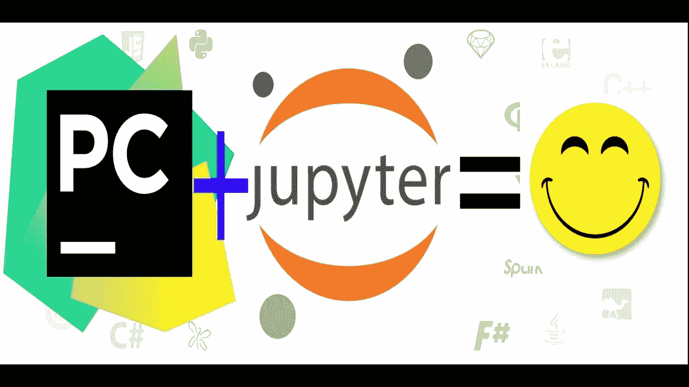

# Jupyter + Pycharm +虚拟环境

> 原文：<https://medium.com/analytics-vidhya/jupyter-pycharm-virtual-environments-9d151db7395d?source=collection_archive---------11----------------------->

让 Pycharm、Jupyter 和虚拟环境玩得更好

# 👨🏻‍💻拼凑一个快速的 shell 脚本，让它们一起工作

我喜欢 Pycharm 有很多原因——交互式调试、林挺、自动完成、集成 Git 工具和超级简单的环境管理就是其中的一些。

我不喜欢 Pycharm(免费社区版)的一点是它…