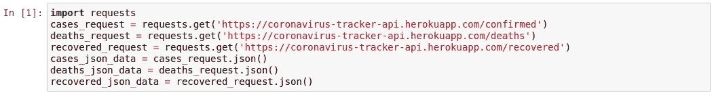
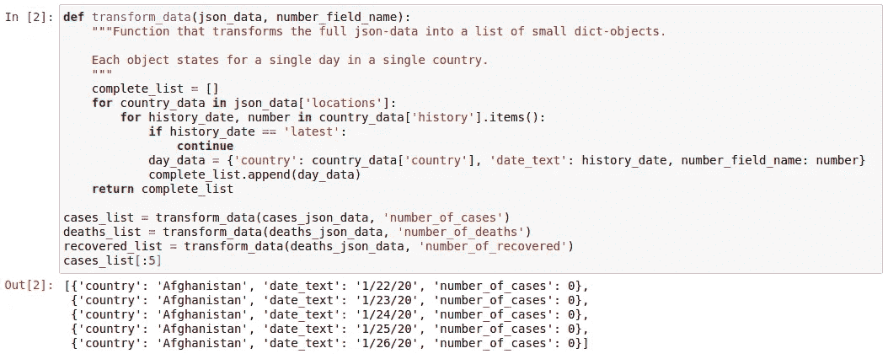
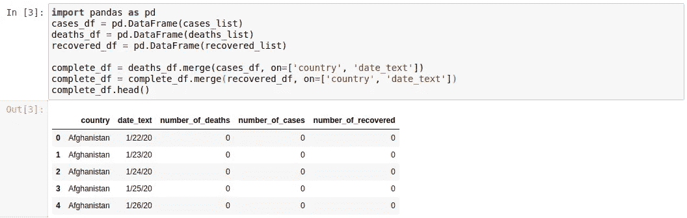
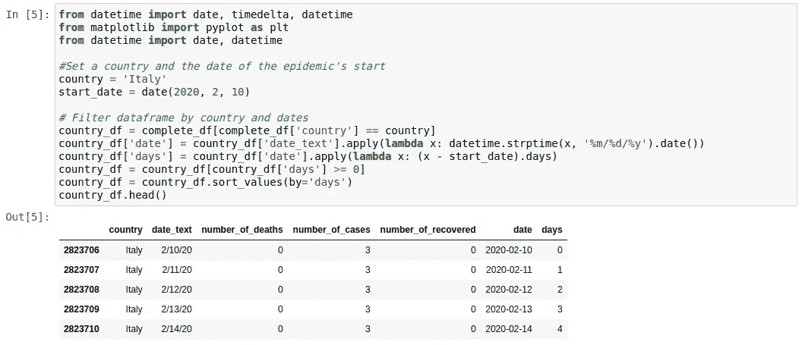
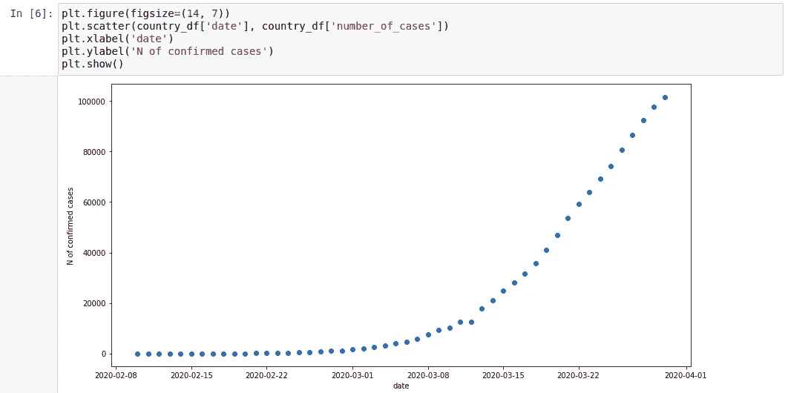
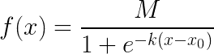
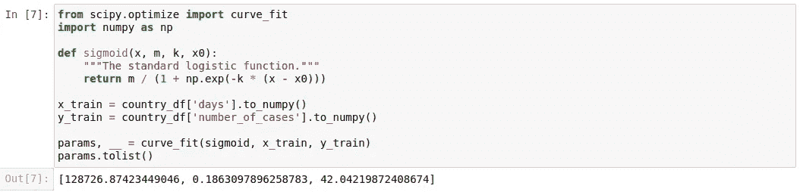
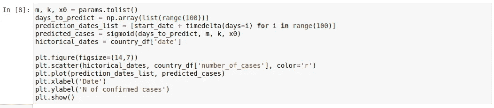
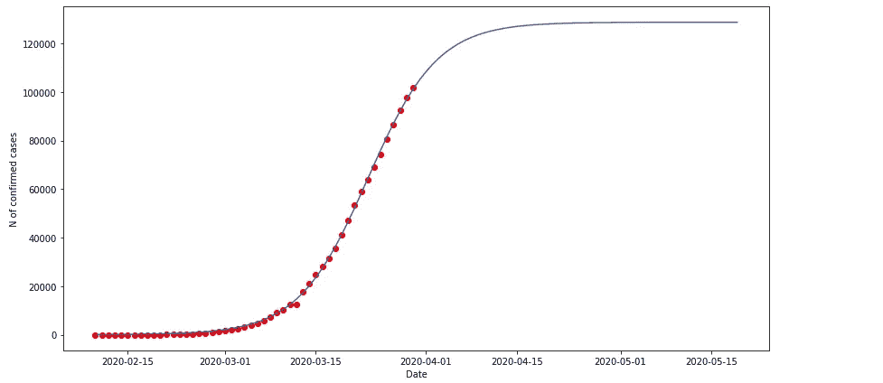
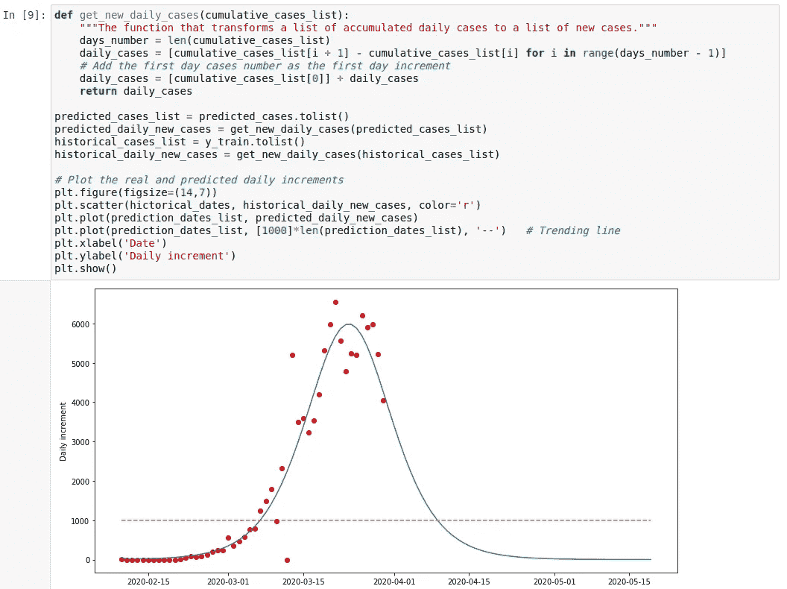

# 用于新冠肺炎数据分析的 Jupyter/Python(第 1 部分)

> 原文：<https://medium.com/analytics-vidhya/jupyter-python-for-covid-19-data-analysis-part-1-df73afa27462?source=collection_archive---------19----------------------->

我们在拉平曲线吗？我们预计会有多少人死亡？死亡率是多少？

在这组帖子中，我将尝试展示如何使用 Python 工具来获得对问题的简单而快速的数据洞察。它不能作为真正科学研究的参考，但它可以帮助更好地理解疫情趋势；以及给出一些关键值的粗略估计。我还希望展示 Python 中应用数据分析的简易性。

## 你需要什么？

要跟踪我，您需要安装 Jupyter 笔记本；另外，下面的 Python 包:`pandas`、`numpy`、`scipy`、`matplotlib`和请求。在正文里我会放上我笔记本的截图。文件本身可以在这里找到:[https://github . com/dmitrii 303/Covid/blob/master/Covid % 20 part 1 . ipynb](https://github.com/dmitrii303/covid/blob/master/Covid%20part1.ipynb)

## 数据准备

我通过这个 API 跟踪冠状病毒病例的每日更新:[https://coronavirus-tracker-api.herokuapp.com](https://coronavirus-tracker-api.herokuapp.com)

第一步是请求对应于病例、死亡和恢复数据的三个不同的终点:

所提供的数据是按国家分类的，我们需要按国家/天来分类。另外，这三个资源都有相似的模式，所以我们可以创建一个函数，从 HTTP-request 中获取 JSON-data，并返回一个包含基本数据的 Python 字典列表:

接下来，我们将使用`pandas`库将所有数据放入数据帧，并合并三个数据源:

现在，我们有了一个单一的数据框架，其中包含每个国家每个日期的完整病例/死亡/恢复数据。由于不同的国家遵循不同的战略，因此具有完全不同的动态，我们将重点关注一个国家的统计数据。我选择了意大利，因为它已经有了大量的数据，疫情仍在持续，目前还没有开始大规模的测试。下一步是按国家和日期过滤数据。当根本没有案例时，我们不想关注陈旧的数据，因此，我们将起始日期定为 2020 年 2 月 10 日(案例开始显著增长的前 10 天)。

## 动力学研究

现在可以显示病例数的历史演变情况:

如果我们想尝试预测曲线的未来行为，我们可以尝试猜测它的形状。一般来说，流行病的过程开始呈指数增长，并在某一点达到饱和。描述它的最标准方法是使用逻辑函数(S 形或 S 形):

物流增长模型用于流行病学，这个特殊的函数是那些用于真实研究的函数的简化版本。我在这里提出一个简单的方法，但它仍然会给出对过程的定性理解。

我们认为它是从流行病开始的天数的函数。该函数由 3 个参数描述(`M`、`k`、`x0`)，其中`M`代表函数的最大值(在我们的例子中，它将是案例的最大总数)。有了历史数据，我们可以尝试推导出这三个参数。为此，我们使用了`scipy`优化包，就这么简单:

这个片段输出了三个参数，我们可以看到我们应该预期的最大案例数大约是 13 万。此外，该过程的典型时间为 40 天左右。这意味着在疫情开始后 40 天(3 月 21 日)达到最大病例数(65K)的一半。为了说明该函数对历史数据的描述有多好，以及为了预测未来的行为，我们可以在更大的日期范围内运行该函数，并将结果与历史数据一起绘制出来:

## 每日增量预测

除了累计确诊病例动态之外，关注每日增长可能也很有趣，因为这些是我们每天观察的真实数字。为此，我们只需用相邻天数的简单替换将累积案例转换为每日增量列表:

如果模型预测的趋势是正确的，我们可以预计在 4 月 10 日左右突破每天 1，000 例新病例的阈值。

## **总结**

我试图展示用简单的 Python 编码进行简单的数学建模可以快速而有意义地洞察实时数据。代码是灵活的，你可以尝试检查其他国家的动态，甚至尝试自己的调查。在下一部分中，我将展示如何预测死亡/恢复动态，以及最终活动案例的数量何时开始减少。