# 用于新冠肺炎数据分析的 Jupyter/Python(第二部分)

> 原文：<https://medium.com/analytics-vidhya/jupyter-python-for-covid-19-data-analysis-part-2-c7aef8fb2ac6?source=collection_archive---------20----------------------->

昨天我们看了，分析了新冠肺炎新增确诊病例动态的大致趋势。我们已经看到，至少对意大利来说，新增病例的曲线很快就会变平。但是封锁什么时候会取消？看起来，尽管曲线正在变平，医院仍然在倒塌。我们能想象一下情况什么时候会好转吗？

至于之前的帖子，我准备了一个 Jupyter 笔记本:

[https://github . com/Dmitri 303/Covid/blob/master/Covid % 20 part 2 . ipynb](https://github.com/dmitrii303/covid/blob/master/Covid%20part2.ipynb)

## 现状

医院的负荷是由活跃病例的数量来定义的——还没有从疾病中康复的人。所以，影响这个数字的有三个过程:新人得病，死亡，康复。要获得活动病例的历史动态，我们可以从病例总数中减去死亡人数和康复人数:

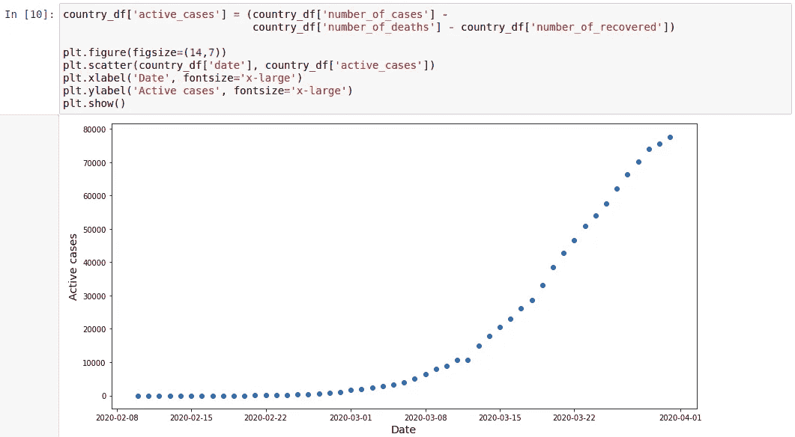

可以看出，活跃病例的数量仍在增加，因此医院的工作量也在增加。问题是，我们能预测这个数字何时开始减少吗？

## 死亡和康复的概率

为了回答这个问题，我们需要能够预测死亡和恢复情况。这并不简单，因为死亡和恢复过程相对于疾病检测都是延迟的。这个过程是动态的，第一天*的死亡/康复数量应该取决于疫情的整个历史。*

让我们想象一下，一个人在第 *k* 天第一次被观察到呈阳性。并且对于接下来的任何一天，我们都可以知道这个人在那一天死亡(康复)的概率。我们可以假设这个概率是 *i* 和 *k* 之差的函数:

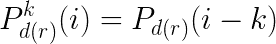

我们可以说，当 *i = k* 时，这些函数可能会在零附近，然后会朝着某个有限值增长(实际上，在第 60 天恢复的概率应该与第 61 天的概率大致相同)。同样，在这个上限，两个概率的总和应该是 1，因为我们假设一段时间后，这个人要么死了，要么康复了。

不幸的是，我们没有按队列统计的死亡/康复数据。如果我们有它，我们可以直接观察概率函数的形状。在我们的例子中，我们可以提出一些简单的函数，定性地满足条件。

**假设**:让我们尝试使用我们在之前的分析中使用的相同的逻辑(Sigmoid)函数。在这种情况下，我们可以写:

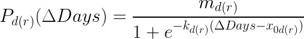

条件为:

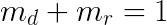

其中 *md(r)* 表示该人死亡(恢复)的最大概率。对于死亡病例，实际上是 CFR——病例死亡率。

## 寻找价值

所以现在死亡和恢复过程的动力学由 5 个参数描述:

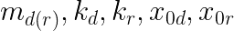

为了找到它们的值，我们必须实现函数，给定这些参数和新病例的历史将返回死亡和恢复的历史。死亡和恢复过程都遵循相似的规律，只是参数值不同。因此，为了描述一个抽象状态(最终状态可能是死亡或恢复)进化的动态，我创建了一组下列函数:

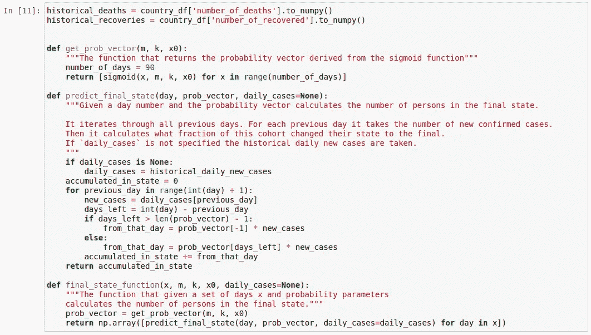

稍微澄清一下:

*   `get_prob_vector(m, k, x0)` —该函数构建 90 天的概率向量。向量的每个元素显示了在与向量中的元素索引相对应的天数之后，人处于某种状态(死亡或恢复)的概率。
*   `predict_final_state(day, prob_vector, daily_cases=None)` —该功能给出了`day`当天处于`prob_vector`对应状态的人数。`daily_cases`是新病例的历史。如果是`None`，那么就用真实的历史数据。
*   `final_state_function(x, m, k, x0, daily_cases=None)` —此函数获取日向量 x，并返回由逻辑函数参数定义的状态下的每日人数

现在，有了这个函数，我们可以建立一个目标函数。它将是每日预测死亡/恢复数量和实际死亡/恢复数量之间的累计差异。剩下的就是用我们想要找到的五个参数最小化这个函数:

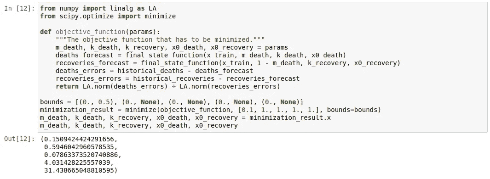

结果显示，真正的死亡概率在 15%左右(我提醒你，取的数据是意大利的)。此外，典型的死亡时间约为 4 天，而相应的恢复值为 31 天。

## 预测动态

有了描述概率的参数，我们可以预测死亡和复苏的数量，并将其与真实的历史数据进行比较:

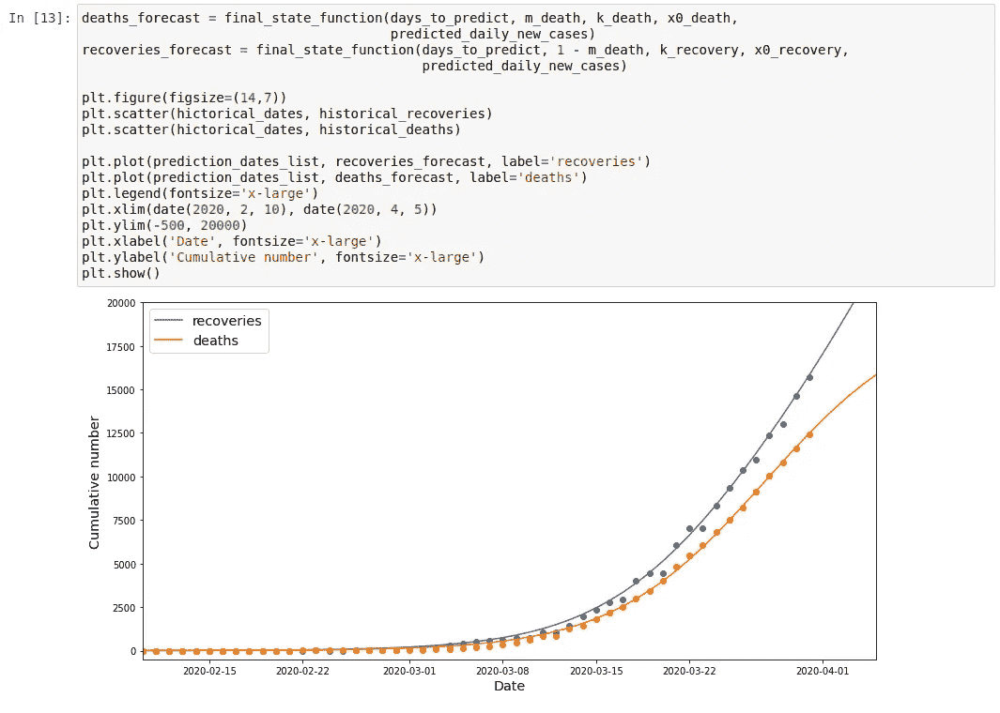

将预测延伸到未来，我们可以得到预期的死亡总数:

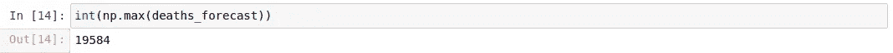

因此，在意大利，预计总死亡人数约为 2 万。

作为最后一步，我们可能希望看到积极的情况下的动态预测。结合我们所有的数据，我们可以得到这样的结果:

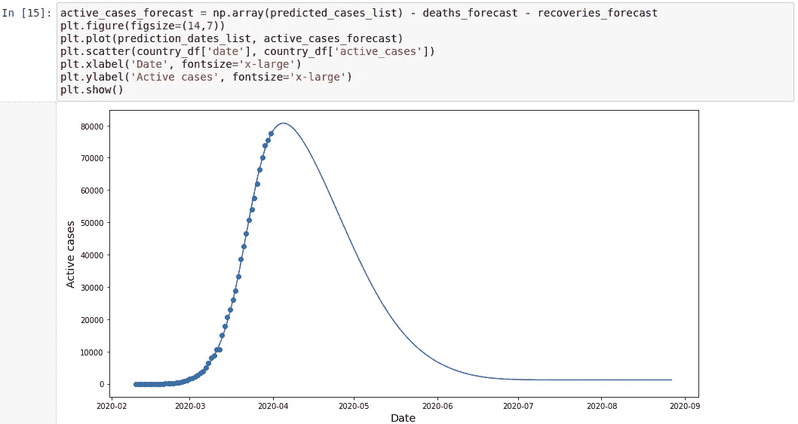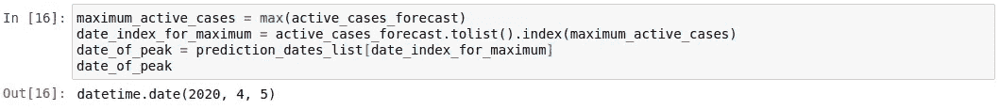

它表明真正的高峰将在 4 月 5 日左右到来，这很快。

## 其他国家

此外，我还尝试在其他几个国家运行它，这就是我得到的结果:

*   西班牙——预计约有 2.4 万人死亡。高峰在 4 月 2 日左右
*   德国——预计死亡人数约为 1500 人。高峰在 4 月 2 日左右

## 摘要

在这两篇文章中，我们对新冠肺炎动态做了一个天真的描述和预测。未来会证明它有多好。最有可能的是，真实的数字会有所不同，但我不指望会有数量级的差异。真正的预测是困难的，真正的流行病的动态强烈地依赖于所采取的措施，依赖于测试策略，依赖于地理，等等。所有这些因素都是随时间变化的，无法用数学模型完全描述。但是仍然可以用有限的资源在短时间内完成一些粗略的估计。