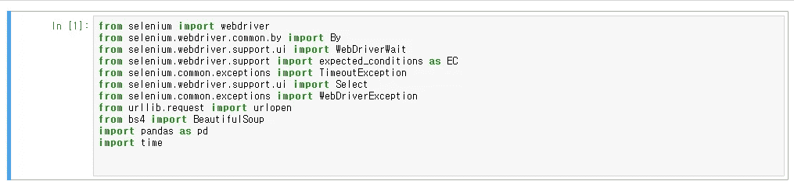
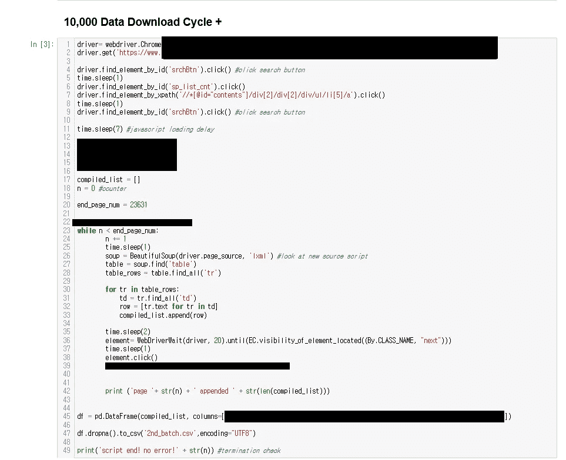
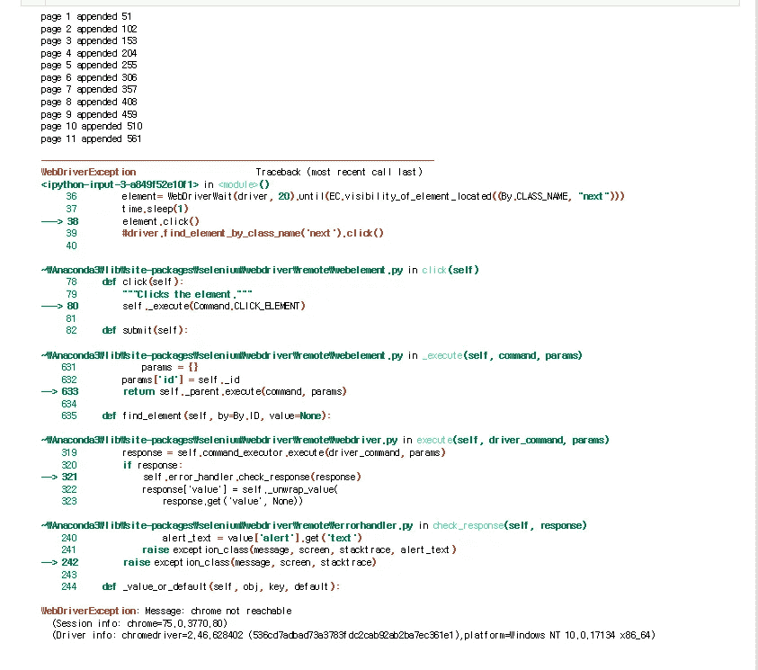
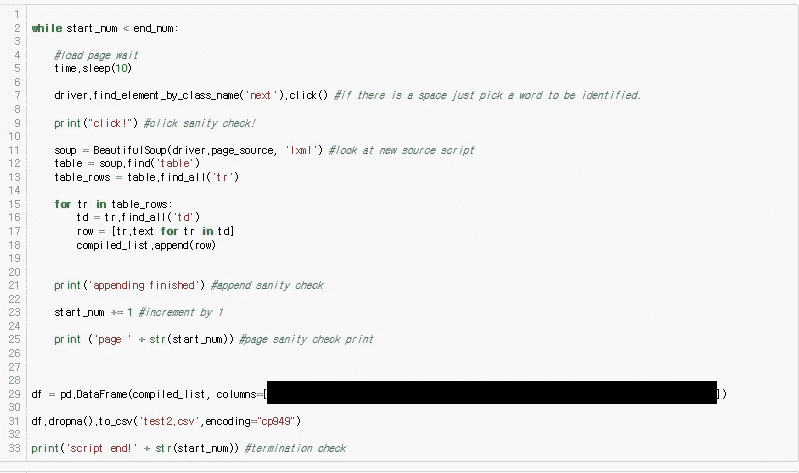
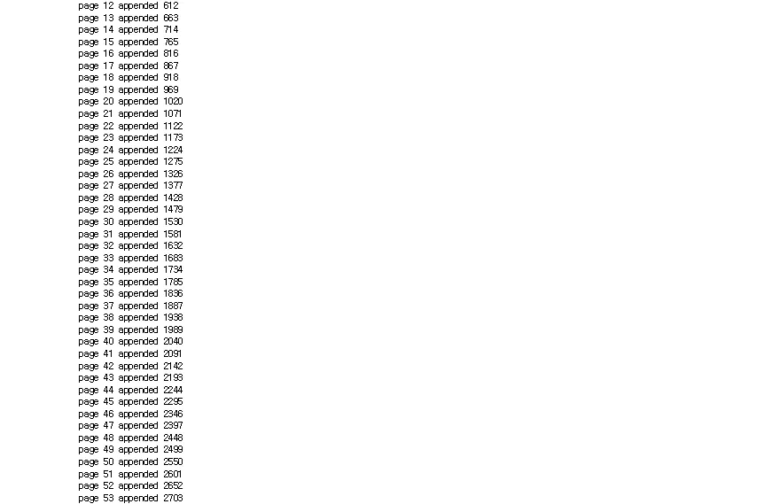

# 出错后重新启动抓取算法

> 原文：<https://medium.com/analytics-vidhya/jupyter-selenium-and-a-way-to-freeze-time-while-scraping-74f57621e67f?source=collection_archive---------13----------------------->

你有没有遇到过这样的情况，你的 scraper 遇到了一个错误[可能是服务器错误或刮刀块]，不得不重新开始？

由 [Djim Loic](https://unsplash.com/@loic?utm_source=medium&utm_medium=referral) 在 [Unsplash](https://unsplash.com?utm_source=medium&utm_medium=referral) 上拍摄的照片

你很幸运！您可以使用 Jupyter 从 scrapper 终止的地方重新启动脚本。我不知道这到底是如何工作的，但是让我给你一个关于如何使用这个方法的简单解释。

这个解决方案很大程度上依赖于 Jupyter 的“运行代码”特性，在这个特性中，我们可以从每一批代码中独立地运行代码块。

从通常的刮库开始:

蟒蛇，硒，熊猫，美汤，还有你的好老朋友时光。

该项目的库需求

在这个解释中，我不会深究我的源代码，而是展示我的第一批抓取代码是什么样子的。

对我的代码的简要解释如下:

1.  转到目标站点
2.  使用 xpath 执行一些操作，转到我想去的特定站点。
3.  创建名为 compiled_list 的数组
4.  去掉 javascript 表中的“地狱”(处理带有分页功能的网站不会在 URL 中显示)
5.  将数据保存在数组中
6.  将数组转换为熊猫数据框。
7.  将熊猫数据表导出到 CSV，用页面命名它们

由于数据的敏感性，一些部分被屏蔽

我们在这里…什么？服务器关闭了…

刮很多的人讨厌这个错误消息

但是正如我在本文的第一部分中所说的，创建另一批代码来继续您开始的代码。

> **在你继续之前**:
> 
> 1)不要关闭与您的脚本连接的 chrome 浏览器。如果您这样做，您的所有会话/进度将被删除。
> 
> 2)记得检查你抓取的页码，并在下一批代码中相应地重新编码。

所以再次运行程序…在导出部分对 set no 的 id 号做一点修改。

在运行这段代码之前，我编辑了集合号

还有 tada！我们前进到刮集的其余部分

代码的其余部分正在运行

但是，如果网站服务器像我的目标网站一样不稳定，一定要小心连续的错误。每当你的程序与网站的连接被切断时，重复上述过程。

我不知道如何自动化这一部分，但是如果你的读者知道答案，请在下面评论。

反正就是这样乡亲们~ jupyter 刮时光机。