# JupyterLab +乳胶。神圣二人组

> 原文：<https://medium.com/analytics-vidhya/jupyterlab-latex-holy-duo-8c7f89d5a2a4?source=collection_archive---------4----------------------->


最近，我遇到了一个非常有趣的任务。基本上，我需要一些 Jupyter 笔记本，让他们好看的 pdf 格式。听起来很简单，对吧？嗯，这取决于你对结果是否满意。所以，让我们开始吧。顺便问一下，我有没有提到 Jupyter 笔记本也有汉字？

因此，为了这篇文章，我创建了一个非常简单的 Jupyter 笔记本，它由一些降价单元格、一些填充空间的无意义文本和一些图表组成，这些都是我直接从 Seaborn Gallery 示例中获取的。

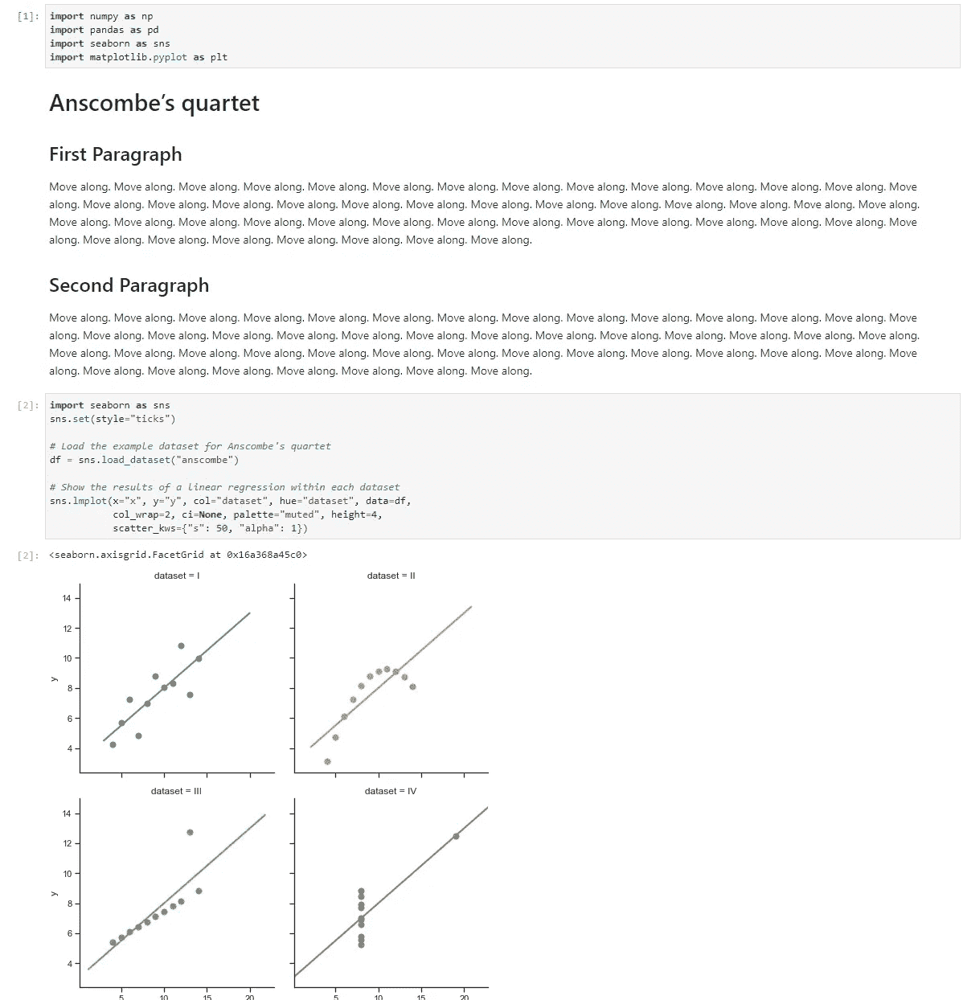

非常普通的笔记本

所以，你们明白了，对吧？现在，让我们看看什么样的标准将笔记本导出为 PDF

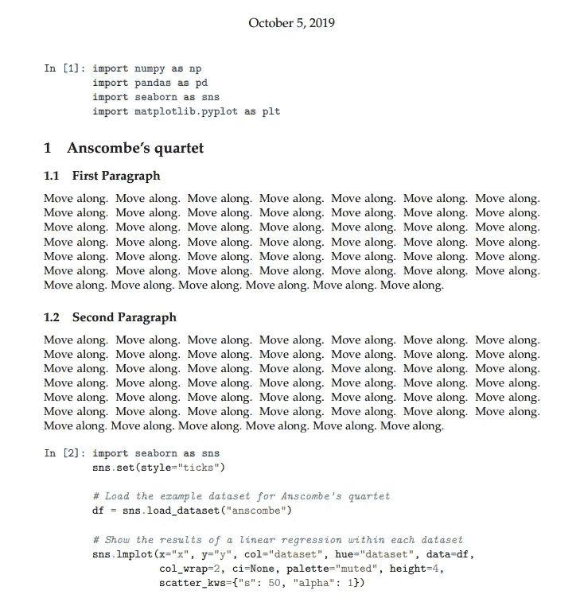

第一页

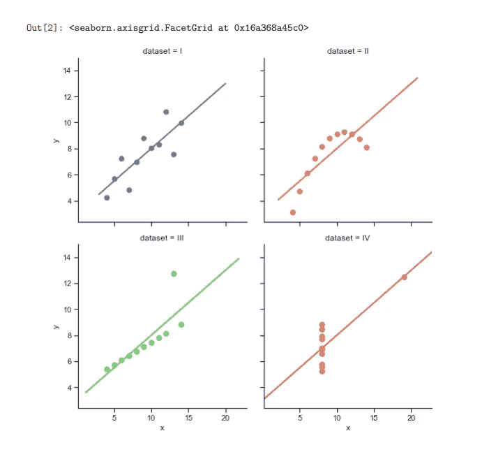

第二页

如果我们要把这些东西展示给对代码不感兴趣的人，结果会很糟糕。那么，我们该如何改进呢？首先，当你要求使用 **nbconvert** 模块将笔记本导出为 PDF 格式时，Jupyter Lab 引用了一些内置模板。乳胶模板，如果我没记错的话。所以，让我们打开我们在朱庇特实验室的终端。我们将呼叫指挥部:

```
jupyter nbconvert — to=pdf Medium.ipynb
```

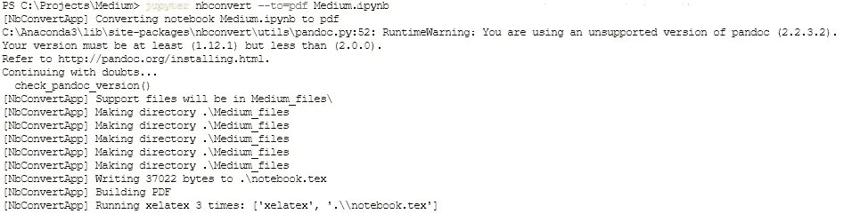

所以，让我们检查结果。


相同的结果

他们是一样的。所以，我们已经达到了与标准出口方式相同的质量。让我们通过在代码中添加一些细节来改进它。

```
jupyter nbconvert — to=pdf — TemplateExporter.exclude_input=True Medium.ipynb
```

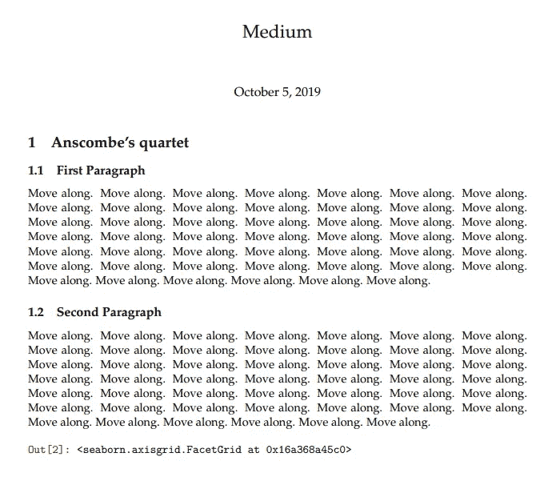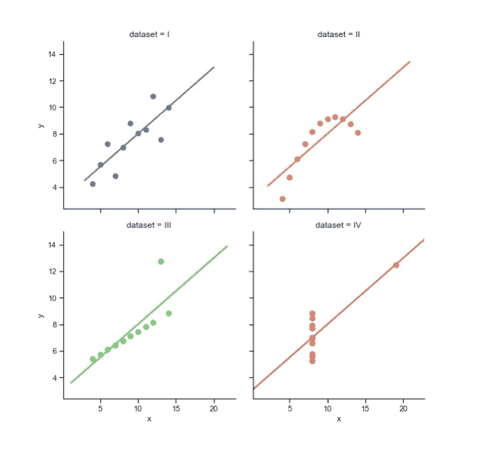

那就，好多了！我们所有的投入都没有了，这很好。我对 seaborn 的输出线有点恼火。因此，要解决这个问题，我只需添加“；”在这条线的尽头。

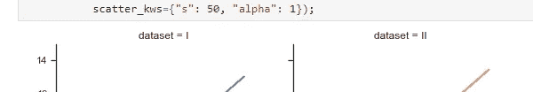

如果您遇到一些输出，比如模块的警告，您可以通过在第一个单元格中添加以下代码来简单地禁用它:

```
import warnings
warnings.filterwarnings('ignore')
```

好吧，我们继续。到目前为止，对于大多数用例来说，结果可能是可以的，但是我们会走得更远。现在让我们先把笔记本转换成 LATEX 格式，而不是 pdf 格式。

```
jupyter nbconvert — to=latex — TemplateExporter.exclude_input=True Medium.ipynb
```

结果，我们可以看到，在我们的文件夹中出现了两个新对象。Medium.tex 和 Medium_files。

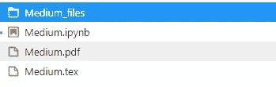

介质文件是我们所有的图表，来自位于。png 格式。因为，稍后当我们将 Medium.tex 转换为 pdf 时，图片将从该文件夹中取出。

要将 Medium.tex 转换为 pdf 格式，我们将使用 xelatex 而不是 pdflatex。为什么会这样，我稍后会解释。

```
xelatex Medium.tex
```

运行后，我们可以看到，我们在文件夹中创建了更多的文件。

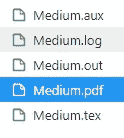

除了。LATEX 使用所有其他文件来构建最终的 pdf。我不会显示结果，它基本上和前面的一样，但我必须包括这一步才能继续。

当我们启动 xelatex 时，它使用的是第一部分中包含的信息。tex 文件。这个信息是由一些标准的模板提供的，这个模板叫做“文章”，但是让我们来改变它。首先，我们可以搜索*。tplx 文件，并将其中一个文件复制到 latex_tmpl 文件夹中。我把 report.tplx 放在里面，做了一些调整。

```
((* block docclass *))
\documentclass{report}
\author{Kejid} % for the title page.
\date{\today} % Use current date.
\usepackage[verbose,tmargin=1in,bmargin=1in,lmargin=1in,rmargin=1in]{geometry}
\usepackage{fancyhdr}
\fancypagestyle{plain}{}
\pagestyle{fancy}
\renewcommand{\headrulewidth}{0pt}
\lhead{Special for Medium}
\rhead{Right Head}
\rfoot{Right Foot}
\cfoot{\thepage}
\lfoot{Left Foot}
((* endblock docclass *))
```

让我们让 **nbconvert** 使用我们的新模板。

```
jupyter nbconvert --to=latex --template=./latex_tmpl/report.tplx --TemplateExporter.exclude_input=True Medium.ipynb
xelatex Medium.tex
xelatex Medium.tex
```

我们运行它两次，因为我们需要为我们的 pdf 建立适当的目录。

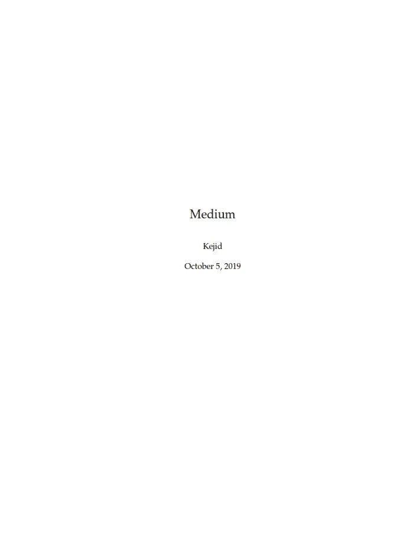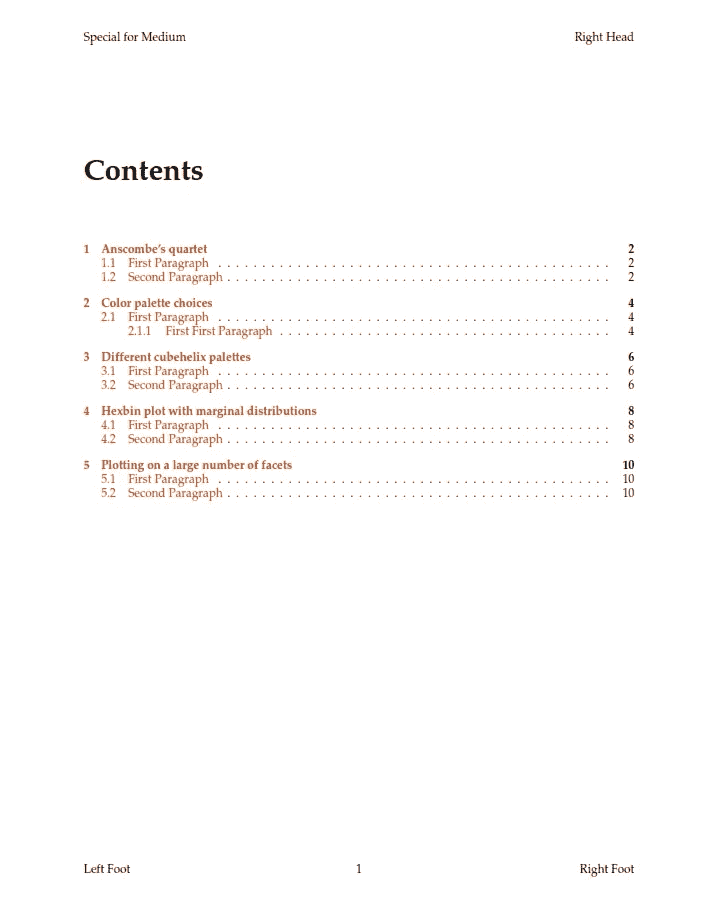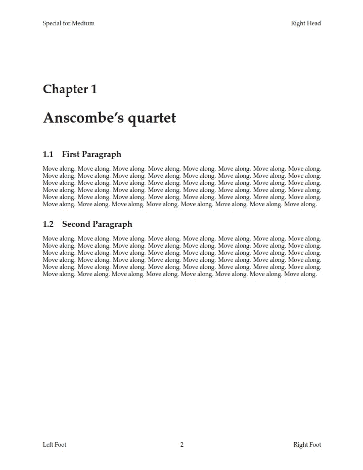

因此，正如你所看到的，我们成功地创建了非常好的 pdf 报告，带有目录中的可点击链接。此外，我们可以修改页眉和页脚或只是让它空着。

进行这种转换的最好方法是创建 bash 脚本，我们所有的命令都包括在内，它向用户询问变量并清除文件夹中不必要的文件。

好了，现在是额外任务的时候了。我在中国生活了一段时间，遇到了无法翻译汉字的问题。基本上是为了解决这个问题，我更喜欢使用 xelatex 而不是 pdflatex 的主要原因是一些 latex 使用包。因此，要创建相同类型的报告，我们只需要在 LATEX 模板文件中包含一行代码。在 documentclass 后面加上:

```
\documentclass{report}
\usepackage{ctex}
\author{Kejid} % for the title page
```

这就行了！