# 只是不要装太多

> 原文：<https://medium.com/analytics-vidhya/just-dont-overfit-e2fddd28eb29?source=collection_archive---------5----------------------->

## 过度拟合是大多数 ML 爱好者的一个主要问题，这篇文章将带你通过一些技术来摆脱这个问题。

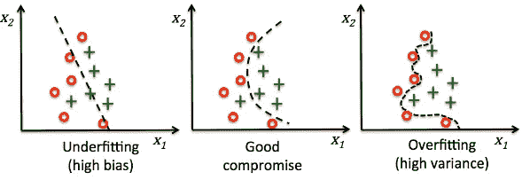

我带回了一个有趣的数据集，最近在 Kaggle 上遇到的。你可以在这里找到数据集[](https://www.kaggle.com/c/dont-overfit-ii/overview)**。**

*在给出任何与数据库相关的提示之前，先看看训练集和测试集的比例。*

*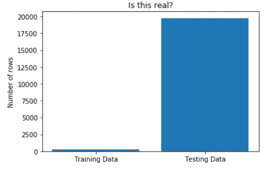*

*测试数据是训练数据的 79 倍。*

*从训练和测试数据集的比例来看，我们可以清楚地预见到我们的模型将会出现过拟合的问题。这可以通过在我们的模型中添加一些偏见或者使用 LASSOCV 来处理(如果你不知道它的意思，不要紧张，我会让这一切变得很容易！).那我们还等什么，开始吧！*

# *导入相关库*

```
*import numpy as np 
import pandas as pd 
from sklearn.linear_model import LassoCV , LassoLarsCV
from sklearn.model_selection import cross_val_score
from sklearn.preprocessing import StandardScaler*
```

*你猜对了，我们将使用 LassoCV 来增加偏差和减少方差。即使你现在没有任何想法，不要担心，只要相信我，到本文结束时，你会对套索回归有很好的了解，以及它如何有助于减少过度拟合。*

*让我们装上子弹，瞄准目标！*

```
*train = pd.read_csv('../input/dont-overfit-ii/train.csv')
test = pd.read_csv('../input/dont-overfit-ii/test.csv')train.shape , test.shape*
```

*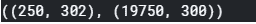*

```
*train.head()*
```

*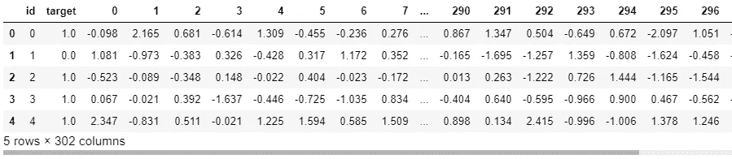*

*有 300 根独立的柱子*

*因此，在将数据分成自变量和因变量后，我们会得到这样的结果:*

```
*y_train = train['target']
x_train  = train.drop(['id' ,'target'] ,axis = 1)
test = test.drop('id',axis = 1)*
```

*我们都做好了进一步处理的准备，但下一步该怎么办呢？现在让我们从基础开始。我们能做的是对数据进行归一化，但是等一下，我们首先需要了解如何进行归一化，主要是为什么要进行归一化。*

# *标准化/规范化的需求:*

## *规范化与标准化*

*   *`Standard Scaler`:以均值为 0，标准差为 1 的方式转换数据。简而言之，它将数据标准化。标准化对于具有负值的数据很有用。它将数据排列成正态分布**。**在分类上比回归更有用。*
*   *`Normalizer`:将数据挤压在 0 和 1 之间。它执行规范化。由于范围和幅度减小，训练过程中的梯度不会爆炸并且您不会获得更高的损失值。在回归中比分类**更有用。***

## *为什么？*

*实际情况是，所有列可能有不同的单位，例如，如果有一个“年龄”列，其值可能是 20、25、18 等。*

*同样，可能还有另一个“薪金”列，其值可能是 20，000，000 或 50，000，000(努力工作的家伙！).主要原因是，如果我们想要关联这两列，解决这个问题的效率会很低，因此，将这两列转换为相同的单位标准化/规范化是很方便的。*

## *怎么会？*

*计算标准定标器的公式为:*

*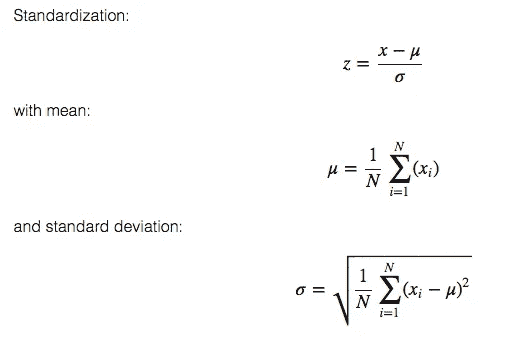*

# *返回代码:*

```
*scaler  = StandardScaler()
x_train  = scaler.fit_transform(x_train)
test = scaler.fit_transform(test)*
```

*现在我们已经将我们的数据转换成了 StandardScaler。进入下一阶段，应用 LASSOCV(最小绝对收缩和选择操作符交叉验证)*

# *最小绝对收缩和选择算子交叉验证*

*LASSOCV 这个术语是什么，为了理解它，让我们把这个术语分成 LASSO 和 CV 两部分。*

*让我们来理解第一部分:套索(最小绝对收缩和选择算子)*

*假设我们的训练集中有这两个点，我们需要拟合一条具有最小残差的直线，很明显，我们会拟合如下所示的直线:*

*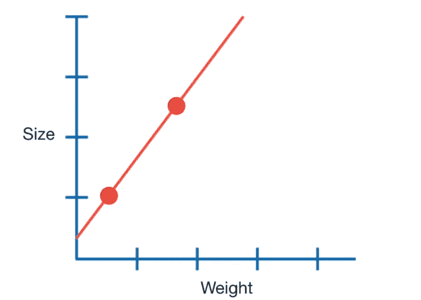*

*现在，如果我们在测试集上检查我们的模型，我们会得到这样的结果:*

*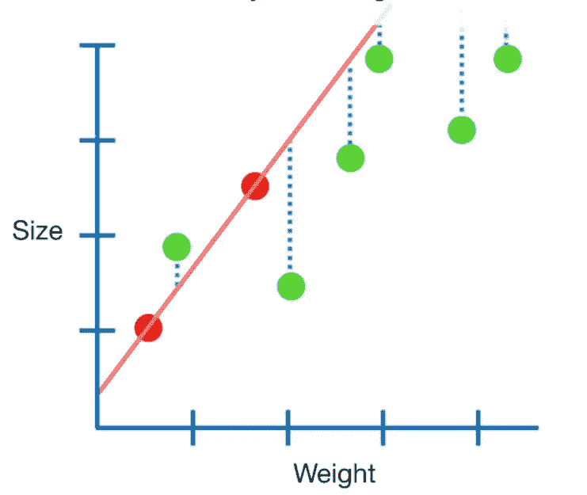*

*从结果中我们可以清楚地看到，残差比训练数据集中的残差高得多。*

*这意味着我们高度过度拟合数据集，导致高方差和低偏差。这个示例场景与我们的数据集非常相似，因为训练数据与测试数据的可比性很小。*

*为了解决这个问题，使用了套索回归，因为它的主要功能是在预测中包含一些偏差，这有助于长期预测。*

*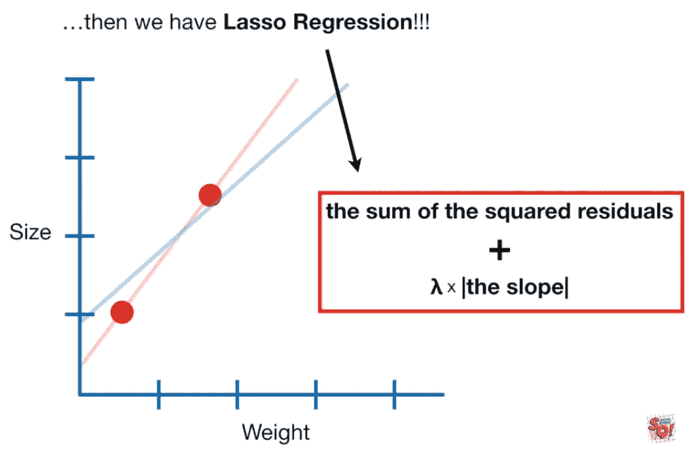*

*套索回归增加了由希腊字母符号λ乘以直线斜率表示的惩罚。*

*它有助于增加偏差和减少残差。*

*如果你还有疑问，这里的是一个不错的教程。*

*现在我们已经理解了 LASSO，让我们来理解交叉验证是什么意思。*

## *交互效度分析*

*套索函数中的一个重要属性是 *alpha 的值。*抛开交叉验证不谈，计算 *alpha* 值背后的数学非常有趣，但实际上，你需要知道的是，Lasso 回归带有一个参数， *alpha* 和 *alpha* 越高，越多的特征系数为零， *alpha 的值越低，* lasso 回归将类似于线性回归。*

*LASSO 中使用交叉验证，通过函数调用 LASSOCV 来计算多个 *alpha* 值的输出。*

# *返回代码:*

```
*model_lasso = LassoCV(alphas =  [0.05, 0.1, 0.3, 1, 3, 5, 10, 15, 30, 50, 75]).fit(x_train, y_train)
lasso_preds = model_lasso.predict(test)*
```

*正如在代码中看到的，我们已经从 0.05 到 75 的阿尔法列表，最好的结果将存储在 lasso_preds 中。*

*最后，我们处于模型的最后阶段，我们需要预测输出并提交它。*

```
*#Converting the list into a column , so that it can be stored in the test.csv filelasso_preds=lasso_preds.T   #.T stands for transpose.*
```

*加载示例提交文件:*

```
*submit = pd.read_csv('../input/dont-overfit-ii/sample_submission.csv')
submit.head()*
```

*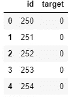*

*在没有预测的情况下覆盖目标后，我们得到:*

```
*submit['target'] = lasso_preds
submit.head()*
```

*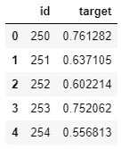*

*手指交叉，让我们提交这个 csv 文件，看看我们的分数。*

```
*submit.to_csv('submit.csv', index = False)*
```

*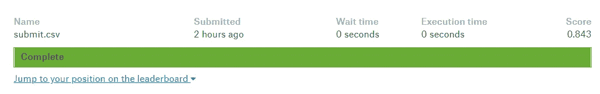*

*0.843(还不错！)*

*好了，现在就这些了，欢迎提出任何建议。我总是乐于学习新的东西，也非常感谢一些评论！*