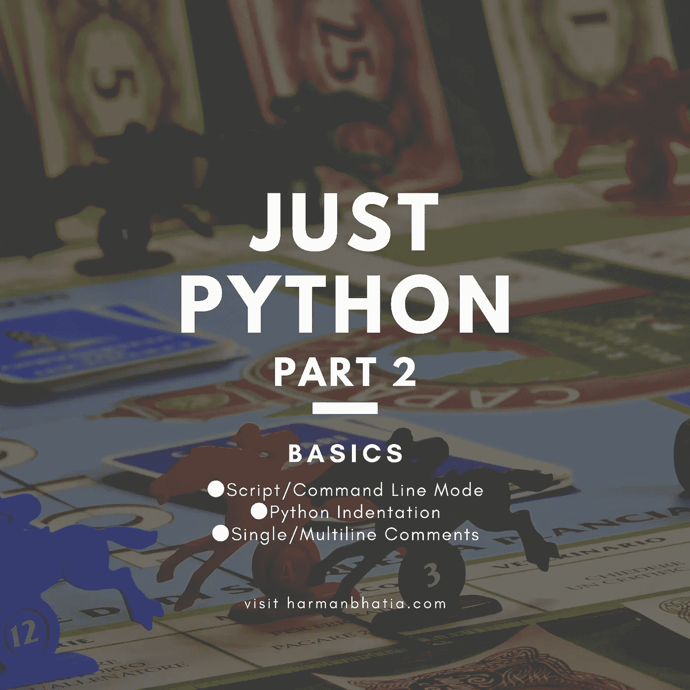

# 仅 Python 第 2 部分—基础知识

> 原文：<https://medium.com/analytics-vidhya/just-python-part-2-basics-f59de90c9eef?source=collection_archive---------10----------------------->



Python 是非常简单明了的语言。Python 是一种解释型编程语言，这意味着作为一名开发人员，你可以编写 Python(。py)文件，然后将这些文件放入 python 解释器中执行。

我相信你已经在你的系统中安装了 python。如果没有，请优先进入下面的安装模块，这样您可以在旁边练习。

[](/@harmanbhatia101/just-python-part-1-installation-6d8c864136a9) [## 仅 Python 第 1 部分—安装

### 本 python 系列旨在为您提供关于 python 及其库的全面知识。这一部分将包括…

medium.com](/@harmanbhatia101/just-python-part-1-installation-6d8c864136a9) 

# Python 脚本模式

用脚本参数调用解释器开始执行脚本，并继续执行，直到脚本完成。当脚本完成时，解释器不再活动。

Python 中最简单的指令是**“print”**指令——它只是打印出一行。让我们编写第一个 Python 文件，名为 helloworld.py，它可以在任何文本编辑器中完成。Python 文件有扩展名**。py** 。

在 helloworld.py 文件中键入以下源代码

```
print("Hello, World!")
```

我们假设您在 PATH 变量中设置了 Python 解释器。现在，试着运行这个程序，如下所示

```
$ python helloworld.py
```

# Python 命令行

为了测试 python 中的少量代码，有时不在文件中编写代码是最快也是最容易的。这之所以成为可能，是因为 Python 本身可以作为命令行运行。

在 Windows、Mac 或 Linux 命令行上键入以下内容:

不将脚本文件作为参数传递，调用解释器会出现以下提示

```
**$** **python**
Python 3.8.0 (default, Nov 14 2019, 22:29:45) [GCC 5.4.0 20160609] on linux
Type "help", "copyright", "credits" or "license" for more information.
**>>>**
```

在 Python 提示符下输入以下文本，然后按 Enter 键

```
**$** python
Python 3.8.0 (default, Nov 14 2019, 22:29:45) [GCC 5.4.0 20160609] on linux
Type "help", "copyright", "credits" or "license" for more information.
**>>>** **print("Hello, World!")**
```

这会产生以下结果

```
**$** python
Python 3.8.0 (default, Nov 14 2019, 22:29:45) [GCC 5.4.0 20160609] on linux
Type "help", "copyright", "credits" or "license" for more information.
>>> print("Hello, World!")
**Hello, World!**
```

当您在 python 命令行中完成操作时，只需输入以下命令即可退出 python 命令行界面:

```
**>>> exit()**
```

# Python 缩进

缩进是指代码行开头的空格。Python 没有提供大括号来表示类和函数定义或流控制的代码块。代码块用行缩进来表示，这是严格执行的。

制表符和空格都受支持，但是标准缩进要求标准 Python 代码使用四个空格。例如:

```
if True:
    print("True")
else:
    print("False")
```

如果跳过缩进，Python 会给出一个错误:

```
if True:
print("True")
**File "<stdin>", line 2
    print("True")
    ^
IndentationError: expected an indented block**
```

# Python 注释

Python 具有注释功能，用于代码内文档。注释可以用来解释 Python 代码。注释可以用来使代码更具可读性。测试代码时，可以使用注释来阻止执行。

不在字符串文字内的散列符号(#)开始注释。#后面直到物理行末尾的所有字符都是注释的一部分，Python 解释器会忽略它们。

```
print "Hello, Python!" # This iscomment
```

## 多行注释

Python 实际上没有多行注释的语法。要添加多行注释，您可以为每行插入一个`#`:

```
# This is a comment.
# This is a comment, too.
# This is a comment, too.
# I said that already.
```

因为 Python 会忽略没有赋给变量的字符串，所以您可以在代码中添加一个多行字符串(三重引号),并在其中放置注释:

```
"""
This is a multiline
comment.
"""
```

只要字符串没有被赋值给变量，Python 就会读取代码，但是会忽略它，这样你就做了一个多行注释。

现在，让我们在下一个教程中前进到 **Python 变量和类型**。

[](/analytics-vidhya/just-python-part-3-variables-and-types-385762b8cfd5) [## 只是 Python 第 3 部分——变量和类型

### 创建变量

medium.com](/analytics-vidhya/just-python-part-3-variables-and-types-385762b8cfd5)