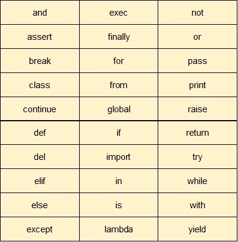

# 只是 Python 第 3 部分——变量、运算符和类型

> 原文：<https://medium.com/analytics-vidhya/just-python-part-3-variables-and-types-385762b8cfd5?source=collection_archive---------8----------------------->


在本教程中，我们将学习 python 变量、不同类型的运算符和数据类型。我相信你已经了解了 python 的基础知识，如果没有，请阅读下面的部分，以便更好地理解第 3 部分。

[](/analytics-vidhya/just-python-part-2-basics-f59de90c9eef) [## 仅 Python 第 2 部分—基础知识

### Python 是非常简单明了的语言。Python 是一种解释型编程语言，这意味着作为一种…

medium.com](/analytics-vidhya/just-python-part-2-basics-f59de90c9eef) 

# 创建变量

变量只是用来存储值的保留内存位置。这意味着当你创建一个变量时，你在内存中保留了一些空间。因此，通过为变量分配不同的数据类型，可以在这些变量中存储整数、小数或字符。

与其他编程语言不同，Python 没有用于声明变量的命令。当你给一个变量赋值时，声明自动发生。*等于*符号(=)用于给变量赋值。

```
**counter = 100**          # An integer assignment
**miles   = 1000.0**       # A floating point
**name    = "John" **      # A string

print counter
print miles
print name
```

这里，100、1000.0 和“约翰”分别是分配给*计数器*、*英里*和*名称*变量的值。这会产生以下结果

```
**100
1000.0
John**
```

# 变量名

变量可以有一个短名称(如 x 和 y)或更具描述性的名称(名称、计数器、英里)。Python 变量的规则:

*   变量名必须以字母或下划线字符开头
*   变量名不能以数字开头
*   变量名只能包含字母数字字符和下划线(A-z、0–9 和 _)
*   变量名区分大小写(年龄、年龄和年龄是三个不同的变量)

> 记住变量名是区分大小写的

# 保留字

以下列表显示了 Python 关键字。这些是保留字，不能用作常量、变量或任何其他标识符名称。所有 Python 关键字都只包含小写字母。



# 变量的多重赋值

Python 允许将单个值赋给多个变量。

```
a = b = c = 1
```

您也可以将多个值赋给多个变量。

```
a,b,c = 1,2,"john"
```

# 输出变量

使用变量有不同的方法。Python print 语句用于输出变量。运算符 *"+"* 用于将一个变量加到另一个变量上。

```
str1 = 'Hello'
print(str)          # Prints string - Hellostr2 = 'World!' 
print(str1 + " " + str2)    #Prints string - Hello World! 
```

# 全局变量

在函数之外创建的变量(在上面所有的例子中)被称为全局变量。

全局变量可以被任何人使用，包括函数内部和外部。

```
x = "Love"def myfunc():
 print("Python is "+ x)myfunc() #Prints Python is Love
```

如果在函数中创建同名变量，该变量将是局部变量，只能在函数中使用。同名的全局变量将保持原来的全局值。

```
x = "Love"def myfunc():
    **x = "Awesome"**
    print("Python is "+ x)myfunc() #Prints Python is Awesomeprint("Python is " + x) #Prints Python is Love
```

## 全局关键字

通常，当你在一个函数中创建一个变量时，这个变量是局部的，并且只能在这个函数中使用。

要在函数内部创建一个全局变量，可以使用`global`关键字。

```
x = "Love"def myfunc():
    **global x**
    **x = "Awesome"**myfunc() print("Python is " + x) #Prints **Python is Awesome**
```

# Python 数据类型

Python 有各种标准数据类型，用于定义可能对它们进行的操作以及每种操作的存储方法。

## 内置数据类型

默认情况下，Python 在这些类别中内置了以下数据类型:

文本类型:`str`

数字类型:`int`、`float`、`complex`

序列类型:`list`、`tuple`、`range`

映射类型:`dict`

设置类型:`set`，`frozenset`

布尔类型:`bool`

二进制类型:`bytes`、`bytearray`、`memoryview`

## 获取数据类型

使用`type()`函数可以得到任何对象的数据类型:

```
x = 5
print(type(x)) #Print <class 'int'>y = "Alex"
print(type(y)) #Print <class 'str'>
```

# Python 运算符

运算符用于对变量和值执行运算。

Python 将运算符分为以下几组:

*   算术运算符
*   赋值运算符
*   比较运算符
*   逻辑运算符
*   标识运算符
*   成员运算符
*   按位运算符

**算术运算符**

在下面的示例中，假设变量 a 保存值 10，变量 b 保存值 20。


**赋值运算符**

在下面的示例中，假设变量 a 保存值 10，变量 b 保存值 20。


**比较运算符**


**逻辑运算符**


**身份运算符**


**隶属操作符**


**按位运算符**


这都是关于 python 变量、数据类型和操作符的。在下一个教程中，我们将朝着 **Python 集合前进，即字符串、列表、字典和元组。**

> 精英制片人和日常英雄明白，你每天做的事情远比你偶尔做的事情重要。所以**每天练习**成为**胜利者**。

[](/@harmanbhatia101/just-python-part-4-strings-and-collections-lists-sets-dictionaries-tuples-460797dc540d) [## 仅 Python 第 4 部分—字符串和集合(列表、集合、字典、元组)

### Python 字符串

medium.com](/@harmanbhatia101/just-python-part-4-strings-and-collections-lists-sets-dictionaries-tuples-460797dc540d)