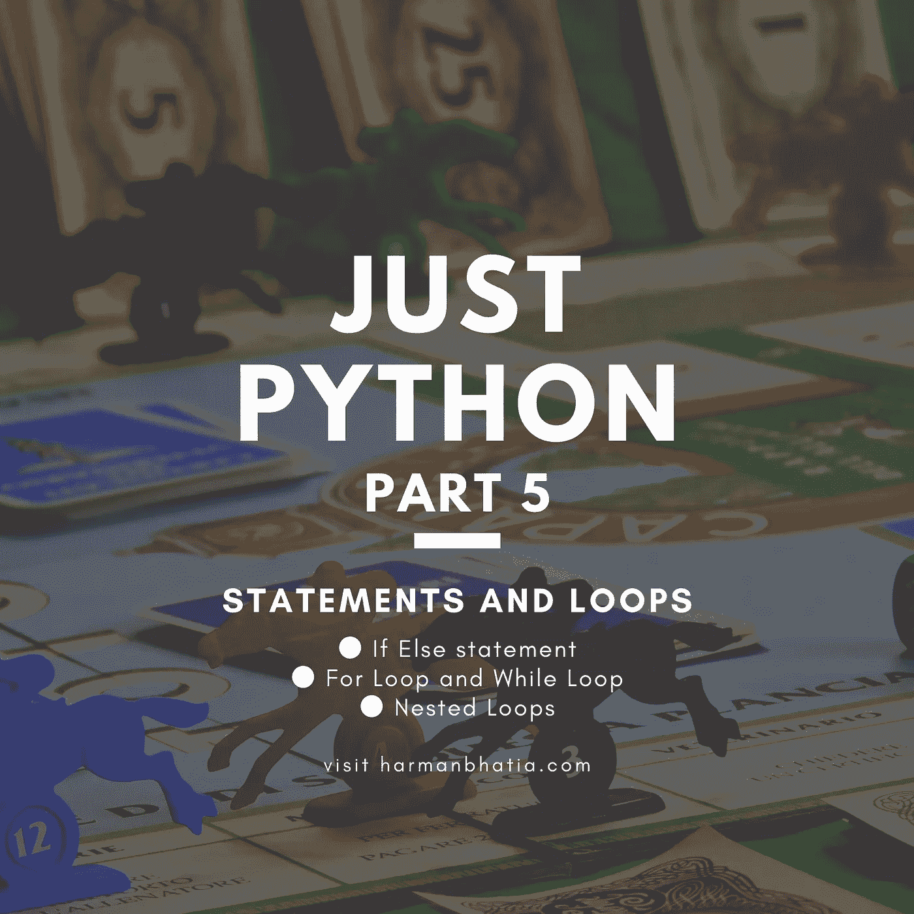

# 仅 Python 第 5 部分—语句和循环

> 原文：<https://medium.com/analytics-vidhya/just-python-part-5-statements-and-loops-6ada70a74ead?source=collection_archive---------20----------------------->



我相信你对第 4 部分中的字符串和集合已经很清楚了，因为它们是我们使用字符串、列表、字典和集合的语句和循环的先决条件。如果没有，请浏览字符串和集合。

[](/@harmanbhatia101/just-python-part-4-strings-and-collections-lists-sets-dictionaries-tuples-460797dc540d) [## 仅 Python 第 4 部分—字符串和集合(列表、集合、字典、元组)

### Python 字符串

medium.com](/@harmanbhatia101/just-python-part-4-strings-and-collections-lists-sets-dictionaries-tuples-460797dc540d) 

# Python 条件和 If 语句

Python 支持数学中常见的逻辑条件:

*   等于:a == b
*   不等于:a！= b
*   小于:a < b
*   Less than or equal to: a <= b
*   Greater than: a > b
*   大于或等于:a >= b

这些条件可以以多种方式使用，最常用于“if 语句”和循环中。通常，语句是按顺序执行的:首先执行函数中的第一条语句，然后执行第二条语句，依此类推。可能会出现需要多次执行一个代码块的情况。


“if 语句”是使用 if 关键字编写的。

```
a = 33
b = 200
if b > a:
    print(“b is greater than a”)
```

## 刻痕

Python 依靠缩进(行首的空白)来定义代码中的范围。其他编程语言经常为此使用花括号。

```
a = 33
b = 200
**if b > a:
print(“b is greater than a”) # This will give an error
** 
```

## 否则如果

elif 关键字是 pythons 的一种说法，“如果前面的条件不为真，那么尝试这个条件”。

```
a = 33
b = 33
if b > a:
    print("b is greater than a")
elif a == b:
    print("a and b are equal")
```

# 其他

else 关键字捕捉前面条件没有捕捉到的任何内容。

```
a = 200
b = 33
if b > a:
    print("b is greater than a")
elif a == b:
    print("a and b are equal")
else:
    print("a is greater than b") -----------------------------------------------------------------a = 200
b = 33
if b > a:
    print("b is greater than a")
else:
    print("b is not greater than a") 
```

## 简写 If-else

如果只有一条语句要执行，可以将它放在与 If 语句相同的行上。

```
if a > b: print("a is greater than b") 
```

如果您只有一个要执行的语句，一个用于 If，一个用于 else，您可以将它们都放在同一行:

```
print("A") if a > b else print("B") 
```

在同一行中还可以有多个 else 语句:

```
print("A") if a > b else print("=") if a == b else print("B") 
```

## 嵌套 If

在`if`语句中可以有`if`语句，这叫做*嵌套* `if`语句。

```
x = 90

if x > 10:
    print("Above ten,")
    if x > 20:
        print("and also above 20!")
    else:
        print("but not above 20.") 
```

## 与或运算符

**和**关键字和**或**关键字是逻辑运算符，用于组合条件语句:

```
a = 200
b = 33
c = 500
if a > b and c > a:
    print("Both conditions are True")
elif a > b or a > c:
    print("At least one of the conditions is True") 
```

## pass 语句

`if`语句不能为空，但是如果出于某种原因，您有一个没有内容的`if`语句，请放入`pass`语句以避免出错。

```
a = 33
b = 200

if b > a:
    pass
```

# Python For 循环

for 循环用于遍历序列(列表、元组、字典、集合或字符串)。

这不像其他编程语言中的 for 关键字，更像其他面向对象编程语言中的迭代器方法。


## 句法

```
for iterating_var in sequence:
     statements(s) 
```

打印水果列表中的每种水果:

```
fruits = ["apple", "banana", "cherry"]
for x in fruits:
    print(x) 
```

## range()函数

要在一组代码中循环指定的次数，我们可以使用 range()函数，

range()函数返回一个数字序列，默认情况下从 0 开始，按 1 递增(默认情况下)，到指定的数字结束。

```
for x in range(6):
  print(x)
```

> 注意，范围(6)不是 0 到 6 的值，而是 0 到 5 的值。

## 中断语句

使用 break 语句，我们可以在循环完所有项目之前停止循环。break 最常见的用途是当某些外部条件被触发，需要快速退出循环时。对于循环，**中断**语句可用于*而*和*中。*

如果使用嵌套循环，break 语句将停止最内层循环的执行，并开始执行该块后的下一行代码。


## 句法

Python 中的 **break** 语句的语法如下

```
break
```

`x`为“香蕉”时退出循环:

```
fruits = [“apple”, “banana”, “cherry”]
for x in fruits:
    print(x)
    if x == “banana”:
        break
```

## continue 语句

使用 continue 语句，我们可以停止当前的循环迭代，并继续下一次循环。 **continue** 语句拒绝当前循环迭代中的所有剩余语句，并将控制移回到循环的顶部。

**继续**语句可用于*而*和*用于*循环。

# 句法

```
continue
```

## 流程图


## **例子**

不要打印香蕉:

```
fruits = [“apple”, “banana”, “cherry”]
for x in fruits:
   if x == “banana”:
       continue
   print(x)
```

## pass 语句

`for`循环不能为空，但是如果出于某种原因，您有一个没有内容的`for`循环，请放入`pass`语句以避免出错。**通过**语句是一个*空*操作；它执行的时候什么都不会发生。**通道**在你的代码最终要去的地方也是有用的，但是还没有被写出来(例如，在存根中)

## 句法

```
pass
```

## 例子

```
for x in [0, 1, 2]:
 pass
```

# 将 else 语句与循环一起使用

Python 支持将 else 语句与循环语句相关联

*   如果 **else** 语句与 **for** 循环一起使用，当循环遍历完列表后，将执行 **else** 语句。
*   如果 **else** 语句与 **while** 循环一起使用，则当条件变为假时，执行 **else** 语句。

```
for x in range(6):
  print(x)
else:
  print("Finally finished!")--------------------------------------------------------------------for num in range(10,20):     #to iterate between 10 to 20
    for i in range(2,num):   #to iterate on the factors of number
       if num%i == 0:         #to determine the first factor
          j=num/i             #to calculate the second factor
          print('%d equals %d * %d' % (num,i,j))
          break #to move to the next number, the #first FOR
    else:                  # else part of the loop
       print(num, 'is a prime number')
```

当执行上述代码时，它会产生以下结果

```
10 equals 2 * 5
11 is a prime number
12 equals 2 * 6
13 is a prime number
14 equals 2 * 7
15 equals 3 * 5
16 equals 2 * 8
17 is a prime number
18 equals 2 * 9
19 is a prime number
```

# while 循环

使用 while 循环，只要条件为真，我们就可以执行一组语句。

## 句法

Python 编程语言中的 **while** 循环的语法是

```
while expression:
   statement(s)
```

这里，**语句可以是一条语句，也可以是一组语句。**条件**可以是任意表达式，true 可以是任意非零值。当条件为真时，循环迭代。**

**当条件变为假时，程序控制传递到循环的下一行。**

**在 Python 中，在一个编程构造之后缩进相同数量的字符空间的所有语句都被认为是单个代码块的一部分。Python 使用缩进作为语句分组的方法。**

# **流程图**

****

**这里，while 循环的关键点是该循环可能永远不会运行。当条件被测试且结果为假时，循环体将被跳过，while 循环后的第一条语句将被执行。**

# **例子**

```
i = 1
while i < 6:
    print(i)
    i += 1 
```

> ****注意:**记得递增 I，否则循环会永远继续下去。**

## **else 语句**

**使用 else 语句，我们可以在条件不再为真时运行一次代码块:**

```
i = 1
while i < 6:
    print(i)
    i += 1
else:
    print("i is no longer less than 6")
```

**以下示例说明了 else 语句与 while 语句的组合，while 语句打印小于 5 的数字，否则将执行 else 语句。**

```
count = 0
while count < 5:
   print(count, " is  less than 5")
   count = count + 1
else:
   print(count, " is not less than 5")
```

**当执行上述代码时，它会产生以下结果**

```
0 is less than 5
1 is less than 5
2 is less than 5
3 is less than 5
4 is less than 5
5 is not less than 5
```

# **单一报表套件**

**类似于 **if** 语句语法，如果您的 **while** 子句只包含一个语句，它可能会与 while 头放在同一行。**

**下面是一个单行 while 子句的语法和示例**

```
flag = 1
while (flag): print('Given flag is really true!')
print "Good bye!"
```

**最好不要尝试上面的例子，因为它进入了无限循环，你需要按 CTRL+C 键退出。**

**这都是关于循环和语句的。如果您有任何疑问，请发表评论或访问[www.harmanbhatia.com](http://www.harmanbhatia.com)。**

**杰出的创造性成就者应用粒度的心态，而不是肤浅的心态。所以不要光看这个来完成题目，也要练习。**

**接下来，我们将学习 **Python 函数**。快乐的蟒蛇！**