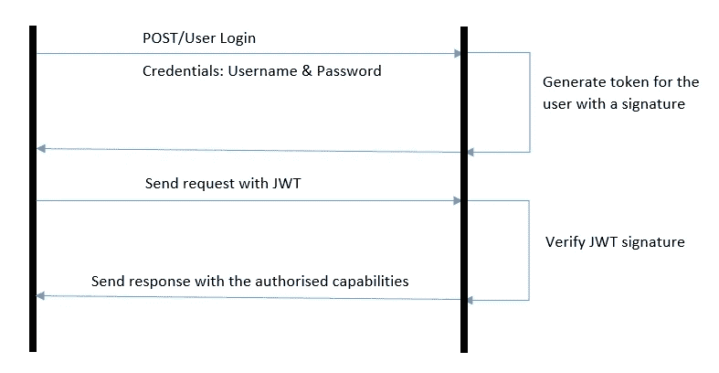
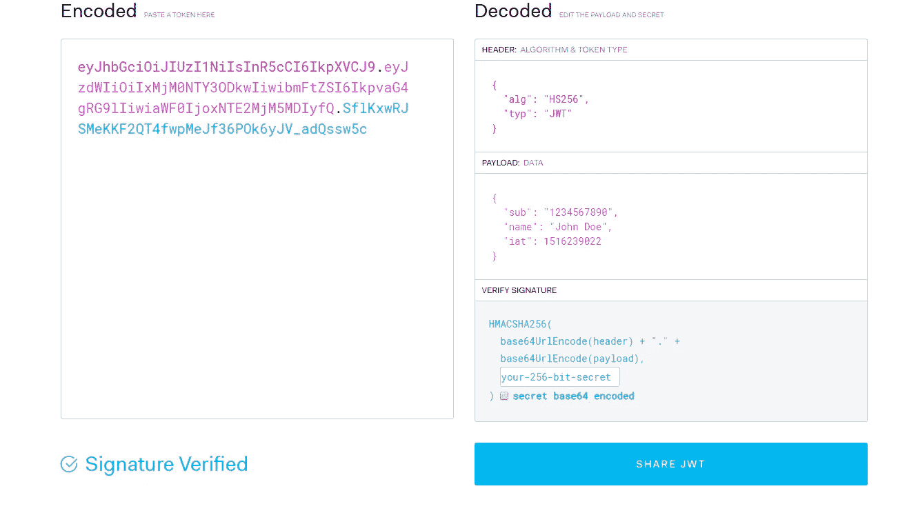
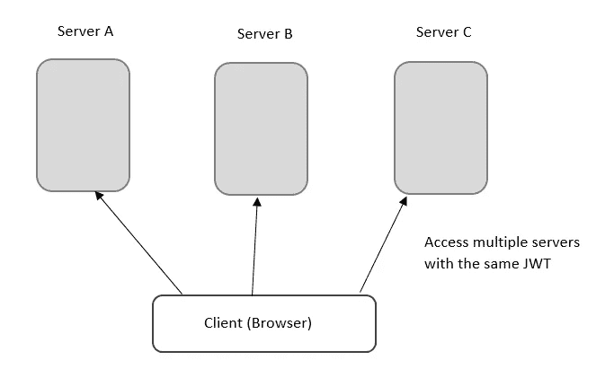

# JWT——杰森·网络令牌

> 原文：<https://medium.com/analytics-vidhya/jwt-jason-web-token-f101daad2779?source=collection_archive---------30----------------------->

首先，让我们看看什么是 Jason web 令牌。它是一种在客户机和服务器之间作为 JSON 对象安全传输信息的机制。与 cookies 不同，它可以包含无限的信息，并且由于其微小的尺寸，使得它更容易通过 URL、POST 参数或 HTTP 头进行传递。

其中一个关键特征是它具有使用秘密或公共/私人密钥对的数字签名。

另一件要记住的事情是，JWT 不允许你在用户登录过程中通过输入用户名和密码来进行身份验证。它的作用是当用户登录时，应用程序将创建一个 JWT 并发送给用户。因此，初始请求之后的请求将包括该令牌，并检查哪些资源被授权给该用户，然后将发送响应。

例如:如果管理员登录并创建了一个令牌，响应将包括一个唯一的令牌，该令牌具有最大的权限来干预网站，而普通用户将生成一个令牌，该令牌具有仅读取/编辑权限的信息。

还建议将 JWT 存储在用户浏览器中，而不是任何脚本都可以访问的本地存储中，从而使其易受外部攻击者的攻击。

**工作原理**

**JWT 的结构**

令牌有三个部分。

头:包括签名算法和类型。

有效载荷:用户 ID、用户名、发布时间的时间戳。

验证签名。

如果你去 https://jwt.io/[网站](https://jwt.io/)，你可以看到任何 JWT 的更清晰的分类。

来源:[https://jwt.io/](https://jwt.io/)

**优点**

假设我们在有许多服务器的应用程序中使用会话而不是 JWT。会话信息存储在其相关的服务器中，因此如果用户必须访问多个服务器，他将不得不每次都通过输入凭证来登录，这可能会令人沮丧。

如果您在多台服务器上共享相同的密钥，JWT 将允许无缝传输，使用户能够重新登录。

**参考文献**

Copes，f .，2020。 *JWT 认证:何时以及如何使用——log rocket 博客*。[在线] LogRocket 博客。可在:<https://blog . log rocket . com/jwt-authentic ation-best-practices/>【2018 年 10 月 11 日访问】。