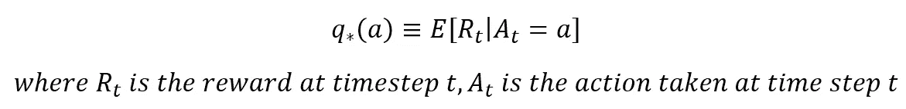
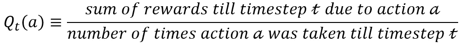
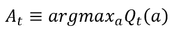
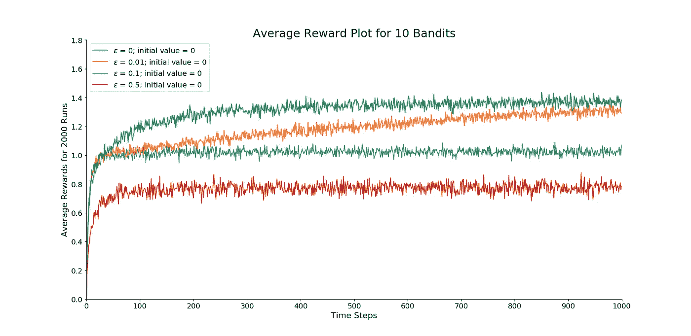
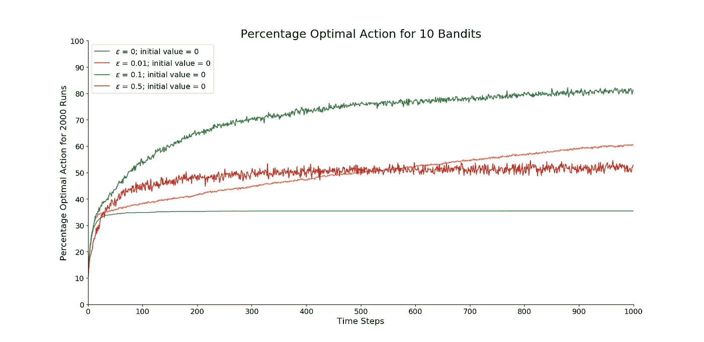
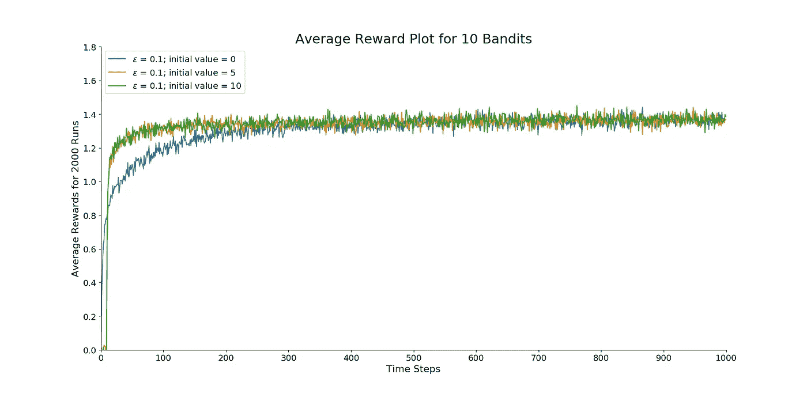
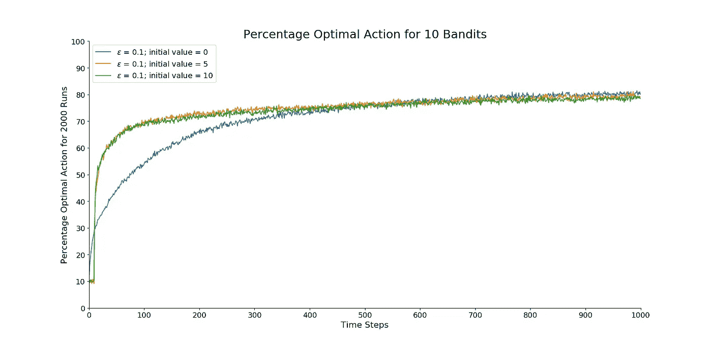
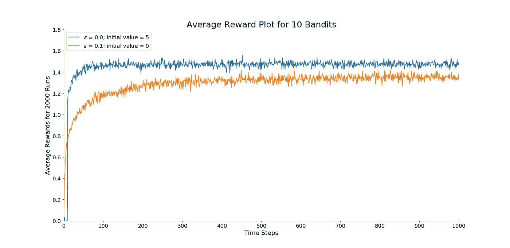
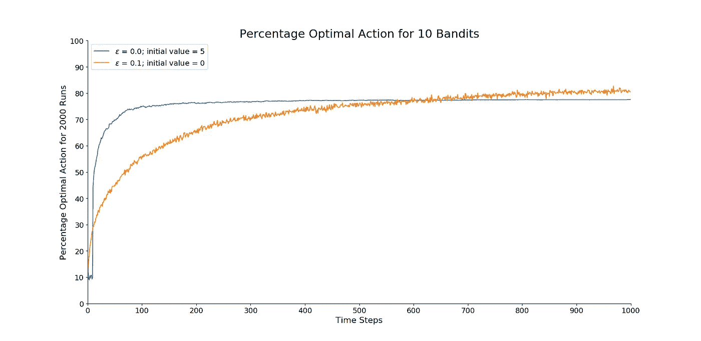

# k-武装匪徒问题

> 原文：<https://medium.com/analytics-vidhya/k-armed-bandits-problem-a92b43988133?source=collection_archive---------9----------------------->

# **问题定义**

想象一下，一个人有 k 个选项，他只能从中选择一个。每当这个人做出一个选择，他就会根据他做出的选择得到一份奖励。概率函数对后端收到的奖励进行建模。同一套选择在这个人面前出现有限次(比如说 *N* 次)。如果是这样，他将如何在每一个 *N* 时间步中做出选择，每次从 *k* 选项中选择一个选项，以使收集到的净报酬最大化？

考虑另一个公式。想象一下赌场里的老虎机。一个人有机会拉动任何一台 *k* 老虎机的手柄。现在，这个人将如何在 *k* 老虎机之间分配 *N* 次机会，以使他的奖励最大化？

# **使用表格方法求解**

当在一个状态中可以采取的动作的数量以及状态的数量较低时，使用表格方法，以便可以使用表格记录所有动作及其相应的值。在这个问题中没有状态可以描述(因为它是*非关联*)，因此与其他复杂问题相比，它是一个简单的问题。由所有可用动作组成的动作空间将由 *k* 动作组成。因此，构建的表将具有尺寸 *k* 。

每个行动(由 *a* 表示)根据其概率分布有一个平均回报。我们可以认为这个平均回报是每个行为的 ***值*** 。取平均值作为在时间步长 *t* 采取行动的预期奖励:

为了设计一个好的解决方案，我们必须尽可能精确地估计每个行动的平均回报。*动作值*方法用于估计动作值。一种估算方法是使用如下平均值(*样本平均法*):

当试验次数趋于无穷大时 *Q* 由大数定律趋于 *q* 。

现在，我们必须选择一个动作选择方法。选择下一个动作有不同的方法:ε-贪婪方法、UGB 方法、梯度方法等等。

这里我们讨论ε-贪婪方法，因为它很简单。在ε-greedy 方法中，我们大多数时候通过选择具有最高估计*值*的动作来表现贪婪，有时我们从一组可用动作中随机选择一个动作，而不依赖于其估计*值*。这种方法是根据*探索-开发困境*设计的，这恰好是强化学习的中心主题。

它可以简单地理解为:在一组给定的选项中，我们选择(利用)那些我们知道能给出最好回报的选项，然而我们不知道那些我们甚至一次也没有选择(探索)过的选项是否能给出更好的回报，如果我们为了寻找更好的回报而放弃我们所拥有的，我们不确定我们是否真的会得到更好的回报，因此出现了两难的境地。这甚至与人类的生活也有关系，人们在 25 岁后停止探索不同的领域，并且只在一个领域发展专长，即使他或她没有探索所有其他领域。

贪婪行为可以表示为:

其中 *t* 是时间步长，而 *a* 表示可用动作集合中的任何动作。

使用均匀概率分布和用户定义的参数*ε*对探索行为进行建模。ε可以取 0 到 1 之间的值。如果使用均匀概率分布在 0 和 1 之间的随机预测值小于ε，则随机采取动作(在本文中使用均匀概率分布来模拟随机性),否则使用上面讨论的贪婪方法来选择动作。

# 为问题定义测试平台

由于问题的定义非常笼统，我们需要一个特例来测试不同的解决方法。我们将设置 *k=10* 。这意味着每个时间步将有 10 个动作可用。从十个动作中的每一个动作获得的奖励由高斯分布建模，其平均值选自另一个平均值为 0 的高斯分布。两种分布的方差都设置为 1。最大时间步长 N 设置为 1000。

这个测试运行 2000 次，每个时间步获得的回报是 2000 个样本的平均值。这样做是为了捕捉总体趋势。进行了三个实验:

1.  **ε的影响**:对ε的以下值进行了测试:0.00(贪婪)、0.01、0.10、0.50。价值估计的初始值被认为是 0。
2.  **初始值的影响**:对于相同的ε= 0.1 的值，对不同的动作值的初始估计值进行了测试:0，5，10。
3.  **乐观初始值**:将ε=0.1 且初始值估计值= 0(现实)的测试与ε= 0 且初始值=5(乐观)的测试进行比较。

# 形象化

为了直观显示和测量性能，我们使用了两种不同的图:

1.  **平均奖励图**:绘制每个时间步获得的总奖励在运行次数上的平均值。它显示了获得的回报是如何随着经验而变化的。
2.  **最佳行动百分比图**:绘制代理在每个时间步选择最佳行动的次数百分比。它显示了准确性如何随着经验而变化。

# **结果和讨论**

**ε的影响**

图 1—ε测试的*效应的平均回报图*

图 2——“艾司隆效应”实验的最佳行动百分比图

ε= 0(贪婪方法)的改善率较高，但它稳定在一个较低值。这是因为它假设首先探索的动作是最佳的，并完全停止探索，从而导致非最佳的动作。从图 2 中可以明显看出，贪婪方法仅在大约 30%的时间或三分之一的时间内采取了最佳行动。ε= 0.1 的方法首先探索所有的动作；因此，它的增长比最初的贪婪方法要小。它最终找到了最佳行动，并随着时间的推移不断选择它。

它最多可以在 91%的时间内采取最佳行动(因为ε= 0.1)。ε= 0.01 的方法在图 1 和图 2 中发展缓慢，最终将比所有方法表现更好。在图 2 中，它将在 99.99%处接近其极限。ε= 0.5 的方法做了太多的探索，并在图 2 中在 50%处达到其最佳动作的极限

**初始值的影响**

图 3——“初始值的影响”实验的平均回报图

图 4——“初始值的影响”实验的最佳行动百分比图

初始增长率随着动作值的初始估计值的增加而增加，而增长率向更高的初始值减慢。最后，所有的方法都收敛到几乎相同的值。

**乐观初始值**

图 5——“乐观初始值”实验的平均回报图

图 6——“乐观初始值”实验的最佳行动百分比图

如图 5 所示，贪婪-乐观方法(ε= 0，初始值=5)比ε-贪婪方法(ε= 0.1，初始值=5)执行得更好。这是因为高度乐观的初始值迫使贪婪方法在收敛于贪婪动作之前进行公平份额的探索。最初，贪婪-乐观方法性能较差，因为它做了很多探索。随着时间步长的增加，探索属性逐渐消失，该方法专注于贪婪动作(具有最高值)，这恰好是最优值。这不同于ε-贪婪方法，因为该方法的探索属性即使在找到最佳动作之后也不会消失，因此受到ε值的限制。

# 结论

随着ε值的增加，平均奖励先增加，然后减少。这表明，开发和探索都不好，而两者的良好混合才能产生最佳效果。因此，所有强化学习算法都应该是探索和利用策略的混合。k 武装土匪问题是测试各种强化算法的好平台。它是强化学习领域的一个很好的介绍性问题。

# 密码

用于生成图和进行测试的 python 代码可以在这里找到— [链接](https://github.com/athultr1997/reinforcement_learning/tree/master/k_armed_bandit_problem)。

# 参考

1.  萨顿，理查德 s 和安德鲁 g 巴尔托。*强化学习:简介*。麻省理工学院出版社，2018。