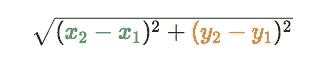

# k 个最接近原点的点-第 8 天(Python)

> 原文：<https://medium.com/analytics-vidhya/k-closest-points-to-origin-day-8-python-4ee1e15f32d4?source=collection_archive---------10----------------------->


照片由[朴达索](https://unsplash.com/@awakedesigner?utm_source=medium&utm_medium=referral)在 [Unsplash](https://unsplash.com?utm_source=medium&utm_medium=referral) 上拍摄

今天我们来解决 k 近邻问题。在我们研究这个问题之前，我们应该知道求两点间距离的公式。



距离公式。来源:汗学院

如果想了解这个公式的推导，可以按照这个[链接](https://www.khanacademy.org/math/geometry/hs-geo-analytic-geometry/hs-geo-distance-and-midpoints/a/distance-formula)。

[**973**](https://leetcode.com/problems/k-closest-points-to-origin/) **。k 个离原点最近的点**

我们在飞机上有一份名单。找到离原点`(0, 0)`最近的`K`点。

(这里，平面上两点之间的距离是欧几里德距离。)

你可以以任何顺序返回答案。答案保证是唯一的(除了它所在的顺序。)

**例 1:**

```
**Input:** points = [[1,3],[-2,2]], K = 1
**Output:** [[-2,2]]
**Explanation:** 
The distance between (1, 3) and the origin is sqrt(10).
The distance between (-2, 2) and the origin is sqrt(8).
Since sqrt(8) < sqrt(10), (-2, 2) is closer to the origin.
We only want the closest K = 1 points from the origin, so the answer is just [[-2,2]].
```

**例 2:**

```
**Input:** points = [[3,3],[5,-1],[-2,4]], K = 2
**Output:** [[3,3],[-2,4]]
(The answer [[-2,4],[3,3]] would also be accepted.)
```

**注:**

1.  `1 <= K <= points.length <= 10000`
2.  `-10000 < points[i][0] < 10000`
3.  `-10000 < points[i][1] < 10000`

解决方案 1:

解决问题的一种方法是，求出各点离原点的距离，对距离进行排序，找到答案。代码将如下所示。

```
class kClosestFinder:
    def kClosest(self, points: List[List[int]], K: int) -> List[List[int]]:x2 = y2 = 0
        points = sorted(points, key = lambda x:math.sqrt(pow(x[0] - x2, 2) + pow(x[1] - y2, 2)))
        return points[:K]
```

我已经尝试了一般化的解决方案，这意味着如果问题需要，你可以改变 x2 或 y2。现在让我们分析一下这个解决方案的复杂性。

复杂性分析

**时间复杂度**

当我们调用 sorted 函数时，timsort()在幕后使用。执行 timsort 的时间复杂度是 O(NlogN)。

**空间复杂度**

Timsort()使用 O(N)空间来执行排序。

能不能试着改进一下上面的逻辑？

我们用 K 大小的堆返回答案怎么样？

1.  对列表中的所有点运行循环。
2.  求当前点到原点的距离。
3.  把它推到堆里，如果堆的大小等于 K，那么在推之前从堆里弹出来。
4.  返回最后一个堆。

```
import heapq
class kClosestFinder:
    def calculate_distance(self, x1, x2, y1, y2):
        return(math.sqrt(((x2-x1)**2) + (y1-y2)**2))

    def kClosest(self, points: List[List[int]], K: int) -> List[List[int]]:
        heap_list = []
        for (x, y) in points:
            dist = -self.calculate_distance(x, 0, y, 0)
            if len(heap_list) == K:
                heapq.heappushpop(heap_list, (dist, x, y))
            else:
                heapq.heappush(heap_list, (dist, x, y))

        return [(x,y) for (dist,x, y) in heap_list]
```

**时间复杂度**

为了创建堆，我们需要遍历整个列表，耗时 O(N)。构建一个 K 大小的堆，时间复杂度为 O(log K)。

**空间复杂度**

要构建一个 K 大小的堆，需要 O(K)。