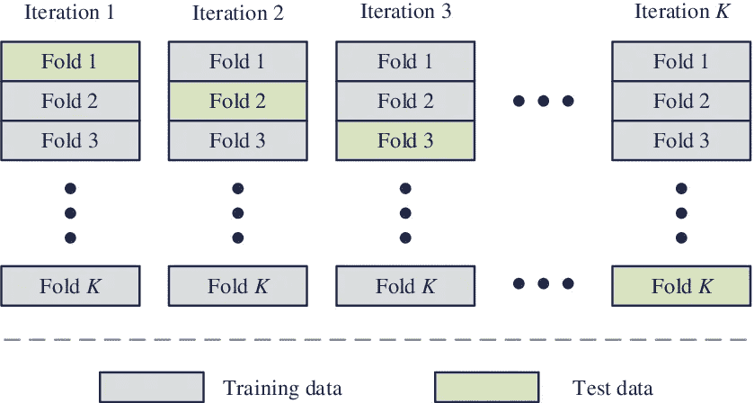

# k 倍交叉验证

> 原文：<https://medium.com/analytics-vidhya/k-fold-cross-validation-d4b7e8777038?source=collection_archive---------13----------------------->

为了更好地表现模型，我们经常将数据集随机分成**训练数据**和**测试数据**。训练数据用于训练模型，为了测试模型，我们使用测试数据，该测试数据也为我们提供模型的评估。**交叉验证**是一项广泛使用的重要技术，科学家最好将其付诸行动，以衡量机器学习模型的性能。机器学习模型的问题在于，在独立数据集上进行测试之前，没有人知道模型的表现或将会有多好。独立数据集是不用于训练机器学习模型的数据集，或者我们可以说是训练数据集。模型的精度随着裂缝随机状态的变化而变化。为了克服这个问题，使用交叉验证技术来估计模型的性能。在这篇博客中，我们将看看 **K 倍交叉** **验证**。
K-Fold 交叉验证是一种常见的交叉验证类型，广泛应用于机器学习中。
在 K 重交叉验证中执行以下步骤:
1 .数据集被分割成 K 个部分或折叠。
让我们假设一个数据集被分成 6 份。
2。在分割数据集之后，在第一次迭代中，第一个折叠被用作测试数据，剩余的折叠被用作训练数据。
3。在第二次迭代中，第二次折叠作为测试数据，其余的作为训练数据。
4。重复该过程，直到所有 6 个折叠中的每个折叠都被用作测试数据。
在 k-fold 交叉验证方法中，原始训练数据集中的所有条目都用于训练和验证。同样，每个条目用于验证**至少一次**和**最多一次****。**

****

****K-Fold 交叉验证的应用**
K-Fold 交叉验证是一种用于在同一数据集上比较不同机器学习模型性能的技术。例如，如果有一个数据集，我们必须对其应用几种机器学习算法，如回归、随机森林、SVM(支持向量机)、决策树等。为了比较机器学习模型在不同算法上的性能以及我们应该选择哪种算法来工作，这种技术将有更大的帮助。**

****优点:**
1。它通过多种方式帮助我们更好地利用我们的数据。
2。我们还可以评估模型的性能。
3。降低过度拟合的风险。
4。比将数据随机分成训练样本和测试样本要好。**

****缺点:**
1。培训时间增加，因为每次迭代，模型都必须从头开始工作。
2。因为所需的处理能力很高，所以需要大量的计算。**