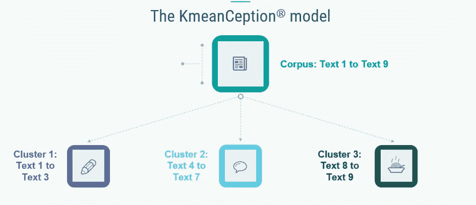
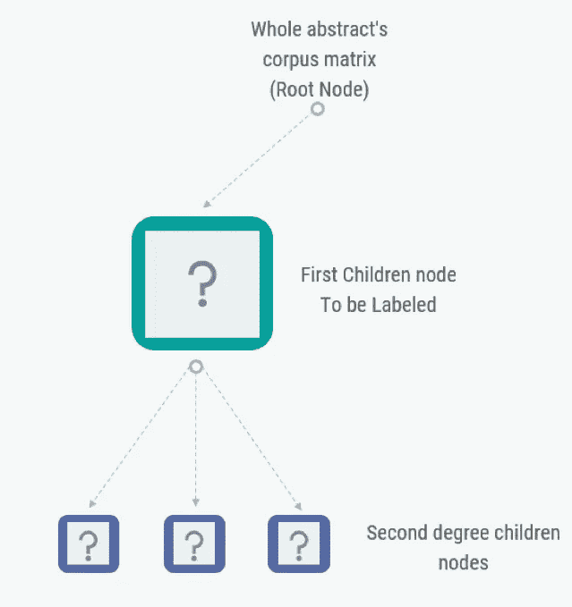
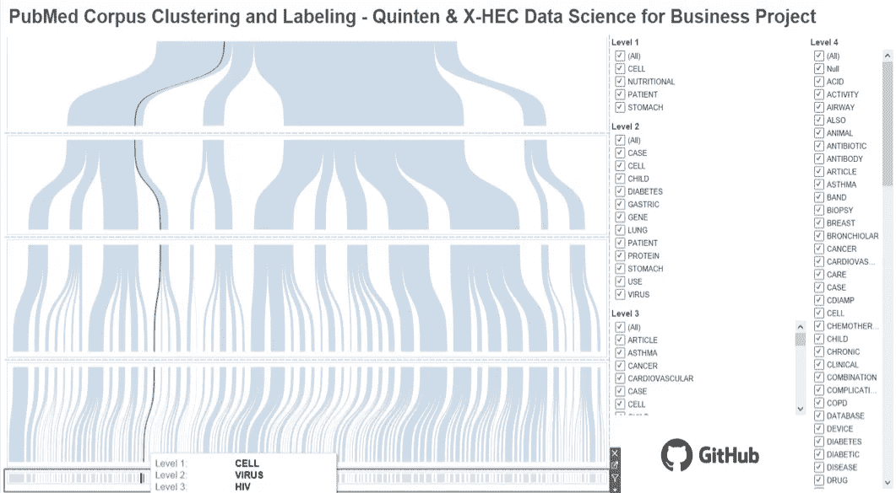
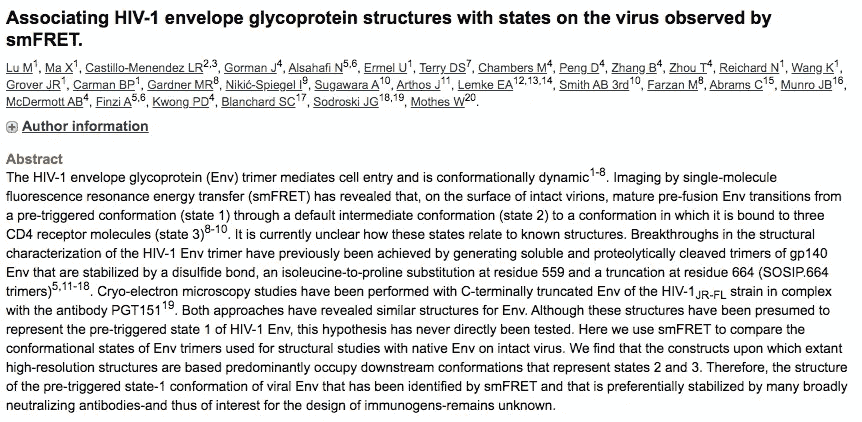

# k-mean exception:如何使用聚类算法自动标记新闻文章？

> 原文：<https://medium.com/analytics-vidhya/k-meanception-how-to-automatically-tag-news-articles-using-clustering-algorithms-7357f18031e2?source=collection_archive---------4----------------------->

# 语境

社交媒体的蓬勃发展无疑导致了文档和信息源的爆发。这是我们这个时代最响亮的革命之一:任何人都可以阅读几乎任何内容，无论主题是什么——如果你目前正在阅读这篇文章，你已经证明了我们的观点…

尽管如此，这种持续的信息流也带来了一些弊端。除非你是一个超级英雄，否则你可能会很难马上找到与你需求最相关的文章。为了帮助人们在他们的斗争中，用一些选择的关键词来标记文章是一种被媒体播放器特许的解决方案。但是当你的文章数据库达到数百万篇论文时，手动标记文章显然变得耗时耗力…另一个超级英雄的任务…

更重要的是，由于缺乏自动化过程，一些标签可能缺乏一致性:一些标签使用过于频繁，因此失去了它们的相关性；其他人很少使用，因此失去了兴趣。

本文旨在介绍一个由[商业数据科学硕士](https://www.hec.edu/en/master-s-programs/x-hec-programs/msc-data-science-business-x-hec)的学生提出的解决方案，这是一个由巴黎综合理工学院和巴黎高等商学院联合学位，与[昆腾](https://www.quinten-france.com) : **合作。如何促进记者工作自动化标记流程？**

# 技术发展水平

主题建模是一种统计方法，旨在发现出现在一组文档(电子邮件、文章……)中的'*主题'*，而不是一开始就知道它们。你必须给主题建模算法的只是原始的未标记文本和要发现的主题数量。主题模型基于相同的假设:

*   每个文档都由多个主题组成
*   每个主题由一组单词组成

换句话说，主题模型假设文档是由一些隐藏的或潜在的变量生成的，我们没有观察到这些变量，并试图发现它们。

LDA 是最流行的主题建模方法之一。想了解更多关于 LDA 的知识，请参考 Jonathan Hui 的优秀文章 [*机器学习—潜在狄利克雷分配 LDA*](/@jonathan_hui/machine-learning-latent-dirichlet-allocation-lda-1d9d148f13a4) 。然而，对于我们的标记股份，使用 LDA 的主要缺点是潜在因素不能立即解释，需要进一步的工作来限定它们，也就是给它们一个名字。

后处理步骤确实非常具有挑战性，并且存在局限性，尤其是当我们考虑将项目产业化时。

# 我们的 k 均值模型

在实现模型之前，我们需要通过对文本进行符号化和符号化来准备数据。然后，我们删除无用的标记:标点符号、停用词、在整个语料库中出现少于 5 次的词……更多详细信息，请参见 Rachel Koening 的文章《面向初学者的介质 [*NLP:清理&预处理文本数据*](https://towardsdatascience.com/nlp-for-beginners-cleaning-preprocessing-text-data-ae8e306bef0f) 。

一旦文本被简化为有限数量的有意义的单词，我们就需要对文档进行矢量化:单词被转换为连续值的向量。我们尝试了多种矢量化方法，如 TF-IDF、word2vec 以及这两种技术的组合。要了解关于嵌入的更多信息，可以看看 Mohammed Terry-Jack 关于 Medium [*NLP 的文章:关于嵌入的一切*](/@b.terryjack/nlp-everything-about-word-embeddings-9ea21f51ccfe) 。在这个预处理步骤的最后，我们有了矢量化的文档，我们将能够在其上执行我们的模型。

**模型概述**

k-mean exception 是一个**两步算法:首先对文档进行聚类，然后自动为一个聚类赋予一个标签**。为了便于理解，我们将分别描述这两个步骤——聚类和标记——但实际上，该模型同时实现了这两个步骤:一旦创建了聚类，就会给出一个标记。

**步骤 1 —聚类:基于树的聚类模型**

我们决定利用树的递归结构，而不是只使用标准的聚类算法，如 k-means 或 DBSCAN，它们的结构不适合我们的问题。树的每个节点都是一个集群，这两个术语可以互换使用。聚类内的所有文档形成新的文档语料库，该语料库将用于创建将成为子聚类的新节点。

*聚类一次…*

因此，最初，所有文档都用您选择的算法聚集成一定数量的 *k* 个集群。在我们的例子中，我们使用最佳选择 *k* 来实现 k-means 方法。最佳的 *k* 的选择是以经典的方式进行的，使用“*肘”*或“*轮廓分数”*的方法，可以自动优化该数量的聚类。

到目前为止，和传统方法没什么不同。然而，这些文本聚类不容易允许定义一组适于标记包含在聚类中的文档的单词。为了保持一个标签有一个聚类的想法，我们对第一步中获得的每个聚类重复该操作。它允许为更小的集群获得越来越精确的标签。

k 均值概念

*聚类两次以上……*

因此，随着每一个新的步骤，我们增加了我们正在创建的树的深度。树的每个节点对应于一个新的文档集(一个新的语料库),该文档集现在被聚集在新的子节点中。

与树木相关的几个问题立即出现:我们应该停在什么深度？每个节点有多少个线程？跑步需要多长时间？这些问题涉及树本身的结构、它的长度和宽度以及初始语料库的大小。

*参数化*

关于树的**深度，当聚类算法对于单个聚类是最优的，或者当达到一定数量的文档时，可以停止并且不开发该节点的线程。也可以定义最大深度；该深度将对树的每个节点上定义的标签产生重要影响。**

对于树的**宽度，最大宽度是一个元参数，可以根据期望的结果进行选择(根据底层问题的度量进行优化)。**

最后，我们获得一棵树，该树逐渐将子节点中的所有文档分开，直到某个叶子，在该叶子处，我们发现存在于相同集群中的文档。

**步骤 2 —标记:本地 TF-IDF 标记方法**

一旦我们有了集群，我们如何正确地标记它们以创建有意义的集群？

首先，我们为同一个节点中的每个单词/令牌和文档计算一个本地 TF-IDF。然后，我们计算来自同一聚类内的文档的每个单词/标记的 TF-IDF 均值。具有每个聚类的最大聚合 TF-IDF 的单词/令牌将被用于标记该聚类。

树的结构

在实践中，我们选择将基于每个单词的 TF-IDF 分数的方法应用于聚类内部:

*   对于树的每个节点，计算 TF-IDF 分数。该 TF-IDF 分数不同于在先前节点上计算的分数，因为它取决于所考虑的文档集。
*   对于通过上述聚类方法获得的每个子聚类(节点线程)，计算该子聚类的文本的 TF-IDF 的平均值，并且选择具有这些 TF-IDF 的最高平均值的单词作为树的该节点的标签。

在我们的例子中，我们有可能将决策应用于树的每个节点，而不是最终的聚类。因此，这个决定(选择固定数量的单词、高于阈值的单词等。)遵循树的结构，该树本身在文本聚类方面是相关的。实际上，一旦进入一组处理例如人类疾病的文档，该节点的子集群(其子节点)将不得不在该主题上进行内部辨别，因此将会出现其他关键字。

最后，对文档有意义的标签是包含该文档的所有节点上的标签。这将遵循树的结构，从一般到精确的标签。

**这种模式的优势**

**模块化 **

这种模式最大的优势就是模块化。一切都可以调整:

*   树的**形状**:树的深度和树的每层节点数。
*   各层的**聚类方法**:k-means 聚类算法、DBSCAN 算法……
*   **单词嵌入方法** : TF-IDF，word2vec，TF-IDF 和 word2vec 的串联，在特定语料库上重新训练的向量…

***多标签***

每次给文档做标签的时候，我们都要问自己感兴趣的标签类型:标签的粒度是什么(*医疗’*vs’*艾滋’*)？有多少个标签(一个标签还是多个标签)？

使用这种树模型，您不需要首先决定您感兴趣的标签的数量和粒度。通过模型的结构，标签变得越来越精确。因此，您可以根据参数调整它们。

# 一个应用:标记医学文章

PubMed 收集了数百万篇医学论文。手动标记所有这些文章既费时又耗资源。通过将我们的模型应用于从抽象中导出的向量，我们获得了具有不同粒度级别的决策树。

k-MeanCeption 模型在 PubMed 语料库中的应用

让我们来看看一篇名为*“将 HIV-1 包膜糖蛋白结构与 smFRET 观察到的病毒状态相关联”的具体论文。*

来自 PubMed 语料库的论文摘要

在对本文的摘要进行预处理和矢量化之后，我们应用了我们的 k-MeanCeption 模型，该模型的最大深度为 4(每篇文章最多有 4 个不同的标签)，最大聚类数为 5(在每个级别上，文章最多被分成 5 个不同的聚类)。

*   首先，我们获得了 4 个不同的集群:*营养*、*细胞*、*病人*和*胃*。该纸张被分配给*单元*簇。
*   然后，当我们将聚类和标记算法应用于节点*单元*时。我们获得了另外 4 个簇，分别命名为:*病毒*、*基因*、*蛋白*和*细胞*。这篇论文被分配到*病毒*集群。顺便说一下，如果一些文档不能被区分，算法将给出与前一个相同的标签。这里:在处理*单元格*的文章组中，有些无法区分，因此它们将再次被标记为*单元格*。
*   我们第三次将聚类和标记算法应用到子节点*病毒*(包含在*细胞*节点 *)* 中，以更好地标记我们感兴趣的论文。4 个新的集群被创建:*疫苗*、*病毒*、*艾滋病毒*和*病毒*。我们的论文被分配到 *HIV* 集群。
*   在对节点 *HIV* 第四次应用聚类和标记算法之后。我们得到了两个集群: *ENV* 和 *HIV* 。然后，论文被分配到代表包膜糖蛋白的 *ENV* 中。

总而言之，我们的模型逐渐增加了给予文章摘要的标签的粒度。最后，这篇文章会有四个标签:**细胞、病毒、HIV 和 ENV。**

# 关于 k 均值异常的结论

因此，这种高度模块化的算法可以在许多情况下使用(研究文档的划分、自动化技术水平、法律行为等)。).这个模型的具体应用需要优化度量的外在反映:用例有标签数量的约束吗？它需要精确的还是通用的标签？根据场景的不同，度量标准可能会发生变化，模型的优化也会发生变化。

进步的轴心之一是增加了一个用户界面，允许实时纠正不明智的标签选择，以便在最终用户的指导下不断改进算法。这个主题与消除不相关关键字的高质量预处理的需求密切相关。

总之，这种创新的算法允许文档语料库的新的相关表示，提供可视的和连贯的树结构，以便在一组文本中导航或找到适合的标签。

***昆腾 X-HEC 合伙***

昆腾是一家纯玩家数据科学咨询公司，已经做了十多年。它主要发生在医疗保健、银行和保险领域，以及能源和媒体行业。帮助高素质的 X-HEC 学生给他们一个真实的案例研究，旨在提高他们对数据科学如何在日常生活中务实地帮助行业的认识，而不是华丽的演讲和不遵守的承诺。

除了启发我们的 k-MeanCeption 算法，克里斯托弗·诺兰还告诉我们任何超级英雄的职责:成为我们社会的'*沉默的守护者和警惕的保护者'*，成为'*黑暗骑士*'。

现在，数据在公司内部被广泛使用，并日复一日地显示出其全部潜力，数据行动者——分析师、工程师、科学家、翻译——成为我们这个时代的超级英雄。因此，他们的职责是确保数据以正确的方式使用:最敏感、最有用、最容易被最终用户理解。正如另一位超级英雄曾经说过的那样:'*力量越大，责任越大'*！

本文由**戈蒂埃·杜拉克**和**本杰明·辛图雷尔**共同撰写，基于**戈蒂埃·杜拉克、苏海尔·埃尔·艾萨乌伊、本杰明·麦、本杰明·皮克、阿德里安·萨斯波特斯**和**本杰明·辛图雷尔**的工作。要了解更多细节，请不要犹豫阅读我们的 [GitHub 库](https://github.com/souhailelaissaoui/Pubmed-NLP-clustering)这篇文章。