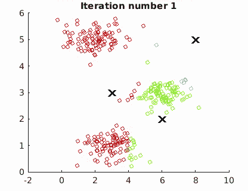
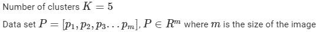

# 灰度识别的 k-均值算法

> 原文：<https://medium.com/analytics-vidhya/k-means-algorithm-to-recognize-grayscale-6c9896e3c65f?source=collection_archive---------8----------------------->

K-means 是最流行和最广泛使用的无监督学习算法。它将给定的未标记数据分类到 K 个簇中。当我们将未标记的训练集和所需的聚类数传递给 K-Means 算法时，它会在数据点中找到一些结构或一致性，并相应地对它们进行分组。

让我们应用这个算法来识别灰度图像中的灰色阴影。

*   **第一步:**读取一幅图像(比如说 RGB)，转换成灰度，将像素矩阵转换成列向量。这是我们未标记的数据集。让我们识别 5 种色调——白色(W)、浅灰色(LG)、灰色(G)、深灰色(DG)、黑色(B)，因此聚类数 K = 5。

*   **步骤 2:** 通过从数据集中随机选择 K 个数据点来初始化聚类质心。

*   **步骤 3:** 将每个数据点分配给更靠近该数据点的聚类质心。

MATLAB 函数将数据点分配给它们最近的质心

*   **步骤 4:** 计算属于每个聚类的所有数据点的位置的平均值，并用计算的平均值更新质心。

计算平均值和更新质心的 MATLAB 函数

*   **步骤 5:** 重复步骤 3 和步骤 4，例如 10 次迭代，以便算法对数据点进行分类。数据点分类后，根据像素值对其进行标注(255:白色，0:黑色，依此类推)。

示例 1

示例 2

**参考:**

 [## 机器学习|课程

### 机器学习是让计算机在没有明确编程的情况下行动的科学。在过去的十年里…

www.coursera.org](https://www.coursera.org/learn/machine-learning?)