# k 均值聚类

> 原文：<https://medium.com/analytics-vidhya/k-means-clustering-43d0136bf005?source=collection_archive---------2----------------------->

**K-Means 聚类**是一种无监督的机器学习算法。与传统的监督机器学习算法相比，K-Means 试图在没有首先用标记数据训练的情况下对数据进行分类。一旦运行了算法并定义了组，任何新数据都可以很容易地分配到最相关的组。

K-Means 的实际应用包括:

## **1。客户档案**

## **2。市场细分**

## 3 .计算机视觉

## 4 .搜索引擎

## 5 .天文学

# 它是如何工作的？

I)我们随机初始化 K 个起始质心。每个数据点被分配到其最近的质心。
ii)质心被重新计算为分配给相应聚类的数据点的平均值。
iii)重复步骤 1 和 2，直到我们触发停止标准。
我们用

**1。欧几里德距离**

**2。平方欧几里德距离**

**3。马哈拉诺比斯距离……等**

**简单地说**，K 均值可以被认为是将数据分组为 K 个聚类，其中对聚类的分配是基于到数据点质心的某种相似性或距离度量。


# 步伐

1.  选择 K(即 3)个随机点作为称为质心的聚类中心
2.  通过计算每个数据点相对于每个质心的距离，将每个数据点分配给最近的聚类。
3.  通过计算指定点的平均值来确定新的聚类中心。
4.  重复第 2 步和第 3 步，直到集群分配没有任何变化

# 选择正确的集群数量

通常情况下，数据会有多个维度，因此很难可视化。结果，不再能观察到最佳的聚类数。一种用数学方法来确定的方法。我们绘制了聚类数之间的关系以及聚类平方和(WCSS)内的关系，然后我们选择了 WCSS 变化开始趋于平稳的聚类数，简称为**肘形法**，该图称为**肘形图。**

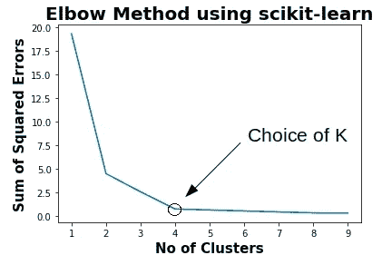

WCSS 被定义为集群的每个成员与其质心之间的平方距离之和。

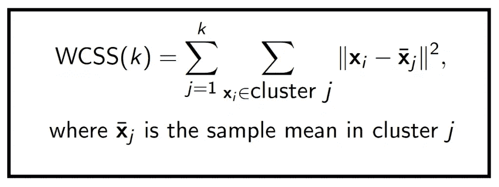

# **例子**

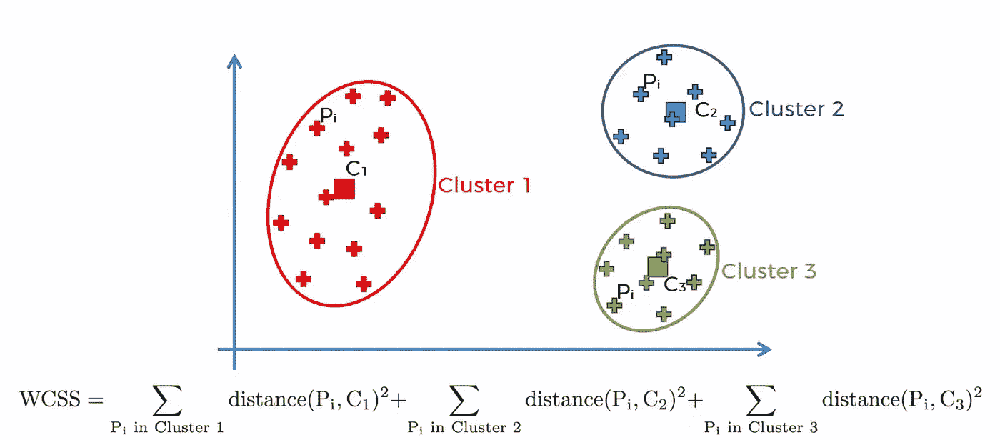

聚类完成后，数据点被聚类/分段/分组，如上图所示。

# 密码

我们使用聚类方法将大学分成两类，私立大学和公立大学。

# 数据

包含以下 18 个变量的 777 个观察值的数据框架。

1.  Private(私立)具有“否”和“是”级别的因子，表示私立或公立大学
2.  收到的申请数量
3.  接受的申请数量
4.  注册新生人数
5.  前 10%百分比。来自高中班级前 10%的新生
6.  前 25%的百分比。来自高中班级前 25%的新生
7.  F.全日制本科生人数
8.  页（page 的缩写）非全日制本科生人数
9.  超过州外学费
10.  房间。食宿费用
11.  图书预计图书成本
12.  个人估计个人支出
13.  博士学位。拥有博士学位的教师
14.  终端百分比。拥有高级学位的教员
15.  南 f .学生/教员比率
16.  校友百分比。捐赠的校友
17.  花费每个学生的教学费用
18.  毕业生。毕业率

**来源**该数据集取自卡内基梅隆大学的 StatLib 图书馆。

该数据集被用于 ASA 统计图形部分的 1995 年数据分析博览会。

# 导入库

```
**import** **pandas** **as** **pd**
**import** **numpy** **as** **np**
**import** **matplotlib.pyplot** **as** **plt**
**import** **seaborn** **as** **sns**
%**matplotlib** inline
**import** **warnings**
warnings.filterwarnings('ignore')
```

# 导入数据

```
df = pd.read_csv('College_Data.csv')
```

**检查数据的负责人**

```
df.head(3)
```

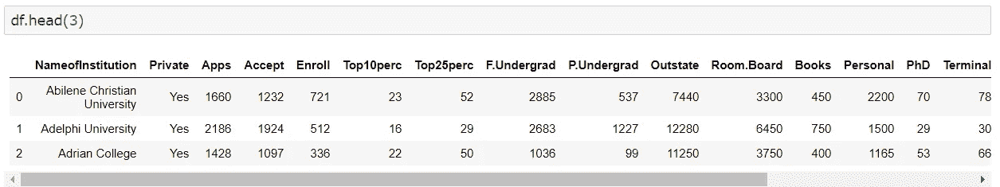

数据帧信息

```
df.info()<class 'pandas.core.frame.DataFrame'>
RangeIndex: 777 entries, 0 to 776
Data columns (total 19 columns):
NameofInstitution    777 non-null object
Private              777 non-null object
Apps                 777 non-null int64
Accept               777 non-null int64
Enroll               777 non-null int64
Top10perc            777 non-null int64
Top25perc            777 non-null int64
F.Undergrad          777 non-null int64
P.Undergrad          777 non-null int64
Outstate             777 non-null int64
Room.Board           777 non-null int64
Books                777 non-null int64
Personal             777 non-null int64
PhD                  777 non-null int64
Terminal             777 non-null int64
S.F.Ratio            777 non-null float64
perc.alumni          777 non-null int64
Expend               777 non-null int64
Grad.Rate            777 non-null int64
dtypes: float64(1), int64(16), object(2)
memory usage: 115.5+ KB
```

检查空值是否存在。

```
df.isnull().sum()**OUTPUT**NameofInstitution    0
Private              0
Apps                 0
Accept               0
Enroll               0
Top10perc            0
Top25perc            0
F.Undergrad          0
P.Undergrad          0
Outstate             0
Room.Board           0
Books                0
Personal             0
PhD                  0
Terminal             0
S.F.Ratio            0
perc.alumni          0
Expend               0
Grad.Rate            0
dtype: int64
```

我们可以看到没有丢失值

```
df.describe()
```

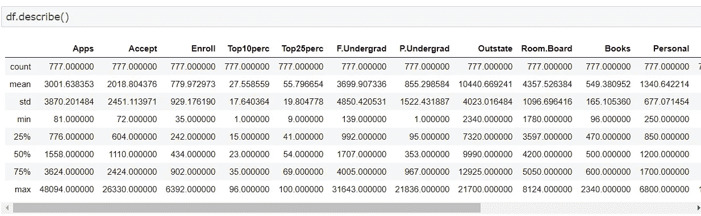

# 可视化

```
sns.set_style('darkgrid')
sns.lmplot('Room.Board','Grad.Rate',data=df, hue='Private',palette='magma_r',size=6,aspect=1,fit_reg=**False**)
```

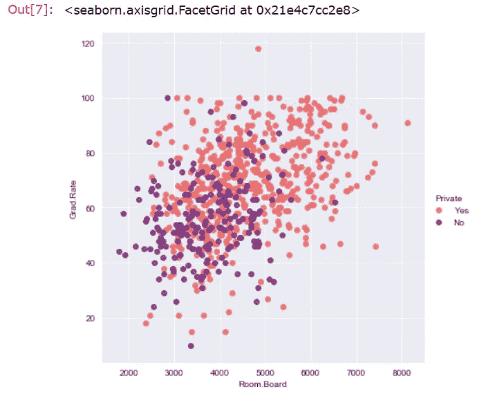

**格拉德散点图。价格与房间。点由私有列着色的板。**

```
sns.set_style('darkgrid')
sns.lmplot('Outstate','F.Undergrad',data=df, hue='Private',palette='magma_r',size=6,aspect=1,fit_reg=**False**)
```

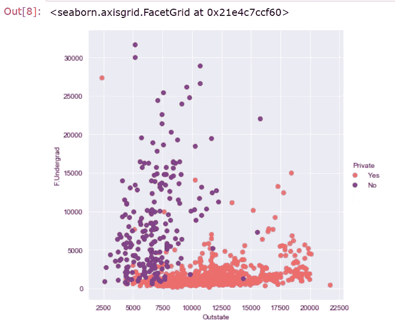

**本科生与非本科生的散点图，其中各点由私有列着色。**

```
sns.set_style('dark')
h=sns.FacetGrid(df,hue="Private",palette='coolwarm',size=6,aspect=2)
h = h.map(plt.hist,'Outstate',bins=20,alpha=0.7)
```

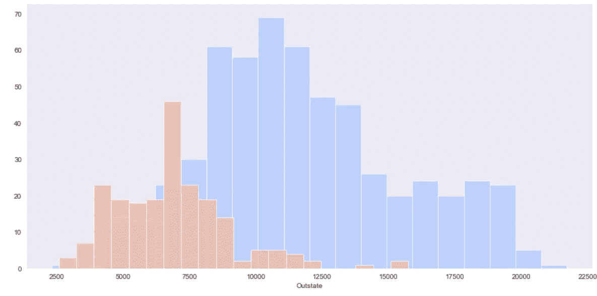

**基于私有列显示州外学费的堆积直方图。**

```
sns.set_style('dark')
g=sns.FacetGrid(df,hue="Private",palette='coolwarm',size=6,aspect=2)
g = g.map(plt.hist,'Grad.Rate',bins=20,alpha=0.7)
```

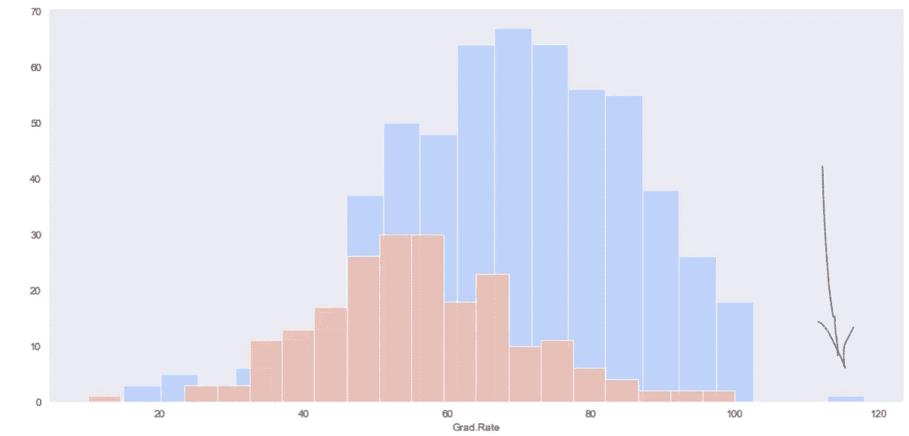

**毕业生直方图。比率栏。**

我们可以看到似乎有一所私立学校的毕业率高于 100%。因此我们需要找到它。

```
df[df['Grad.Rate'] > 100]
```

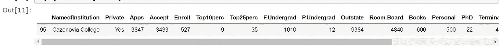

我们需要将该学校的毕业率设置为 100，这样才有意义。我们得到一个警告而不是一个(错误)，所以我们使用 dataframe 操作并检查直方图可视化以确保它确实发生了变化。

```
df.set_value(95, 'Grad.Rate', 100)df[df['Grad.Rate'] > 100]
```

Out[13]:

nameofininstitutionprivateappsacceptenroltop 10 perctop 25 percf。Rate，比率，比率

我们可以看到没有超出 100 的数据点。

```
sns.set_style('darkgrid')
g=sns.FacetGrid(df,hue="Private",palette='coolwarm',size=6,aspect=2)
g = g.map(plt.hist,'Grad.Rate',bins=20,alpha=0.7)
```

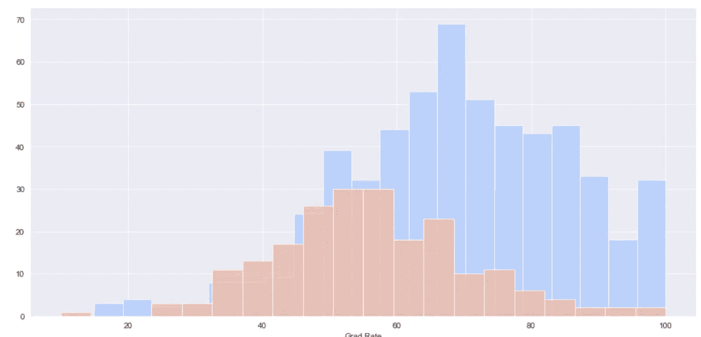

我们可以看毕业生。心率不会低于 100。

在运行 Kmeans 算法之前，我们需要删除字符数据，即机构名称

```
df=df.drop(['NameofInstitution',],axis=1)
```

# 选择 K 意味着集群

**从 SciKit Learn 导入 KMeans。**

```
**from** **sklearn.cluster** **import** KMeanskmeans = KMeans(n_clusters=2)
```

**使模型适合除私有标签之外的所有数据。**

```
kmeans.fit(df.drop('Private',axis=1))**OUTPUT**KMeans(algorithm='auto', copy_x=True, init='k-means++', max_iter=300,
       n_clusters=2, n_init=10, n_jobs=None, precompute_distances='auto',
       random_state=None, tol=0.0001, verbose=0)
```

**未标记数据的聚类中心向量**

```
means=kmeans.cluster_centers_
print(means)
**OUTPUT**[[1.03631389e+04 6.55089815e+03 2.56972222e+03 4.14907407e+01
  7.02037037e+01 1.30619352e+04 2.46486111e+03 1.07191759e+04
  4.64347222e+03 5.95212963e+02 1.71420370e+03 8.63981481e+01
  9.13333333e+01 1.40277778e+01 2.00740741e+01 1.41705000e+04
  6.75925926e+01]
 [1.81323468e+03 1.28716592e+03 4.91044843e+02 2.53094170e+01
  5.34708520e+01 2.18854858e+03 5.95458894e+02 1.03957085e+04
  4.31136472e+03 5.41982063e+02 1.28033632e+03 7.04424514e+01
  7.78251121e+01 1.40997010e+01 2.31748879e+01 8.93204634e+03
  6.50926756e+01]]
```

# 估价

如果我们没有标签，没有完美的方法来评估聚类，但是，我们有标签，所以我们利用这一点来评估我们的集群。

**为 df 创建一个名为“Cluster”的新列，1 表示私立学校，0 表示公立学校。**

```
**def** converter(cluster):
    **if** cluster=='Yes':
        **return** 1
    **else**:
        **return** 0df['Cluster'] = df['Private'].apply(converter)df.head(1)
```

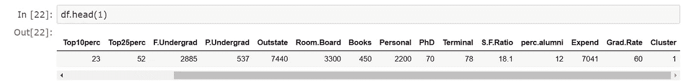

我们可以看到一个新的列“集群”

```
df.Private.value_counts()**OUTPUT**Yes    565
No     212
Name: Private, dtype: int64
```

**创建一个混淆矩阵和分类报告，看看在没有给定任何标签的情况下，Kmeans 聚类的效果如何。**

```
**from** **sklearn.metrics** **import** confusion_matrix,classification_report
print("ConfusionMatrix",confusion_matrix(df['Cluster'],kmeans.labels_))
print(classification_report(df['Cluster'],kmeans.labels_))ConfusionMatrix[[ 74 138]
 [ 34 531]]
              precision    recall  f1-score   support

           0       0.69      0.35      0.46       212
           1       0.79      0.94      0.86       565

    accuracy                           0.78       777
   macro avg       0.74      0.64      0.66       777
weighted avg       0.76      0.78      0.75       777
```

我们可以看到分组数据有 78%的准确率

```
kmeans.fit(df.drop('Private',axis=1))**OUTPUT**
KMeans(algorithm='auto', copy_x=True, init='k-means++', max_iter=300,
       n_clusters=2, n_init=10, n_jobs=None, precompute_distances='auto',
       random_state=None, tol=0.0001, verbose=0)
```

**标记数据的聚类中心向量**

```
means1=kmeans.cluster_centers_
print(means1)[[1.03631389e+04 6.55089815e+03 2.56972222e+03 4.14907407e+01
  7.02037037e+01 1.30619352e+04 2.46486111e+03 1.07191759e+04
  4.64347222e+03 5.95212963e+02 1.71420370e+03 8.63981481e+01
  9.13333333e+01 1.40277778e+01 2.00740741e+01 1.41705000e+04
  6.75925926e+01 3.14814815e-01]
 [1.81323468e+03 1.28716592e+03 4.91044843e+02 2.53094170e+01
  5.34708520e+01 2.18854858e+03 5.95458894e+02 1.03957085e+04
  4.31136472e+03 5.41982063e+02 1.28033632e+03 7.04424514e+01
  7.78251121e+01 1.40997010e+01 2.31748879e+01 8.93204634e+03
  6.50926756e+01 7.93721973e-01]]
```

绘制质心以检查两者是否相同

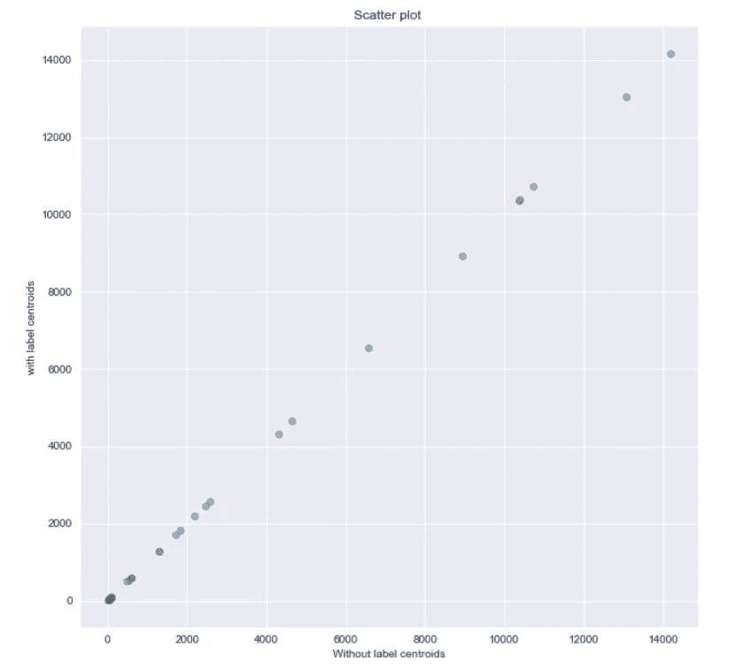

```
fig = plt.figure(figsize=(10,10))
plt.scatter(means,means1, alpha=0.5)
plt.title('Scatter plot ')
plt.xlabel('Without label centroids')
plt.ylabel('with label centroids')
plt.show()
```

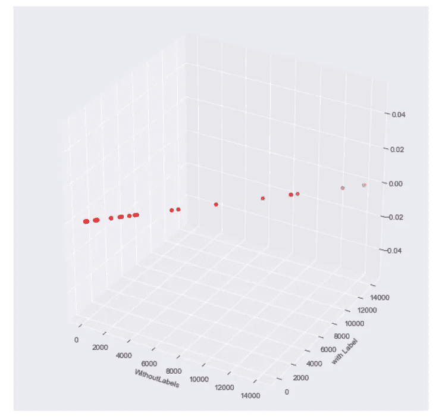

```
**from** **mpl_toolkits.mplot3d** **import** Axes3D
**import** **matplotlib.pyplot** **as** **plt**fig = plt.figure(figsize=(10,10))
ax = fig.add_subplot(111, projection='3d')x =means
y =means1ax.scatter(x, y, c='r', marker='o')
ax.set_xlabel('WithoutLabels')
ax.set_ylabel('with Label')
```

该算法纯粹使用这些特征将大学分成两个不同的群。KMeans 对于聚类未标记的数据很有用。

# WCSS

```
wcss = []
**for** i **in** range(1, 11):
    kmeans = KMeans(n_clusters=i, init='k-means++', max_iter=300, n_init=10, random_state=0)
    kmeans.fit(df.drop('Private',axis=1))
    wcss.append(kmeans.inertia_)
plt.plot(range(1, 11), wcss)
plt.title('Elbow Method')
plt.xlabel('Number of clusters')
plt.ylabel('WCSS')
plt.show()
```

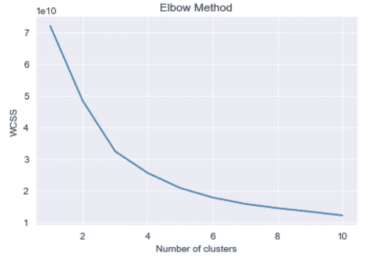

```
kmeans = KMeans(n_clusters=4)kmeans.fit(df.drop('Private',axis=1))KMeans(algorithm='auto', copy_x=True, init='k-means++', max_iter=300,
       n_clusters=4, n_init=10, n_jobs=None, precompute_distances='auto',
       random_state=None, tol=0.0001, verbose=0)kmeans.cluster_centers_**OUTPUT**array([[2.32830097e+03, 1.58846602e+03, 4.92830097e+02, 3.74417476e+01,
        6.68640777e+01, 1.96334951e+03, 3.04563107e+02, 1.50857718e+04,
        5.18160194e+03, 5.68315534e+02, 1.07616505e+03, 8.20582524e+01,
        8.90000000e+01, 1.17500000e+01, 3.14660194e+01, 1.28801165e+04,
        7.57038835e+01, 9.90291262e-01],
       [1.67909382e+03, 1.20654158e+03, 5.02245203e+02, 2.03454158e+01,
        4.80191898e+01, 2.32546055e+03, 7.21164179e+02, 8.45028145e+03,
        3.95973987e+03, 5.31840085e+02, 1.36672921e+03, 6.56183369e+01,
        7.31321962e+01, 1.50407249e+01, 1.95628998e+01, 7.30658422e+03,
        6.07249467e+01, 7.12153518e-01],
       [1.07111341e+04, 7.35846341e+03, 2.95760976e+03, 3.21585366e+01,
        6.37195122e+01, 1.55374756e+04, 3.11045122e+03, 8.28236585e+03,
        4.15140244e+03, 5.95500000e+02, 1.87660976e+03, 8.42926829e+01,
        8.97560976e+01, 1.63512195e+01, 1.59512195e+01, 9.49881707e+03,
        6.08902439e+01, 8.53658537e-02],
       [9.34175000e+03, 3.60625000e+03, 1.32195000e+03, 7.60500000e+01,
        9.17000000e+01, 5.28320000e+03, 4.27200000e+02, 1.81197500e+04,
        6.04275000e+03, 5.76600000e+02, 1.25555000e+03, 9.33000000e+01,
        9.68000000e+01, 6.61500000e+00, 3.53500000e+01, 3.23479000e+04,
        8.89500000e+01, 1.00000000e+00]])
```

**分类报告**

```
**from** **sklearn.metrics** **import** confusion_matrix,classification_report
print(confusion_matrix(df['Cluster'],kmeans.labels_))
print(classification_report(df['Cluster'],kmeans.labels_))[[  2 135  75   0]
 [204 334   7  20]
 [  0   0   0   0]
 [  0   0   0   0]]
              precision    recall  f1-score   support

           0       0.01      0.01      0.01       212
           1       0.71      0.59      0.65       565
           2       0.00      0.00      0.00         0
           3       0.00      0.00      0.00         0

    accuracy                           0.43       777
   macro avg       0.18      0.15      0.16       777
weighted avg       0.52      0.43      0.47       777
```

正如我们可以看到的，随着聚类的增加，算法的准确性下降

```
kmeans = KMeans(n_clusters=6)kmeans.fit(df.drop('Private',axis=1))KMeans(algorithm='auto', copy_x=True, init='k-means++', max_iter=300,
       n_clusters=6, n_init=10, n_jobs=None, precompute_distances='auto',
       random_state=None, tol=0.0001, verbose=0)kmeans.cluster_centers_**OUTPUT**
array([[1.35493091e+03, 1.04448364e+03, 3.61025455e+02, 2.51090909e+01,
        5.34000000e+01, 1.48434182e+03, 4.56254545e+02, 1.15509455e+04,
        4.63094909e+03, 5.37945455e+02, 1.19984364e+03, 6.93418182e+01,
        7.76181818e+01, 1.30683636e+01, 2.55600000e+01, 9.12509091e+03,
        6.92363636e+01, 9.81818182e-01],
       [9.17100000e+03, 3.62557895e+03, 1.31457895e+03, 7.54736842e+01,
        9.15263158e+01, 5.26426316e+03, 4.31315789e+02, 1.80456316e+04,
        6.04889474e+03, 5.69052632e+02, 1.26373684e+03, 9.30000000e+01,
        9.66315789e+01, 6.56315789e+00, 3.51578947e+01, 3.29746316e+04,
        8.85263158e+01, 1.00000000e+00],
       [2.93307826e+03, 1.84125217e+03, 5.57417391e+02, 4.45913043e+01,
        7.37304348e+01, 2.18336522e+03, 2.26573913e+02, 1.66457565e+04,
        5.35880870e+03, 5.73834783e+02, 1.00786087e+03, 8.60434783e+01,
        9.24347826e+01, 1.09252174e+01, 3.44608696e+01, 1.49999652e+04,
        7.88695652e+01, 9.91304348e-01],
       [6.39812381e+03, 4.44923810e+03, 1.88442857e+03, 2.21714286e+01,
        5.37142857e+01, 9.96773333e+03, 2.49683810e+03, 7.28323810e+03,
        3.84779048e+03, 5.69571429e+02, 1.81260000e+03, 7.99238095e+01,
        8.58761905e+01, 1.71104762e+01, 1.40761905e+01, 7.68971429e+03,
        5.60190476e+01, 8.57142857e-02],
       [1.57616667e+04, 1.04965333e+04, 4.01676667e+03, 4.34000000e+01,
        7.63000000e+01, 2.04839333e+04, 3.45553333e+03, 9.24250000e+03,
        4.42580000e+03, 6.06433333e+02, 1.70430000e+03, 8.73666667e+01,
        9.21333333e+01, 1.58966667e+01, 1.82000000e+01, 1.11458333e+04,
        6.74000000e+01, 1.33333333e-01],
       [1.30240773e+03, 9.38549356e+02, 4.26218884e+02, 1.85236052e+01,
        4.51587983e+01, 1.95019742e+03, 5.96618026e+02, 7.02466094e+03,
        3.62361803e+03, 5.32759657e+02, 1.41783262e+03, 6.31459227e+01,
        7.01158798e+01, 1.58768240e+01, 1.71158798e+01, 6.45169099e+03,
        5.64420601e+01, 6.39484979e-01]])
```

**分类报告**

```
**from** **sklearn.metrics** **import** confusion_matrix,classification_report
print(confusion_matrix(df['Cluster'],kmeans.labels_))
print(classification_report(df['Cluster'],kmeans.labels_))[[  5   0   1  96  26  84]
 [270  19 114   9   4 149]
 [  0   0   0   0   0   0]
 [  0   0   0   0   0   0]
 [  0   0   0   0   0   0]
 [  0   0   0   0   0   0]]
              precision    recall  f1-score   support

           0       0.02      0.02      0.02       212
           1       1.00      0.03      0.07       565
           2       0.00      0.00      0.00         0
           3       0.00      0.00      0.00         0
           4       0.00      0.00      0.00         0
           5       0.00      0.00      0.00         0

    accuracy                           0.03       777
   macro avg       0.17      0.01      0.01       777
weighted avg       0.73      0.03      0.05       777
```

# 正如我们可以看到的，随着聚类的增加，算法的准确性下降

# Github 要点链接

[https://gist . github . com/HarisH-Reddy-DS/CD 5b 90 b 0 BCD 8 db 9 fc 71 f 97 ee 5 ad C7 cc 3](https://gist.github.com/HarisH-Reddy-DS/cd5b90b0bcd8db9fc71f97ee5adc7cc3)

# 我的 Github 个人资料

[](https://github.com/HarisH-Reddy-DS/HarisH-ML-PythonNotebooks) [## HarisH-Reddy-DS/HarisH-ML-python notebooks

### 一个统计学研究生，一个数据科学爱好者，一个业余爱好的书呆子。我喜欢看到数据分析的力量…

github.com](https://github.com/HarisH-Reddy-DS/HarisH-ML-PythonNotebooks) 

# 参考

1.  分析 Vidya
2.  走向数据科学
3.  极客论坛
4.  堆叠交换