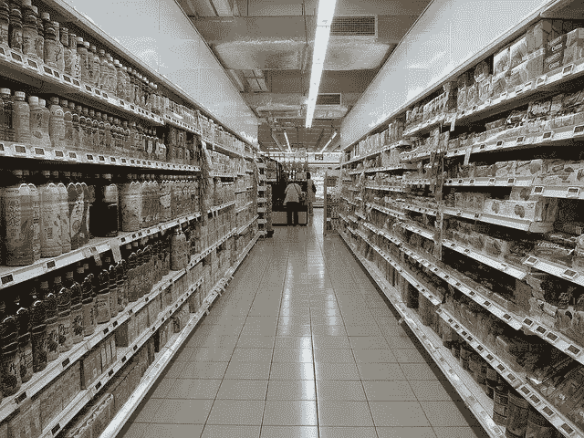
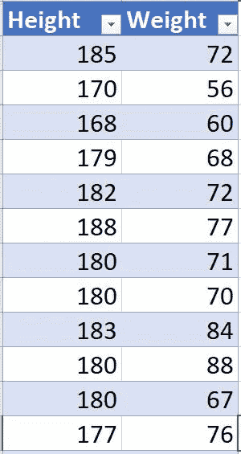
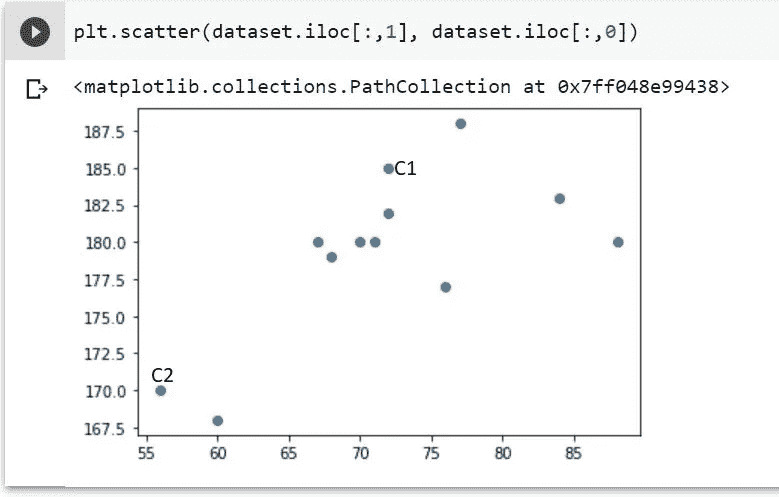
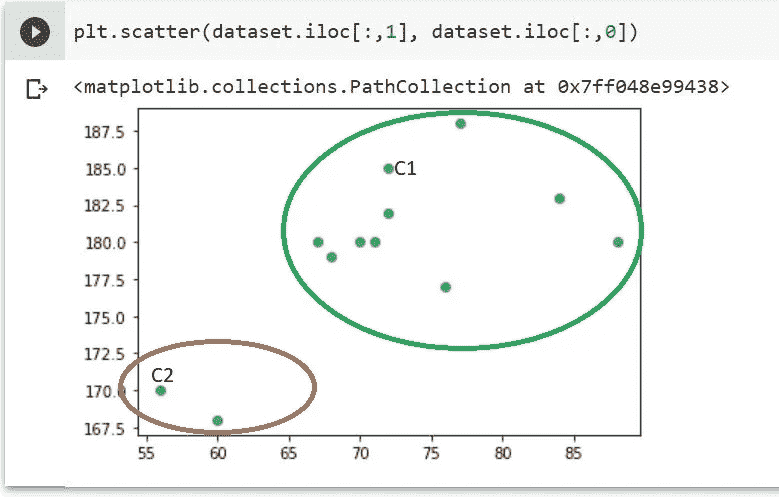

# k 均值聚类

> 原文：<https://medium.com/analytics-vidhya/k-means-clustering-a67935655c48?source=collection_archive---------11----------------------->

在本文中，我们将了解 K-Means 聚类的含义，使用数学方法的算法中涉及的步骤及其应用。

> ***什么是聚类？*** 聚类是机器学习算法中的无监督学习，只是将相似的数据点分组在一个簇中。

我们举个例子来了解一下这个:
假设你在一家超市里逛了逛。你认为那里的商品是怎样排列的？

所有性质相似的项目都放在一起，这样客户就可以很容易地获得。

但是，假设你在一个房间里有一堆不同主题的笔记，你的导师要求你根据内容对每一个笔记进行分组。假设你有这么多笔记，你认为整理这些笔记要花多少时间？

一堆笔记

这可以通过聚类技术轻松实现。它会根据某些主题将所有笔记分组，放在内容相似的书架中。

每个书架都有相似的内容

> ***什么是 K-Means 聚类？K-Means 聚类是无监督学习中的一种聚类技术，它允许我们在我们的数据集中发现类别或子组或聚类。它帮助我们找到没有明确标记的数据点，找到模式，根据相似性对它们进行分组，并做出更好的决策。***

看起来不错。不过还有一个问题！

> **K-Means 中的 K 是什么？**
> ***K 中的 K-表示*** 是算法从数据中识别出的聚类数。

这是对算法含义的基本理解。

## K-Means 算法的步骤:

1.  *选择 K 个集群。*
2.  *从图中选择 K 个随机点或从数据集中选择 K 个数据点作为聚类的质心。*
3.  *将每个数据点分配到最近的质心以形成 K 个聚类。*
4.  *继续迭代以下步骤，直到我们找到最佳质心，这样数据点的赋值不会改变:
    a .计算数据点和质心之间的距离。
    b .将每个数据点分配给比其他聚类更近的聚类(质心)。通过取该聚类的所有数据点的平均值来计算聚类的质心。*

我知道你迷路了。但是不要担心，让我们借助一个简单的示例来更好地理解每个步骤:

假设您的数据集中有身高和体重列。你想找到不同的年龄组和他们的体重。

身高以厘米计，体重以千克计

第一步:让我们选择 K = 2 作为聚类数。

步骤 2:在这一步中，我们可以从我们的数据集中随机选取 2 个数据点或 2 个数据点作为聚类的质心。

让我们把前两个数据点作为两个质心 C1(185，72)和
C2(170，56)。

第 3 步和第 4 步:让我们采取点 P3(168，60)。它将进入哪个集群？我们必须计算两个聚类之间的距离，并在聚类中分配具有最小距离的新数据点。

C1 到 P3 的距离，D13
= sqrt( (C1。x P3。X) + (C1。P3。y))
= sqrt((185-168)+(72–60))
= sqrt(289+144)
= sqrt(433)
= 20.80

C2 到 P3 的距离，D23
= sqrt( (C2。X — P3。X) + (C2。P3。y))
= sqrt((170–168)+(56–60))
= sqrt(4+16)
= sqrt(20)
= 4.48

因此，P3 将进入 C2 集群。现在，我们必须计算质心 C2 的平均值(因为它与点 P3 的距离最小)和新添加的点，并将其分配回质心。这将是我们新的质心。

C2 = ( ( 170 + 168)/2，(60 + 56)/2 )
= ( 169，58)

到目前为止，我们有两个集群，数据点如下:
集群 1: C1
集群 2:P3 C2

像这样，我们必须将所有剩余的数据点分成这两个组，这样最终的组将是:
组 1: C1、P4、P5、P6、P7、P8、P9、P10、P11、P12
组 2: C2、P3

现在我们必须检查是否有数据点被重新分配到不同的集群中。可以使用上述步骤进行检查。在我们的例子中，这是最后一个集群。

## K-均值聚类的应用

*   市场分割
*   文档聚类
*   图象分割法
*   图像压缩
*   客户细分
*   分析动态数据的趋势

## 参考资料:

1.  [https://www . udemy . com/course/machine learning/learn/lecture/5714416 #备注](https://www.udemy.com/course/machinelearning/learn/lecture/5714416#notes)
2.  [https://www.youtube.com/watch?v=CLKW6uWJtTc](https://www.youtube.com/watch?v=CLKW6uWJtTc)
3.  [https://www . tutorialspoint . com/machine _ learning _ with _ python/machine _ learning _ with _ python _ clustering _ algorithms _ k _ means . htm](https://www.tutorialspoint.com/machine_learning_with_python/machine_learning_with_python_clustering_algorithms_k_means.htm)
4.  [https://www.youtube.com/watch?v=EItlUEPCIzM](https://www.youtube.com/watch?v=EItlUEPCIzM)