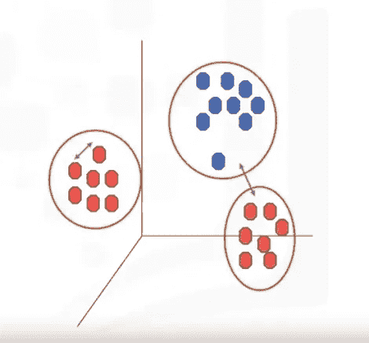

# k 均值聚类

> 原文：<https://medium.com/analytics-vidhya/k-means-clustering-cdcba44a1d51?source=collection_archive---------18----------------------->

不要和 KNN 搞混了。

k-means 是一种**聚类**的机器学习算法。

k-Means 是一种无监督算法。

k-means 根据**相似性**将数据划分(划分)成组。

k 均值聚类

它将数据分成 K 个不重叠的子集或聚类，没有任何聚类内部结构或标签，这意味着这是一个无监督的算法…