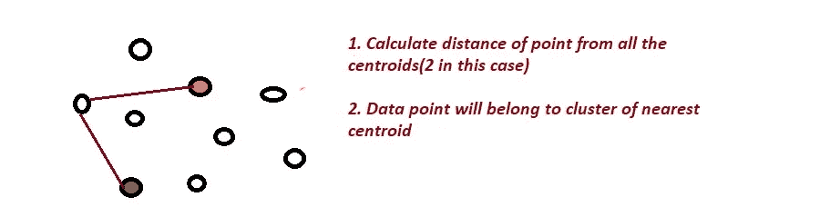
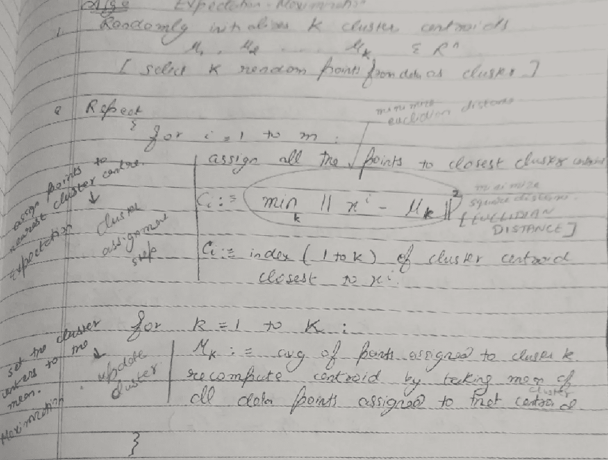
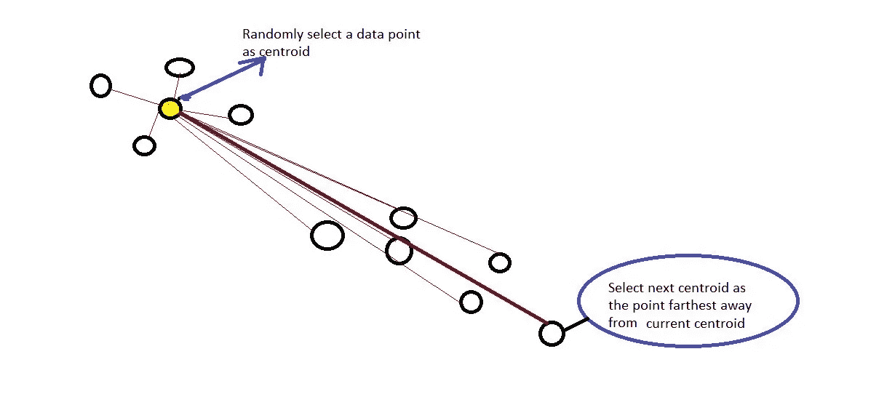
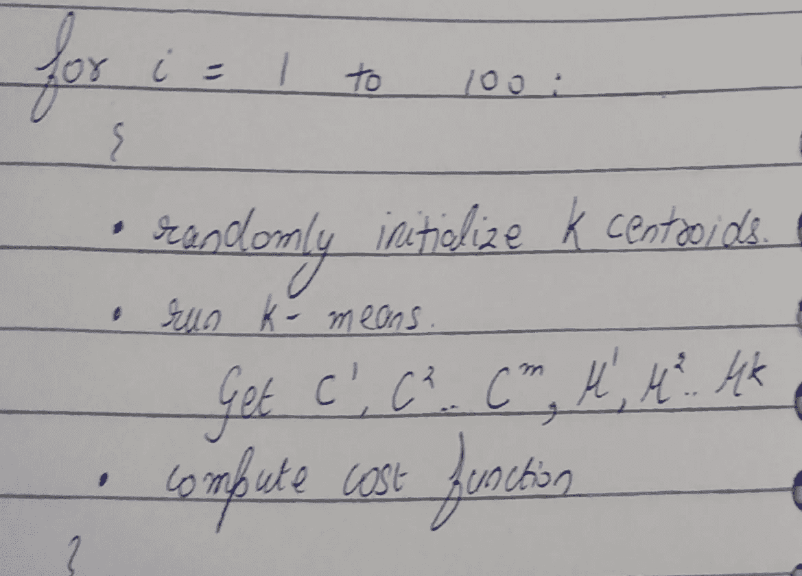
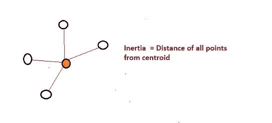
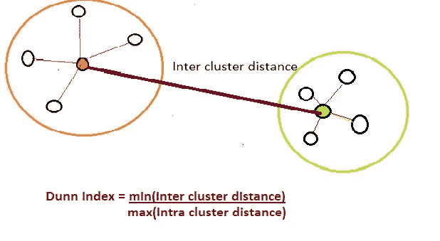
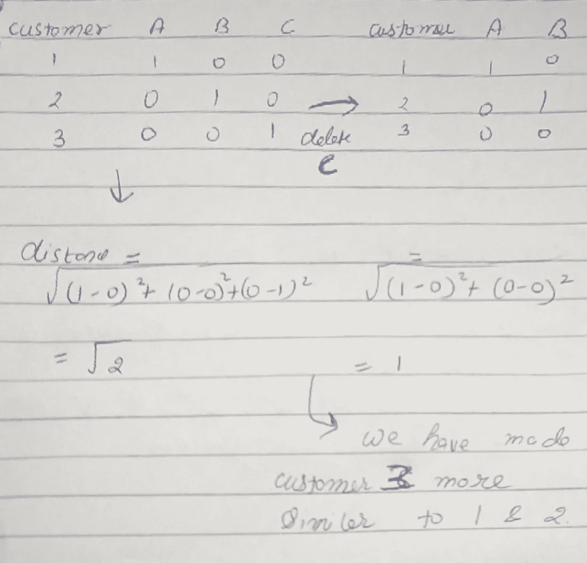

# k-均值聚类—您需要知道的一切

> 原文：<https://medium.com/analytics-vidhya/k-means-clustering-everything-you-need-to-know-175dd01766d5?source=collection_archive---------10----------------------->

当我学习 K-means 聚类时，我必须通过几个博客和视频来收集我想知道的关于 K-means 聚类的所有信息。本教程只是试图在一个博客中包含从各种来源学到的所有概念。

# 能够满足

1.  [什么是 K 均值聚类？](#5ac5)
2.  [我们的目标？](#0729)
3.  这个算法是如何工作的？
4.  [如何随机初始化质心？](http://@aebc)
    [*随机初始化](#2df0)
    [* K-means ++](#6cdd)
5.  [如何优化？](#2ce7)
6.  [聚类的评价指标？](#e39f)
7.  [聚类的停止标准？](#9f9c)
8.  [K 均值的假设](#f6a0)
9.  [K-means 的挑战](#d62a)
10.  [需要处理的数据问题？](#26fc)
11.  [K 均值的应用](#8f14)
12.  [参考文献](#4c5d)

# **什么是 K 均值聚类？**

这是一种算法，可以帮助我们将相似的数据点分组在一起。这是一个划分问题，所以如果我们有 m 个数据点，那么我们需要将它们划分成 K 个簇

# **我们的目标？**

我们希望优化我们的算法，以便—
1。我们希望聚类中的数据点尽可能相似
2。尽可能保持集群(不相似或不同)

# **这个算法是怎么工作的？**

**输入-
1。**训练集:x1，x2……，xm
2。数据集需要的聚类数:K

**伪算法-**

K-means 算法(Andrew NG 的课程)

# **如何随机初始化质心？**

在上述算法中，K 均值的两个最重要的考虑因素是—

1.  如何确定质心的数量？
2.  如何初始化质心？

在本教程的后面部分，我们将研究如何选择集群数量。

*   **随机初始化-**

1.  我们可以从我们的训练集中随机选取 K 个数据点，并初始化这些数据点的质心。
2.  随机初始化的问题——每次我们运行我们的算法，我们的初始质心将是不同的。所以 K-means 可以基于质心的初始化得到不同的解。**(局部最优)**

*   **K-means ++**

我们在这里只选择了一个随机质心，而不是随机选择所有质心进行初始化。

1.  随机选取 1 个数据点作为初始质心。
2.  现在计算每个数据点与质心的距离。
3.  下一个质心=距离当前质心最远的距离的平方。

> K-means ++比随机初始化开销大

# **如何避免局部最优？还是为了更好的局部最优而优化？**

在实现 K-means 算法时，很有可能会陷入局部最优。所以我们的目标是找到最佳的局部最优解。

**多次随机初始化:**

如果 K = = = small(2–10)
**Algo:**，则使用此方法

选择给出最低成本函数的质心。

# 聚类的评估指标-

> **惯性——试图形成紧密的集群**

它计算聚类中所有点离质心的距离。
***惯性越低越好***

分析-Vidhya

> ***邓恩指数*** *—聚类之间的相异度*

考虑聚类之间的距离，以便聚类尽可能互不相同。
***邓恩指数越高，聚类越好。***

分析-Vidhya

# **K 表示的停止标准**

1.已达到最大迭代次数。
2。新形成的星团的质心变化不大。
3。点保持在同一簇中。

# **K 均值的假设**

1.  **限于球形团簇** 如果你想知道 K-means 将要形成的团簇，只需想象一个类似球形的形状。当 K-means 计算距质心的距离时，它形成一个球形。因此，它不能群集复杂的几何形状。
    ***解——内核方法*** *变换到更高维的表示，使数据线性可分。* ***从 sklearn.cluster 导入 SphericalClustering***
2.  **簇的大小** 该算法仅考虑距离，因此不考虑具有不同大小或密度的簇。*它假设一个聚类内的特征具有相等的方差。*

# **K-means 的挑战**

1.  **局部最优—** 聚类数增加局部最优。因此，我们的集群依赖于质心初始化
2.  **K-** 无法从数据中学习聚类数。
3.  **缓慢—** 随着我们数据集规模的增大，算法变得缓慢。对于 K 的每次迭代，它必须访问数据集中的每个点。
    ***解决方案—小批量 K 表示***
4.  **聚类均匀数据—**即使数据集中没有逻辑聚类，该算法也能聚类均匀数据。
5.  **给予较大的聚类更多的权重**

# 应用 K-means 需要处理的数据问题

1.  ***异常值—*** *由于我们使用的是基于距离的方法，K-means 对异常值很敏感。*
2.  ***分类数据—*** *K 表示不能处理分类数据。这可以通过三种方式来解决。*将分类变量转换为数值— →缩放数据— >应用 K 均值
    2。用汉明距离代替欧几里德距离。[如果两个分类值相同，使距离==0 否则 1]
    3。计算模式。
3.  **降维—** *如果数据是高维的，降低我们数据的维度是很好的*
4.  **缺失值** — *这些应该被处理。*
5.  **多线性** — *不会受到严重影响，因为它会计算距离。但是，如果我们删除一些基于共线性的要素，我们可能会使一些样本更接近。*

# **K-means 的应用**

1.  **数据或图像压缩—***1 字节 256 色可寻址。对于每个像素，我们有 3 个字节用于* ***RGB。*** *现在如果我们想减少颜色的数量，我们可以使用 K-means 来确定使用哪些颜色。我们可以将每个像素视为一个数据点。
    实现—*[https://jakevdp . github . io/python datascience handbook/05.11-k-means . html](https://jakevdp.github.io/PythonDataScienceHandbook/05.11-k-means.html)
2.  **异常值检测—**

> 基于距离的方法—

*找出数据的阈值— →如果距离>阈值:标记为异常值— →移除异常值*

> 基于集群的方法-

*找出最小聚类— - >将最小聚类中的点视为离群点。*

# **参考文献-**

1.  [https://jakevdp . github . io/python datascience handbook/05.11-k-means . html](https://jakevdp.github.io/PythonDataScienceHandbook/05.11-k-means.html)
2.  [https://sci kit-learn . org/stable/modules/clustering . html # k-means](https://scikit-learn.org/stable/modules/clustering.html#k-means)