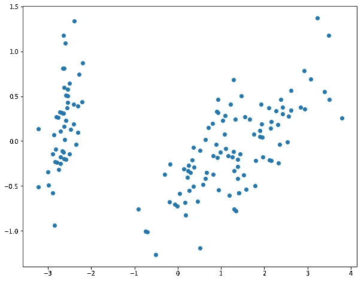
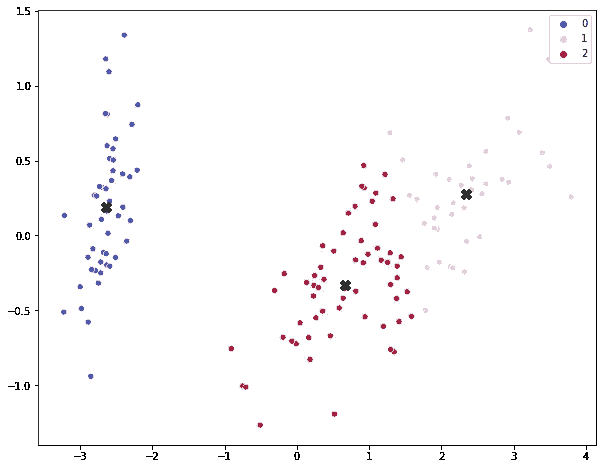

# k 均值聚类解释|机器学习

> 原文：<https://medium.com/analytics-vidhya/k-means-clustering-explained-419ee66d095e?source=collection_archive---------2----------------------->

在我们开始讨论 K-Means 聚类之前，让我们看一些事情。什么是集群
2。欧几里德距离
3。寻找多个点的中心或平均值
如果你已经熟悉这些东西，可以直接跳到 K-Means 算法

# 什么是集群？

图 1.1

聚类无非就是分组。给我们一些数据，我们必须在数据中找到一些模式，并将相似的数据组合在一起，形成聚类。这是聚类的基础。这是在欧几里德距离的帮助下完成的。

比如:
1。一个体育俱乐部可能希望根据他们的速度(一维)将他们的跑步者分成 3 个不同的组
2。一家公司可能希望根据两个因素将他们的客户分成三个不同的群:带来的商品数量、退回的商品数量(二维)

# 什么是欧氏距离？

两个坐标之间的距离可以在欧几里德距离的帮助下找到。如果数据是二维的，在一个平面上，那么上式中 **n** 将为 2，可以表示为 **(x，y)** 。如果是三维数据， **n** 将为 3，可以表示为 **(x，y，z)。**

# **寻找多个点的中心或平均值**

图 2.1

现在，考虑图 2.1 中的黑点。我们需要找到所有黑点的中心。

我们知道这是二维数据，因为它有一个 **x** 和 **y** ，并表示为 **(x，y)** 为了找到中心，这就是我们要做的。

1.获得所有黑点的 x 坐标，并取平均值，假设它是 **x_mean** 。
2。对所有黑点的 y 坐标做同样的操作，我们称之为 **y_mean。**
3。现在，中心点将只是 **(x_mean，y_mean)** ，这将导致红色多边形出现在黑点的中心

至此，我们已经成功地完成了 K 均值聚类的先决条件。

# k 均值聚类

**什么是 K 均值聚类？**

这是一种借助欧几里德距离将具有相似特征的数据聚集在一起的聚类算法

**工作原理？**

为此，我们举一个数据集的例子

图 3.1

图 3.1 代表了我们的数据点。
现在。比方说，我们需要将这些数据分为两类。
只看这个，就可以说
**x < -2** 的数据点可以分组在一起， **x > -2** 的数据点可以分组在一起。

同样，如果我们想将这些数据分成 3 类，我们可以说左边的数据可以组合在一起，中间的数据可以组合在一起，右边的数据可以组合在一起，如图 3.2 所示。最初，我们不知道应该用给定的数据形成多少个集群。我稍后会处理这个问题。

图 3.2

*很抱歉中间数据点的颜色(是白色的，几乎与背景相匹配)*

**现在，让我们在给定的数据上实现 K 均值**

1.  将质心(c1)随机初始化为数据集中的一些数据点(聚类质心的数量=您要创建的聚类的数量)。
2.  **将点映射到质心:**对于数据集中的每一个数据，计算所有可用质心中最接近它的质心，然后该数据点将被视为最接近它的特定质心的一部分*(您可以给每个质心赋予不同的颜色，属于该质心的数据点也将具有相同的颜色)*
3.  **将质心移动到中心:**对于属于特定质心的所有点，使用上述方法计算中心，并将这些点的质心移动到该中心。*(对所有质心重复此操作)*

4.现在，当我们改变质心的位置时，数据点需要映射到基于新的质心位置的质心上。因此，重复步骤 2 和 3 若干次迭代，直到所有的质心停止移动。

图 3.4

如果还是不明白，看一下图 3.4，再读一遍上面的 4 个步骤。

它包括 3 个步骤:初始化，映射点到质心，移动质心到所有点的平均值，重复这个过程，直到没有变化发生。

现在，如果我对图 3.1 所示的上述数据执行这些过程。我将最终得到这个图，其中黑点是每个集群的质心

图 3.5

请注意，这可能与我们人类预期的略有不同。但是，没关系。这就是 K-均值聚类的工作原理

# 还有一点

正如我已经说过的，我们不知道要选择的集群数量的确切值。但是，有一种方法叫做**肘法，**用它我们可以大致做到这一点。这将在另一篇博客文章中讨论。

图 4.1

*对于上述数据，如果我们选择聚类数为* ***2*** *，图 4.1 就是聚类的表示。*

质心的初始化点在我们得到的合成簇中也有一定的发言权。因为我们随机初始化质心，所以最好多次运行该算法并绘制图形，然后选择多数投票结果。

# 结论

这可能看起来有点难以理解。但是，这是最简单的算法之一，聚类分析在许多领域都有应用。其中一些是:推荐系统，模式识别和图像处理。

# 谢谢你