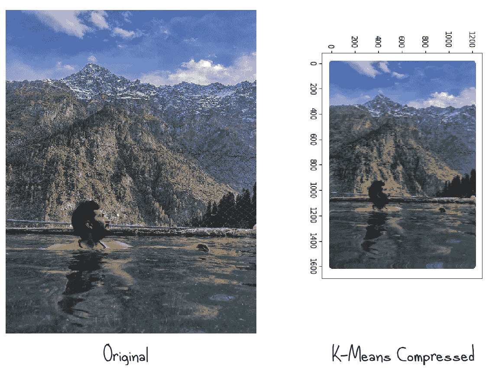

# k-均值聚类|图像压缩做得好

> 原文：<https://medium.com/analytics-vidhya/k-means-clustering-image-compression-done-right-dfad434652b6?source=collection_archive---------16----------------------->

> Python 中的 K-means、Elbow 方法(WCSS)和图像压缩研究

我希望你以最好的健康和工作精神阅读这篇文章。由于新冠肺炎的封锁给了我们前所未有的时间去探索更多。这是我第一次以程序员的身份尝试数据科学，也是我第一次以作家的身份尝试 Medium 所以请容忍我。

**数据点**是与我们最初零散的原始观测片段；很少或没有关于他们关系的信息。
**聚类**就是寻找数据点之间的某种联系，把相似的数据点聚在一起。在当前的全球形势下，人们经常在媒体上听到新冠肺炎的集群，其中新冠肺炎是*数据点*(人类)之间的*关系*。


天体星团

在数据点之间的关系不容易被注意到的复杂场景中，各种数学和计算机科学工具被用来寻找相同的东西。
K-Means 算法就是这样一种方法。

**它是如何做到的，它能做什么？**

**第一个** *，K-Means* 在 N 维空间中挑选 *K 个*随机初始点(称它们为*初始点【前方 )(N 是数据点的独立属性/特性(假设，对于 Covid 患者，这些特性可以是年龄、血压、先前的呼吸问题等)。*

**其次，**计算每个数据点与*初始点*之间的距离(假设*欧几里德*)。然后，每个数据点被分配到其最近的 *InitPoint。*从而形成初始聚类集。

> *距离可以是*闵可夫斯基*、*欧几里德*或其他距离。*

**第三，**每个*初始点*被移动到分配给它的各个数据点的新获得的质心(外行:中心/中间)。

**重复**第二步，寻找每个数据点和新质心(旧*初始点*)之间的距离，并将数据点重新分配到最近的质心(移动*初始点*)。接着是第三步。
重复这两个步骤，直到没有数据点到新的不同最近质心/ *InitPoint* 的新分配发生。即质心被正确地分配给所有的数据点。

我们现在拥有的是一个有 K 个集群的 N 维空间。


通过反复计算点和初始点的距离获得聚类质心

**如何决定随机初始点的个数“ *K* ”？**
**肘法**

我们从 *K* = 1 开始，并假设所有数据点都在一个集群中。然后按照 *K-Means* 算法，我们得到正确的质心。
此后，我们计算所谓的*【簇内平方和】
，这是在已经执行了 *K-means* 之后，每个数据点到其指定质心/ *InitPoint* 的距离的平方和**。***

*数学上给出如下:-*

**

*我们取 *K* =2， *K* = 3 …以此类推，计算 *WCSS* 的行程。
然后，我们绘制一张 ***K* 与 *WCSS 之间的关系图。****

*就像这样出现了:*

**

*因此，我们看到，对于数据点的一些给定样本，对于 *K =* 3，观察到肘形弯曲；给我们一个关于计数的概念。这最终将是集群的计数。人们必须观察到，如果我们不断增加星团的数量，WCSS 就会不断下降。如果我们建立和数据点数量一样多的聚类。WCSS 将降为零。因为每个点本身就是质心。*

*这样的聚类没有解决任何目的。更确切地说，拾取初始点，随机有其自身的问题称为 ***随机初始化陷阱*** ，导致不同的 start *InitPoints* 产生不同的最终结果(集群集)。因此，请多读一些关于“K-means++的内容来避免这个陷阱。*

# *图像压缩做得很好*

*K-Means 算法有不同的应用，从预测营销活动的正确受众到文本和图像聚类。*

*下面是用于压缩图像的 K-Means 的实际实现。*

*我是一个狂热的旅行者，所以在这里我从雄伟的喜马拉雅山*的 *Kheergana Trek* 中挑选了一张我最喜欢的图片，并将其压缩，用 Python 编程。**

> *完整代码如下:*

*利用 KMeans 聚类进行图像压缩*

> *之前和之后:*

**

*这里初始图片是 1200*1600 像素。因为每种颜色/像素由三原色红、绿、蓝组成；叫做 RGB。每个像素的 RGB 值可以是(0，0，0)到(255，255，255)之间的任何值。
该方法是从图像中读取所有像素，并在三维空间(R，G，B)中为每个像素形成 64 个聚类。RGB 是我们的数据点。*

*这些群集的质心将保存 RGB 值，我们需要打印该群集下的所有像素。本质上，上面右边的图片仅仅是由 64 种颜色组成的！！！*

*读取图像像素:*

```
*org_image = Image.open('Kheerganga.jpeg','r')
size = org_image.size
pixels = list(org_image.getdata())
final_pixels = []
for i in range(0,len(pixels)):
    final_pixels.append( np.array(pixels[i]) )
final_pixels = np.array(final_pixels)*
```

> *这里我们取 64 个聚类，并预测每个像素的聚类为:*

```
*kmeans = KMeans(n_clusters = 64, init = 'k-means++', n_init= 10, max_iter = 20)
y_kmeans = kmeans.fit_predict(final_pixels)*
```

> *下面的代码给出了质心:*

```
*centroids = kmeans.cluster_centers_*
```

***最后**，我们遍历每个像素，获取它的聚类(从 64 个中)，以及相应的质心值(RGB)。*

> *我们做的情节是:*

```
*X = np.arange(0,org_image.size[0])
for y in range(0,org_image.size[1]):
    plt.scatter(np.full((1,org_image.size[0]),y)[0],X ,c = kmeans.cluster_centers_[ykmeans[y][X]]/255)
plt.show()*
```

*这是我对算法的一点回顾。非常欢迎建设性的批评、意见和建议；)下次见。#StayHomeStaySafe*