# 200 字的“K-均值聚类”。

> 原文：<https://medium.com/analytics-vidhya/k-means-clustering-in-200-words-c2f08dcba89e?source=collection_archive---------10----------------------->

K-means 是一种机器学习算法，旨在通过测量点之间的 ***【距离】*** 来找到数据中的 ***【聚类】*** 。

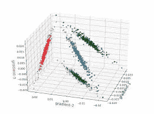

中的***【K】***是指要识别的聚类数。

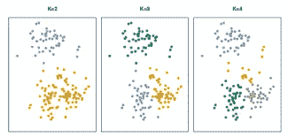

该算法遵循以下步骤:

**第一步:**确定 k 的个数。

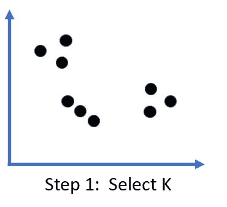

这通常通过 ***【肘法】*** 完成，绘制不同 K 的****误差*** ，并使用曲线变平的数字。*

*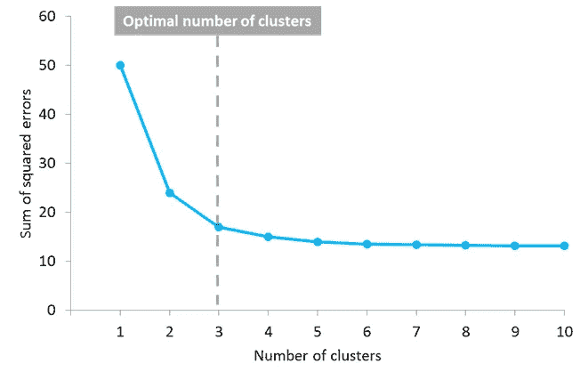*

***第二步:**为每个聚类选择一个随机的起点。*

*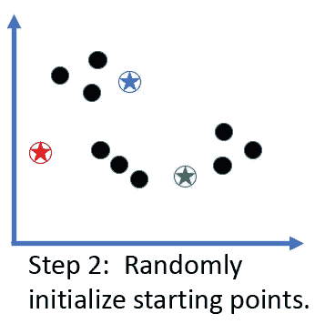*

***第三步:**测量一个点与所有三个 ***【质心】*** 的距离。*

*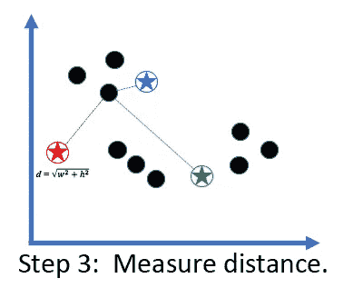*

***第四步:**将其分配到最近的质心。*

*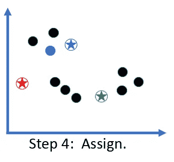*

***步骤 5:** 对所有点重复。*

*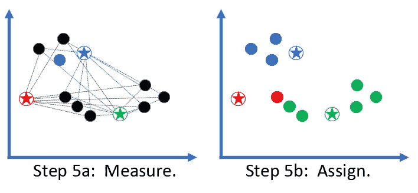*

***步骤 6:** 基于当前分配为每个聚类寻找新的中心。*

*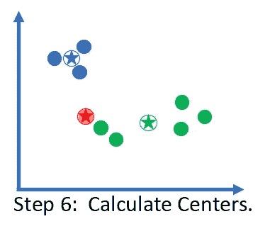*

***步骤 7:** 使用新的质心重复步骤 5-6，直到所有点停止移动。*

*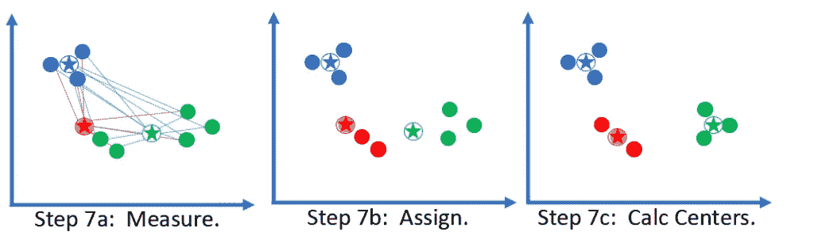*

***步骤 8:** 通过计算每个点到其聚类中心的距离之和，对聚类进行评分。*

*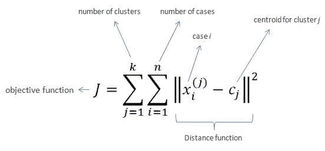*

**基于质心的随机初始化，这可能导致非常差的聚类。*

*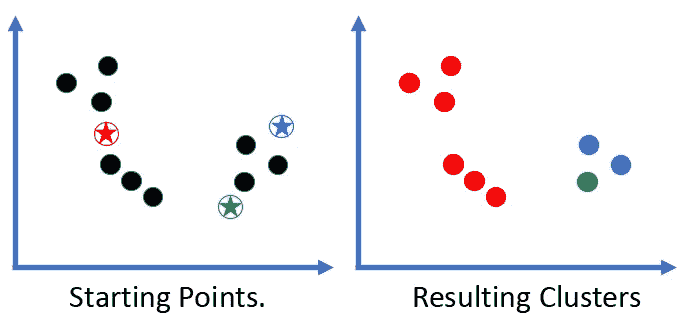*

***第 9 步:**多次重复第 1-9 步，记录每个步骤的。选择整体损失最低的型号。*

*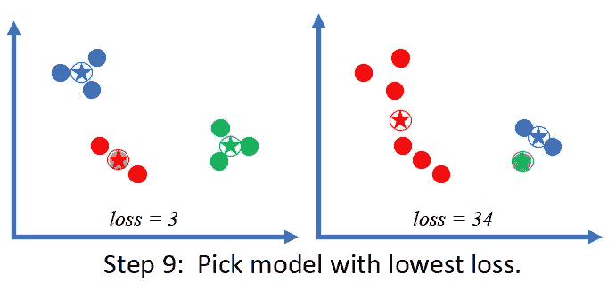*

*总的来说，K-means 非常快，很容易理解。然而，其他聚类算法被证明比 K-means 更一致和可重复。*

**最初发表于 2020 年 8 月 13 日 https://thaddeus-segura.com***。***