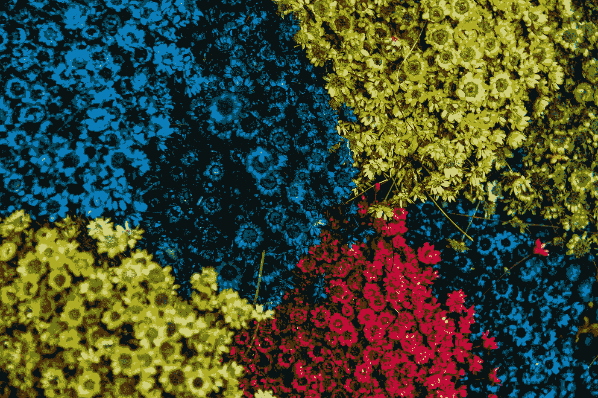
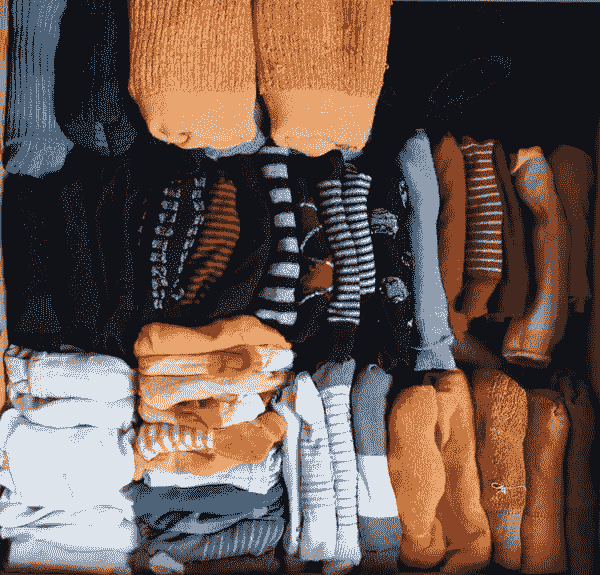
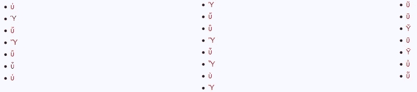
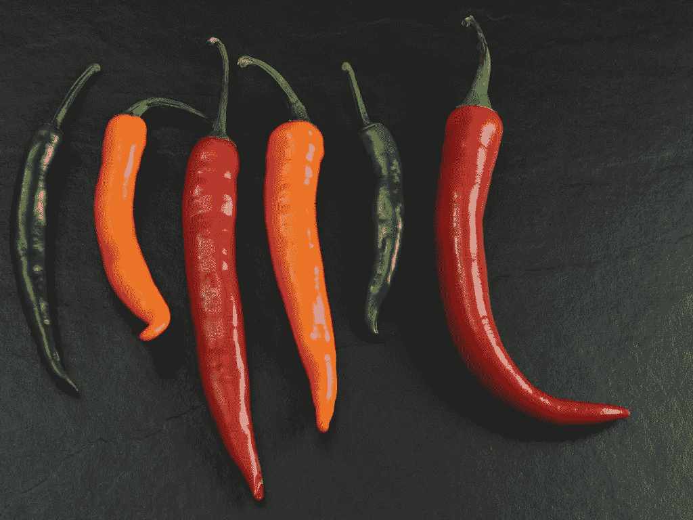
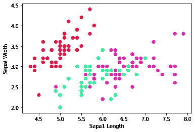
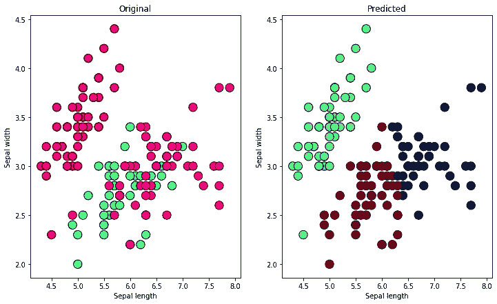

# Python 中的 K-means 聚类

> 原文：<https://medium.com/analytics-vidhya/k-means-clustering-in-python-80b7ac147eee?source=collection_archive---------3----------------------->

## 拾取数据科学

## 一个简单的，无监督的 ML 例子



亨利·洛伦扎托在 [Unsplash](https://unsplash.com?utm_source=medium&utm_medium=referral) 上拍摄的照片

如果一个人太深入，对机器学习(ML)概念的描述可能会迅速升级。让我们暂时远离杂草。相反，我们将漫步于基本机器学习(ML)算法领域，并回顾一些与无监督 ML 相关的问题。

## 我们将回顾:

*   什么是 K-means 聚类，它的优势是什么？
*   描述 K 均值聚类算法
*   如何用 Python 实现 K-means 聚类

# 无监督学习

聚类是无监督学习的一个例子。无监督学习是一种机器学习，它在没有提供标签和最少人工监督的情况下处理数据中以前未检测到的模式。

与通常使用标记数据的监督学习技术相比，无监督学习允许对输入的概率密度建模(我们稍后将简化这个定义)。K-means 是这些技术中最基本的一种。

## 什么是集群？

在 ML 中，聚类是将数据点分成特定组的一个例子，这种方式是将相似的数据点分组在一起。任何一个组中的数据点与同一组中的数据点更相似，而与其他组中的数据点不相似。



[埃尔克·韦奇格](https://commons.wikimedia.org/wiki/File:Sockenzoo.jpg) / [CC BY-SA](http://Elke Wetzig (Elya) / CC BY-SA (https://creativecommons.org/licenses/by-sa/3.0))

> 聚类基本上是基于数据之间的相似性和不相似性来收集数据。例如，花卉种类的分组可以是聚类的一个例子。

# k 均值聚类

K-means 聚类算法的目标是简单地将数据分组，使得从每个点到聚类平均点的距离平方和最小。

K-means 被认为是一种线性算法。我们使用欧几里得距离，即欧几里得空间中两点之间的“普通”直线距离，作为计算数据之间相似性的度量。



相似？字母“u”的古希腊变体，截屏来自[wikitionary](https://en.wiktionary.org/wiki/Appendix:Variations_of_%22u%22)/[CC BY-SA 3.0](https://creativecommons.org/licenses/by-sa/3.0)

# K-均值聚类算法

K 均值算法在迭代过程中工作:

*   选择 k 的某个值，例如要创建的聚类数。
*   初始化数据中的 K 个“质心”或起始点。
*   创建聚类，将每个点指定给最近的聚类质心。
*   尝试改进集群。将每个质心移动到其簇的中心。
*   重复上述两个步骤，直到你的质心收敛。
*   结束算法。

## K-means 的优缺点

优势

*   实现起来非常简单——构建模型几乎比绘制结果更快
*   非常快
*   算法很容易适应新的例子
*   收敛是有保证的(不要与完全准确相混淆)
*   扩展到大型数据集



六个不同长度的辣椒，三种颜色| [pikrepo](https://www.pikrepo.com/fccvu/six-bell-peppers)

不足之处

*   手动决定 k 的值是困难的(辣椒代表 3 种颜色，两种或三种大小，曲线和直线…？)
*   异常值是有问题的，我们很快就会看到——在我们的数据图的左下角
*   对初始值的依赖
*   不同的大小和密度会使集群变得复杂

# 使用 python 实现

包括 pandas、matplotlib 和 sklearn 在内的库对于扩展 python 的内置功能以支持 K-means 非常有用。

```
from sklearn import datasets
import matplotlib.pyplot as plt
import pandas as pd
from sklearn.cluster import KMeans
```

## 数据集

我们将通过使用 sklearn 库中提供的 IRIS 数据集来简化我们的数据采集。该数据由来自三种鸢尾(刚毛鸢尾、海滨鸢尾和杂色鸢尾)的每一种的 50 个样本组成。数据集描述了每个样本的四个特征:萼片和花瓣的长度和宽度。

```
# loading data
iris = datasets.load_iris()
```

定义目标和预测值

```
X = iris.data[:, :2]
y = iris.target
```

让我们看看我们的数据是如何分布的。我们将使用 matplotlib 的散点图来可视化我们的数据。

```
plt.scatter(X[:,0], X[:,1], c=y, cmap='gist_rainbow')
plt.xlabel('Sepa1 Length')
plt.ylabel('Sepal Width')
```



可视化三个数据分组

现在，让我们使用 sklearn 库提供的 K-means 算法来拟合这些数据。正如我们在上面的图中看到的，有三个集群，因此我们将 k 设置为 3。

```
# creating Kmeans object using  KMeans()
kmean = KMeans(n_clusters = 3, random_state=1)# Fit on data
kmean.fit(X)
KMeans(algorithm='auto', 
       copy_x=True, 
       init='k-means++', # selects initial cluster centers
       max_iter=300,
       n_clusters=3, 
       n_init=10, 
       n_jobs=None, 
       precompute_distances='auto',
       random_state=1, 
       tol=0.0001, # min. tolerance for distance between clusters
       verbose=0)
```

让我们画出由模型决定的聚类中心。

```
# instantiate a variable for the centers
centers = kmean.cluster_centers_# print the cluster centers
print(centers)
```

*[[6.81276596 3.07446809]
【5.006 3.428】
【5.7735891 2.69245283】]*

## 原始数据与聚类结果的比较

现在，让我们将聚类数据与原始数据一起绘制出来，看看我们的模型预测与原始的“真实”数据聚类的一致性如何。

```
new_labels = kmean.labels_
# Plot the identified clusters and compare
fig, axes = plt.subplots(1, 2, figsize=(12,7))
axes[0].scatter(X[:, 0], X[:, 1], c=y, cmap='gist_rainbow', edgecolor='k', s=150)
axes[1].scatter(X[:, 0], X[:, 1], c=new_labels, cmap='jet', edgecolor='k', s=150)
axes[0].set_xlabel('Sepal length')
axes[0].set_ylabel('Sepal width')
axes[1].set_xlabel('Sepal length')
axes[1].set_ylabel('Sepal width')
axes[0].set_title('Original')
axes[1].set_title('Predicted')
```



比较原始聚类和预测聚类的可视化效果

将原始数据聚类的可视化与模型的预测聚类进行比较，我们可以看到一个聚类相当准确(其中“原始”图中的红色是由“预测”图中的绿色估计的)。其他两个集群不容易区分。

# 结论

在本文中，我们讨论了 K-means 聚类算法在 Python 中的实现。我们使用 sklearn IRIS 数据集来训练和测试一个模型，目的是区分三种植物物种。然后，我们对数据的散点图可视化进行着色，表示样本观察的宽度和长度特征。

K-means 聚类在一系列应用中可能是有用的，包括客户细分、文档分类和威胁检测。但是，当原始数据中的聚类之间存在明显的重叠或相关性时，其他算法可能更适合该任务。

你用 K-means 分析过哪些数据科学问题？在这里评论，或者在 [Linkedin](https://www.linkedin.com/in/darganj/) 上联系我。