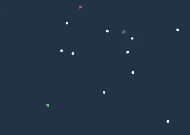
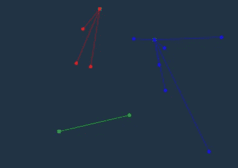
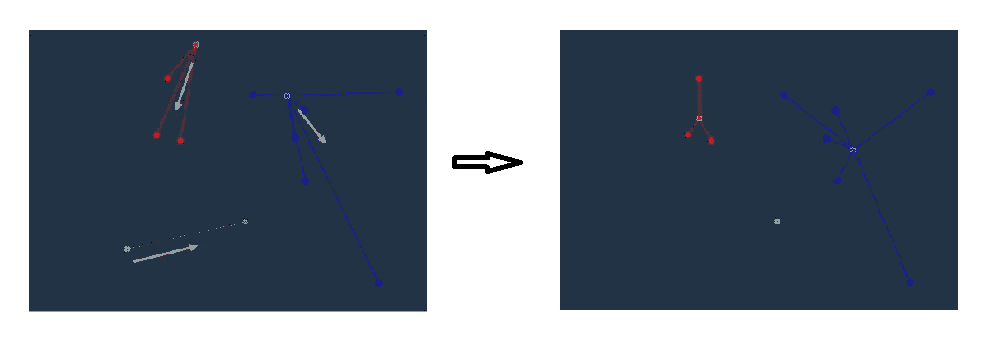
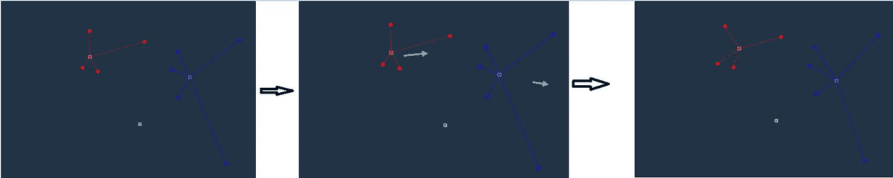
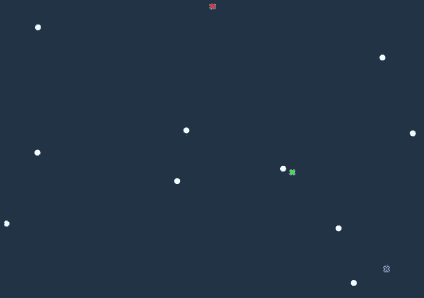
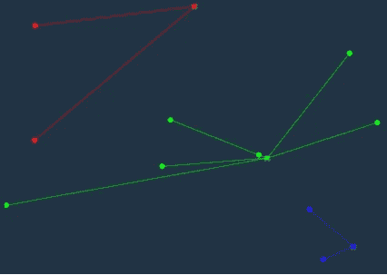
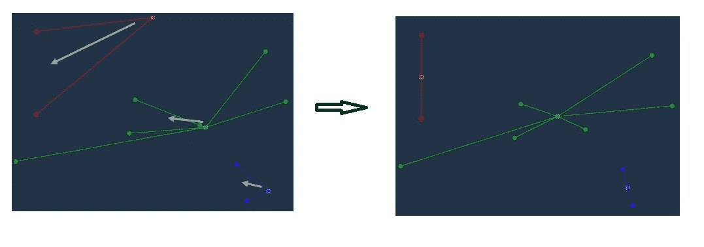
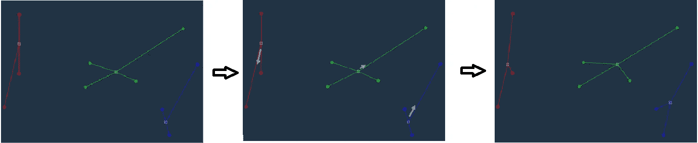

# 简化的 k-均值聚类

> 原文：<https://medium.com/analytics-vidhya/k-means-clustering-simplified-6cff56d12194?source=collection_archive---------10----------------------->

## 通过简单的可视化理解 K-Means 聚类

slate.com

K-Means 聚类算法可能是机器学习中最常用的聚类算法，有时也被称为[劳埃德](https://en.wikipedia.org/wiki/Lloyd%27s_algorithm)算法。在这里，我们将尝试深入算法，并理解它实际上是如何工作的。

我们不会在这里讨论不同聚类算法的广度，因为有相当多的文章描述了不同类型的聚类算法。

# 什么是集群？

简单来说，我们只是试图在某种相似或相异的基础上，将整个数据点或观测值划分为不同的子组。这些子群被称为集群。

就拿我们的地球母亲这个最简单的例子来说，我们都是人，都有某些我们共有的属性或行为，这些属性或行为将我们与动物区分开来，使我们成为这个地球上独一无二的生物。然而，我们仍然因为地理位置不同，说的语言不同，吃的食物不同，穿的衣服不同，说话和走路的方式也不同。

我们根据这些不同的**属性**或**行为**对不同种类的人类进行分类，这被称为数据世界中数据的**特征**。

# 为什么要集群？

无监督学习中的聚类技术是洞察任何未标记数据结构的最简单方法。未标记的数据意味着我们没有任何可区分的属性或特征的先验知识(即使存在)。这主要用于我们希望深入了解数据并利用数据中已识别的趋势或模式采取一些措施的情况。

这些信息对任何企业的利益相关者都非常重要，因为它有助于他们进行分析，并在需要时采取必要的行动来扩大企业规模或接触更广泛的受众等。

例如，考虑最简单的情况，您的邮箱中有一个使用聚类算法的垃圾邮件过滤器。邮件头、发件人和内容会被不断地检查，并根据一些共同特征组合在一起，被归类为垃圾邮件。聚类被证明非常有用的其他用例包括市场细分、欺诈检测、假新闻等。

# K-Means 中的 K 是什么？

让我们假设我们有一定数量特征的数据。现在，可以基于一个或多个特征的相似性将观察结果或数据点组合或分组在一起，这将较大的数据点集分成 2 个或更多个较小的组。聚类内的数据点将具有大部分相似的特征(但不一定所有特征都相似),而在聚类之间，它们将拥有大部分不相似的特征。

这里要注意的一点是，我们可以继续创建组或聚类的数量，并达到最细粒度的级别，并单独达到每个不同的数据点(这是一种完全不同的聚类技术，属于分层聚类，虽然它有自己的使用案例，但计算量非常大)，但我们的目标是只进行拆分，直到清楚地将不同聚类中的数据点分开的级别。

**K’**这里只是可以创建的清楚可区分的组的最佳可能**数量**，其中每个聚类具有内聚的数据点(即，聚类内的数据点非常相似或接近，但是在不同的聚类中非常不相似或相距很远。或者换句话说，我们需要在不同的聚类中，聚类内方差最小和最大的聚类。

## **寻优 K**

为了找到 K 的最佳值，我们有两种不同的方法，即肘形法和剪影法。在这里，我们将使用肘法，有时也被称为膝盖测试。

我们将通过下面的例子来理解这一点:

使用 sklearn 的弯头方法

一旦我们找到了最佳的聚类数，即 K；下一步是在数据集中找到实际的 K 个聚类。在这里，我们将借助一个假设来理解 K-Means，即我们有一个包含 n 个数据点的小数据集。K-Means 技术主要包括以下步骤来寻找聚类。

1.  在数据点的数学空间中，初始化随机的 K 个质心；是随机点；请继续关注我，直到这篇文章结束，你会发现为什么。
2.  计算每个数据点与 K 个质心的距离，并将其关联到最近的质心。
3.  计算每个聚类内所有数据点的平均值，将这 K 个质心重新定位到每个聚类的新的平均质心。这些新的聚类质心位于特征空间内，但是它们可能不代表任何实际的数据点。
4.  重复步骤 2 和 3，直到所有数据点停止从一个聚类移动到另一个聚类。
5.  现在，由于初始随机质心对最终收敛质心的位置有很大的影响，我们需要尽可能多的重复整个过程。这是 K-Means 的缺点之一。

我们将通过下面一个简单的例子来理解这一点。

让我们考虑我们有 10 个数据点，K 的最佳可能值是 3。

1.  在特征空间中初始化随机的 3 个点(我们假设它们是 3 个聚类的质心)

2.计算每个数据点与这些聚类质心的距离，并将其与最近的质心相关联。

3.计算新的平均质心并重新定位质心

4.重复步骤 2 和 3，直到聚类质心和数据点停止移动。

第一次迭代中的簇形成

现在集群已经收敛，数据点不会在不同的集群之间移动，因此迭代到此结束。

然而，你有没有注意到我们识别的聚类是有偏差的，并且高度依赖于初始质心的坐标？
让我们对相同的数据点和 K 值再做一次上述练习，观察集群的形成。

1.  在特征空间中初始化随机的 3 个聚类质心。

2.计算每个数据点与这些聚类质心的距离，并将其与最近的质心相关联。

3.计算新的平均质心并重新定位质心

1.  重复步骤 2 和 3，直到聚类质心和数据点停止移动。

第二次迭代中的簇形成

现在，如果我们比较两次迭代中形成的最终聚类，我们可以得出结论，初始质心选择对最终形成的聚类有很大的影响。

为了消除这种偏差，我们多次重复上面的练习，并使用所有迭代中最好的。默认情况下 [sklearn.cluster.KMeans()](https://scikit-learn.org/stable/modules/generated/sklearn.cluster.KMeans.html) 使用 10 次迭代，但是您可以根据您的数据和业务需求更改它和其他超参数来优化模型。

这里有一个在 sklearn 葡萄酒数据集上实现 K-Means 的基本示例，假设我们有 3 个聚类，我们已经在上面说明的 Elbow 方法中找出了这 3 个聚类。

k-表示使用 sklearn

建议或问题？请写在评论里。

**参考资料:** [http://tech.nitoyon.com](http://tech.nitoyon.com/)
[https://scikit-learn.org](https://scikit-learn.org/stable/modules/generated/sklearn.cluster.KMeans.html)