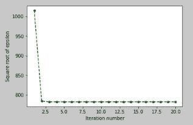

# k-意味着从头开始使用 Python 进行聚类

> 原文：<https://medium.com/analytics-vidhya/k-means-clustering-using-python-from-scratch-7ccdace7789?source=collection_archive---------13----------------------->


玛利亚·沙妮娜在 [Unsplash](https://unsplash.com?utm_source=medium&utm_medium=referral) 上拍摄的照片

K-means 聚类是一种无监督学习算法，旨在将 n 个观察值划分为 k 个聚类，其中每个观察值属于质心最近的聚类。该算法旨在最小化观测值与其所属聚类质心之间的平方欧氏距离。

在深入研究代码之前，我们先来看看分步方法:-

**第一步** :-首先我们需要决定集群的数量。在某些情况下，如市场细分，在问题陈述中定义了“k”(聚类数)的值。在其他情况下，我们必须决定“k”的最佳值。肘法通过用一系列“k”值拟合模型来帮助选择“k”的最佳值。我们将在另一篇文章中讨论它。这里我们假设“k”的值是 3。

第二步 :-然后我们从给定的数据点中随机初始化‘k’个质心。

**步骤 3** :-我们计算质心和数据点之间的欧几里德距离的平方。如果数据点和第 k 个聚类的质心之间的欧几里德距离的平方最小，则将该数据点分配给第 k 个聚类。

**步骤 4** :-现在我们知道了每个聚类中的数据点，计算每个聚类的质心。

**步骤 5** :-我们计算“ε”,其定义为数据点与其各自质心之间欧几里得距离的平方和。

**步骤 6** :-我们重复整个过程，直到‘Epsilon’的值没有显著变化，表明集群形成没有显著变化。

现在让我们来理解将 2 维数据 K-means 聚类成 3 个聚类的 python 代码。

我们得到下面的散点图。


我们观察到，在第 3 次迭代后，聚类形成没有显著变化，因为第 3、第 4 和第 5 散点图彼此非常相似。

现在让我们绘制“迭代次数对ε的平方根”的图表。

```
**a = list(range(1,21))** #Number of iterations = 20 **plt.plot(a, [x**0.5 for x in epsilon], ‘go — ‘, linewidth=1.5, markersize=4)
plt.xlabel(‘Iteration number’) 
plt.ylabel(‘Square root of epsilon’)**
```



从上图中，我们再次观察到，在第三次迭代之后，ε的平方根值没有显著变化。因此，我们可以在 3-4 次迭代后停止。