# K-Means 使用 Python 进行聚类

> 原文：<https://medium.com/analytics-vidhya/k-means-clustering-with-python-77b20c2d538d?source=collection_archive---------7----------------------->

## 用 python 在 5 分钟内读取聚类

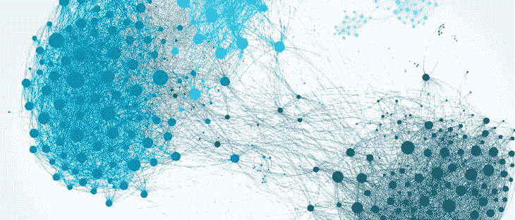

在机器学习中，有一部分是我们处理未标记的数据集，称为“无监督学习”。有时，我们只是想知道我们的数据是如何组织的，以了解这种聚类进入我们了解数据是如何组织的画面。聚类意味着对一组对象进行分组。

K-means 聚类是无监督学习的一部分，在这种情况下，我们获得了未标记的数据集，该算法会自动将数据分组为连贯的聚类。这是最流行和最广泛使用的聚类算法。它被用于各种应用中，例如市场分割、图像分割等。

**该算法将接受两个输入:**

a) K(这是您想要的聚类数)

b)训练数据集

**我们将在几个步骤中看到 k-means 算法与 python 的结合:**

1.K-均值的表示

2.集群分配步骤

3.移动质心步长

4 .局部最优

5 .选择集群数量

6.使用 python 实现

**表象:**

K =集群的数量

c(称为簇质心)=随机初始化 K 个簇质心

m =训练样本的数量

*【注意:你应该总是有 K 的值<m】*

idx C(i) =示例 X(i)被分配到的聚类的聚类质心

这里给出了一个例子，这样你就能理解这个符号了

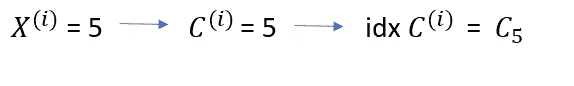

**集群分配步骤:**

在这一步中，我们将根据离数据集最近的聚类质心为数据集指定一个聚类质心，并对指定的数据集进行着色。这通过计算欧几里德距离来完成

让我们以更好的方式来看:


在随机定义聚类质心和聚类分配步骤后，它看起来将如下图所示:

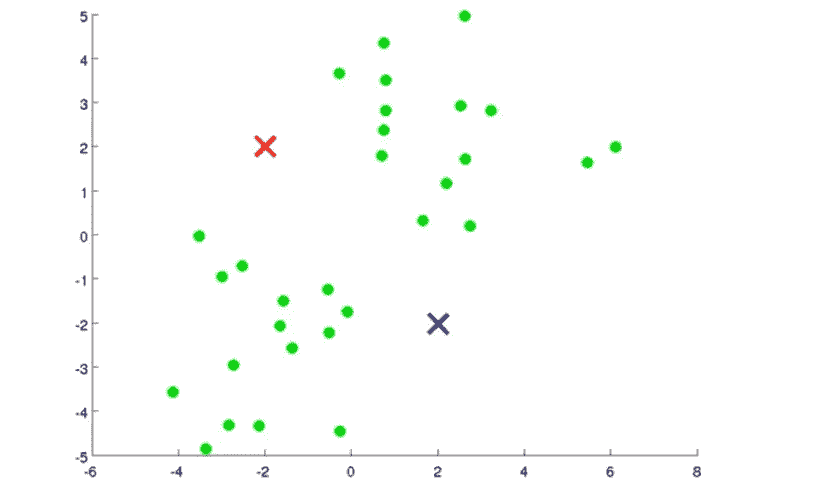

随机初始化 K

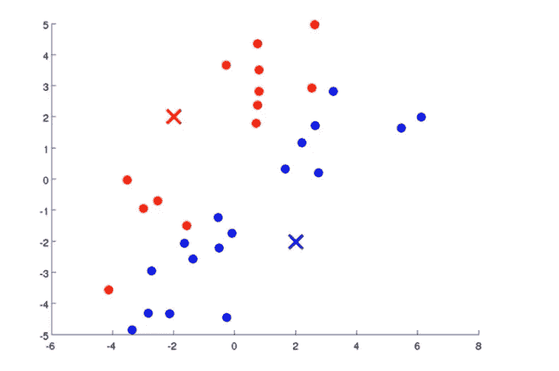

在集群分配步骤之后

**移动质心的步骤:**

在这里，我们要做的是，我们要取两个群集质心，即红色十字和蓝色十字，我们要将它们移动到相同颜色的点的平均值。我们要做的是查看所有的红点并计算平均值，实际上平均值是所有红点的位置，我们要将红色聚类的质心移动到那里。蓝十字也是如此。

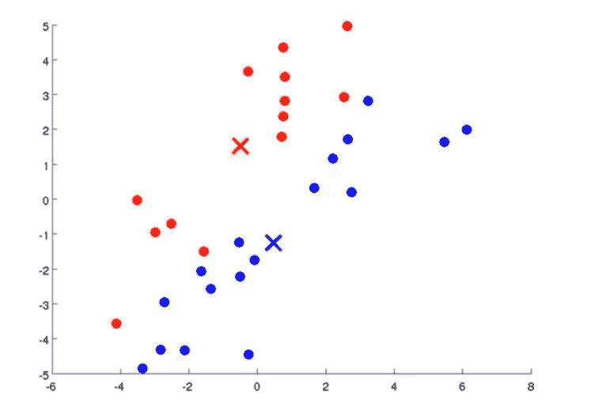

计算移动质心后，我们可以从上面的图像中看到质心的位置发生了变化

K 均值的优化目标:

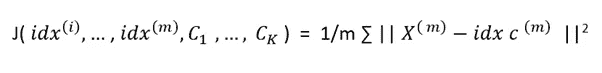

这就是所谓的失真函数

**局部最优:**

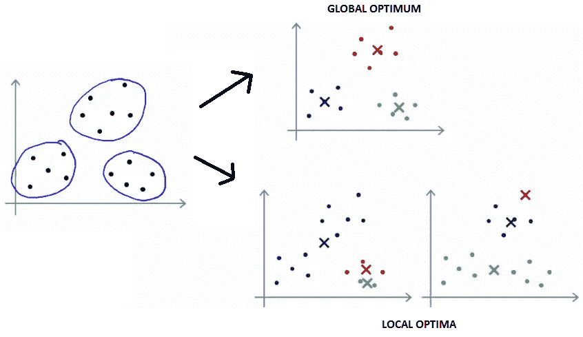

图片 01

如果我们运行 K-means，如果它以一个好的局部最优结束，也称为全局最优，那么你可能会得到上面图像 01 中带有全局最优标题的簇环。不幸的是，通过进行随机初始化，K-means 算法也可以停留在不同的局部最优，在左边的图像 01 中，看起来蓝色集群捕获了大量的点，而红色、绿色在相对少量的点上添加了字幕。这相当于坏的局部最优，因为它将两个聚类合并成一个，并将第二个聚类分成两个子聚类。

为了获得最佳的全局最优解，如图 01 所示，我们将尝试多次随机初始化聚类质心，并运行 K-means 算法很多次，从中，我们将获得最佳的解决方案，因为良好的局部最优解或全局最优解是可能的。

**选择聚类数:**

我们通常知道 K 的值，我们用这个值，否则我们用肘法。

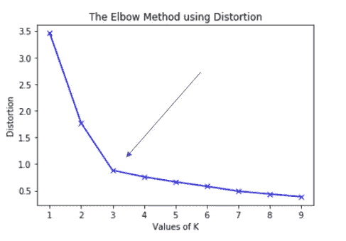

我们针对不同的 K 值(比如 K = 10 比 1)运行该算法，并绘制 K 值与失真的关系图。并为肘点选择 K 值，如图所示。

**使用 python 实现:**

***导入库***

```
import numpy as np
import pandas as pd
import matplotlib.pyplot as plt
```

***导入数据集***

```
X = pd.read_csv("data1.csv")
```

***绘制一个数据集***

```
a = X['0'].values
b = X['1'].values
X = np.array(list(zip(a, b)))
plt.scatter(a, b , c='black', s=7)
```

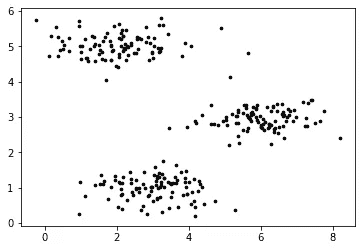

***定义 K 的值并随机初始化点***

```
K = 3
c_x = np.random.randint(0 , np.max(X) , size = K)
c_y = np.random.randint(0 , np.max(X) , size = K)
c = np.array(list(zip(c_x,c_y)),dtype = np.float32) 
```

我们的聚类中心在这些随机选择的点上

[[6.1.】
【4。5.】
【5。4.]]

***用簇形心绘制图形***

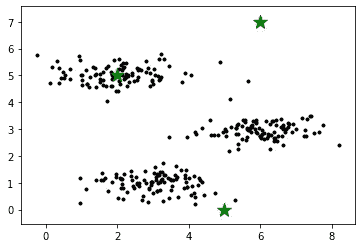

***聚类赋值***

将每个输入值分配给最近的中心

```
m = X.shape[0]
idx = np.zeros(m)for i in range(m):
    temp = np.zeros(K)
    for j in range(K):
        temp[j] = np.sum((X[i,:] - c[j,:]) ** 2) 
        idx[i] = np.argmin(temp)
```

***计算质心***

我们通过取分配给该聚类的所有点的平均值来找到新的质心。

```
for i in range(K):
    points = [X[j] for j in range(len(X)) if idx[j] == i]
    c[i] = np.mean(points, axis=0)
```

***标图***

```
colors = ['r', 'g', 'b']
fig, ax = plt.subplots()
for i in range(K):
     points = np.array([X[j] for j in range(len(X)) if idx[j] == i])
        ax.scatter(points[:, 0], points[:, 1], c=colors[i])
ax.scatter(c[:, 0], c[:, 1], marker='*', s=200, c='#050505')
```

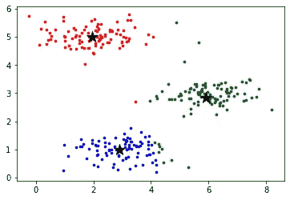

你可以在我的 GitHub 库上看到添加了 GUI 的整个项目

[https://github.com/Zeel2864/Synapse_ML](https://github.com/Zeel2864/Synapse_ML)


如果你觉得这篇文章有帮助，请鼓掌👏拍手可以让更多的人看到一个帖子。