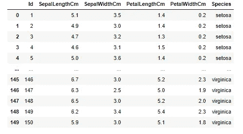
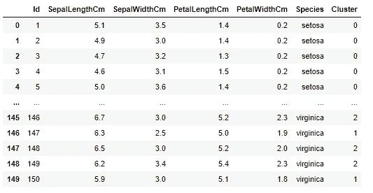

# 使用 Python 的 K-Means 聚类—初学者教程

> 原文：<https://medium.com/analytics-vidhya/k-means-clustering-with-python-beginner-tutorial-45a44c34e7f?source=collection_archive---------2----------------------->


各种颜色的气球作为未标记数据的例子。

抱歉，不开门。我假设你已经知道什么是集群，以及这个东西的目的是什么，所以让我们直接跳到教程。

*或者如果你还对数据分析中聚类的定义和目的感到困惑，可以查看这个链接:*[*https://developers . Google . com/machine-learning/clustering/overview*](https://developers.google.com/machine-learning/clustering/overview)

## 导入库。

```
import pandas as pd
import numpy as np
import matplotlib.pyplot as plt
from sklearn.cluster import KMeans
from sklearn import datasets
```

## 加载数据集。

```
iris = pd.read_csv('iris.csv')
```

是的，我们将使用[虹膜数据集](https://www.kaggle.com/uciml/iris#)。对于初学者学习机器学习来说，这是一个非常好的数据集。


虹膜数据集

如果你看一下“物种”一栏的数据，在物种名称前有某种额外的字符串(Iris-)。让我们删除多余的字符串，我们可以这样做:

```
iris['Species'] = iris.Species.str.replace('Iris-' , '')
```

现在我们得到了更干净的物种名称字符串。



虹膜数据集

## **减去数值。**

为了进行聚类，我们只需要表格中的四个特征(萼片长度、萼片宽度、花瓣长度和花瓣宽度)。所以我们可以把这些列减去，变成一个新的变量，叫做 x。

```
x = iris.iloc[:, [1,2,3,4]]
```

减去列之后，现在我们想使用 numpy 数组函数将值减去到一个数组表中。

```
x  = np.array(x)
```

## **求最优聚类数。**

因此，在我们实现 k-means 和分配数据中心之前，我们还可以使用 Elbow 方法进行快速分析，以找到最佳的聚类数(中心)。

```
# Collecting the distortions into list
distortions = []
K = range(1,10)
for k in K:
 kmeanModel = KMeans(n_clusters=k)
 kmeanModel.fit(x)
 distortions.append(kmeanModel.inertia_)# Plotting the distortions
plt.figure(figsize=(16,8))
plt.plot(K, distortions, ‘bx-’)
plt.xlabel(‘k’)
plt.ylabel(‘Distortion’)
plt.title(‘The Elbow Method showing the optimal clusters’)
plt.show()
```


肘法

从上面的折线图中，我们可以观察到“肘部”是数字 3，这是本例中的最佳集群(中心)。

**实施 K 均值。**

```
# Define the model
kmeans_model = KMeans(n_clusters=3, n_jobs=3, random_state=32932)
# Fit into our dataset fit
kmeans_predict = kmeans_model.fit_predict(x)
```

在此步骤中，我们已经创建了集群，如下所示:


0、1 和 2 数字内的 3 个聚类。我们还可以将分类结果与原始数据表合并，如下所示:

```
iris['Cluster'] = kmeans_predict
```



具有聚类列的 Iris 数据集

最后一步也是最必要的一步是可视化我们的集群，这样我们就可以实际看到集群的模型。

## **可视化集群**。

```
# Visualising the clusters
plt.scatter(x[kmeans_predict == 0, 0], x[kmeans_predict == 0, 1], s = 100, c = ‘red’, label = ‘Setosa’)
plt.scatter(x[kmeans_predict == 1, 0], x[kmeans_predict == 1, 1], s = 100, c = ‘blue’, label = ‘Versicolour’)
plt.scatter(x[kmeans_predict == 2, 0], x[kmeans_predict == 2, 1], s = 100, c = ‘green’, label = ‘Virginica’)# Plotting the centroids of the clusters
plt.scatter(kmeans_model.cluster_centers_[:, 0], kmeans_model.cluster_centers_[:,1], s = 100, c = ‘yellow’, label = ‘Centroids’)plt.legend()
```


形象化

# 摘要

*   在最常见的无监督学习形式中，数据是无标记的，聚类涉及基于数据实例之间的相似性来分离数据。
*   K-means 是一种流行的聚类技术。它涉及一个迭代过程，以找到称为质心的聚类中心，并将数据点分配给其中一个质心。
*   K-means 聚类的步骤包括:
    1 .识别组合 K
    2 的编号。识别每个群集的质心
    3。确定物体到质心的距离
    4。基于最小距离对对象进行分组

在这里可以找到笔记本[。](https://notebooks.gesis.org/binder/v2/gh/jerichosiahaya/my-notebooks/64131fa240144e991ce89b335649b1834b46ceb9?filepath=k-means%20clustering%20using%20iris%20dataset%2FClustering%20using%20Iris%20dataset.ipynb)