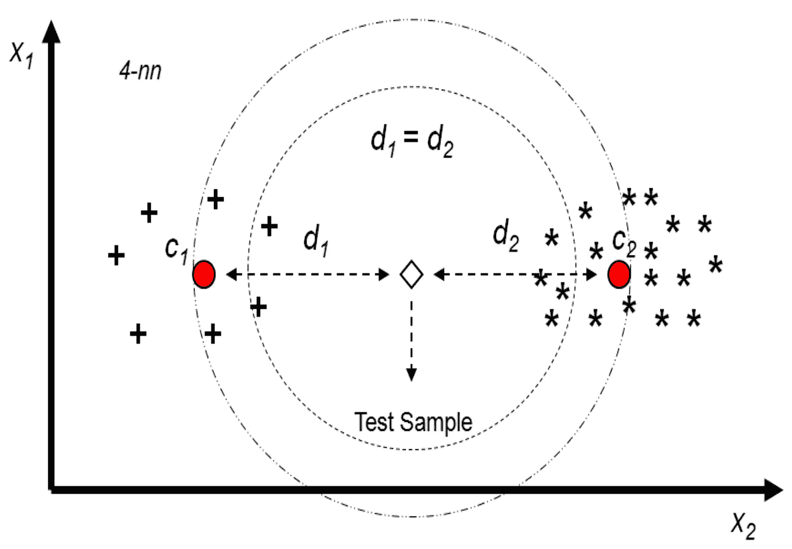
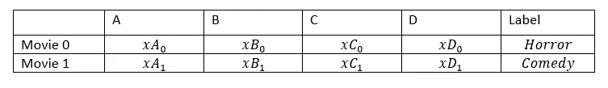
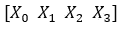
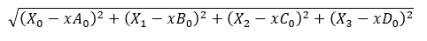
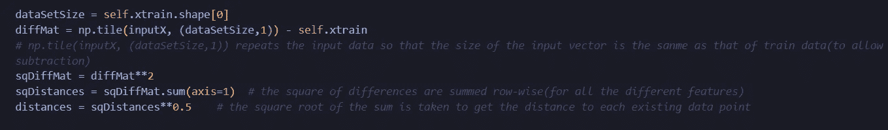
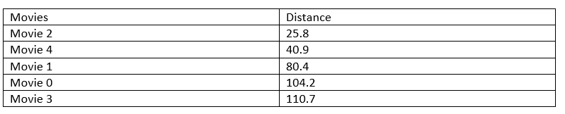
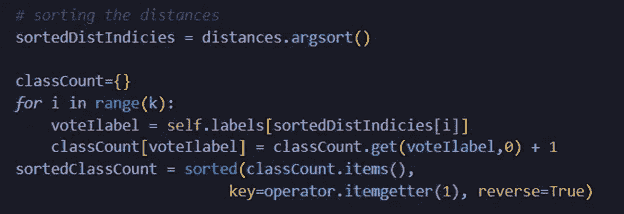
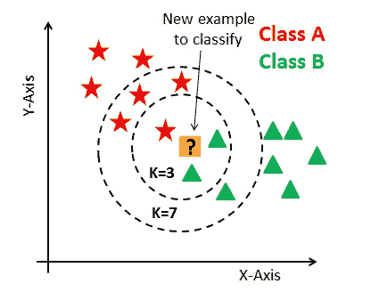
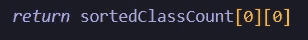

# k-最近邻算法

> 原文：<https://medium.com/analytics-vidhya/k-nearest-neighbor-algorithm-157f407abee8?source=collection_archive---------15----------------------->

k-NN 是一种用于解决分类问题的监督机器学习算法。这是一种懒惰的学习算法，因为它只在进行查询后概括数据。它进行基于实例的学习。这意味着 k-NN 只是记忆训练数据(没有任何主动学习)，并利用数据点之间的相似性进行预测。

例如，喜剧电影有很多令人捧腹大笑的场景。另一方面，恐怖电影有非常可怕的场景。因此，如果一部电影有大量的恐怖场景，那么它很可能是一部恐怖电影，而一部有许多有趣场景的电影很可能是一部喜剧。如果我们要找出一部新电影的类型(恐怖或喜剧)，我们可以通过计算恐怖场景和喜剧场景的数量，然后根据它是恐怖场景数量多还是喜剧场景数量多来将其分类为恐怖或喜剧。这就是 k-NN 分类器的作用…

## **算法**

当用输入向量 X 查询该算法时，kNN 分类器做三件主要事情:

1.计算欧几里德距离

2.按升序对距离进行排序

3.在到 x 的距离最短的 *k* 个项目中查找并返回多数类

## 计算欧几里德距离

抽样资料

输入向量

假设输入向量如上所示。那么对于上表中描述的样本数据，电影 0 的距离将被计算为:

欧几里德距离方程

下图显示了这方面的代码。注意，距离是为数据集中的每个数据点(例如电影 0、电影 1、电影 2 等)计算的。

计算欧几里德距离

## 排序距离

在计算了训练数据中的数据点和输入向量之间的距离之后，这些距离按升序排序。下表显示了一个示例:

电影的排序距离

这方面的代码可以在下面的代码片段中看到:

排序距离

## 查找并返回多数类

下一步是在训练数据中挑选前 k 个最相似的项目。 *k 是一个整数，通常小于 20。*在下图中，假设 k = 3，那么多数类将是 b 类。然而，如果 k=7，那么多数类将是 a 类。

邻居

多数类基本上是距离排序列表中的第一个元素。它是最接近输入数据的点的类。

多数阶级

**优点**

*   很容易实现。
*   它适用于数值和标称值。
*   它对异常值不敏感，因为它只测量数据点之间的距离。
*   k-NN 是一种非参数学习算法。这意味着它不对数据做任何假设。例如，k-NN 并不假设数据是线性可分的。它不在乎。

**缺点**

*   对于 k-NN 这样的懒学习算法，没有训练阶段。因此，由于分类器在每次进行预测时都在整个训练集中搜索最近的邻居，因此在预测过程中花费了大量时间。
*   这在计算上是昂贵的。进行预测时，需要大量内存来存储训练数据。

> 完整的代码可以在这个 [**github 资源库**](https://github.com/Lormenyo/ML_Algorithms_From_Scratch) 中找到。非常感谢您阅读这篇文章。我希望它很有启发性。别忘了鼓掌😊👍