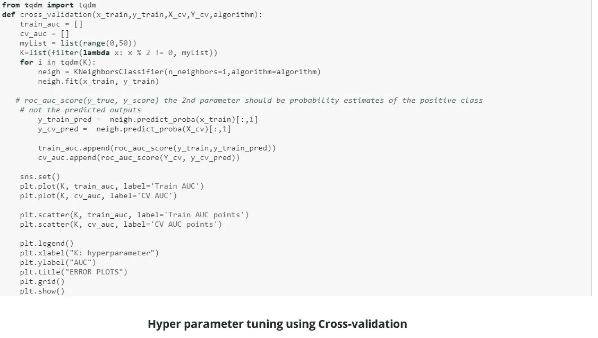
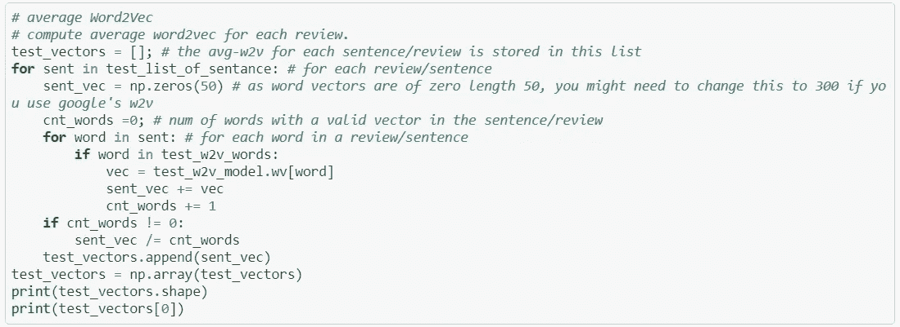
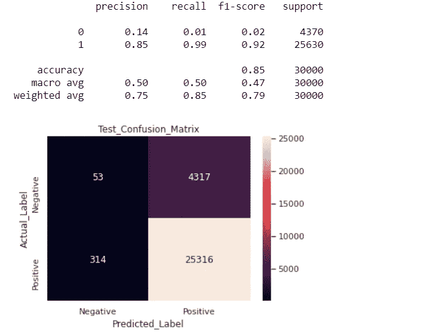

# 基于亚马逊美食评论分析的 k-最近邻算法

> 原文：<https://medium.com/analytics-vidhya/k-nearest-neighbor-algorithm-with-amazon-food-reviews-analysis-14d83a4cadea?source=collection_archive---------13----------------------->


**首先我们想知道什么是亚马逊美食点评分析？**

这个数据集由亚马逊的美食评论组成。这些数据跨越了 10 多年的时间，包括截至 2012 年 10 月的所有约 500，000 篇评论。评论包括产品和用户信息、评级和明文评论。我们也有来自所有其他亚马逊类别的评论。

亚马逊评论通常是最公开可见的消费品评论。作为一个经常使用亚马逊的用户，我对检查亚马逊评论的大型数据库的结构和可视化这些信息很感兴趣，以便成为一个更聪明的消费者和评论者。

【https://www.kaggle.com/snap/amazon-fine-food-reviews】来源:[](https://www.kaggle.com/snap/amazon-fine-food-reviews)

**亚马逊美食点评数据集由来自亚马逊的美食点评组成。**

**评论数:568，454
用户数:256，059
产品数:74，258
时间跨度:1999 年 10 月—2012 年 10 月
数据中的属性/列数:10**

**属性信息:**

1.  **身份**
2.  **产品 Id —产品的唯一标识符**
3.  **UserId —用户的唯一标识符**
4.  **ProfileName**
5.  **帮助度分子—认为评论有帮助的用户数量**
6.  **帮助度分母——表示他们认为评论是否有帮助的用户数量**
7.  **分数—介于 1 和 5 之间的等级**
8.  **时间—审核的时间戳**
9.  **摘要—审核的简要摘要**
10.  **文本—审阅的文本**

# **目标**

**给出一个评价，确定该评价是正面的(评分为 4 或 5)还是负面的(评分为 1 或 2)。**

# **内容**

1.  **数据预处理**

**2.列车测试分离**

**3.使用单词包特征的 K-NN 简单“蛮”模型**

**4.使用 TFIDF 特征的 K-NN 简单“野蛮”模型**

**5.使用 Word2Vec 特性的 K-NN 简单“野蛮”模型**

**6.使用平均 Word2Vec 特征的 K-NN 简单“野蛮”模型**

**7.使用 TFIDF W2V 功能的 K-NN 简单“野蛮”模型**

**8.使用单词包特征的 k-NN“Kd-tree”模型**

**9.结论**

**10.观察**

## ****数据预处理****

**数据预处理是一种用于将原始数据转换成干净数据集的技术。换句话说，无论何时从不同来源收集数据，都是以原始格式收集的，这对于分析是不可行的。**

****

**要了解亚马逊食品评论数据集和特征的完整概述，请访问我以前的博客链接 [**这里**](/analytics-vidhya/amazon-fine-food-reviews-featurization-with-natural-language-processing-a386b0317f56) **。****

**让我们用 K-NN 建立一个模型如果你不知道 K-NN 是如何工作的，请访问我以前的博客链接 [**这里**](/analytics-vidhya/k-nearest-neighbors-algorithm-7952234c69a4) **。****

**将数据分配给从属特征 X，将目标分配给 y。**

```
 X=data['preprocessed_reviews'].values
 Y=data['Score'].values
```

## **列车测试分离**

**当机器学习算法用于对不用于训练模型的数据进行预测时，训练-测试分离过程用于估计机器学习算法的性能。**

**如果你有**一个数据集**，你需要首先使用 Sklearn `train_test_split`函数分割它。**

**训练测试分割是一种用于评估机器学习算法性能的技术。它可用于分类或回归问题，并可用于任何监督学习算法。**

**该过程包括获取一个数据集并将其分成两个子集。第一个子集用于拟合模型，称为训练数据集。第二子集不用于训练模型；相反，数据集的输入元素被提供给模型，然后进行预测并与期望值进行比较。第二个数据集被称为测试数据集。**

```
*#Train-Test split*
**from** **sklearn.model_selection** **import** train_test_split
X_train,X_test,Y_train,Y_test=train_test_split(X,Y,test_size=0.3) *#random splitting*

X_train,X_cv,Y_train,Y_cv=train_test_split(X_train,Y_train,test_size=0.3) *#random splitting*

print(X_train.shape,Y_train.shape)
print(X_test.shape,Y_test.shape)
print(X_cv.shape,Y_cv.shape)
```

## ****使用单词包的文本特征化****

```
*#featurization_using_Bow*
**from sklearn.feature_extraction.text import** **CountVectorizer**
vect=CountVectorizer()
vect.fit(X_train)
X_train_bow=vect.fit_transform(X_train)
X_test_bow=vect.transform(X_test)
X_cv_bow=vect.transform(X_cv)
```

## **超参数调谐**

**我们希望选择最佳的 K 来获得更好的模型性能，通过使用交叉验证或网格搜索交叉验证来选择最佳的 K。**

********

**使用 K-NN 蛮力建立一个简单的模型，我们已经定义了一个 Grid_search 函数，当我们调用它时，它会给出结果。**

```
#Hyper parameter tuning
best_k=Grid_search(X_train,Y_train,'brute')
```

****

**从误差图中，我们选择 K，使得我们将在 cv 数据上具有最大 AUC，并且训练和 cv 之间的差距较小。基于我们使用的方法，我们可能得到不同的超参数值作为最佳值。**

**所以，我们根据我们选择的方法来选择，如果我们有更多的计算能力，你使用网格搜索，注意这将花费更多的时间。如果我们增加网格搜索 cv 中的 CV 值，您将获得更稳健的结果。**

## **使用测试数据进行测试**

**测试集是一组观察值，用于使用一些性能度量来评估模型的性能。重要的是，测试集中不包括来自训练集的观察值。如果测试集确实包含来自训练集的示例，则很难评估该算法是学会了从训练集进行归纳，还是简单地记住了它。**

**在我们使用网格搜索 CV 找到最佳 k 之后，我们希望使用测试数据检查性能，在本案例研究中，我们使用 AUC 作为性能度量。**

****定义测试数据的功能。****

****

```
#Testing with test data
test_data(X_train,Y_train,X_test,Y_test,'brute')
```

****

## **性能指标**

**绩效指标用于衡量企业的行为、活动和绩效。这应该是在一个范围内测量所需数据的数据形式，允许形成支持总体业务目标实现的基础。**

**要了解机器学习中使用的性能指标的详细信息，请访问我以前的博客链接[**这里**](/@sachin.s1dn/performance-metrics-for-machine-learning-models-80d7666b432e) **。****

****定义绩效指标的功能。****

****

```
#performance metric
metric(X_train,Y_train,X_test,Y_test,'brute')
```

****

## **使用 TFIDF 特征的文本特征化**

****

```
*#generating the tf-idf features*
**from** **sklearn.feature_extraction.text** **import** **TfidfVectorizer**
vectorizer=TfidfVectorizer(ngram_range=(1, 2))
X_train_tf_idf=vect.fit_transform(X_train)
X_test_tf_idf=vect.transform(X_test)X_train=X_train_tf_idf
X_test=X_test_tf_idf#Hyper Parameter Tuning
best_k=Grid_search(X_train,Y_train,'brute')
```

****

```
*#computing the AUC on the test data*
test_data(X_train,Y_train,X_test,Y_test,'brute')
```

****

```
#performance metricmetric(X_train_tf_idf,Y_train,X_test_tf_idf,Y_test,'brute')
```

****

## **使用 Word2Vec 特性的文本特征**

**Word2vec 创建向量，这些向量是单词特征的分布式数字表示，如单个单词的上下文。**

**它不需要人工干预。给定足够的数据、用法和上下文，Word2vec 可以根据过去的表现对单词的意思做出高度准确的猜测。**

****

```
*# Train your own Word2Vec model using your own text corpus*
i=0
train_list_of_sentance=[]
**for** sentance **in** X_train:
    train_list_of_sentance.append(sentance.split())*# Using Google News Word2Vectors*
**from** **gensim.models** **import** **Word2Vec**
**from** **gensim.models** **import** **KeyedVectors**
*# min_count = 5 considers only words that occured atleast 5 times*
train_w2v_model=Word2Vec(train_list_of_sentance,min_count=5,size=50, workers=4)
```

****

****Word2Vec 为每次审查特征化列车数据****

****

```
*# Train your own Word2Vec model using your own text corpus for test data*
i=0
test_list_of_sentance=[]
**for** sentance **in** X_test:
    test_list_of_sentance.append(sentance.split())
test_w2v_model=Word2Vec(test_list_of_sentance,min_count=5,size=50, workers=4)
```

****

****Word2Vec 对每次审查的测试数据进行特征化****

****

```
#Hyper parameter Tuning
best_k=Grid_search(X_train,Y_train,'brute')
```

****

```
*#Testing with Test data*
*#computing the AUC on the test data*
test_data(X_train,Y_train,X_test,Y_test,'brute')
```

****

```
*#performance metric*
metric(X_train,Y_train,X_test,Y_test,'brute')
```

****

## **使用平均 Word2Vec 特征的文本特征化**

****

****每次审查列车数据的平均 Word2Vec 特征化****

****

****每次审查测试数据的平均 Word2Vec 特征****

****

```
#Hyper parameter tuning
best_k=Grid_search(X_train,Y_train,'brute')
```

****

```
*#Testing with Test data*
*#computing the AUC on the test data*
test_data(X_train,Y_train,X_test,Y_test,'brute')
```

****

```
*#performance metric*
metric(X_train,Y_train,X_test,Y_test,'brute')
```

****

## **使用 TFIDF W2V 功能的文本特征**

********

```
*#define tf_idf vectorizer*
**from** **sklearn.feature_extraction.text** **import** **TfidfVectorizer**
tfidf_vect = TfidfVectorizer(ngram_range=(1, 1))
train_tfidf_w2v = tfidf_vect.fit(X_train)
test_tfidf_w2v = tfidf_vect.transform(X_test)
```

********

```
#Hyper parameter tuning
best_k=Grid_search(X_train,Y_train,'brute')
```

****

```
*# Testing with Test data*
*#computing the AUC on the test data*
test_data(X_train,Y_train,X_test,Y_test,'brute')
```

****

```
*#performance metric*
metric(X_train,Y_train,X_test,Y_test,'brute')
```

****

**至此，我们使用一些流行的文本特征化技术构建了一个 K-NN 简单“暴力”模型。**

**要用“Kd-tree”建立 K-NN 模型，在函数中，我们只需将算法从“brute”改为“Kd-tree ”,它就会给出结果。**

**当我们使用 Kd-tree 算法时，它需要大量的时间来运行，所以要有耐心，如果你有内存错误，只考虑较少的特征和数据点。**

# **基于 Bow 特征的 K-NN kd 树**

```
*#K-D tree takes lots of time so I used 10 K data points only*
*#use preprocessed_reviews and score for building a model* 
X=data['preprocessed_reviews'][:10000].values
Y=data['Score'][:10000].values
```

****

**我们只考虑了 500 个特征，以避免下图所示的内存错误。**

****

**Kd-tree 只接受信任点，所以我们想把稀疏矩阵转换成信任矩阵。**

```
X_train=X_train_bow.todense()
X_test=X_test_bow.todense()
```

**我们刚刚将函数中的“brute”算法改为“Kd-tree ”,以构建一个包含 Kd-tree 的 K-NN，如下所示。**

```
#Hyper parameter tuning
best_k=Grid_search(X_train,Y_train,'kd_tree')
```

****

```
*# Testing with Test data*
*#computing the AUC on the test data*
test_data(X_train,Y_train,X_test,Y_test,'kd_tree')
```

****

```
*#performance metric*
metric(X_train,Y_train,X_test,Y_test,'kd_tree')
```

****

**类似地，我们为 TFIDF、Word2Vec、Average word2Vec 和 TFIDF W2V 构建了具有 Kd 树的 K-NN 模型。**

**要了解完整代码请访问我的 [**GitHub**](https://github.com/Sachin-D-N/Amazon_Food_Reviews/blob/main/02.KNN_Amazon_Food_Reviews/KNN_Amazon_Food_Reviews_Assignment.ipynb) 链接。**

# **结论**

**为了在表格中写入震荡，我们使用了 python 库 PrettyTable。**

**pretty table 是一个简单的 Python 库，旨在使在视觉上吸引人的表格中表示表格数据变得快速而简单。**

```
**from** **prettytable** **import** PrettyTable

table = PrettyTable()
table.field_names = ["Vectorizer", "Model", "Hyper Parameter", "AUC"]
table.add_row(["Bow", 'Brute_Forse', 49,80.18 ])
table.add_row(["TFIDF", 'Brute_Forse', 49, 81.34])
table.add_row(["Word2vec", 'Brute_Forse',49 ,84.61 ])
table.add_row(["Avg_Word2vec", 'Brute_Forse', 7, 50.27,])
table.add_row(["TFIDF_Word2vec", 'Brute_Forse',45 ,49.75 ])
table.add_row(["Bow", 'kd_Tree', 49,79.15 ])
table.add_row(["TFIDF", 'kd_Tree', 47,79.84 ])
table.add_row(["Word2vec", 'kd_Tree', 47,50.71 ])
table.add_row(["Avg_Word2vec", 'kd_Tree',27 ,50.12 ])
table.add_row(["TFIDF_Word2vec", 'kd_Tree', 3,49.76 ])
print(table)
```

****

# **观察**

1.  **从上表中，我们可以得出结论，对于所有的文本特征，通过超参数调整的 best_K 是 49。**
2.  **从上表中，我们观察到 Word2vec 的 K-NN 简单强力模型在测试数据上具有 84.61%的最高 AUC 分数。**
3.  **TF-IDF 和单词包特征的 K-NN 简单粗暴模型在具有 81.34%和 80.18%的 AUC 分数的测试数据上也工作得相当好。**
4.  **Avg_Word2Vec 和 TFIDF_Word2vec 在测试数据上的 AUC 得分较低。**

**要了解亚马逊美食评论数据集和特征的完整概述，请访问我以前的博客链接 [**这里**](/analytics-vidhya/amazon-fine-food-reviews-featurization-with-natural-language-processing-a386b0317f56) **。****

**想知道 K-NN 是如何工作的，访问我之前的博客链接 [**这里**](/analytics-vidhya/k-nearest-neighbors-algorithm-7952234c69a4) **。****

**要了解机器学习中使用的性能指标的详细信息，请访问我以前的博客链接[**这里**](/@sachin.s1dn/performance-metrics-for-machine-learning-models-80d7666b432e) **。****

**欲了解完整代码，请访问我的 [**GitHub**](https://github.com/Sachin-D-N/Amazon_Food_Reviews/blob/main/02.KNN_Amazon_Food_Reviews/KNN_Amazon_Food_Reviews_Assignment.ipynb) 链接。**

# **参考**

*   **应用人工智能**
*   **Coursera**
*   **数据营**

**感谢您的阅读和耐心。我希望你喜欢这个帖子，如果我的帖子有错误，请告诉我。如果你发现帖子中有什么错误或者有什么要补充的，就在评论中讨论吧…**

**快乐学习！！**