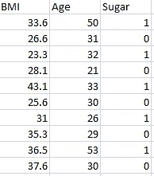
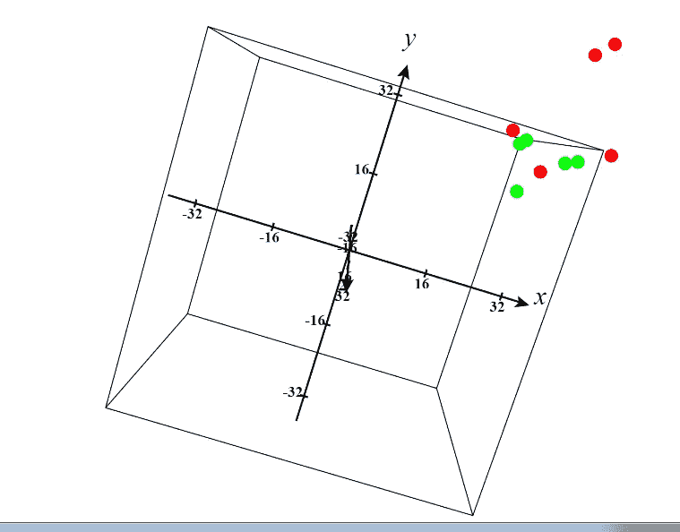
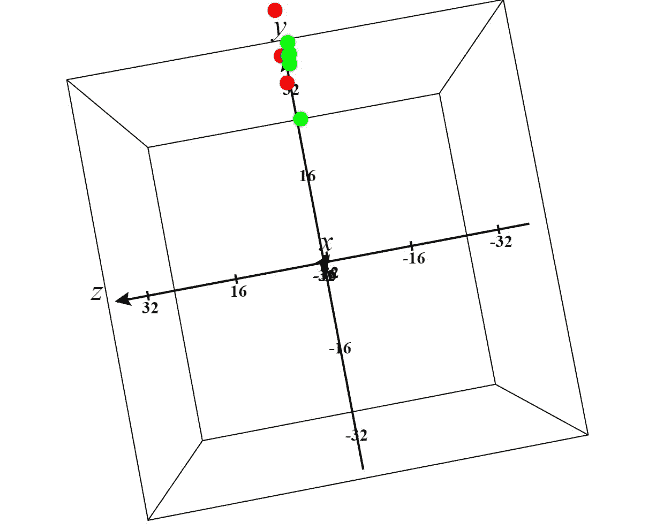
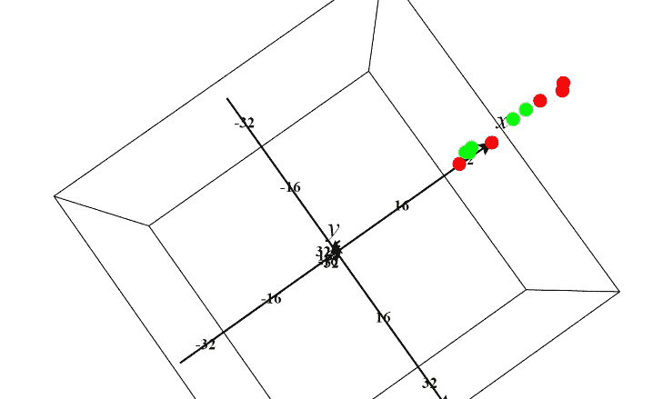
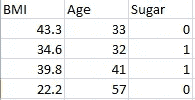
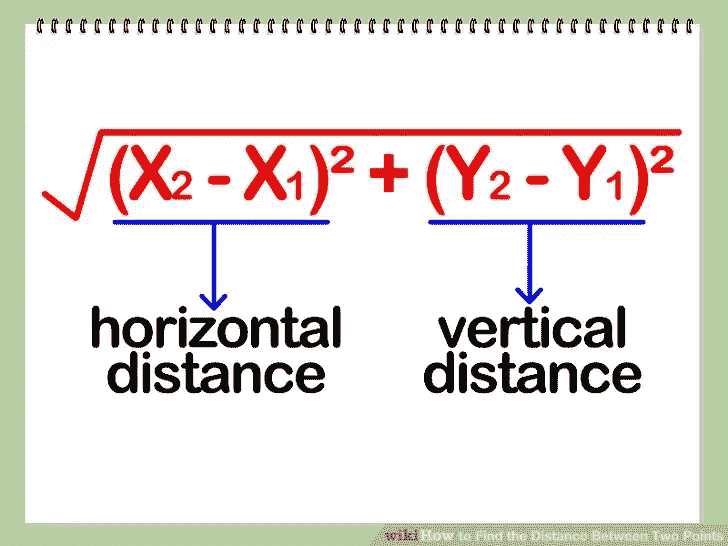
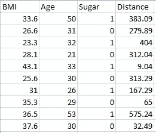

# 举例说明 K-最近邻

> 原文：<https://medium.com/analytics-vidhya/k-nearest-neighbor-explanation-with-example-843d78d0288e?source=collection_archive---------4----------------------->

K-最近邻是用于分类的算法。

**什么是分类？**

分类是根据一些因素对数据进行分类。

将人们分为糖尿病患者和非糖尿病患者。

**工作:**

它基于最近邻值工作。

k→表示有多少邻居

我用下面的数据集来解释算法的工作过程。我从 kaggle 获取了这个名为“pima indian diabetes dataset”的数据集。在下面的链接中找到的数据集。

【https://www.kaggle.com/uciml/pima-indians-diabetes-database】T4。

I 只在数据集上取 3 个变量。身体质量指数测量、年龄、输出量(如果有或没有糖尿病存在)。我只取了 10 个人的数据用于训练，3 个人用于测试。我的 10 个训练数据是

1 表示有糖尿病，0 表示没有糖尿病

这里身体质量指数和年龄是独立变量。糖(糖尿病患者)是因变量。糖尿病取决于身体质量指数和年龄。

第一步是什么？

清楚地标识了多少个自变量。在我们的例子中，身体质量指数和年龄。所以两个自变量(X1，X2)。

因变量(糖)有多少种可能的结果。只有两种可能的结果(糖尿病或非糖尿病)

下一步是决定 k 值。k 表示我们考虑多少个邻居。

我选择 k=3，因为我有这样低的数据，例如(只有 10)

现在我为数据集绘制图表。这是 3d 图形，因为我们有 3 个值身体质量指数，年龄，糖(存在与否)。我显示了 3 个视图的绘图。红点表示糖尿病患者。绿点表示非糖尿病患者。我画了 10 个值。

x 轴-身体质量指数

y 轴-年龄

z 轴-糖

**XY 视图**

**YZ 视图**

**ZX 观点**

对某些人来说，这很难理解。在最后两个观点中，观点过于接近。因为 Z 轴是存在的。我们的 Z 值是多少？那是糖。它只有两个可能的值 0 和 1。所以 Z 上的点要么是 0 要么是 1 太接近了。

这是我选择用来测试的下表。

**测试台**

是的，现在是时候分类了。如果一个人的身体质量指数=43.3，年龄=33，那么他是糖尿病患者吗？最初的答案是否定的，因为我们是从数据集中提取的。但是我们必须测试机器在说什么(糖=0 或糖=1)

非 knn 变成 3nn(因为我们选择 k=3)

首先计算目标点(43.3，33)到数据集中每个点之间的距离。所以，你知道如何计算两点之间的距离。那里有公式。

感谢维基百科

现在我们想要选择 3 个点，这 3 个点靠近我们的目标点(43.3，33)。因为 k=3

在距离公式中，平方根对于这种情况是不必要的。因为举个例子考虑距离是=(25，16，9，49，64)。选择最小值 3。是(9，16，25)。

取距离的平方根。是(5，4，3，7，8)。选择最小值 3。是(3，4，5)。

两个输出相同。因此避免不必要的操作以减少计算时间。我将展示一个点的例子来计算距离。

距离=(43.3–33.6)-(33–50)= 383.09

43.3 和 33 是目标点。33.6 和 50 是我们数据集中的第一个点。同样，我们计算每个数据点到目标点的距离。这是所有计算距离的输出。

现在你看到的是从我们的目标点开始的每个点的距离。选择最小 3。是 9.04，32.49，65。查看它们各自的值(1，0，0)。最大值为零。所以机器宣布这个病人没有糖尿病。

现在你明白这个概念了。当看到一个新值(身体质量指数和年龄)时，它选择一个 K(在我们的例子中 k=3)邻居值并查看它们的历史。在 3 名患者中，2 名为非糖尿病患者，1 名为糖尿病患者。因此，它宣布新患者为非糖尿病患者。原输出也是非糖尿病。成功了

那是关于 K-neares 的邻居。所以为了方便计算，我选择这个。但是在现实世界中有大量的数据。此外，我只测试了 1 个测试数据，它的作品。但是对于剩余的 3 个数据，它可能是失败或通过..！！！因为是机器学习。