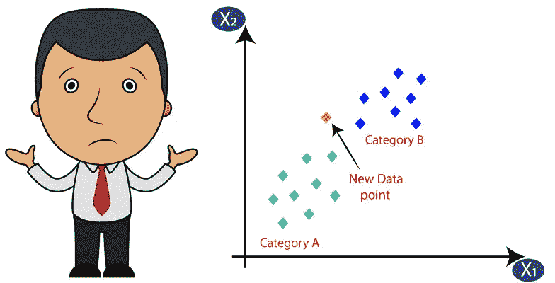
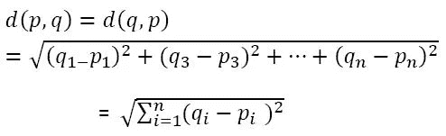
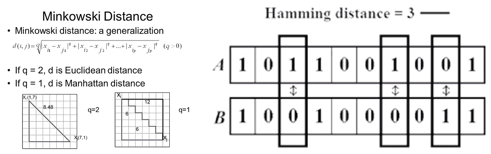

# k-最近邻

> 原文：<https://medium.com/analytics-vidhya/k-nearest-neighbor-k-nn-f4418a55b74f?source=collection_archive---------23----------------------->



K-最近邻(K-NN)算法是一种简单、易于实现的有监督机器学习算法。k-NN 中的“K”指的是它在做出决策时将考虑的最近邻居的数量。它通常被用作分类算法，但是我们已经看到了 k-NN 被用作回归算法并且优于许多回归算法的情况。

K-NN 也被称为懒惰学习器，因为它不从训练数据中学习任何东西，而是记忆整个训练数据集，并且在分类时，它对数据集执行操作。

K-NN 算法本身相当简单，可以总结为以下步骤:

1.选择 k 的数量和距离度量。距离度量可以是欧几里德、曼哈顿、汉明或闵可夫斯基距离。

2.找出我们要分类的样本的 k 个最近邻。

3.通过多数投票分配类别标签。

基于所选择的距离度量，k-NN 算法在训练数据集中找到与我们想要分类的点最接近(最相似)的 k 个样本。然后，新数据点的类别标签由其 k 个最近邻居中的多数投票来确定。

让我们通过 scikit-learn 页面上列出的一个简单示例来了解 k-NN 的工作原理。

[](https://scikit-learn.org/stable/modules/generated/sklearn.neighbors.KNeighborsClassifier.html) [## sk learn . neighbors . kneighborsclassifier-scikit-learn 0 . 22 . 2 文档

### 实现 k-最近邻投票的分类器。了解更多信息。参数 n_neighborsint，可选(默认值=…

scikit-learn.org](https://scikit-learn.org/stable/modules/generated/sklearn.neighbors.KNeighborsClassifier.html) 

```
X = [[0], [1], [2], [3]] 
y = [0, 0, 1, 1] #class-labels
from sklearn.neighbors import KNeighborsClassifier #import
neigh = KNeighborsClassifier(n_neighbors=3, *metric='*Euclidean*'*)#k=3
neigh.fit(X, y) #training 
print(neigh.predict([[1.1]])) #new or unknown data.
[0] #output
```

因此，我们训练我们的 k-nn 模型，数据为 0，1，2 和 3，类别标签或输出分别为 0，0，1，1。取 k 的值为 3，距离度量为欧几里得。

现在，在训练我们的模型之后，我们提供了测试数据为 1.1 的 or 模型，并且机器计算所有输入数据的欧几里德距离，然后输出结果为 0。

让我们看看 k-NN 算法的内部工作原理。欧几里德距离由公式给出。



如果 p 和 q 是感兴趣的点，那么 p 和 q 之间的欧几里德距离

现在我们将计算测试数据(1.1)和训练数据之间的距离，并选择最近的三个距离。

```
Euclidean Distance  Class-Label(1.1–0)² = 1.21         0(1.1–1)² = 0.01         0(1.1–2)² = 0.81         1(1.1–3)² = 3.61         1
```

因此，最接近新点 1.1 的最小 3 距离是 1.21、0.01 和 0.81，它们的类别标签分别为 0、0、1、1。因此，在多数情况下，新点的类别标签为 0。

# **k-NN 的优势**

1.  简单的
2.  只有一个要优化的超参数(k)

# k-NN 的缺点

1.  慢速算法
2.  维度的诅咒
3.  对异常值、缺失数据等敏感。

# 应用程序

1.  文本挖掘
2.  农业
3.  金融

# **条款预警:**

1.  **有监督的机器学习**:这是一种向机器提供输入数据和类别标签的学习，机器从这些数据中学习输入和输出之间的关系，并预测未知数据的结果。其他类型的学习包括无监督和强化学习。
2.  **曼哈顿距离:**沿直角轴测量的两点间的距离。在 p1 在(x1，y1)且 p2 在(x2，y2)的平面中，它是|x1 — x2| + |y1 — y2|。
3.  **汉明距离:**两个二进制字符串之间不同的位数。更正式地说，两个字符串 A 和 B 之间的距离是∑ | Ai — Bi |。



距离度量

建议总是受欢迎的。别忘了看看我的其他文章。

[从零开始线性回归。](https://ak95ml.blogspot.com/2020/06/linear-regression.html)

[美汤刮痧](https://www.blogger.com/blog/post/edit/1004924421828631592/5881650886724527591#)

[我如何开始我作为机器学习爱好者的旅程](https://www.blogger.com/blog/post/edit/1004924421828631592/5881650886724527591#)。