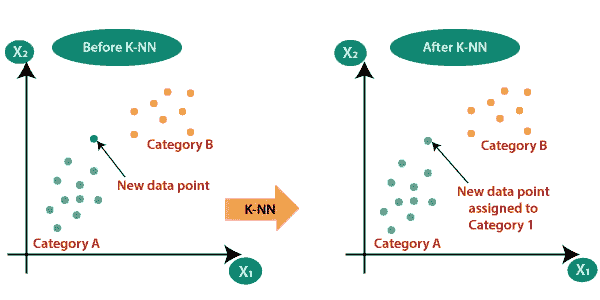

# k 个最近邻居

> 原文：<https://medium.com/analytics-vidhya/k-nearest-neighbors-a5ea981b6bc9?source=collection_archive---------23----------------------->

> KNN 属于**监督学习**算法家族。k 最近邻是一种简单的算法，它存储所有可用的案例，并根据相似性度量对新案例进行分类。分类是通过对其邻居的多数投票来完成的。数据被分配给具有最近邻居的类。随着最近邻数量的增加，k 值的精确度可能会增加。

KNN 是一个非参数的，懒惰的学习算法。当我们说一种技术是非参数的，这意味着它没有对底层数据分布做任何假设。

> 在 KNN 算法中，没有明确的训练阶段，或者训练阶段非常少

让我们看看 K 最近邻算法是如何工作的:

**第一步**:选择我们在算法中将要拥有的邻居的数量 **K** 。在这里， **KNN** 中的‘K 是用于分类或(在连续变量/回归的情况下预测)测试样本的最近邻数。最常见的 K 的默认值是 5。

**第二步**:根据**欧氏距离**，取新数据点的 K 个最近邻。我们还可以使用任何其他测量距离的公式，如曼哈顿距离或切比雪夫和汉明距离。

**欧几里德距离:**欧几里德距离或欧几里德度量是欧几里德空间中两点之间的“普通”直线距离。

欧几里德距离公式

**第三步**:在这 K 个邻居中，统计每一类中的数据点数，即属于一类的数据点与属于另一类的数据点的数量。

当 K 的值很小时，我们就迫使我们的模型盲目地分类并预测结果。小 K 值提供了最灵活的拟合。另一方面，较大的 K 值将增加每个预测中的平均投票者，因此对异常值更有弹性。

**步骤 4** :将新的数据点分配到我们计数最邻近的类别。

在 KNN，模型结构是由数据决定的。KNN 也是一个懒惰的算法，这意味着它不使用训练数据点做任何推广。

# 应用

**非常简单的实施**，因为没有明确的培训阶段，或者培训非常少。 **KNN** 可以胜过更强大的分类器，被用于各种**应用**，如经济预测、数据压缩和遗传学。

K-NN 算法最常见和最广泛使用的一个例子是**推荐系统。**

K 近邻机器学习算法到此为止。敬请关注更多博客。

*谢谢*

KNN 算法在乳腺癌数据集上的实现

> 数据集:[乳腺癌](https://github.com/InternityFoundation/MachineLearning_Navu4/blob/master/Logistic%20Regression/breast_cancer.csv)数据集

链接:[https://github . com/internity foundation/machine learning _ navu 4/blob/master/KNN/KNN . ipyn](https://github.com/InternityFoundation/MachineLearning_Navu4/blob/master/KNN/KNN.ipynb)