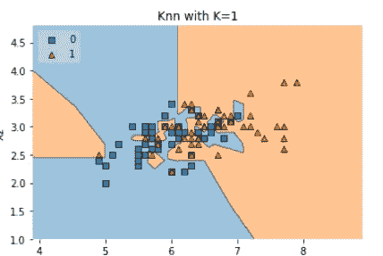
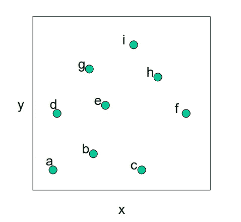

# k-最近邻算法

> 原文：<https://medium.com/analytics-vidhya/k-nearest-neighbors-algorithm-7952234c69a4?source=collection_archive---------1----------------------->

*KNN 是一种非参数的懒惰学习算法。非参数意味着没有对基础数据分布的假设。换句话说，从数据集确定的模型结构。这在实践中非常有用，因为大多数真实世界的数据集并不遵循数学理论假设。*

*KNN 是一种最简单、最传统的非参数样本分类技术。给定一个输入向量，KNN 计算向量之间的近似距离，然后将尚未标记的点分配到其 K-最近邻的类中。*

*懒惰算法意味着它不需要任何训练数据点来生成模型。测试阶段使用的所有训练数据。这使得培训更快，测试阶段更慢，成本更高。昂贵的测试阶段意味着时间和内存。在最坏的情况下，KNN 需要更多的时间来扫描所有的数据点，并且扫描所有的数据点将需要更多的内存来存储训练数据。*

# *用于分类的 K-NN*

*分类是一种监督学习。它指定了数据元素所属的***类，当输出有有限和离散值时最好使用。它还为输入变量预测了一个* ***类*** *。**

**

**考虑给定的评论是肯定的(或否定的)，分类是关于如果我们给一个新的查询点确定(或预测)给定的评论是肯定的(或否定的)。**

**分类就是学习给定点的函数。**

**

****K-NN 算法是如何工作的？****

**在 K-NN 中，K 是最近邻的个数。邻居数量是核心决定因素。如果类的数量是 2，k 通常是奇数。当 K=1 时，该算法称为最近邻算法。这是最简单的情况。假设 P1 是标签需要预测的点。首先，您找到离 P1 最近的一个点，然后将最近点的标签分配给 P1。**

**

**假设 P1 是标签需要预测的点。首先，找到离 P1 最近的 k 个点，然后根据其 k 个邻居的多数投票对这些点进行分类。每个对象为它们的类投票，投票最多的类被作为预测。要查找最近的相似点，您可以使用距离度量来查找点之间的距离，例如欧几里德距离、汉明距离、曼哈顿距离和闵可夫斯基距离。**

****K-NN 有以下基本步骤:****

1.  **计算距离**
2.  **寻找最近的邻居**
3.  **投票给标签**
4.  **取多数票**

****K-NN 的失败案例:****

**1。当查询点远离数据点时。**

**

**2。如果我们有混乱的数据集。**

**

**对于上图显示的杂乱数据集，在上面的数据集中没有任何有用的信息。在这种情况下，算法可能会失败。**

****K-NN 中的距离测度:*** *机器学习中的距离测度主要有以下四种。**

1.  **欧几里德距离**
2.  **曼哈顿距离**
3.  **闵可夫斯基距离**
4.  **海明距离**

> ****欧氏距离****
> 
> **平面或三维空间中两点之间的欧几里德距离测量连接两点的线段的长度。这是表示两点间距离的最明显的方式。欧几里得距离标志着两点间最短的路线。**

**勾股定理可以用来计算两点之间的距离，如下图所示。如果点(x1，y1)(x1，y1)和(x2，y2)(x2，y2)在二维空间中，那么它们之间的欧几里德距离是**

****

****欧氏距离称为一个向量的 L2 范数。****

**范数是指两个向量之间的距离。**

**

****欧几里得距离一个原点的距离由*给出***

**

> ****曼哈顿距离****
> 
> **两个向量(城市街区)之间的曼哈顿距离等于向量之间距离的 1 范数。所涉及的距离函数(也称为“度量”)也称为“出租车”度量。**

**

****两个向量之间的曼哈顿距离称为一个向量的 L1 范数。****

**在 L2 范数中，我们取元素向量之间的差的平方和，在 L1 范数中，我们取元素向量之间的绝对差的和。**

**两点(x1，y1)与(x2，y2)之间的曼哈顿距离为:* ***| x1—x2 |+| y1—y2 |。****

**

****曼哈顿距离*** ***由*** 给出*

**

> ****闵可夫斯基距离****
> 
> **闵可夫斯基距离* *是赋范向量空间中的度量。闵可夫斯基距离用于向量的距离相似性。给定两个或多个向量，求这些向量的距离相似度。**

**闵可夫斯基距离称为向量的 LP 范数。**

**

**p！=0，P 总是大于 0(p > 0)**

# **欧几里得距离与闵可夫斯基距离**

**当* ***p = 2*** *时，闵可夫斯基距离与欧几里得距离相同。**

# **曼哈顿距离闵可夫斯基距离**

**当****p = 1****时，闵可夫斯基距离与曼哈顿距离相同。**

> ****海明距离****
> 
> **汉明距离是比较两个二进制数据串的度量。在比较两个等长的二进制字符串时，汉明距离是两个位不相同的位数。**

**它用于文本预处理，二元向量，布尔向量。**

**考虑 x1，x2 是布尔向量，**

**x1=[0，1，0，1，1，0，1]**

**x2=[1，1，0，0，1，0，0]**

**汉明距离(x1，x2)=#二进制向量不同的位置/维数。**

**上例汉明距离(x1，x2)=3**

**基因编码序列中使用的汉明距离。**

> ****余弦距离和余弦相似度:****

**余弦相似性度量内积空间的两个向量之间的相似性。它通过两个向量之间的夹角余弦来测量，并确定两个向量是否大致指向同一方向。在文本分析中，它经常被用来度量文档的相似性。**

**余弦相似性是有利的，因为即使两个相似的文档相距欧几里德距离很远(由于文档的大小)，它们仍有可能朝向更近。角度越小，余弦相似度越高。**

**余弦相似度和余弦距离的关系可以定义如下。**

1.  ****两个向量之间的距离越大，相似度越小。****

**

****2。当两个向量之间的距离减小时，相似性增加。****

**

> ****余弦相似度和余弦距离:****

**余弦相似性说的是，要找到两点或向量之间的相似性，我们需要找到它们之间的角度。**

**求余弦相似度和距离的公式如下:**

**

****余弦相似度= cosθ****

**余弦距离= 1-****cosθ****

**当余弦相似度(x1，x2)非常相似时余弦相似度(x1，x2)等于 1。如果是非常不相似的余弦相似度(x1，x2)等于-1。**

**

****θ*** *是 x1 和 x2 之间的夹角。**

**余弦距离使用两点之间的角度，而欧几里得距离使用两点之间的几何距离。**

**

**如果 A 和 B 都是单位向量，那么||A|| =||B||=1**

**比相似度，cos(****θ****)= A . B**

****欧氏距离和余弦距离的关系。****

**如果 A 和 B 都是单位向量，那么||A|| =||B||=1**

**【欧氏距离(x1，x2)】的平方= 2(1-cos(****θ****)**

**[欧几里德距离(x1，x2)]的平方=2 余弦距离(x1，x2)**

# **K-NN 算法的性能受三个主要因素的影响:**

1.  *****距离函数*** *或距离度量用于确定最近邻居。***
2.  ******决策规则用于从 K 个最近邻居中导出分类*** *。****
3.  ******邻居数量*** *用于分类新实例。****

# ***K-NN 随 K 变化的决策面:***

***当 K=1 时，判定曲线是锐边和非光滑曲线，分类器不出错。***

****

***当 k=5 决策面曲线光滑，分类器出现小错误时。***

****

***在 K-NN 中，决策曲面的光滑度随着 K 的增加而增加。***

***当 k=n 时，分类器给出每个查询点属于多数类。当 K=n 分类器产生更多错误时。***

*****我们用下图所示的一些玩具数据集玩了 K-NN 决策面。*****

************

> ***通过查看上面的图像，我们观察到随着 k 的增加，决策面将变得更加平滑。***

***要查看 python 中的完整代码和实现，请访问* [***此处***](https://github.com/Sachin-D-N/Data_Science/blob/master/KNN_Decision_surface/knn_with_simple_code.ipynb) *。***

# ***模型的过拟合和欠拟合***

***利用数据训练寻找给定数据的正确函数的过程称为拟合。***

****

**当 k=1 时，模型过度拟合数据，因为我们的模型不会产生任何错误。**

**当 k=n 时，由于我们的模型产生更多的错误，所以模型对数据拟合不足，它认为每个查询点都属于多数类。**

**过拟合和欠拟合之间的平衡很好，它会产生一些错误，因为机器学习不是完美的，犯点小错误是可以的。**

*****但是你可能会想，我们怎么能确定我们的模型是欠拟合还是过拟合呢？*****

***答案是通过标绘法。***

***我们希望我们的模型在交叉验证数据集上具有最大的准确性或最小的误差。***

********

> *****训练错误:*** *当一个训练好的模型再次对数据运行后返回* ***错误*** *时，就会发生训练错误。它开始返回错误的结果。顺便说一下，这里有一个逻辑假设，即您的训练集不会包括属于不同类别的相同训练样本，即冲突信息。然而，一些真实世界的数据集可能具有这种属性。***
> 
> *****交叉验证错误:*** *错误发生在选择最佳 K 时，通过使用交叉验证。***

****

***当* ***训练误差低*** *和* ***验证误差高*** *时，我们面临上图所示的过拟合问题。***

***当* ***训练误差高*******验证误差也高*** *我们面临上图所示的欠拟合问题。****

***我们选择我们的模型，因为一些训练误差和一些验证误差彼此接近，如上图所示最佳拟合。***

# ***如何找到最好的 K？***

***通过交叉验证，我们找到了最优 k。***

***交叉验证就是让函数看到一些数据，让函数看不到一些数据。***

***交叉验证(CV)是用于测试机器学习模型有效性的技术之一，它也是一种用于在数据有限的情况下评估模型的重采样程序。为了执行 CV，我们需要保留一个样本/部分数据，这些数据不用于训练模型，以后我们使用这个样本进行测试/验证。***

**下面是几个常用于 CV 的技巧。**

1.  *****训练 _ 测试拆分方法*** *。***

***在这种方法中，我们将完整的数据随机分为训练集和测试集。然后对训练集执行模型训练，并使用测试集进行验证，理想情况下将数据分成 70:30 或 80:20。如果我们的数据很大，并且我们的测试样本和训练样本具有相同的分布，那么这种方法是可以接受的。***

****

***我们可以使用切片将数据手动拆分为训练集和测试集，或者我们可以使用 sci-kit-learn 方法的****train _ test _ split****来完成此任务。完整的文档是* [*这里的*](https://scikit-learn.org/stable/modules/generated/sklearn.model_selection.train_test_split.html) *。***

****

## *****在这个方法中有一个问题，*****

***使用这种方法，如果我们的数据有限，可能会出现较高的偏差，因为我们会错过一些没有用于训练的数据信息。***

***所以对于有限的数据，还有一种方法叫做* ***K 倍交叉验证。*****

> *****K 倍交叉验证:*****

***K-Fold 很流行，也很容易理解，与其他方法相比，它通常会产生一个偏差较小的模型。因为它确保了原始数据集中的每个观察值都有机会出现在训练集和测试集中。如果我们的输入数据有限，这是最好的方法之一。该方法遵循以下步骤。***

****

***该方法遵循以下步骤。***

1.  ***将整个数据集随机分成 k 个“折叠”***
2.  ***对于数据集中的每个 k 层，在数据集的 k-1 层上构建模型。然后，测试模型以检查第 k 次折叠的有效性***
3.  ***记录你在每个预测上看到的错误***
4.  ***重复此操作，直到每个 k 折叠都作为测试集***
5.  ***你记录的 k 个误差的平均值被称为交叉验证误差，并将作为你的模型的性能指标***

***重复这个过程，直到每个 K-fold 都作为测试集。然后取你记录分数的平均值。这将是该模型的性能指标。***

****

***这将花费更多的时间，但是，在这种方法中，我们使用了数据的每一部分进行训练，并对数据的每一部分进行交叉验证。***

***要查看 python 中交叉验证的完整代码和实现，请访问这里的***。****

# ***用于回归的 K-NN***

***在回归中输出不再是小的有限集类的一部分，输出 Yi 属于实数(或)无限集类。***

****

*****K-NN 回归步骤如下。*****

1.  ***通过交叉验证(或)K 重交叉验证找到给定点的最优-K。***
2.  ***为给定的查询点找到 K-最近邻。***
3.  ***取所有 K 近邻的平均值或中值。***
4.  ***中位数不太容易出现离群值。***
5.  ***对于 K-NN 分类，我们采用 K-最近邻的多数投票，对于 K-NN 回归，我们采用 K-最近邻的均值(或中值)。***
6.  ***K-NN 是从分类到回归的简单扩展。***

# *****加权 K-NN:*****

***加权 K-NN 赋予各点权重的重要性。***

*****加权 K-NN*** *是 K 近邻的修改版。…最简单的方法是采取多数投票，但是如果最近的邻居在距离上变化很大，并且最近的邻居更可靠地指示物体的类别，这可能是一个问题。***

****

***考虑上述图像，假设 5-NN，然后通过距离测量，我们将得到 3 个正点和 2 个负点，通过采取多数投票，我们得出结论，给定的查询点是正的。***

***假设从查询点到 5-NN 的距离与下图相同。***

****

***但这并不能真实地与正点数相比，负点数与查询点数非常接近，所以要考虑 5-NN 个点的权重。***

***点的权重和距离之间的关系由*给出**

****

***当距离增加时，重量减少，距离减少时，重量增加。***

***现在考虑每个点的权重***

****

***让我们考虑正类和负类的权重之和。***

***负类的权重是 10+5 =5***

***正类的权重为 3.33+1.25+0.66= 5.24***

***考虑哪个类是最高权重，该类成为预测类，因此负类从加权 K-NN 成为我们的预测类。***

# ***k-NN 的时间复杂度***

1.  ***我们来看看 k-NN 的时间复杂度。我们在 d 维空间。***
2.  ***为了简单起见，让我们假设我们已经处理了一些输入，我们想知道增加一个数据点的时间复杂度。***
3.  ***在训练的时候，k-NN 只是简单的记住它看到的每个数据点的标签。
    这意味着再增加一个数据点是 O(d)。***
4.  ***测试时，我们需要计算新数据点和我们训练的所有数据点之间的距离。***
5.  **如果 NN 是我们训练过的数据点的数量，那么我们训练的时间复杂度是 O(dn)。对一个测试输入进行分类也是 O(dn)。**

# ***K-NN 的局限性***

1.  ***大型存储要求。***
2.  ***计算密集型召回。***
3.  **K-NN 的时间复杂度和空间复杂度一样多。**
4.  ***K-NN 不适合互联网公司使用的低延迟应用。***

# ***K-D 树***

***由于 K-NN 的空间和时间复杂度较大，为了降低空间和时间复杂度，K-D 树被发明出来。***

***K-D 树(也称为 K 维树)是二叉查找树，其中每个节点中的数据是空间中的 K 维点。简而言之，它是一种空间分区数据结构，用于组织 K 维空间中的点。***

***k-d 树保证 log2 n 深度，其中 n 是集合中的点数。传统上，k-d 树存储 d 维空间中的点，这些点相当于 d 维空间中的向量。***

****

***选择 X 轴，将每个点投影到 X 轴上，然后计算中值，并使用中值分割数据。***

***然后选择 Y 轴并将每个点投影到 Y 轴上，然后计算中值并使用中值分割数据。***

***重复上述步骤，交替变换轴，建立树。***

***K-D 树中的一个非叶节点将空间分成两部分，称为半空间。***

***该空间左边的点由该节点的左子树表示，该空间右边的点由右子树表示。***

****

**如果只有一个点，用那个点形成一片叶子。否则，用一条垂直于其中一个轴的线将这些点分成两半。递归构造两组点的 k-d 树。将垂直于轴的点分割成最宽的分布。**

# ***使用 K-D 树查找最近的邻居***

***递归搜索，查找与查询相同单元格中的点。在返回时，搜索每个子树，在那里可能会找到比你已经知道的点更近的点。***

***保留最接近找到的查询点的变量。一旦子树的边界框表明它们不能包含任何比查询点更近的点，就修剪子树。搜索子树以便最大化修剪的机会。***

****

***为逐步实现构建 K-D 树访问* [***此处***](https://courses.cs.washington.edu/courses/cse373/02au/lectures/lecture22l.pdf) ***。*****

# ***k-D 树的时间复杂度***

**在一个合理的模型中，K-D 树每次搜索的平均时间为 O(log n)。(假设 d 很小)。k-d 树的存储量是 O(n)。假设 d 很小，预处理时间为 O(n log n)。**

# ***k-D 树的局限性***

1.  ***当 d 不小时——时间复杂度急剧增加。***
2.  **K-D 树只适用于数据均匀分布且维数较小的情况。但是大多数真实世界的数据并不是均匀分布的。**
3.  ***K-D 树不是为 K-NN 发明的，它主要是为信息检索和计算机图形学发明的。***

# ***区分位置哈希***

**寻找最近邻的相似点是一种很好的技巧。为此，它使用了哈希的概念。**

***你可能熟悉哈希表是如何构造的。如果没有，请点击此* [*链接*](https://why-android.com/2018/03/26/gentle-introduction-to-hashing/) *快速复习哈希概念。这是一种非常有效的数据结构，允许我们在 O(1)时间内执行操作。***

***LSH 是一种基于哈希的算法，用于识别近似的最近邻居。在正常最近邻问题中，空间中有一堆点(我们称之为训练集),给定一个新点，目标是识别训练集中最接近给定点的点。***

****

***位置敏感哈希是一组技术，可显著加快数据的邻居搜索或近似重复检测。例如，这些技术可以用来以令人印象深刻的速度过滤掉重复的网页，或者从地理空间数据集中对附近的点进行近乎恒定时间的查找。***

***哈希函数通常具有以下关键属性:***

1.  **它们将某种类型的输入(如字符串或浮点数)映射到离散值(如整数)。**
2.  **根据输入的关键属性，它们被设计成两个输入将产生不同或相同的散列输出。**

*****它是如何工作的？*****

***我们对每个可用的数据点应用哈希函数。这给了我们可以放置点的桶或钥匙。***

**我们尝试最大化碰撞，以便相似的点进入同一个桶。**

***现在，如果我们获得一个未标记的查询点并应用哈希函数，那么它将转到存在相似点的同一个桶。***

***这使得查找查询点的最近邻居变得容易。随后，我们可以应用 k-NN 来预测它的类别。***

# ***使用余弦相似度的位置敏感哈希***

***我们试图解决的问题是，给定一个具有预分类数据点的数据集，预测一个新数据点的类别。***

***LSH 是一种概率随机算法。因此，它并不完善，并广泛应用于计算机视觉。***

*****什么是余弦相似度？*** *高层次余弦相似度可以告诉我们两个点有多相似。为此，我们计算两个点的矢量表示，然后找出两个矢量之间的角度。***

****

***向量 a 和 b 之间的相似度可以由它们之间的夹角余弦给出。***

***我们可以使用这个概念来计算数据点的哈希值。***

***现在我们知道了余弦相似性，我们可以用它来计算数据点的 LSH 值。为此，我们使用超平面来划分空间。***

****

***为了简单起见，考虑一个具有 X-Y 轴的二维空间。我们可以使用 3 个平面(或)线π1、π2 和π3 将它分成几个区域。***

***因此，假设数据点“x1”、“x2”、“x3”、“x4”、“x5”将位于这些区域之一。对于每一个平面，我们可以用法向量的概念找到这个点所在的方向。***

***这样我们可以找到每个平面的值。对于每个平面，该值将是+1 或-1。我们可以用这个来计算散列密钥。***

***如果同一个桶中的两个点对于一个超平面来说π比距离可以更近。***

****

***一旦我们有了哈希表，我们就可以用它来确定新数据点的键。然后找到最近的邻居。***

***假设新点落在 key =1 的桶中。那么我们知道它离点很近。接下来，应用 k-NN 找到它的分类。***

***作为我们的距离度量，有些时候可能会错过余弦相似度中的最近邻居。为了解决这个问题，为所有点构建多个散列表，最后在桶中取公共的最近邻居。***

***随着超平面数量的增加，切片的数量增加多于每个切片的点数减少。***

# ***使用欧几里德距离的位置敏感散列法***

***这与我们之前讨论的余弦相似性的位置敏感哈希(LSH)非常相似。我将在这里引用相同的内容，所以如果您在继续之前经历相同的内容会更好。***

**不同之处在于我们计算哈希值的方式。正如我们所看到的，我们可以用平面来划分区域。在每个区域，我们可以有数据点。**

***将平面分成小部分，将每个数据点投影到平面上，对于每个数据点，获取沿每个平面的距离，并使用它来计算哈希值。***

***垂直于平面投影所有点。相似的(或)更近的点应该到达相同的区域(或)桶。***

****

***将整个区域分解成块(或)区域。***

****

**如果两个点彼此靠近，那么它们很有可能映射到相同的区间。反之，如果点距离较远，则不太可能落入同一个桶**

****

***这样我们可以找到每个平面的值。对于每个平面，该值可以是正值，也可以是负值。我们可以用这个来计算散列密钥。***

***一旦我们有了哈希表，我们就可以用它来确定新数据点的键。然后找到最近的邻居。***

***假设新点落在 key =1 的桶中。那么我们知道它离点很近。接下来，应用 k-NN 找到它的分类。***

***有关* ***区分位置哈希*** *的更多信息，请访问* [***此处***](https://cse.iitkgp.ac.in/~animeshm/algoml/lsh.pdf) ***。*****

# ***K-NN 作为概率类标签***

***KNN 是一个非常简单的算法，具有被证明的错误率。***

***考虑 2 类分类 Y****∈{****0，1}为给定点 X.***

****

***假设 7-NN (K=7)，查询点 Xq 属于 4 个假设为 0 的红色点作为负类标签，3 个假设为 1 的蓝色点作为正类标签，那么通过 7-NN 的多数投票，将其归类为 0。***

**如果我们考虑概率方法，它给出了预测的确定性，而不是多数票。**

********

***考虑为负点 P(Yq****∈****0)= 4/7 = 0.57***

***考虑为正的点 P(Yq****∈****1)= 3/7 = 0.42***

**从上面的概率方法，我们得出结论，查询点属于负类的是 57 %，而查询点属于正类的是 42 %。**

# ***K 个最近邻的优劣***

*   ***简单的算法，因此容易解释预测。***
*   ***非参数 so 对底层数据模式不做任何假设。***
*   ***用于分类和回归。***
*   ***与其他机器学习算法相比，最近邻的训练步骤要快得多。***

# **K 个最近邻的缺点**

*   ***KNN 的计算开销很大，因为它在预测阶段搜索新点的最近邻居***
*   ***高内存需求，因为 KNN 必须存储所有数据点***
*   ***预测阶段成本非常高***
*   ***对异常值敏感，准确性受噪声或无关数据影响。***

***这是 K 近邻的小介绍。***

# **参考**

*   **应用人工智能**
*   **Coursera**
*   **数据营**

***感谢您的阅读和耐心。如果我的帖子有错误，请告诉我。如果你发现帖子中有什么错误或者有什么要补充的，让我们在评论中讨论吧...***

**快乐学习！！**