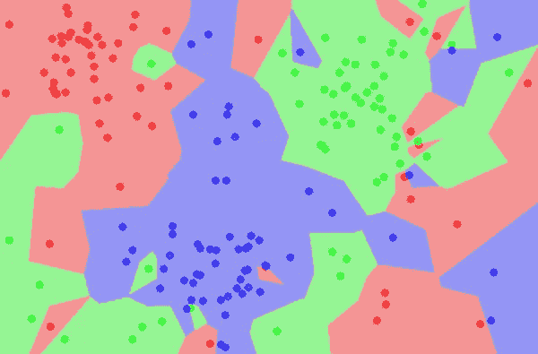
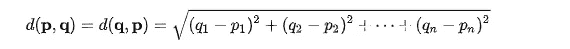
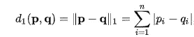
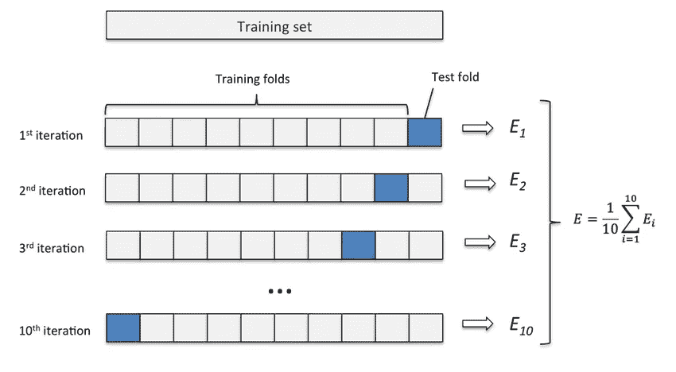
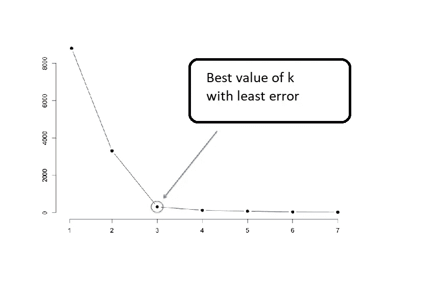

# 适用于初学者的 k-最近邻算法(KNN)

> 原文：<https://medium.com/analytics-vidhya/k-nearest-neighbors-algorithm-knn-for-beginners-d289a28f0d5?source=collection_archive---------13----------------------->

本文的目标读者是对机器学习不熟悉，并且有兴趣学习更多关于 ML 算法的知识的人。因为 K-最近邻是许多其他机器学习算法中最简单的，所以从这里开始是一个相当好的决定:)

KNN 是一种**监督式机器学习算法，易于实现，用于解决既有*分类又有*回归的问题。****

## ***让我们潜得更深！***

***KNN 的基本事实简单如下:***

> ***相似的输入有相似的输出。***

******

***KNN 将相似输入定义为那些**彼此靠近(具有最小距离)**的物体。因为它们彼此接近，所以它们具有相同的类/标签/输出。上面的图片表示了相同的场景，即彼此靠近的对象具有相同的颜色(标签)。***

# *****测距*****

******

***托马斯·哈布尔在 [Unsplash](https://unsplash.com?utm_source=medium&utm_medium=referral) 上拍摄的照片***

***现在问题来了，我们如何找到物体之间的距离？有很多方法可以找到它，你可能对其中一些很熟悉。***

***用于找出任意给定两点 ***p*** 和 ***q*** 之间的距离的通用形式如下，并且也称为 ***【闵可夫斯基距离】*** :***

****

*   ****欧几里德距离(a = 2 )****

**这是最基本和最短的距离查找技术，定义如下:**

****

**它对大的差异高度敏感。因为它对具有较大差异的距离求平方，并对计算产生巨大影响。**

*   ****曼哈顿距离(a = 1 )****

**它也被称为*城市街区、出租车距离、蛇形距离或 L1 范数*，它计算点坐标之间的绝对差之和。**

****

*   ****切比雪夫距离(a =无穷大)****

**对于切比雪夫距离，两点之间的距离是它们沿任意坐标维度的最大差值。**

****

**由此得出的一个重要结论是，随着**‘a’**值的增加，坐标间的最大距离开始变大，小距离特征被忽略。对于切比雪夫，具有最大距离的坐标将被幂至无穷大，并且将主要用于距离计算。**

# ****KNN 算法和复杂性分析****

**KNN 算法遵循以下步骤:**

*   **获取训练样本数据集 D= {(x1，y1)，(x2，y2)，(x3，y3)，…，(xn，yn)}，以及要预测其标签的测试数据样本(x，y)。假设 *x* 为 *m* 维，数据集中的点的总数为 *n.***
*   **为 **k** 选择一个合适的值(将进一步讨论)**
*   **对于给定的测试数据，计算数据集的每个样本点的距离，并将距离和点的标签一起存储在集合中。**

> **ccomplexity:O(Mn)，因为我们遍历所有数据点，并且对于每个点将花费 m 时间(在计算距离时)。**

*   **根据距离度量对集合进行升序排序，并从集合中选取前 K 个值。**

> **使用快速选择算法找到第 k 个最小距离，然后返回不大于第 k 个最小距离的所有距离。O(n)**

*   **从 K 值中选择最常出现的标签，并将其分配给测试数据。这将是我们的输出标签。 *O(k)***

**注意:在回归的情况下，最后一步取标签的平均值(它们可能是一些连续的值)。**

> **时间复杂度:O(mn + n + k) = O(mn)**
> 
> **空间复杂度:O(mn)用于存储 m 维的 n 个数据点。**

# ****如何选择合适的 K 值？****

****

**由 [KOBU 机构](https://unsplash.com/@kobuagency?utm_source=medium&utm_medium=referral)在 [Unsplash](https://unsplash.com?utm_source=medium&utm_medium=referral) 上拍摄的照片**

# ****K=1(非常小的值)****

**假设我们从 1 开始取 k 的值。这通常不是一个好的选择。因为它会使数据 ***对噪声*** 高度敏感，会导致*过拟合，分类器会 ***过于具体而不一般化。*** 通过使用 K=1，将训练集作为测试集输入到 1-NN 分类器，每个点将最接近自己，并将输出自己的标签。因此，在训练数据上，1-NN 将以最大的准确性表现出色，但在测试数据(看不见的数据)上，它不会做出正确的预测。最终，在看不见的数据上，我们的错误率将是最高的，分类器被称为过度拟合。***

# ****K = 100(非常大的值)****

**这会使模型 ***过于泛化*** ，以 ***偏高*** 和 ***欠拟合。*** 测试和训练数据的性能都不好。**

# ****K = n(等于训练数据的大小)****

**在选择 k 的值时，这也不是一个好的选择。因为这种类型的分类器将总是输出我们数据集中最大类的标签。或者我们可以说最大类总是从我们的数据集中胜出！**

****那么该怎么办呢？？****

# ****调整超参数 K****

**使用这种技术，我们应该比较 k 的不同值，并选择误差最小的 k。对于这种方法，对于不同的 k 值，考虑以下步骤:**

1.  **对于 m 倍迭代，运行以下算法。如下图 m = 10，运行这些步骤十次。**

**1.1 使用适当的比率将数据集分为训练数据和验证数据。**

**1.2 在验证数据上测试分类器(test fold)，计算误差并保存。对剩余的折叠迭代重复步骤 1.1。**

**2.用 k 值和所有记录分数的平均值绘制误差图。对下一个 k 值重复步骤 1。**

**选择误差最小的 ***k*** ，如下图所示。**

********

**x 轴显示 k 值，y 轴显示误差**

**误差最小的‘k’就是我们想要的 k 值，随着 k 值的增加，误差率并没有急剧下降。在 k = 3 之后，我们没有发现我们的分类器有任何显著的改进。因此，这将是 k 的最优值。**

**不建议选择 K 的偶数值，因为在从 K 个例子中挑选频繁标签时会产生平局。例如，如果我们选择 ***k=4*** ，并假设有两个示例带有“+”标签，其余两个带有“—”标签。我们将如何获得最频繁的标签？看，这导致了平局！一些专家建议，在这种情况下，建议将 k 值减少 1(使 k 为奇数)，并重新运行实验以获得结果。**

# **优势**

1.  **KNN-是一种**非参数算法。****

*   ***超参数“k”的调整由我们手动完成，它有助于学习或预测过程。与线性回归等其他算法不同，它不需要学习参数，也不需要在学习参数的基础上进行预测。***
*   ***它不对基础分布做任何假设，也不试图估计它。***
*   ***KNN 可用于监督机器学习算法类别下的分类和回归问题。***

***2.K-NN 是一种基于 ***实例的*** 学习算法。***

*   **K-NN 不是执行显式概括，而是通过将新问题实例与训练实例进行比较来形成假设。**
*   **可以轻松适应看不见的数据。**

# **不足之处**

**除了一些优点之外，这种易于实现的算法也有一些缺点。一些定义如下:**

1.  **K-NN 是一种 ***懒学习*** 算法。**

*   **因为 K-NN 不需要对训练数据进行任何显式训练。当对它进行查询时，它开始执行计算。在大数据的情况下，我们的分类器将花费大量的计算时间。**

**2.对于 ***高维问题*** 表现不佳。所以维度的诅咒也在这里。**

**3.这个算法 ***较慢*** 求值，需要存储整个训练数据。因此，也可能是 ***计算量大的*** 。**

# ****参考文献****

*   **[https://www . cs . Cornell . edu/courses/cs 4780/2018 fa/lectures/lecture note 02 _ KNN . html](https://www.cs.cornell.edu/courses/cs4780/2018fa/lectures/lecturenote02_kNN.html)**
*   **[https://en.wikipedia.org/wiki/K-nearest_neighbors_algorithm](https://en.wikipedia.org/wiki/K-nearest_neighbors_algorithm)**
*   **[https://machine learning mastery . com/difference-a-parameter-and-a-hyperparameter/](https://machinelearningmastery.com/difference-between-a-parameter-and-a-hyperparameter/)**

**这都是关于 K-NN 的，如果你发现任何改进或者想提出任何建议，请随时联系我，在 emanijaz583@gmail.com。一个更好的理解和 K-NN 的实际例子将很快上传。希望这篇阅读会有所帮助，谢谢！:)**