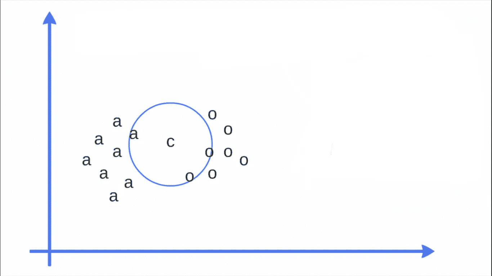
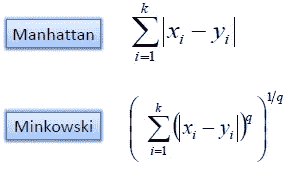
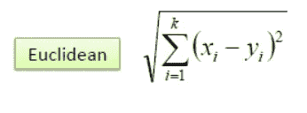
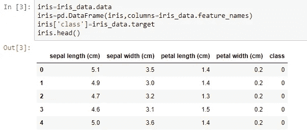
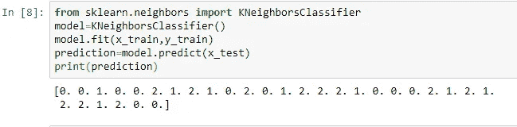
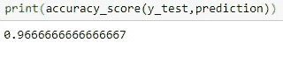

# 基于 Python 的 k 近邻算法(KNN)

> 原文：<https://medium.com/analytics-vidhya/k-nearest-neighbors-algorithm-knn-with-python-e570f6bb8aed?source=collection_archive---------18----------------------->

k 近邻

本文包括六个部分:

1.  什么是 K 近邻(K-NN)？
2.  要在 K 个最近邻中找到“K”？
3.  距离函数
4.  pros K-最近邻
5.  K-最近邻的缺点
6.  k-最近邻用 **Python** ( ***用代码*** )

在这篇文章中，我们将探索并看到著名的**监督机器学习算法的*代码*，**“K-最近邻”。这可用于解决**分类**和**回归**问题。

# 什么是 K-最近邻？

K-最近邻是 a

k-最近邻(kNN)是一种受监督的机器学习算法，可用于解决分类和回归任务。该算法通过计算输入样本和每个训练实例之间的相似性来进行预测。在 K-NN 算法中，输出是一个类成员。直观上，K 总是正整数。K-最近邻算法本质上归结为在 K 个与给定的“看不见的”观察最相似的实例之间形成多数投票。相似性根据两个数据点之间的距离度量来定义。

> 以下两个属性可以很好地定义 KNN

**懒惰学习算法:-** KNN 是一种懒惰学习算法，因为它没有专门的训练阶段，并且在分类时使用所有的数据进行训练。

**非参数学习算法:-** KNN 也是一种非参数学习算法，因为它不对底层数据做任何假设

# 如何找到最佳 k 值

“K”的选择对我们从 KNN 得到的结果有很大的影响。“K”是用于识别新数据点的相似邻居的数字。KNN 算法中的“k”基于特征相似性

选择正确的“K”值是一个称为参数调整的过程，对于提高精度非常重要。求“k”的值并不容易。

# 一些常用的距离函数有

曼哈顿和闵可夫斯基(距离测量)

欧几里得(距离度量)

# KNN 的支持者

1.  KNN 非常容易实现。实现 KNN 只需要两个参数
2.  由于 KNN 算法在进行预测之前不需要训练，**新数据可以无缝添加**，这不会影响算法的准确性。
3.  **无训练期:** KNN 被称为**懒惰学习者(基于实例的学习)**。它在训练期间什么也学不到

# KNN**的缺点**

**1。它不适用于大型数据集**。

**2。**KNN 算法不适用于高维数据，因为在大量维的情况下，算法很难计算每个维的距离。

**3。需要特征缩放:**在将 KNN 算法应用于任何数据集之前，我们需要进行特征缩放(标准化和规范化)。如果我们不这样做，KNN 可能会产生错误的预测。

**4。** KNN 对数据集中的噪声很敏感。我们需要手动估算缺失值并移除异常值。

# 蟒蛇皮 KNN

 [## abhijeetap/K-最近邻算法与 python

### permalink dissolve GitHub 是超过 5000 万开发人员的家园，他们一起工作来托管和审查代码，管理…

github.com](https://github.com/Abhijeetap/K-Nearest_Neighbor_algorithm_with_python/blob/master/k-NN%20%28k-Nearest%20Neighbors%29.ipynb) 

虹膜数据集

虹膜数据目标名称

X=iris.values[:，0:4]
Y=iris.values[:，4]
x_train，x_test，y_train，y_test=train_test_split(X，Y，test_size=0.2，random_state=47)

k-神经网络

输出

感谢您的阅读。如果您有任何反馈，请告诉我。

# 我关于机器学习算法的其他帖子

 [## 用 Python 实现随机森林算法

### 在本文中，我们将探索著名的监督机器学习算法“随机…

medium.com](/analytics-vidhya/random-forest-algorithm-with-python-7ccfbe9bcb47)  [## 什么是支持向量机(SVM)

### 本文包括三个部分:

medium.com](/analytics-vidhya/what-is-the-support-vector-machine-svm-dc89207c011)  [## 用 Python 实现朴素贝叶斯算法

### 本文包括五个部分:

medium.com](/@abhi.pujara97/naïve-bayes-algorithm-with-python-7b3aef57fb59) 

**快乐学习！！！**

**快乐编码:)**

别忘了拍手拍手拍手…

