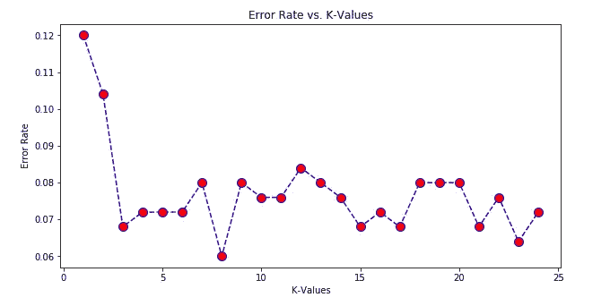

# k 近邻:你需要知道的一切

> 原文：<https://medium.com/analytics-vidhya/k-nearest-neighbors-all-you-need-to-know-1333eb5f0ed0?source=collection_archive---------7----------------------->

我从来不喜欢通过写博客而不是写论文甚至是一本书来炫耀我的知识，但今天早些时候向我的一位同事解释 K-近邻(K-NN)时，我感到有些生疏。因此在这篇文章中，我将解释你需要知道的关于 K-NN 的一切。

> 你是生活在你周围的五个人的平均值。

***目录:***

1.  介绍
2.  它是如何工作的
3.  K-NN 中的这个**‘K**’是什么(在这种情况下也称为超参数调谐)
4.  利用 K-NN 构建电影推荐系统
5.  从这里去哪里


我的邻居做这件事，所以我也在做。

# {1}简介

尽管被认为是最简单的机器学习算法之一(可能是因为我们周围的例子很容易联系起来)，K-NN 已经被证明在解决现实世界的问题时非常有用。

## 何时使用:

是一种有监督的机器学习算法(提供输出标签)**既解决** [**分类**](https://www.cs.princeton.edu/~schapire/talks/picasso-minicourse.pdf) **又解决** [**回归**](https://www.kdnuggets.com/2017/02/regression-analysis-primer.html) **问题**。虽然它被广泛用于分类问题，它在回归问题上也很有效，但是使用量很小。

# {2}它是如何工作的

让我们通过一个简单的例子来理解 K-NN，在这个例子中，我们必须根据到其最近邻居的距离来找到空圆的值(请注意，我在这里已经考虑了度为“2”的闵可夫斯基距离)。因为在红色边界中我们可以看到有一个负值最接近我们的空圆，所以我们将空圆的值指定为负值。很明显，对吧？？


我最亲密的朋友

**注意:** *请注意，在执行 K-NN 时，您不应该考虑 K 的偶数值，因为以 50-50 分割来决定结果可能会产生歧义。*

> 计算距离的不同方法

> [闵可夫斯基距离](https://en.wikipedia.org/wiki/Minkowski_distance)(欧几里德、曼哈顿等)
> 
> [切比雪夫距离](https://en.wikipedia.org/wiki/Chebyshev_distance)
> 
> [余弦相似度](https://en.wikipedia.org/wiki/Cosine_similarity)
> 
> [海明距离](https://en.wikipedia.org/wiki/Hamming_distance)

现在，让我们看看下面的图片，我们需要根据它的邻居找到空圆的值，但我们刚刚遇到了一个选择的困境。


> 内部紫色边界表示数值为负，而外部黄色边界表示数值为正。这就是 K-NN 中 **K** 概念的由来。

# { 3 } K-NN 中的这个**K**是什么

让我们考虑一个实时的例子，找出其中 K 的值。这就是我们的数据集的样子，我们要找到这个问题的 K 值。


现在，有两种流行的方法来计算 K-NN 中 K 的值

> (a)肘部曲线
> 
> (b)网格搜索

让我们看看肘曲线，找出 K 的值



肘形曲线

所以，我们的肘曲线表示 K = 8 的值。

所以，一旦我们知道了 K 的值，问题就解决了。现在，我们需要做的就是预测值，并寻找我们的精度措施。让我们来看看。(你可以在这里找到笔记本)


准确度分数

# {4}基于 K-NN 的电影推荐系统

推荐系统可以大致分为三类:

> > > >**基于内容的系统:**它利用一个项目的一系列离散特征来推荐具有相似属性的附加项目。
> 
> > > >**协同过滤系统:**它根据用户过去的行为(之前购买或选择的项目和/或对这些项目给出的数字评级)以及其他用户做出的类似决定来建立模型。该模型然后被用于预测用户可能感兴趣的项目(或项目的评级)。)
> 
> > > >**混合系统:**它结合了前两种方法。大多数企业更喜欢在他们的产品推荐系统中使用混合方法。

> 步骤 1:导入必要的库

> # Import 必需的库
> Import matplotlib . py plot as PLT
> Import pandas as PD
> Import numpy as NP
> Import seaborn as SNS
> % matplotlib inline
> from ipython . display Import Image
> # utils Import
> from fuzzywuzzy Import fuzz

> 步骤 2:读取数据集

> # read data
> df _ movies = PD . read _ CSV(
> '[http://khansingh.xyz/Datasets/movies.csv'](http://khansingh.xyz/Datasets/movies.csv')，
> usecols=['movieId '，' title']，
> dtype={'movieId': 'int32 '，' title': 'str'})
> 
> df _ ratings = PD . read _ CSV(
> '[http://khansingh.xyz/Datasets/ratings.csv'](http://khansingh.xyz/Datasets/ratings.csv')，
> usecols=['userId '，' movieId '，' rating']，
> dtype={'userId': 'int32 '，' movieId': 'int32 '，' rating': 'float32'})

注:虽然 KNN 没有对基础数据分布做出任何假设，但它依赖于项目特征的相似性。当 KNN 对一部电影做出推断时，它会计算目标电影与其数据库中所有其他电影之间的“距离”，然后对其距离进行排序，并返回前 K 部最近邻电影作为最相似的电影推荐。

> 步骤 3:数据操作

> 从 scipy.sparse 导入 csr_matrix
> # pivot 评级到电影功能
> df _ movie _ features = df _ ratings . pivot(
> index = ' movie id '，
> columns='userId '，
> values='rating'
> )。菲尔纳(0)
> 
> #创建从电影标题到索引的映射器
> movie _ to _ idx = {
> movie:I for I，movie in
> enumerate(list(df _ movies . set _ index(' movie id ')。loc[df_movie_features.index]。标题))
> }
> 
> #将电影特征的数据帧转换为稀疏矩阵
> mat _ movie _ features = CSR _ matrix(df _ movie _ features . values)

现在，看看我们的派生数据集，由于显而易见的原因，它是稀疏的。


稀疏表

让我们增强表格的可视性

> df _ movie _ features _ name = df _ complete . pivot _ table(
> index = ' userId '，
> columns='title '，
> values='rating'
> )。菲尔纳(0)

> 步骤 4:数据可视化

> ax = df_movie_cnt \
> 。sort_values('movie_cnt '，ascending=False) \
> 。reset_index(drop=True) \
> 。plot(
> figsize=(12，8)，
> title= '所有电影的评分频率'，
> font size = 12
> )
> ax . set _ xlabel("电影 Id")
> ax.set_ylabel("评分数")

现在，让我们看看这个图表


了解我们的数据集

正如我们从数据中看到的，绝大多数人对评价电影不感兴趣，所以我们可以只考虑前 40%的数据。

> #过滤数据
> ratings _ thres = 50
> active _ users = list(set(df _ users _ CNT . query(' movie _ CNT>=[@ ratings _ thres](http://twitter.com/ratings_thres)')。index))
> df _ ratings _ drop _ users = df _ ratings _ drop _ movies[df _ ratings _ drop _ movies . userid . isin(active _ users)]
> print('原始收视率数据形状: '，df_ratings.shape)
> print('去掉冷门电影和非活跃用户后的收视率数据形状: '，df_ratings_drop_users.shape)

> 步骤 5:现在，创建模型最关键的部分之一，选择合适的距离度量来计算 K 的值

请注意，我们需要处理一个非常高维的数据集，但高维对 KNN 来说并不好。
此外，欧几里德距离在高维度中是无用的，因为所有向量与搜索查询向量(目标电影的特征)几乎等距。相反，我们将使用余弦相似度进行最近邻搜索。

余弦相似性是有利的，因为即使两个相似的向量或文档相距欧几里德距离很远(由于文档的大小)，它们仍有可能朝向更近。
角度越小，余弦相似度越高。

当绘制在多维空间上时，其中每个维度对应于特征向量中的一个特征，余弦相似性捕获特征的方向(角度)而不是幅度。如果你想知道大小，计算欧几里得距离。

还有另一种流行的方法来处理
高维数据中的最近邻搜索，即位置敏感散列法。

> 从 sklearn.neighbors 导入 nearest neighbors
> model _ KNN = nearest neighbors(metric = ' cosine '，algorithm='brute '，n_neighbors=20，n_jobs=-1)

拟合模型:

> 模型 _ KNN . fit(mat _ 电影 _ 特征)

**让我们让预测变得可读**

```
def fuzzy_matching(mapper, fav_movie, verbose=True):
 “””
 return the closest match via fuzzy ratio. If no match found, return None

 Parameters
 — — — — — 
 mapper: dict, map movie title name to index of the movie in datafav_movie: str, name of user input movie

 verbose: bool, print log if TrueReturn
 — — — 
 index of the closest match
 “””
 match_tuple = []
 # get match
 for title, idx in mapper.items():
 ratio = fuzz.ratio(title.lower(), fav_movie.lower())
 if ratio >= 60:
 match_tuple.append((title, idx, ratio))
 # sort
 match_tuple = sorted(match_tuple, key=lambda x: x[2])[::-1]
 if not match_tuple:
 print(‘Oops! No match is found’)
 return
 if verbose:
 print(‘Found possible matches in our database: {0}\n’.format([x[0] for x in match_tuple]))
 return match_tuple[0][1]def make_recommendation(model_knn, data, mapper, fav_movie, n_recommendations):
 “””
 return top n similar movie recommendations based on user’s input movieParameters
 — — — — — 
 model_knn: sklearn model, knn modeldata: movie-user matrixmapper: dict, map movie title name to index of the movie in datafav_movie: str, name of user input movien_recommendations: int, top n recommendationsReturn
 — — — 
 list of top n similar movie recommendations
 “””
 # fit
 model_knn.fit(data)
 # get input movie index
 print(‘You have input movie:’, fav_movie)
 idx = fuzzy_matching(mapper, fav_movie, verbose=True)
 # inference
 print(‘Recommendation system start to make inference’)
 print(‘……\n’)
 distances, indices = model_knn.kneighbors(data[idx], n_neighbors=n_recommendations+1)
 # get list of raw idx of recommendations
 raw_recommends = \
 sorted(list(zip(indices.squeeze().tolist(), distances.squeeze().tolist())), key=lambda x: x[1])[:0:-1]
 # get reverse mapper
 reverse_mapper = {v: k for k, v in mapper.items()}
 # print recommendations
 print(‘Recommendations for {}:’.format(fav_movie))
 for i, (idx, dist) in enumerate(raw_recommends):
 print(‘{0}: {1}, with distance of {2}’.format(i+1, reverse_mapper[idx], dist))
```

> 第六步:我们来预测一下电影:

> 我最喜欢的=《低俗小说(1994)》
> 
> make _ recommendation(
> model _ KNN = model _ KNN，
> data=mat_movie_features，
> fav_movie=my_favorite，
> mapper=movie_to_idx，
> n_recommendations=10)


该建议

虽然我们已经成功推荐了这部电影(此处的笔记本链接是，但同时我们也发现基于项目的协同过滤有两个缺点:

> 1.人气偏向:推荐者倾向于推荐人气商品
> 
> 2.项目冷启动问题:推荐器无法推荐新的或不太知名的项目，因为项目要么没有交互，要么很少交互。想象一部没有评级或评级很低的新电影

# {5}下一步该怎么走

对现行制度的改进

这个电影推荐器可以使用“矩阵分解”来进一步改进

在现实世界中，绝大多数电影很少或者根本没有得到用户的评价。我们正在查看一个极其稀疏的矩阵
，其中 99%以上的条目都是缺失值。有了这样的稀疏矩阵，有哪些 ML 算法可以训练出来，可靠的做出推断？因此，必须解决数据稀缺问题，以建立更好的模型，矩阵分解是解决方案。

这将在我的下一篇文章中讨论。

参考资料:

> *斯普林格的《统计学习导论》*
> 
> 麻省理工学院机器学习开放课件
> 
> 爱丁堡大学的入门应用*机器学习* (IAML)课程
> 
> 分析 Vidhya，Medium，KDnuggets