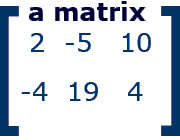
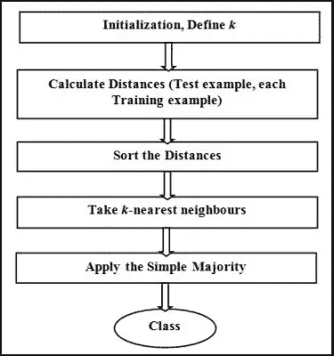
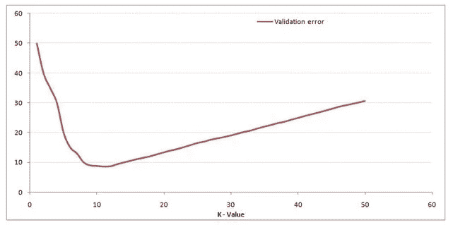
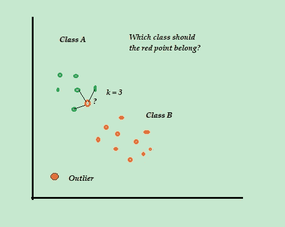
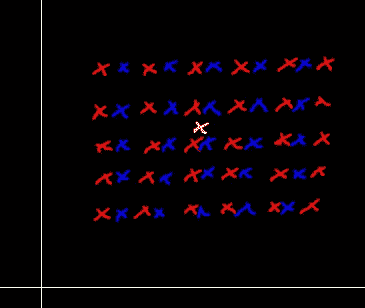

# 机器学习中的 k 近邻分类技术。

> 原文：<https://medium.com/analytics-vidhya/k-nearest-neighbors-classification-technique-in-machine-learning-2b8d22b99979?source=collection_archive---------18----------------------->

这篇博客重点介绍了 K-NN 算法的概况，如何选择 K 值，K-NN 算法的特点，失败案例，偏差-方差权衡，异常值的影响和利弊。

# 机器学习中的分类是什么

比方说，你生活在一个封闭的住房社会，你的社会有不同类型的废物分开垃圾箱:一个用于废纸，一个用于塑料垃圾，等等。你在这里做的基本上是将垃圾分类。因此，分类是给一个特定的项目分配一个“类别标签”的过程。在上面的例子中，我们给不同类型的垃圾贴上了“纸”、“金属”、“塑料”等标签。

废物的分类。

# 机器学习中的分类算法

现在我们知道了分类的确切含义，我们将学习机器学习中的分类算法:

*   k-最近邻(KNN)
*   逻辑回归
*   线性回归

在这篇博客中，我们将只关注 K-NN。我们将只涵盖对该算法的总体理解。

## **矩阵符号**

矩阵是一种按列和行组织数据的方式。矩阵写在括号[ ]内。

下图中的矩阵有两行和三列。

*   其**尺寸**为 2 ×3
*   2 行 3 列
*   下面矩阵的[条目](https://www.mathwarehouse.com/algebra/matrix/#entry)是 2，-5，10，-4，19，4。
*   这里每行代表一个数据点。
*   所有列代表数据集的要素。

## KNN 算法及其直觉

**第一步**—**—**在 KNN 的第一步中，我们必须加载训练和测试数据。

**步骤 2**—接下来，我们需要选择 K 的值，即最近的数据点。k 可以是任何整数。

**步骤 3**—对于测试数据中的每个点，执行以下操作

*   **3.1**—借助任何方法计算测试数据和每行训练数据之间的距离，即:欧几里德距离、曼哈顿距离或汉明距离。计算距离最常用的方法是欧氏距离。
*   **3.2**—现在，根据距离值，将它们按升序排序。
*   **3.3**—接下来，它将从排序后的数组中选择前 K 行。
*   **3.4**—现在，它将根据这些行中最常见的类别为测试点分配一个类别。

**寻找 K-NN 中 K 的最佳值**

*   我们使用验证数据的误差图或准确度图来**找到**最有利的 **K** 值。
*   从图中，我们取误差最小的 K 值，在这种情况下，K 值约为。9(来自下图)。

验证数据的 K-误差图。

## KNN 的特色

*   k 最近邻算法被广泛用于测试更复杂的算法，如深度网络、SVM、CNN。
*   KNN 是懒惰学习者的典型例子。它被称为*懒*不是因为它表面上的简单，而是因为它不从训练数据中学习任何函数，而是记忆训练数据集。(在现实中，KNN 没有任何决定边界，这只是为了我们的理解目的。)
*   我们可以使用 KNN 进行回归和分类。
*   这是一种非参数方法，这意味着它不假设任何先验数据分布。
*   当数据具有偶数个类时，我们通常选择 K 为奇数，当数据具有奇数个类时，我们通常选择 K 为偶数。
*   对于较小维度的数据，我们通常使用欧几里德距离。

## KNN 的失败案例

图二。随机传播的数据

*   如图 1 所示。如果我们的查询点离最近的邻居非常远，那么它会将查询点分类到错误的类中。
*   如果数据是杂乱的或随机分布的，那么我们会得到错误的查询点输出。

## **如果我们有不平衡的数据对 KNN 的影响**

它受到类别不平衡问题的影响，即它试图将每个查询点归类为主要类别。但是我们可以使用过采样和欠采样等技术来平衡数据。

## 过度拟合和欠拟合(偏差-方差权衡)

k 值小可能导致**过拟合**，k 值大可能导致**欠拟合**。

*   **过拟合**表示模型在训练数据上表现良好，但在新数据到来时表现不佳。
*   **欠拟合**指的是对训练数据不好的模型，也不能推广到预测新数据。

偏差-方差权衡

## 优势

*   无培训期，易于实施
*   新的数据可以随时添加，它不会影响模型，因为没有训练期。
*   很好地处理多类问题

## **缺点**

*   对噪音和缺失数据敏感
*   必须进行特征缩放。
*   无法获取特征重要性。

参考资料:

谷歌图片

这是我第一篇关于媒体的文章，如果你觉得这篇文章对你有帮助，请不吝留下你的评论。感谢阅读。