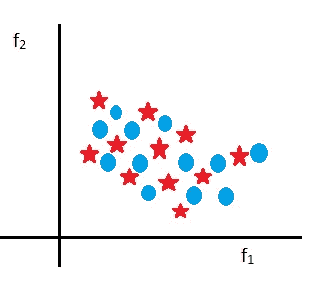
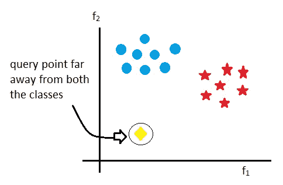
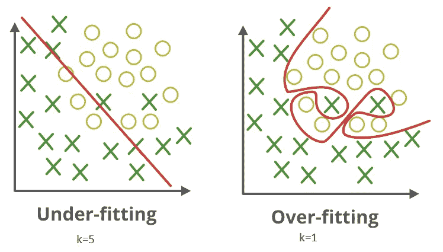
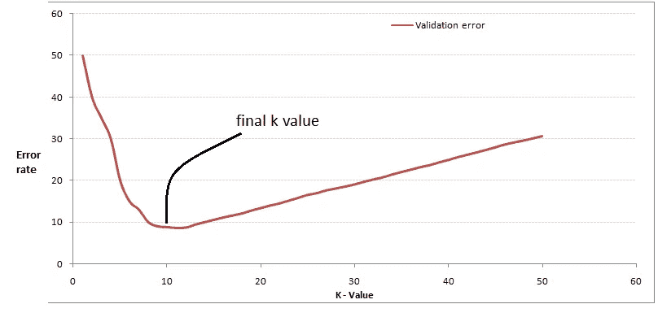
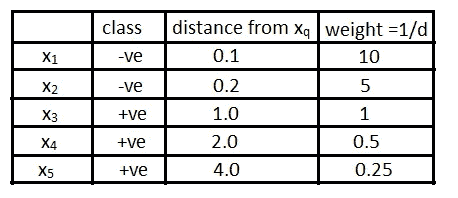

# 假人的 k-最近邻

> 原文：<https://medium.com/analytics-vidhya/k-nearest-neighbors-for-dummies-eaaa0f80a62?source=collection_archive---------12----------------------->

> 你是和你相处时间最长的五个人的平均值

来源:谷歌图片

先说 K 近邻(简写为 kNN)的核心思想。

给定一个查询点 xₜ，我们将在给定的数据集中找到该点的 k 个最近邻，并通过对 k 个最近邻的类进行多数投票来预测 yₜ类。同样的事情也适用于回归，但不是多数投票，而是取 k 个最近邻的平均值或中值。

*kNN 失败案例:*

情况 1:正负类随机分布时

来源:我的电脑

情况 2:当查询点 xₜ远离任一类时。在这种情况下，我们无法确定 xₜ属于哪个阶级。

来源:我的电脑

> 如何判断一个点是否离两个类都很远？门槛应该是多少？

嗯，决定阈值是数据特定的，但一个可接受的决定方式是-

*   为训练数据中的每个点找到第一个最近邻距离。
*   对所有距离进行排序
*   找到，比方说 90ᵗʰ或 95ᵗʰ百分位值(p’)(或根据要求的任何其他百分位值)。
*   现在，如果查询点 xₜ的第一最近邻大于 p’，那么我们可以说 xₜ离每个类都很远。

> 我们如何找出给定点的邻居？

这和在现实生活中寻找邻居是一样的。住在你家附近的人是你的邻居。类似地，靠近给定点的数据点将是它的邻居。这种接近度由数据点之间的距离来定义。机器学习中使用了很多距离度量。你可以在[https://towards data science . com/how-to-measure-distance-in-machine-learning-13 a396 aa 34 ce](https://towardsdatascience.com/how-to-measure-distances-in-machine-learning-13a396aa34ce)上了解到它们。通常，在 kNN 中使用欧几里德距离。

## kNN 简单实现的时间和空间复杂度

*   给定具有 n 个数据点和 d 维的训练数据集 X。

对于查询点 xₜ，我们必须找到与训练数据中每个点的距离。

对于 1 距离计算，我们必须执行 d 运算(d =数据的维数)

∴对于 n 次距离计算，我们将不得不执行 n*d 次运算或 O(n*d)次

然后我们必须根据所有的距离选择最近的 k 点。通常，与数据集的大小相比，k 非常小。大多数情况下，k =3，5，11，15 左右，因此需要 O(n)时间

然后，我们必须决定使用多数表决，这将需要常数或 O(1)时间。

KNN 的∴时间复杂度将为:O(n*d) + O(n) + O(1) = **O(n*d)**

当我们说我们已经训练了一个 kNN 模型时，这仅仅意味着我们已经将训练数据加载到 RAM 中。在训练阶段不执行任何操作，因此 kNN 的空间复杂度将是: **O(n*d)**

## k 变化时 kNN 的决策面

来源:GeeksForGeeks

随着 k 的增加，曲线的平滑度增加。

> 如果 k=n(数据点数)会怎样？

在这种情况下，不会有任何决策表面，整个数据集都将被考虑在内。给定一个查询点，其类别由训练数据中的多数类别决定。这将是一个非常不适合的情况。

**过度拟合**基本上是指我们找到了一个非常好的函数，它甚至考虑到了每一分钟的细节，包括有噪声的异常值。该模型在训练数据上几乎不会给出错误，但是在遇到看不见的数据时会失败。**当 kNN 中的 k 很小时发生**。

**欠拟合**基本上是指我们找到了一个与数据松散拟合的函数，或者换句话说，是一种不完美的描述数据的方式。它会在训练和看不见的数据上产生错误。**发生在 kNN 中 k 大的时候**。

## 找到 k 的正确值

我们已经看到了 k 的值是如何影响我们的模型的。但是我们应该如何确定 k 的值呢？

在实践中，它是通过交叉验证来完成的，这可能是我下一篇文章的主题，但简而言之，我们将数据集分成三部分:训练数据、CV(交叉验证)数据和测试数据。我们在训练数据上训练我们的模型，对于不同的 k 值，在 CV 数据上计算精确度。给出最大精度(或最小误差)的 k 被选为最终 k 值。之后，我们测试我们的模型，取测试数据的最终 k 值。

来源:Vidhya 分析

## 加权 kNN

有时我们希望给予离查询点较近的点比较远的点更大的权重。因此，我们给查询点的 k 个最近邻居中的每一个赋予权重。

分配权重的一种方法是使用反距离函数。让我们用一个例子来理解这一点:

来源:我的电脑

现在我们计算每一类的权重。

重量(-ve 等级)= 10+5=15

重量(+ve 类)= 1+0.5+0.25 = 1.75

因为，权重(-ve 类) >权重(+ve 类)，∴我们将查询点分配给负类。

好了，暂时就这些了。

来源:谷歌图片