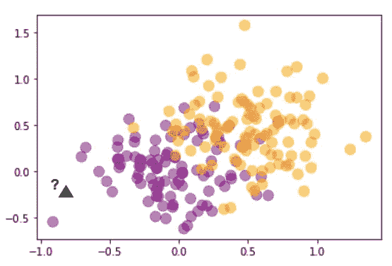
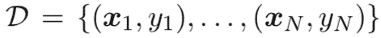
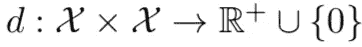
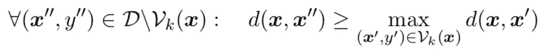
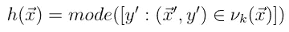
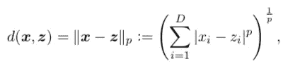
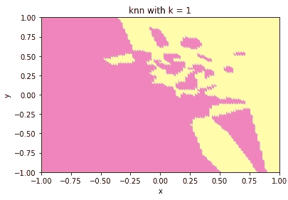
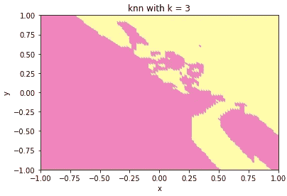
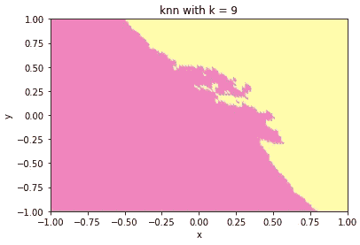
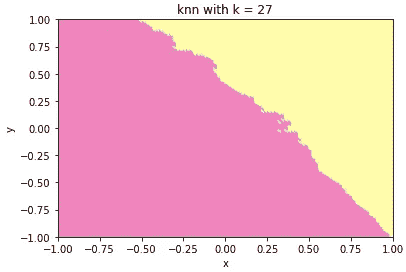

# 理论视角下的 k 近邻

> 原文：<https://medium.com/analytics-vidhya/k-nearest-neighbors-from-a-theoretical-perspective-5d0da1ded4e0?source=collection_archive---------20----------------------->


李·杰夫斯在 [Unsplash](https://unsplash.com?utm_source=medium&utm_medium=referral) 上的照片

## k-NN 背后的思想

*k* 最近邻( *k* -NN)是最古老的监督机器学习算法之一。它是由盖和哈特在 1967 年创建的。

为了理解 *k* -NN 是如何工作的，我们先来分析下图。



鲁本斯·巴博萨制图

我们注意到一个数据集，其中的点分散在图上，我们有两个类别:紫色和橙色。我们又观察到一个新的点，一个小三角形。出现问题是:这个新的点是紫色还是橙色？

你可能认为新点的类别是紫色的。现在想想你是怎么做到的！你怎么知道它是紫色的？你用了什么衍生规则吗？你用概率了吗？你用线性代数了吗？不要！

你可能会看到这些点的接近程度。小三角形离紫色点比离橙色点更近。然后，您决定根据紫色点的接近程度将其归类为紫色。这和 *k* -NN 算法背后的思路是一样的！

## **邻里**

在 *k* -NN 中，邻域*Vk(****x****)*定义为数据集 *D* 中输入值最接近 ***x*** 的 *k* 有序对



根据距离函数 *d* 给出了接近度的概念



形式上，邻域*Vk(****x****)*定义为 *D* 的子集，基数 *k* ，满足:



上式表示，对于不属于 ***x*** 邻域的所有训练点，如果我们计算它们到 ***x*** 的距离，这样的距离不会小于 ***x.*** 的任何一个邻域的最大距离

更简单的说，如果一个点不属于 ***x*** 的邻域，那么它不可能比它的邻域更接近 ***x*** 。

## 预言

您可以使用 *k-* NN 进行分类以及回归，但是在本文中，我们将只使用它进行分类。在这种情况下，对任何新输入 ***x*** 的预测由*Vk(****x****)*中最常见的标签给出，如下所示:



mode 函数返回最常见的情况。有些人把这种分类规则称为多数表决。上面的等式说明了 *k-* NN 算法的预测，其中 h( ***x*** )被称为假设函数。

## k-NN 算法

给定数据集 *D = {(x1，y1)，。。。，(xN，yN)}* ，任何向量 ***x*** 的标号都可以通过以下步骤用 *k* -NN 来估计:

1.  计算距离*d:= d(****x****，****x****I)*对于 *i = 1，…，N*；要每分 ***x***
2.  从 *d* 中找出 k 个最小元素的索引及其标签；
3.  return*h(****x****)= mode(y1，…，yk)。*

## 距离

到目前为止，我们一直使用符号 *d* 来表示距离。最常见的选择包括闵可夫斯基距离的特殊情况:



*   对于 p = 1，它叫做曼哈顿距离；
*   对于 p = 2，它被称为欧几里德距离；
*   对于 *p* → ∞返回向量分量之间的最大差值。如果你想证明，你可以做到。

***一个提示*** :当 *p* → ∞时，可以用极限三明治定理证明上面的结果。🙂

## 对你的挑战

文件[https://www.dropbox.com/s/vzsg86s39z1cncx/data-qs1-1.csv?dl=0](https://www.dropbox.com/s/vzsg86s39z1cncx/data-qs1-1.csv?dl=0) 有一个二元分类问题的训练样本，X**= R**Y = { 0，1}。*数据是以**的形式出现的。包含三列的 csv** 文件:*

*1.**列 1** :数值属性 1(***x1***)；*

*2.**第 2 列**:数值属性 2(***x2***)；*

*3.**第 3 列** : class (y)。*

*考虑到 *k* -NN 分类器，对于 *k* = 1，3，9，27，在区间【1，1】*中画出决策边界。对于问题中的 ***k*** 值的影响，你的结论是什么？**

**推荐你用 python 编程语言。 ***拜托:*** 不要用 sklearn 的 *k* -NN 的库。创建自己的 *k* -NN 算法，使用欧氏距离。**

## **给你更多建议**

**当您完成自己的 *k* -NN 分类器算法时，您的图形应该如下图所示。😊**

## **k = 1 时[-1，1]之间的判定边界**

```
**k = 1
hypothesis = knn(k)
plot_decision_boundary(k, hypothesis)**
```

****

## **k = 3 时[-1，1]之间的判定边界**

```
**k = 3
hypothesis = knn(k)
plot_decision_boundary(k, hypothesis)**
```

****

## **k = 9 时[-1，1]之间的判定边界**

```
**k = 9
hypothesis = knn(k)
plot_decision_boundary(k, hypothesis)**
```

****

## **k = 27 时[-1，1]之间的判定边界**

```
**k = 27
hypothesis = knn(k)
plot_decision_boundary(k, hypothesis)**
```

****

## **结论**

**在本文中，我们看到了如何使用人工数据集实现 k -NN 分类器算法。我们还看到结果很有趣，当我们增加(1，3，9，27 奇数)中的 *k* 值时，决策边界变得更加可分。决策边界保持更加平滑，k 等于 27，因为它几乎可以被一条直线分割。**

**你可能想知道的一些问题是:我如何选择 k 的大小？为什么 k 等于 1 不是一个好的选择？为什么 k 等于我的数据集的大小不是一个好的选择？我的数据集的大小对我选择 *k* 有影响吗？思考这些问题，找到答案。另外，我希望你搜索一下关于 *k* -NN 的利弊。**

**很神奇吧？我希望你喜欢阅读这篇文章。谢谢大家！**