# 机器学习中的 k-最近邻

> 原文：<https://medium.com/analytics-vidhya/k-nearest-neighbors-in-machine-learning-k-nn-e84a70b79b3c?source=collection_archive---------18----------------------->

**K 近邻**是机器学习中最基本的分类算法之一。

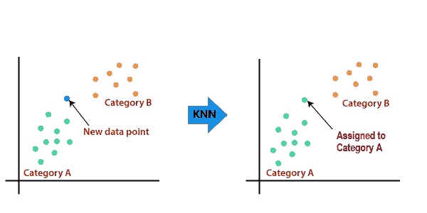

代码和数据集链接:[Github-StuffByYC](https://github.com/YadsmiC/Machine-Learning/tree/master/Classification)|[ka ggle-StuffByYC](https://www.kaggle.com/stuffbyyc/sales-data)

代码和数据集也可在[stuffbyyc.com](https://www.yadsmic.com)的下载部分获得

在这个博客中，我们将了解 K-最近邻算法是如何工作的。如何用 Python 实现？

**KNN 算法**使用“特征相似度”根据距离预测新数据点的值。

要查看基于距离的模型中使用的距离类型，请转到: [*机器学习算法中使用的距离类型*](https://www.yadsmic.com/post/type-of-distances-used-in-machine-learning-algorithm)

# 理解 K-最近邻

## **什么是 K？**

k 是邻居的数量，这将帮助我们决定新数据点的类别。

## **算法步骤:**

**第一步:选择“K”的值，即。将用于预测结果类的邻居数量。**

《出埃及记》假设我们选择 k 的值为 5。

有 2 类[“猫”、“狗”]。我们必须预测新数据点属于“猫”类还是“狗”类。

**第二步:计算新数据点到剩余数据点的距离，取 k 个距离最近的相邻数据点。您可以选择要使用的距离公式。** [*机器学习算法中使用的距离类型*](https://www.yadsmic.com/post/type-of-distances-used-in-machine-learning-algorithm)

《出埃及记》假设距离新数据点**“N(x，y)”**最近的 5 个数据点是 **A** 、 **B** 、 **C** 、 **D** 、 **E** ，我们用欧氏距离法计算。

**第三步:得到“K”个最近的数据点后，统计该数据点的类别(即统计这 K 个邻居中有多少属于哪个类别)。**

《出埃及记》数据点的类别有

A -“猫”，B -“狗”，C -“猫”，D -“狗”，E -“狗”

现在数数类别。**“猫”- 2 和“狗”- 3**

**步骤 4:将新数据点“N”分配给具有最大类别计数的类别**

《出埃及记》这里类别或类“狗”有最大数量的类别计数。最近的数据点的 **5** 中的 **3** 属于“狗”类

所以新的数据点“ **N** ”将被分配给类“ **Dog**

如果你理解这个有任何困难，请在评论中告诉我。

# 实现 K-最近邻

下面我们将使用 Sklearn 库实现 KNN 算法。

**任务是预测客户是否会购买产品**

代码和数据集链接:[Github-StuffByYC](https://github.com/StuffByYC/Machine-Learning/tree/master/Classification)|[ka ggle-StuffByYC](https://www.kaggle.com/stuffbyyc/sales-data)

该网站的下载部分也提供了代码和数据集

## 你需要安装 Sklearn 库

打开命令提示符

```
**pip install scikit-learn**
```

## 步骤 1:我们将导入库

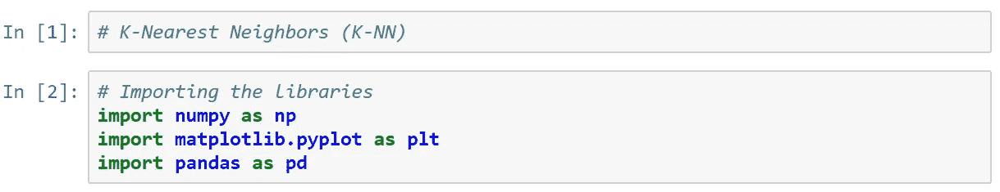

## 第 2 步:导入数据(您可以在上面的 Github 链接中找到 Sales.csv 文件)

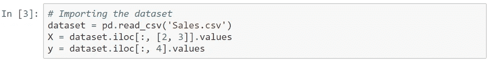

## 步骤 3:将数据分为训练数据和测试数据

这里 Test_size = 0.25。这意味着分配给测试的数据超出数据集的 25%

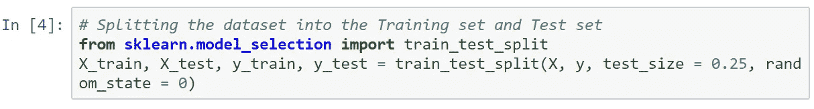

## 步骤 4:特征缩放

**什么是特征缩放？**

正如我们在上面学到的，我们使用距离来预测一个特定的类。现在，在这个特定的数据集中，我们的工资值从千到十万不等，年龄值在 100 以内。

因为薪资从 0 到 15 万+范围很广。其中 as 的年龄范围为 0-60，计算的距离将由薪金列控制，这将导致错误的模型，因此我们需要特征缩放

**特征缩放**是一种将固定范围内的数据中存在的独立特征(数据列)标准化/规范化的技术。

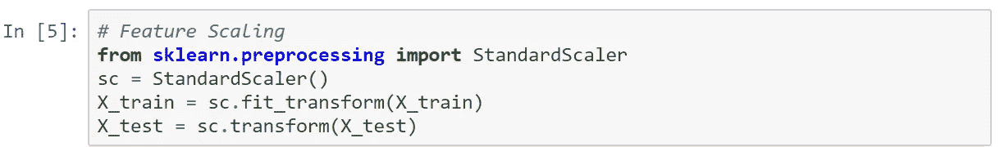

下面是来自的数据转换示例

**X(数据)——>X(训练 _ 测试 _ 分割后)——>X(特征缩放后)**

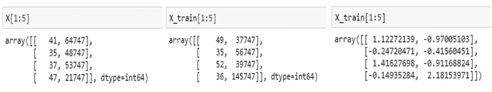

## 步骤 5:拟合模型

这里我们将使用欧几里德距离，因此我们设置 p = 2

[点击:距离类型了解更多](https://www.stuffbyyc.com/post/type-of-distances-used-in-machine-learning-algorithm)。

k 值设置为 5

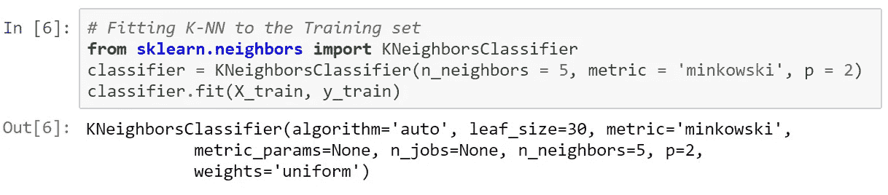

## 步骤 6:使用分类器/模型预测测试结果

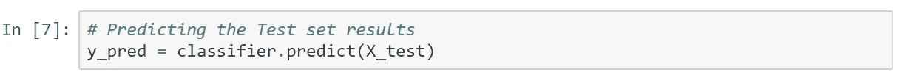

## 步骤 7:计算评估模型的性能指标

[点击绩效指标了解更多信息](https://www.yadsmic.com/post/classification-and-its-performance-metrics-in-machine-learning)

[***混乱矩阵***](https://www.stuffbyyc.com/post/classification-and-its-performance-metrics-in-machine-learning)

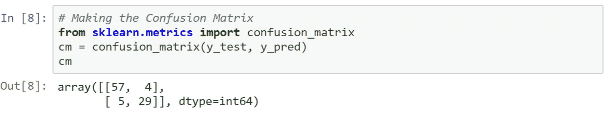

**真阳性(TP):** 结果数据为阳性，预测为阳性。

**假阴性(FN):** 结果数据为阳性，但预测为阴性。

**假阳性(FP):** 结果数据为阴性，但预测为阳性。

**真阴性(TN):** 结果数据为阴性，预计为阴性。

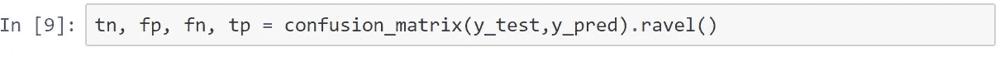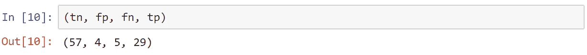

[***【召回-85.29%】***](https://www.yadsmic.com/post/classification-and-its-performance-metrics-in-machine-learning)

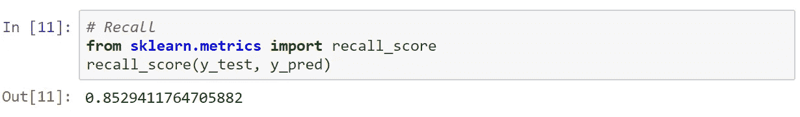

[***准确率- 90.53%***](https://www.yadsmic.com/post/classification-and-its-performance-metrics-in-machine-learning)

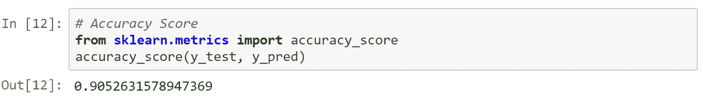

[](https://www.yadsmic.com/post/classification-and-its-performance-metrics-in-machine-learning)*精度- 87.88%*

*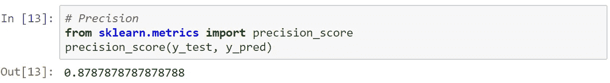*

*[***F1 得分***](https://www.yadsmic.com/post/classification-and-its-performance-metrics-in-machine-learning)*

*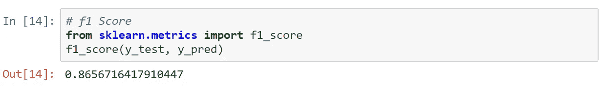*

*在 **scikit-learn** 库的帮助下，我已经在 python 中成功实现了**K-最近邻**。查看[K-最近邻**的优缺点**和](https://www.yadsmic.com/post/k-nearest-neighbors-advantages-and-disadvantages)*

**原载于 2020 年 3 月 18 日 https://www.stuffbyyc.com*[](https://www.yadsmic.com/post/k-nearest-neighbors-in-machine-learning)**。***