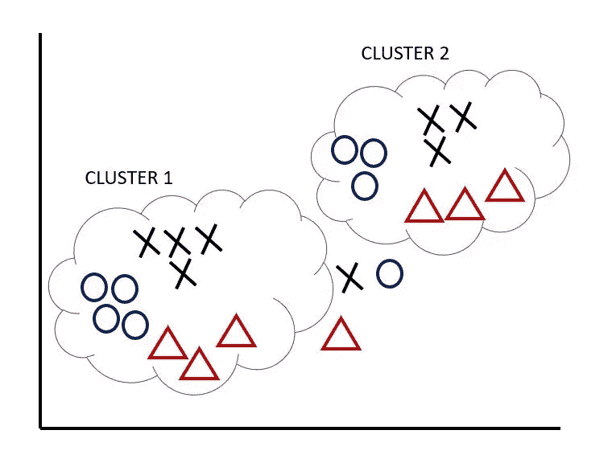
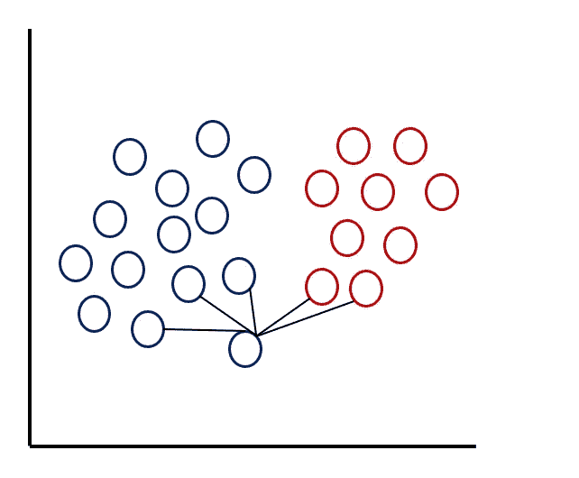

# 具有 numpy 的 K 个最近邻(K-NN)

> 原文：<https://medium.com/analytics-vidhya/k-nearest-neighbors-k-nn-with-numpy-6c52cbe28093?source=collection_archive---------5----------------------->

> ML 算法的群集返回 K-NN 作为最简单的算法

K-NN 可以说是用于分类和回归的最简单的机器学习算法。构建模型包括仅存储训练数据集，从而减少训练时间。这里我们将了解如何使用 KNN 进行分类。我们将在 kaggle 的[西雅图降雨数据集上使用 numpy 实现 KNN。是有真假标签的二元分类。](https://www.kaggle.com/rtatman/did-it-rain-in-seattle-19482017)


图一。下雨了吗？

**第一步:导入库**

```
import pandas as pd
import numpy as np
from collections import Counter
from sklearn.model_selection import train_test_split
from sklearn.metrics import classification_report, accuracy_score
```

**第二步:读取数据并预处理**


图二。照片由[弗兰基·查马基](https://unsplash.com/@franki?utm_source=medium&utm_medium=referral)在 [Unsplash](https://unsplash.com?utm_source=medium&utm_medium=referral) 上拍摄

```
#Read the csv in the form of a dataframe
df= pd.read_csv("data.csv")
df.head()
```


图 3。浏览一下数据

```
#Removing the null values
df.dropna(axis=0, inplace=True)
#Reset the index to avoid error
df.reset_index(drop=True, inplace=True)
y = df['RAIN'].replace([False,True],[0,1])
#Removing Date feature and Rain because it is our label
df.drop(['RAIN','DATE'],axis=1,inplace=True) 
```


图 4。预处理后的训练数据

```
#Splitting the data to train(75%) and test(25%)
x_train,x_test,y_train,y_test=train_test_split(df,y,test_size=0.25)
```

**步骤 3:实现欧几里德距离以找到最近的邻居**



图 5。将数据分类成两个群

让我们试着理解图 5。首先，我们在两个聚类中有三个特征，类似于我们的西雅图降雨量数据。让我们假设聚类 1 在不下雨时是数据点，聚类 2 在下雨时是数据点。前两个集群可以被认为是我们的训练数据。两个聚类之外的三个数据点是我们必须找到标签的测试数据。

现在，我们将使用**欧几里德距离**来计算训练数据和测试数据之间的距离。我们也可以使用不同的方法来计算距离，如**曼哈顿距离、闵可夫斯基距离**等。

**欧氏距离:-** 用于求两点间的直线距离。


x 和 y 之间的欧几里德距离

由于 KNN 是非参数的，即它不对输入的概率分布做任何假设，我们从训练数据中找到测试数据点的距离，并且考虑接近测试数据的数据点来分类我们的测试数据。让我们借助一张图片来看看这一点


图 6。计算训练数据和测试数据之间的欧几里德距离

我们看到，在图像中，每个特征有 5 个数据点，2 个分类在一个聚类中，2 个分类在另一个聚类中，1 个尚未标记。一旦我们计算出这些数据点之间的欧几里德距离，我们就可以对这些数据点所在的聚类进行分类。

KNN 中的 K 表示我们必须考虑的计数，假设 K 为 5，在这种情况下，它将考虑前 5 个最短距离，在此之后，具有更多频率的类将被视为测试数据的类。



图 7。k 为 5 时的最近邻居

为了理解 K 的目的，我们只取了一个自变量，如图 7 所示，具有 2 个标签，即二进制分类，并且在计算距离之后，我们标记了 5 个最近的邻居，因为 K 被赋予值 5。现在我们可以看到，蓝色标签的频率(蓝色为 3，红色为 2)高于红色标签的频率，我们将测试数据点标记为蓝色。找出 K 的值是 K-NN 中的一项任务，因为它可能需要通过尝试不同的值并基于这些值评估模型来进行多次迭代。

```
def KNN(x,y,k):
    dist = [] 
    #Computing Euclidean distance
    dist_ind = np.sqrt(np.sum((x-y)**2, axis=1)) 
    #Concatinating the label with the distance
    main_arr = np.column_stack((train_label,dist_ind))
    #Sorting the distance in ascending order
    main = main_arr[main_arr[:,1].argsort()] 
    #Calculating the frequency of the labels based on value of K
    count = Counter(main[0:k,0])
    keys, vals = list(count.keys()), list(count.values())
    if len(vals)>1:
        if vals[0]>vals[1]:
            return int(keys[0])
        else:
            return int(keys[1])
    else:
        return int(keys[0])
```

**第四步:计算准确度和分类报告**

```
print(classification_report(pred,train_label))
```


图 8。带有训练数据的分类报告

```
print(classification_report(pred,test_label))
```


图 9。测试数据分类报告

我们在训练数据上取得了 96%的准确率，在测试数据上取得了 94%的准确率，不错！

# 何时应用欧氏距离的 KNN


图 10。由[朱尼尔·费雷拉](https://unsplash.com/@juniorferreir_?utm_source=medium&utm_medium=referral)在 [Unsplash](https://unsplash.com?utm_source=medium&utm_medium=referral) 上拍摄的照片

一个很常见的问题，什么时候应用哪种算法？

答案并不简单，但它取决于我们手头的数据和任务，至于欧氏距离的 KNN，当我们拥有连续数据类型的结构化数据时，我们可以希望获得更好的结果。这也是一个假设，我们可以通过模型的多种实现来证明。

**使用的参考资料:-**

[](https://brilliant.org/wiki/k-nearest-neighbors/) [## k-最近邻|精彩的数学和科学维基

### k-最近邻(或简称为 k-NN)是一种简单的机器学习算法，它通过使用输入的 k…

brilliant.org](https://brilliant.org/wiki/k-nearest-neighbors/)  [## 1.6.最近邻-sci kit-了解 0.23.2 文档

### 为无监督和有监督的基于邻居的学习方法提供功能。无监督的最近邻居…

scikit-learn.org](https://scikit-learn.org/stable/modules/neighbors.html#classification) 

**Github 上提供的代码:-**

[](https://github.com/Akshit2409/KNN/blob/main/KNNWithNumpy.ipynb) [## 阿克什特 2409/KNN

### permalink dissolve GitHub 是超过 5000 万开发人员的家园，他们一起工作来托管和审查代码，管理…

github.com](https://github.com/Akshit2409/KNN/blob/main/KNNWithNumpy.ipynb)