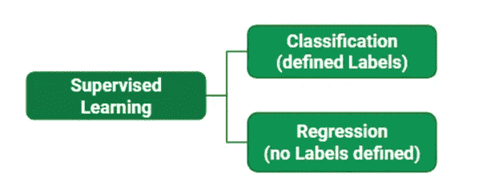
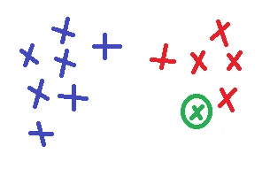
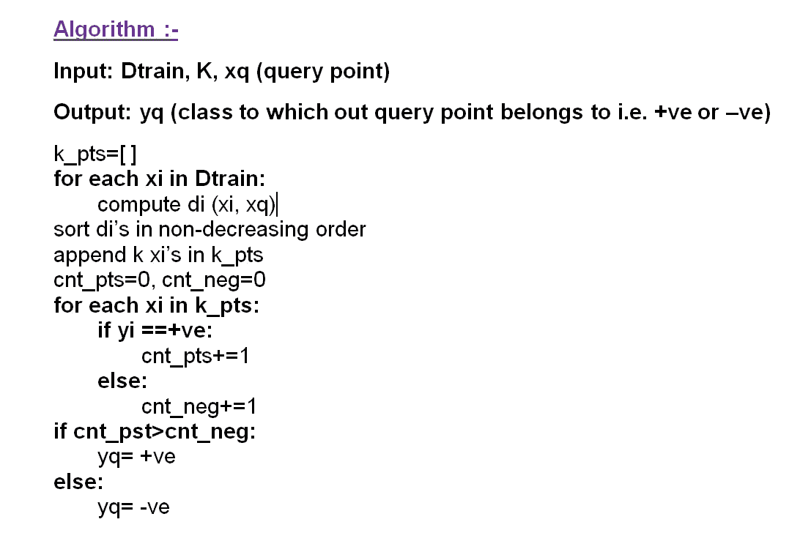
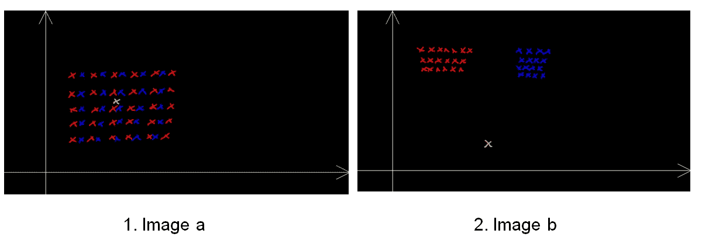

# k-最近邻

> 原文：<https://medium.com/analytics-vidhya/k-nearest-neighbours-c51aa06d36bd?source=collection_archive---------23----------------------->

> k-最近邻是一种机器学习算法，属于监督学习，可用于分类和回归预测问题。所以在这篇文章中，我们将从监督学习中解开其中一个算法。

让我们一步一步地理解这一切，最终，我们将能够把所有的点连接起来。在首先了解 K-NN 之前，我们先了解一下什么是监督学习。

**监督学习**是指你有输入变量(X)和输出变量(Y){也就是说，我们已经标记了数据集}并且你使用一种算法来学习从输入到输出的映射函数。 **F(X) = Y**

**监督学习进一步分为两个子类别:-**

**1。分类:** —在这类问题中，我们将离散值作为问题的输出。假设给定一个正面和负面评论的数据集，一个新的评论出现了，我们必须预测它是正面评论(1)还是负面评论(0)。在这个问题中，我们的输出将是 1 或 0(这是 2 类分类)，这类问题属于分类。

**2。回归:——**在这类问题中，我们将真实值作为问题的输出。假设给定一个学生的身高(X)和体重(Y)的数据集，如果一个新生有给定的身高，那么我们可以预测他的体重，这可能是一个真实值，比如 53.4 公斤，这种问题属于回归问题。这里我们有两种变量，一种是因变量，一种是自变量。在这个例子中，我们可以说身高是自变量，体重是因变量。

**现在，再回到 K-NN:** K-NN 假设相似种类的事物存在于很近的距离(相似的数据点彼此很近)。K-NN 算法依赖于这一假设为真，以使算法工作良好。

让我们看一个例子，它实际上是如何工作的。
假设给我们一个数据集，其中包含两种类型的点，即负点(红色点)和正点(蓝色点)

**任务:给定一个查询点(绿色的那一个),判断它是属于正类还是负类。**

**执行算法的主要步骤是-** **第一步**:计算距离。
**第二步**:获取最近邻居。
**第三步**:基于多数进行预测。

K-NN 所做的是，根据距离(我们将在后面讨论如何测量距离)获取查询点的 K 个最近邻居，然后获取邻居的多数票，无论哪个具有最高多数，我们的新查询点都只属于该类。

对于上面的例子，考虑 k=3 (3 个最近邻)，假设 x1、x2 和 x3 是我们的查询点的 3-NN，我们发现我们的点的类别标签是:-

**x1= -ve，x2 = -ve，x3 = +ve**
majority = -ve 类所以我们的 xq(绿点)将属于–ve 复习类。

现在我们假设， **x1 = +ve，x2 = -ve，x3 = +ve**
Majority = +ve 类所以在这种情况下，我们的 xq 将属于+ve 复习类。

**注意:
我们不能取 k 的偶数值，因为我们可能遇到+ve 和–ve 类邻居数量相等的任何情况，因此在这种情况下，我们的分类器将无法决定它应该将查询点分配给哪个类。这就是为什么为了避免这种混乱，我们总是把我们的 k 作为一个奇数值。**

KNN 算法

> KNN 就像我爱我的邻居，只有当他们靠近我的时候。

# **K-NN 失败案例**

**在上图中，我们可以看到 K-NN 的失败案例。
图 a:** 在这里我们可以看到我们的数据集是混乱的(查询点是一个黄色十字)，所以如果我们应用 K-NN，我们不确定它是否会给出正确的预测。

**图像 b:** 在这种情况下，查询点距离数据集非常远，我们也不确定预测是否正确，因为它是一个异常值，所以它可以属于任何一个类，这就是为什么我们不能说我们的基于距离的方法在这种情况下会工作得很好。

> 有趣的事实: K-NN 也被认为是懒惰的学习者。

> 希望你们都明白什么是 KNN 以及它是如何工作的！！！