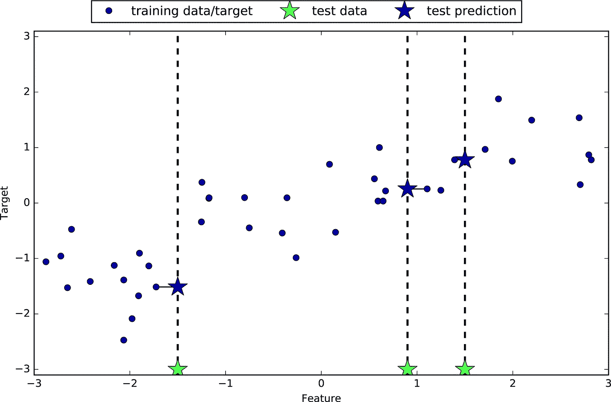
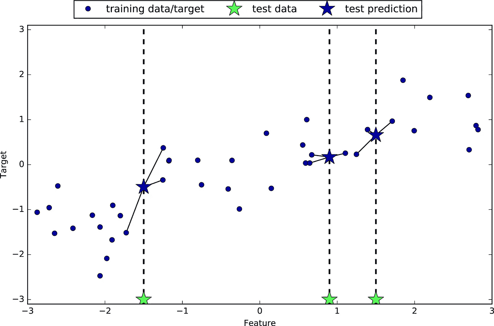
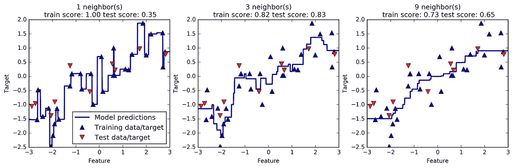

# Python 中的 k 近邻回归分析

> 原文：<https://medium.com/analytics-vidhya/k-neighbors-regression-analysis-in-python-61532d56d8e4?source=collection_archive---------1----------------------->

k 最近邻是一种简单的算法，它存储所有可用的案例，并基于相似性度量(例如，距离函数)来预测数字目标。KNN 作为一种非参数技术，早在 20 世纪 70 年代就已经被用于统计估计和模式识别。**算法**KNN 回归的一个简单实现是计算 K 个最近邻的数值目标的平均值。另一种方法使用 K 个最近邻居的反距离加权平均值。KNN 回归使用与 KNN 分类相同的距离函数。


以上三种距离度量只对连续变量有效。在分类变量的情况下，您必须使用汉明距离，这是一种对相同长度的两个字符串中相应符号不同的实例数量的度量。

使用单个邻居的预测只是最近邻居的目标值。

让我们开始动手操作，在本文中我使用来自 mglearn 的数据集，第一步如果您的笔记本中没有包，请在 cmd/anaconda 提示符下安装..

```
pip install mglearn
```

之后，您可以绘制 n_neighbors = 1 的 k-neighbors 回归。

```
import mglearn 
import matplotlib.pyplot as pltmglearn.plots.plot_knn_regression(n_neighbors=1)
```



图一。通过最近邻回归对波浪数据集进行预测

同样，这种 k-neighbors 回归只使用 1 n_neighbors，可以使用多个单个最近邻进行回归，并且预测的是相关邻的平均值或均值。让我们看看…

```
mglearn.plots.plot_knn_regression(n_neighbors=3)
```



图二。通过对波浪数据集的三最近邻回归进行预测

现在我们可以使用 knn 回归对测试数据进行预测，n_neightbors = 3

```
from sklearn.neighbors import KNeighborsRegressor
X, y = mglearn.datasets.make_wave(n_samples=40)# split the wave dataset into a training and a test set
X_train, X_test, y_train, y_test = train_test_split(X, y, random_state=0)# instantiate the model and set the number of neighbors to consider to 3
reg = KNeighborsRegressor(n_neighbors=3)# fit the model using the training data and training targets
reg.fit(X_train, y_train)
```

如果你已经完成了以上工作，你就可以在测试数据上使用你的模型了

```
print(reg.score(reg.score(X_test, y_test)))
```

输出:0.83

**分析近邻回归量**

我们可以分析精度如何受到 n_neighbors 的影响:我们可以使用不同的 n_neighbors 值，并解释模型的 n_neighbors 值。

```
fig, axes = plt.subplots(1, 3, figsize=(15, 4))
# create 1,000 data points, evenly spaced between -3 and 3
line = np.linspace(-3, 3, 1000).reshape(-1, 1)
for n_neighbors, ax in zip([1, 3, 9], axes):
    # make predictions using 1, 3, or 9 neighbors
    reg = KNeighborsRegressor(n_neighbors=n_neighbors)
    reg.fit(X_train, y_train)
    ax.plot(line, reg.predict(line))
    ax.plot(X_train, y_train, '^', c=mglearn.cm2(0),   
             markersize=8)
    ax.plot(X_test, y_test, 'v', c=mglearn.cm2(1), markersize=8)
    ax.set_title("{} neighbor(s)\n train score: {:.2f} test  
              score: {:.2f}".format(n_neighbors,    
              reg.score(X_train, y_train),reg.score(X_test, 
              y_test)))
    ax.set_xlabel("Feature")
    ax.set_ylabel("Target")
axes[0].legend(["Model predictions", "Training data/target","Test   
    data/target"], loc="best")
```



正如我们从图中看到的，仅使用单个邻居，训练集中的每个点对预测都有明显的影响，并且预测值贯穿所有数据点。这导致了非常不稳定的预测。考虑更多的邻居导致更平滑的预测，但是这些也不符合训练数据。

参考:安德烈亚斯·C·穆勒和萨拉·圭多。2017.pyhton 机器学习简介