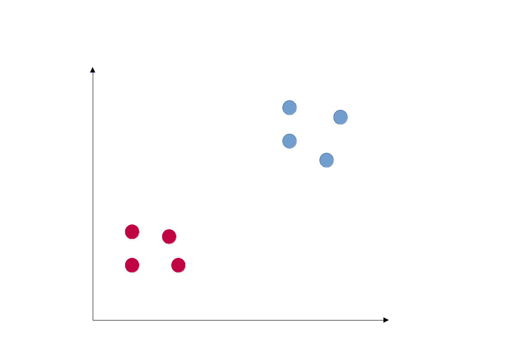
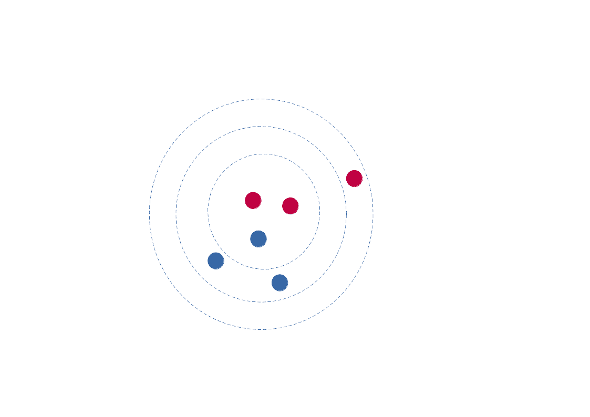
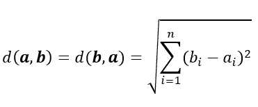
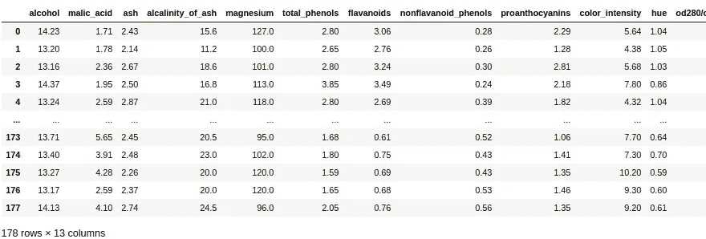
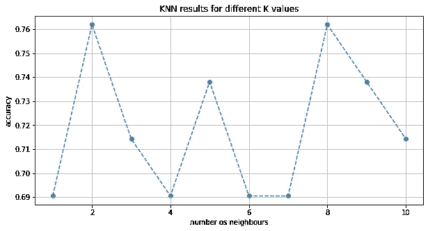

# K-NN 从零开始

> 原文：<https://medium.com/analytics-vidhya/k-nn-from-scratch-212dcff13eb3?source=collection_archive---------8----------------------->


比尔·尼诺在 [Unsplash](https://unsplash.com?utm_source=medium&utm_medium=referral) 上的照片

k 近邻算法是分类问题中最常用的算法之一。从零开始实现它是一个很好的编程练习，可以给我们很多关于数据处理、学习优化和一般统计学习的见解，这是我在这篇文章中试图完成的，希望它将引导我们进入讨论 PCA 分析的第二部分。

# 它是如何工作的

如果你熟悉像 [scikit-learn](https://scikit-learn.org/stable/index.html) 这样的库，你就会知道实现一个机器学习算法有多容易。但是在分类或回归算法背后发生了很多事情，理解这些算法的工作方式对于建立一个真正有效的模型是至关重要的。此外，从头开始实现 ML 算法是真正了解人工智能是什么的最有效的方法。好吧，我们开始吧。

你可以在快速的谷歌搜索中找到许多关于该算法的详细解释，但在这里我将专注于一种更直观的方法，并讨论一些结果。因此，假设您有一个包含许多要素和相应标签的数据集，以及一些您希望根据可用标签进行分类的未知数据



具有红色和蓝色两个类别的点组。基于空间属性(空间坐标)，新点的分类是什么？

上图说明了这个问题。我们的数据的特征是它们在平面(x，y)中的坐标，标签是颜色。如果我们在空间中引入一个新点，顾名思义 K 近邻会尝试根据该点的近邻之间的距离对这个新点进行分类。名称中的 K 代表分类所基于的相邻要素的数量。下面的 gif 展示了分类过程。最近的邻居将根据他们自己的类别为分类“投票”。所以，如果我们有 k = 3，两个红色最近邻和一个蓝色近邻，我们得到 2 票支持红色，一票支持蓝色，所以新点将被分类为红色，以此类推。你应该注意到，如果我们对 K 使用一个偶数，我们可以得到一个平局，这应该在算法开发中考虑。



该算法的步骤是:

1.  根据已知数据计算新实例之间的距离。
2.  统计 K 个最近邻的类。
3.  根据上一步中获得的大多数类对实例进行分类。

我们在步骤 1 中使用欧几里德距离:



两点间的欧几里得距离

让我们一步一步地看代码。我们主要使用 NumPy 函数来完成这项工作。同样，作为一个例子，我们将继续使用[葡萄酒数据集](http://archive.ics.uci.edu/ml/datasets/Wine/)来应用我们的算法。

```
import numpy as np
import pandas as pd
import matplotlib.pyplot as plt
```

为了运行我们的算法，我们以[葡萄酒数据集](https://archive.ics.uci.edu/ml/datasets/wine)为例。我们可以通过 scikit 学习数据集库轻松阅读它。

```
dataset = load_wine()X = pd.DataFrame(data['data'], columns = data['feature_names'])y = pd.DataFrame(data['target'],columns=['target'])
```

X 数据框如下所示:



具有数据特征的 x 数据框

所以我们在空间中有 13 个坐标的点，这很难(实际上不可能)可视化，但我们仍然可以用欧几里德距离来表示 n 维的真实空间。我们生成一个名为“scaled”的新数据帧，数据经过适当标准化:

```
scaled = (X - X.mean())/X.std()
```

Y 数据帧保存每个 X 行点的类。这些值是 0、1 或 2，它们代表一种酒。因此，假设我们得到一个新的数据点，有 13 个可用的特征，但我们不知道酒的种类(0、1 或 2)。KNN 来救援了！

# **算法**

该算法的代码相当简单，但是我将一步一步地对它进行评论。首先，我们定义一个函数来计算从我们的数据到查询点的距离:

```
def euclidean(X, query):
    return np.sqrt(np.sum((X - query)) ** 2)
```

KNN 的函数是这样的:

```
def knn(query, k, X, Y): E = np.apply_along_axis(euclidean,1, X, query)
    ids = np.argsort(E)[:k]

    classes = np.unique(Y)
    count = np.zeros(len(classes))

    i=0
    for c in classes:
        count[i] = np.sum(c == Y[ids])
        i += 1    
    max_prob_class = classes[np.argmax(count)]
    return [max_prob_class]
```

我们使用“apply_along_axis”函数计算查询中每个点的距离，并将 k 个最近邻居的位置存储在“ids”变量中。然后，我们用零初始化“计数”向量，以计数最近邻的类别。最后一个 for 循环负责使用 Y 向量计算并存储给我们的值。投票过程完成并存储在“max_prob_classes”中:

```
max_prob_class = classes[np.argmax(count)]
```

因此，如果我们有 3 个类，我们的“计数”变量初始化如下:

```
count = [0 0 0]
```

我们的“类”变量是这样的:

```
classes = [1 2 3]
```

该循环将使用存储在“ids”变量中的 k 个最近邻在 Y 向量中的位置来检查它们的类的数量:

```
count[i] = np.sum(c == Y[ids])
```

所以在循环运行之后，计数向量看起来会像这样:

```
count = [5 0 1]
```

这意味着它有 5 个属于类 1 的邻居、0 个属于类 2 的邻居和 1 个属于类 3 的邻居。所以查询点会被归类为 1。“np.argmax”函数获取“count”变量中最大值的索引，当我们将它传递给类时，它会将正确的类返回给我们。我们将它存储在“max_prob_class”变量中，意思是“成为这个类的最大概率”。

# 测试(原始数据/标准化数据)

让我们用新算法做一些数据科学。我们需要像往常一样将数据分为训练和测试。

```
msk = np.random.rand(len(X)) < 0.5
X_train = X[msk]
Y_train = Y[msk]
X_test = X[~msk]
Y_test = Y[~msk]
```

现在，我们可以对不同的 k 值进行一些试验，并确定您的算法的准确性。在上面的循环中，我们计算不同 k 值(1 到 10)的精度:

```
R = []for k in range(1,11):
    r = []
    accuracy = 0
    for i in range(len(X_test)):
        r.append( knn(X_test.values[i], k, X_train, Y_train))
        if r[i] == Y_test[i]:
            accuracy +=1R.append([k, accuracy/len(X_test)])
```

然后我们绘制结果图:



不同 K 个相邻要素的精度值

我们得到了 0.69–0.76 的精度范围…实际上对于第一次运行来说还不错！

下面是进行绘图的代码:

```
plt.figure(figsize=(10,5))
plt.scatter(np.asarray(R)[:,0], np.asarray(R)[:,1])
plt.plot(np.asarray(R)[:,0], np.asarray(R)[:,1], '--')
plt.title('KNN results for different K values')
plt.ylabel('accuracy')
plt.xlabel('number os neighbours')
plt.grid(True)
plt.show()
```

# 后续步骤

您可以使用该算法，并在其他数据集中测试它，看看它的表现如何。在下一篇文章中，我将展示如何通过一些数据预处理技术来改进我们的结果！再见！