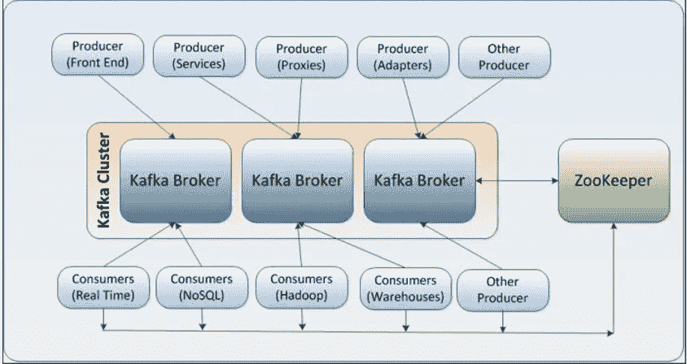

# 卡夫卡——你想知道的一切

> 原文：<https://medium.com/analytics-vidhya/kafka-all-you-want-to-know-b9624e496006?source=collection_archive---------16----------------------->


> **历史**

Apache Kafka 最初由 LinkedIn 开发，随后于 2011 年初开源。2014 年 11 月，几名在 LinkedIn 从事 Kafka 工作的工程师创建了一家名为 Confluent 的新公司，专注于 Kafka。杰伊·克雷普斯似乎以作家弗朗茨·卡夫卡的名字给它命名，因为它是“一个为写作而优化的系统”，而且他喜欢卡夫卡的作品。

# **什么和为什么**

在当今世界，社交媒体、在线购物或任何其他类型的各种应用程序导致数据呈指数级增长。大多数时候，产生信息的应用程序和使用信息的应用程序相距甚远，彼此无法访问。我们需要一种无缝的机制，能够可靠而快速地将这些信息传递给多个接收者。

Kafka 是一种解决方案，它在生产者和消费者的信息之间提供无缝集成，而不会阻止信息的生产者，也不会让生产者知道谁是最终消费者。



## **术语:**

在讨论卡夫卡时，我们会用到各种各样的术语。它们是:

*   消息:它就像我们关系数据库中的一条记录。甚至认为它是一个字符串
*   **主题:**属于特定类别的消息流称为主题。数据存储在主题中。
*   **代理:**集群中的每个服务器都被视为一个代理。这是我们储存数据的地方。
*   **生产者:**产生消息的人。
*   **消费者:**消费来自代理的批量消息的人。
*   **分区:**主题分分区。分区允许跨多个代理拆分数据。它允许多个消费者并行阅读一个主题。
*   **复制:**跨代理拥有同一个分区的多个副本以实现数据高可用性的过程。
*   **领导者:**即使我们有多个副本，一个分区也只有一个领导者。他负责发送和接收该分区的数据。
*   **跟随者:**除了首领以外的所有其他复制品。他们将与领导者保持同步。
*   **Offset:** 分区中每个消息的唯一 ID，类似于数组索引。
*   **消费者群体:**一群消费者平行阅读一个卡夫卡主题，以提高消费速度。

## 保留:

Retention 是一种配置，它告诉 kafka 它可以将特定的消息保留多长时间。卡夫卡抛弃基于时间或大小的旧信息。

> **时间**

默认值为 168 小时(7 天)。有多种配置可用于以毫秒、小时或分钟为单位更改该值。它们是:

```
*log.retention.ms  
log.retention.hours
log.retention.minutes*
```

*如果指定了多个，较小的单元尺寸优先*

> **大小**

另一种使消息过期的方法是基于保留的消息的总字节数。默认值为 1 GB

```
log.retention.bytes
```

我们在卡夫卡中经常使用的基本命令是:

## **1。启动 Kafka 服务器**

```
kafka/bin/kafka-server-start.sh kafka/config/server.properties &
```

## **2。创建主题**

卡夫卡创造的主题是:

```
kafka/bin/kafka-topics.sh \
**--create** \
**--zookeeper** localhost:2181 \
**--replication-factor** 1 \
**--partitions** 1 \
**--topic** test-topic
```

*这里 test-topic 是题目名称。*

## 3.列出主题:

要列出 kafka 区域中所有可用的主题:

```
kafka/bin/kafka-topics.sh \
**--list** \
**--zookeeper** localhost:2181
```

## 4.生成消息:

如果您想为一个主题生成几条消息，命令是:

```
kafka/bin/kafka-console-producer.sh \
**-broker-list** localhost:9092 \
**-topic** test-topic
```

*broker-list 是可用的 kafka 经纪人列表。如果我们有多个代理，您可以像这样指定 CSV:localhost:9092，localhost:9093*

## 5.消费邮件:

消费卡夫卡主题中的信息是:

```
kafka/bin/kafka-console-consumer.sh \
**--bootstrap-server** localhost:9092 \
**--topic** test-topic \
**--from-beginning**
```

## 6.邮件计数:

要计算 kafka 主题中的消息数:

```
kafka/bin/kafka-run-class.sh \
kafka.tools.GetOffsetShell \
**--broker-list** localhost:9092 \
**--topic** test-topic \
**--time** -1
```

*然而，通过使用上述命令，结果将是主题的最后偏移值。如果有任何邮件由于保留期结束而被删除，我们将不会得到准确的计数。*

## 7.描述主题:

描述一个主题:

```
kafka/bin/kafka-topics.sh \
**--describe** \
**--zookeeper** localhost:2181 \
**--topic** test-topic
```

## 8.改变主题

```
kafka/bin/kafka-configs.sh \
**–zookeeper** localhost:2181 \
**–alter** \
-**-entity-type** topics \
**--entity-name** test-topic \
**–partitions** 40
```

## 9.删除主题中的所有邮件:

要删除一个主题中的所有消息，有两种方法:

*   **删除主题并重新创建:**

```
kafka/bin/kafka-topics.sh \
**--zookeeper** localhost:2181 \
**--delete** \
**--topic** test-topic
```

*   **通过更改保留:**

如果我们像这样将保留期更改为一秒钟，我们可以在一秒钟内删除所有邮件:

```
kafka/bin/kafka-configs.sh --zookeeper localhost:2181 --alter --entity-type topics --entity-name test-topic --add-config retention.ms=1000
```

我们可以使用以下方法将保留时间恢复为默认值:

```
kafka/bin/kafka-configs.sh  --zookeeper localhost:2181 --alter --entity-type topics --entity-name test-topic --delete-config retention.ms
```

## 10.要停止 Kafka 服务器:

```
kafka/bin/kafka-server-stop.sh kafka/config/server.properties
```

以上是对卡夫卡及其基本命令的介绍。希望有用。我将很快在卡夫卡中发表另一篇具有一些高级特征的文章。

谢谢你…..