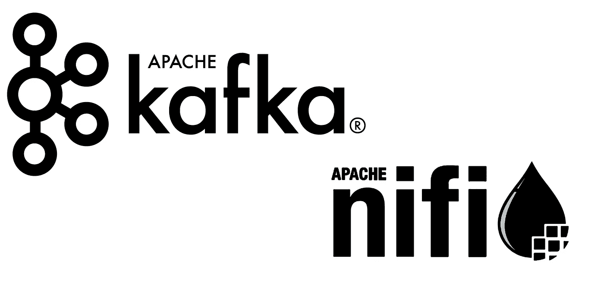
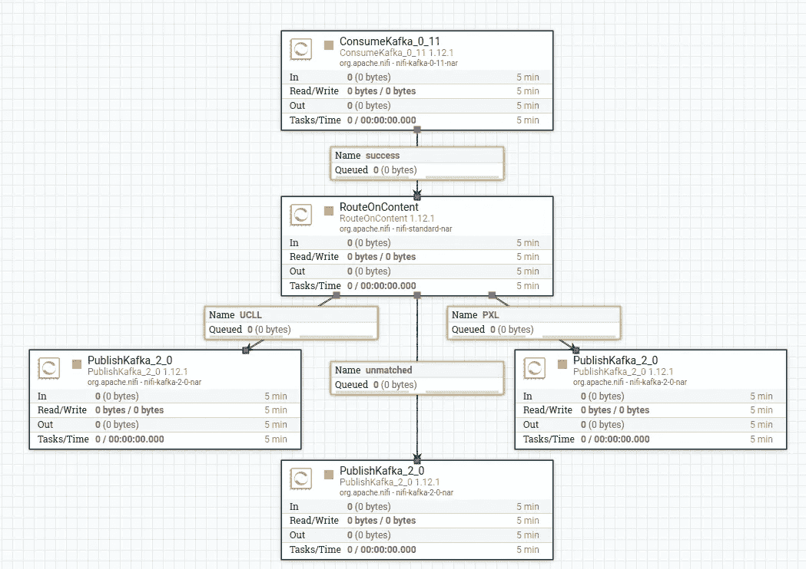
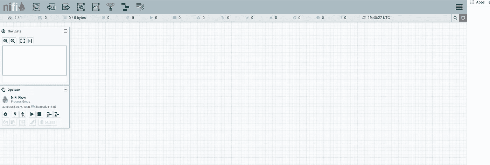

# 卡夫卡与尼菲的融合

> 原文：<https://medium.com/analytics-vidhya/kafka-and-nifi-integration-d0431b540f37?source=collection_archive---------10----------------------->

## 使用 Docker，Kafka，Nifi 和 Python



[图像信用](https://justcodeit.io/wp-content/uploads/2018/05/ingestion_datos_Apache_nifi_Apache_Kafka.jpg)

这篇文章给出了一个简单的 Kafka 和 Nifi 集成的例子，让你马上开始。只需上传模板，按“开始”，你就可以了。

# 尼菲

A pache NiFi 是一款开源软件，用于自动化和处理不同系统之间的数据流。这是一个处理和分发数据的强大而可靠的系统。此外，所提供的网络用户界面可以轻松创建、监控和控制数据流。

Nifi 的设计概念类似于基于流的编程范例。这种范式将应用程序表示为通过预定义的连接传输信息的“黑盒”进程网络。

Nifi 的一些用例是供应链优化、质量控制和欺诈检测。

**先决条件:** 本项目使用 Docker 和 docker-compose。查看[此链接](https://docs.docker.com/compose/install/)了解如何为您的操作系统安装它们。

**克隆我的 git 回购:**

```
git clone [https://github.com/Wesley-Bos/spark3.0-examples.git](https://github.com/Wesley-Bos/kafka_nifi_integration_example.git)
```

[](https://github.com/Wesley-Bos) [## Wesley-Bos —概述

### 我的兴趣在于大数据领域。我喜欢将世界视为一个大数据问题，其中蕴含着…

github.com](https://github.com/Wesley-Bos) 

***注意:*** *根据您的 pip 和 Python 版本，命令会稍有不同:*

*   *pip 变成 pip3*
*   *python 成为 python3*

在我们开始之前，创建一个新的环境。我使用 Anaconda 来完成这项工作，但是也可以随意使用您喜欢的任何工具。通过执行以下命令激活环境并安装所需的库:

```
pip install -r requirements.txt
```

*务必在您打开的每个* ***新*** *终端中激活正确的环境！*

# 设置 Nifi

这个项目的故事是这样的:卡夫卡摄取了一个数据流。然后，这些信息被输入到 Nifi 中，并根据其内容被分配到三个类别中的一个。这些类别是:

*   包含“PXL”的邮件。
*   包含“UCLL”的邮件。
*   所有不符合上述情况的信息。

由于我不想让你对配置感到厌烦，我创建了一个你只需要导入的模板，简单吧？对于那些想了解配置的人，请查看 Github 库。

**模板看起来是这样的:**



截图模板

## 好了，我们开始吧。

1.  执行 **build_project.sh** 脚本来构建 docker 容器。
    *这个可能需要一段时间，尤其是倪飞。*
2.  访问 Nifi 的 web UI[http://localhost:8080/Nifi/](http://localhost:8080/nifi/)
3.  您可能需要重新加载页面，直到看到下图。



截图 Nifi 的 Web Ui

在屏幕的顶部，有处理器、模板等组件。在屏幕的左侧，有一个导航和操作视图。

1.  在**下*操作*下**选择【上传模板】，上传库中找到的模板。
2.  现在从顶部选择模板组件，并将其拖到工作区中。选择您刚刚上传的模板。
3.  通过按 Ctrl+a 选择全部，然后按 Start。

这就是尼菲的一切。

# 卡夫卡

如果你不熟悉卡夫卡，你可以看看我之前的帖子。它简要解释了卡夫卡是什么，并列举了一些例子。

[](/@wesleybos99/your-first-data-pipeline-with-kafka-8ed9728e37b0) [## 你与卡夫卡的第一条数据管道

### 使用 Docker、Kafka、Python 和 Postgres

medium.com](/@wesleybos99/your-first-data-pipeline-with-kafka-8ed9728e37b0) 

在卡夫卡文件夹里，有一个生产者，有三个消费者。只有生产者的 Python 脚本需要执行这个项目的工作。要查看每个类别的主题数据，请执行相应的脚本。

```
python producer.pypython consumer_pxl.pypython consumer_ucll.pypyhton consumer_unmatched.py
```

***注意:*** *目前，Nifi 向 Kafka 发布消息的格式存在问题，但对于这个示例来说，这不是问题。*

# 结论:

使用 Nifi 提供的 UI，您可以毫不费力地在 Kafka 和 Nifi 之间建立数据流。只需添加一些处理器，连接它们，您就可以开始工作了。那么，你还在等什么？

一如既往的感谢你一直读到最后！非常感谢任何关于我可以在哪里以及如何改进的反馈。请随时给我发消息。

## 参考资料:

[https://en.wikipedia.org/wiki/Flow-based_programming](https://en.wikipedia.org/wiki/Flow-based_programming)

 [## Apache NiFi 文档

### 版权所有 2018 Apache Software Foundation，根据 Apache 许可证 2.0 版获得许可。阿帕奇人，阿帕奇人…

nifi.apache.org](https://nifi.apache.org/docs.html) [](https://www.guru99.com/apache-nifi-tutorial.html) [## Apache NiFi 教程:什么是架构和安装

### Apache NiFi 是一个开源软件，用于自动化和管理系统之间的数据流。这是一个强大的…

www.guru99.com](https://www.guru99.com/apache-nifi-tutorial.html)