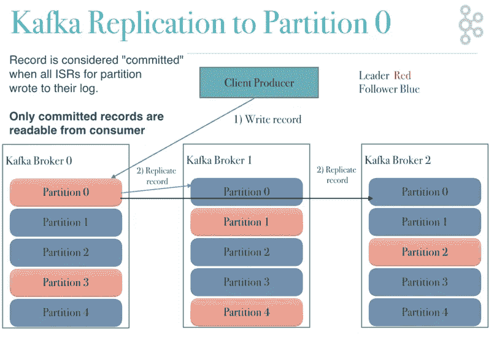
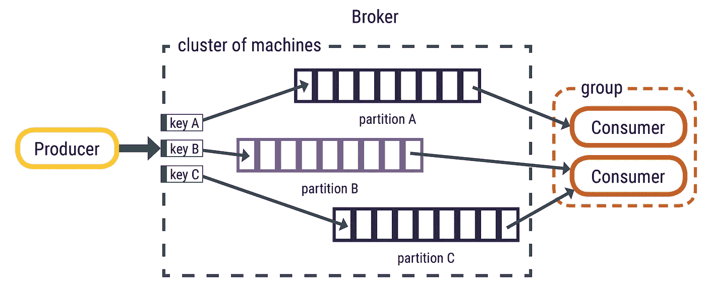

# 卡夫卡，深入到它的位

> 原文：<https://medium.com/analytics-vidhya/kafka-drilled-down-to-its-bits-1fada1aa6fc1?source=collection_archive---------14----------------------->

自从我开始软件工程师的职业生涯以来，已经有将近两年的时间了，这是我第一次遇到卡夫卡，谁知这家伙是个野兽。给定的参数太多，无法将其调整到最佳状态。在四处寻找了一个星期后，我想把它都写在一个地方。:-P

[斯蒂夫·约翰森](https://unsplash.com/@steve_j?utm_source=medium&utm_medium=referral)在 [Unsplash](https://unsplash.com?utm_source=medium&utm_medium=referral) 上拍照

**首先要明白为什么需要卡夫卡？**

Kafka 用于实时数据流，做大数据或者做实时分析。它通常用作两个或多个微服务之间的数据连接桥

我将首先尝试清除卡夫卡作品中的所有术语，即主题、经纪人

1.  Topic = A Topic 的意思是`“about which something is said”.`，比如把 Kafka 看成一个数据库(只是说明一下)，Topic 看成一个表格。
2.  Producer = A **Kafka producer** 是一个应用程序，可以充当 **Kafka** 集群中的数据源。一个**制作人**可以发布一个或多个**卡夫卡**主题的消息。
3.  Broker = A **broker** 是一个 **Kafka** 服务器。Kafka broker 允许消费者通过主题、分区和偏移量获取消息。
4.  Partition =代理中的数据按分区划分，用于并行处理。(这个我们后面会详细讲)
5.  偏移量= T21 偏移量是一个简单的整数，卡夫卡用它来保持消费者的当前位置

卡夫卡给出了一些高层次的保证

1.  由生产者发送到特定主题分区的消息将按照发送的顺序被附加。也就是说，如果记录 M1 与记录 M2 由同一个制作人发送，并且 M1 被首先发送，那么 M1 将具有比 M2 更低的偏移量，并且在日志中出现得更早。
2.  使用者实例按照记录在日志中的存储顺序查看记录。
3.  对于复制因子为 N 的主题，我们最多可以容忍 N-1 个服务器故障，而不会丢失任何提交到日志中的记录。(这方面有几个例外)

卡夫卡有三个部分:

1.  生产者
2.  [经纪人](/@alpitanand20/kafka-drilled-down-to-its-bits-e28df4700ec6)(文章的第二部分)
3.  消费者

在这一点上，我们将试图了解卡夫卡的第一部分**制片人**。

**什么是制作人？**

它只是一个通过使用 producer api 向 Kafka 集群发送数据或消息的应用程序。无论我们发送什么数据，对卡夫卡来说都只是一个字节数组。假设我们在数据库中有一个 orders 表，表中的每一行都对应一条消息，您可以使用 Kafka producer API 将消息发送到 Kafka Orders 主题。

> **生产者的消息大小限制:**
> 
> 开箱即用，一个代理最多可以处理 1 MB，(略小于 1 mb)，如果你真的需要增加消息大小，你必须调整， *message.max.bytes*

通常，生产者不会等待来自代理的任何类型的确认，但是它可以根据需要进行配置，假设一个 Kafka 集群有 3 个副本代理。

类似这样的。(图片来自 dzone)

这里，在映像中，ISR 是同步副本

主要有 3 种类型的 ACK(确认)。

1.  ACK = 0，生产者不会等待任何类型的确认。在这种情况下，不能保证经纪人收到了记录。重试配置不会生效，因为没有办法知道是否发生了任何故障。
2.  ACK = 1，一旦记录被代理写入，代理就会给出一个确认。但是，它不会等待复制完成。这意味着，如果在复制完成之前，引导程序(稍后将详细介绍引导程序部分)发生故障，记录将会丢失。
3.  ACK = all or -1，all or -1 →一旦记录被代理写入并在所有跟随者中同步，代理就给予确认。这种模式，当与 config***min . in sync . replicas***结合使用时，提供高耐久性。它定义了必须确认写入才能认为写入成功的最小复制副本数量。

> 考虑以下情况
> 代理数量= 3
> 复制因子= 3
> min.insync.replicas = 2(这包括 leader)
> ack = all
> 你只能容忍一个代理宕机。如果一个以上的代理关闭，则抛出**notenoughpreplicas**或**notenoughpreplicasafterappend**异常。

在真实的场景中，即使数据在代理上提交，您的 Kafka 生成器也很有可能没有收到确认(可能是由于网络故障)并重试请求。在这种情况下，存在数据的重复。为了处理这种情况，您需要使您的生产者幂等。
让您的生产者幂等就像设置配置 **enable.idempotence = true 一样简单。**

但是这是如何工作的呢？

每个生产者都被分配了一个生产者 Id (PID ),并且每次它向代理发送消息时都会包含它的 PID。此外，每条消息都有一个递增的序列号(SqNo)。在代理端，每个主题分区都有另一个序列。代理跟踪每个分区的最大 PID-SqNo 组合。当收到较低的序列号时，它将被丢弃。

现在，生产者如何决定向哪个分区发送数据，比如主题可能被分成 10 个分区，它应该从哪个分区开始发送数据？

生产者向 Kafka 代理请求关于哪个 Kafka 代理具有哪个主题分区领导的元数据，因此不需要路由层。这个领导数据允许生产者将记录直接发送给 Kafka 代理分区领导(稍后将详细介绍代理分区领导)。

> 目前，只需了解每个分区副本都有一个分区领导者，并且每个分区副本都存在于不同的代理中

有两种方法可以将数据发送到主题中的分区。

1.  循环法
2.  将数据发送到特定分区的基于哈希的键。

> 循环赛的定义？
> 
> 为了公平地调度进程，循环调度器通常采用分时方式，给每个任务分配一个时隙或时间量[4](分配给 CPU 的时间)，如果任务没有完成，就中断任务。下次为该进程分配时隙时，作业将继续。如果进程在其指定的时间段内终止或将其状态更改为等待，调度程序将选择就绪队列中的第一个进程来执行。在没有时间共享的情况下，或者如果量程相对于作业的大小来说很大，那么产生大量作业的进程会比其他进程更受青睐。

在循环法中，根据循环法选择分区，因为首先在分区 0 中发送消息，然后在分区 1、分区 2 中发送，以此类推，再次发送到分区 0。

然而，在生产者和消费者的基于散列的键-值对中，具有相同键的记录被发送到相同的分区，确保每个分区中消息的顺序，有点像下图中的。

**生产者中的批处理是什么？**

术语批处理简单地说是指在发送给代理之前累积消息。

数据按主题的每个分区累积在一个缓冲区中。数据根据生成器批次大小属性分组到批次中。主题中的每个分区都有一个单独的累加器/缓冲区。

kakfa producer 的缓冲存储器= 32 mb

两个参数对于延迟和吞吐量特别重要:批量大小和逗留时间。

***batch.size =*** 以总字节数而不是消息数来衡量批量大小。它控制在向 Kafka 代理发送消息之前收集多少字节的数据。在不超过可用内存的情况下，尽可能将该值设置得高一些。默认值为 16384 字节

***linger . ms*=**linger . ms 设置添加了一个延迟，以等待更多记录的建立，因此会发送更大的批次。增加 linger.ms 以生产者延迟为代价增加代理吞吐量。如果生产者获得的记录的大小为 batch.size 或更大，那么它会被立即发送。如果 Producers 获得的值小于 batch.size，但经过了 linger.ms 间隔，则发送该分区的记录。增加 linger.ms 以提高代理的吞吐量，降低代理负载(常见改进)。

**压缩式生产者？**

***compression.type*** 默认为 none，该设置设置为 none、gzip、snappy 或 lz4，我们可以将该设置更改为向代理发送更小的数据(更少的带宽)。

唷，这是一篇相当大的文章，但是它大概涵盖了生产者的所有重要概念。

文章的第二部分，关于 [**经纪人**](/@alpitanand20/kafka-drilled-down-to-its-bits-e28df4700ec6) 就在这里

在我的下一篇文章中，我将很快写下关于消费者的内容。

> 请鼓掌。:-)，会喜欢反馈的。